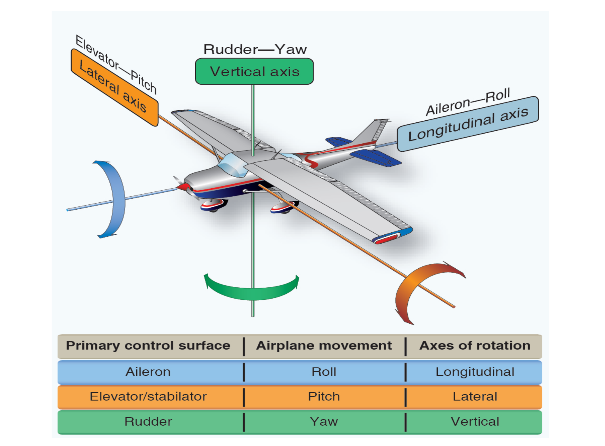
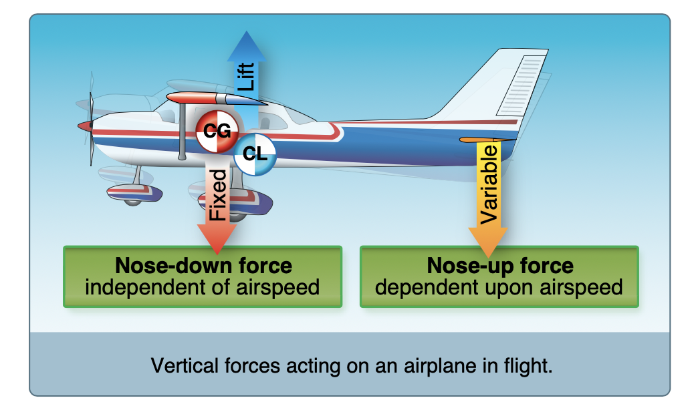
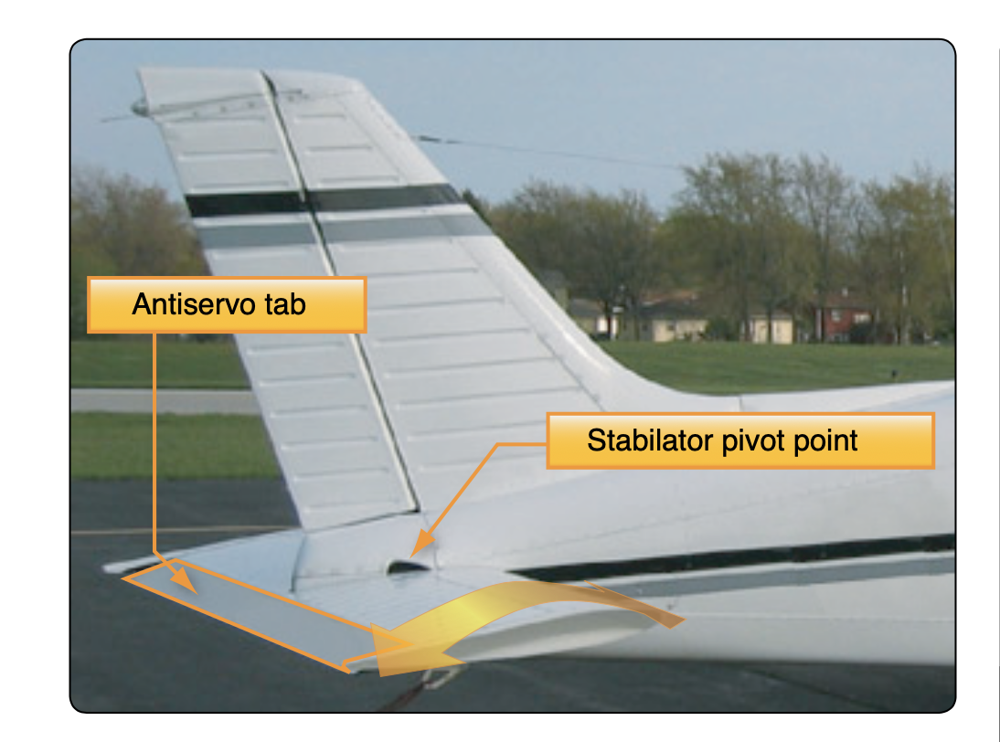
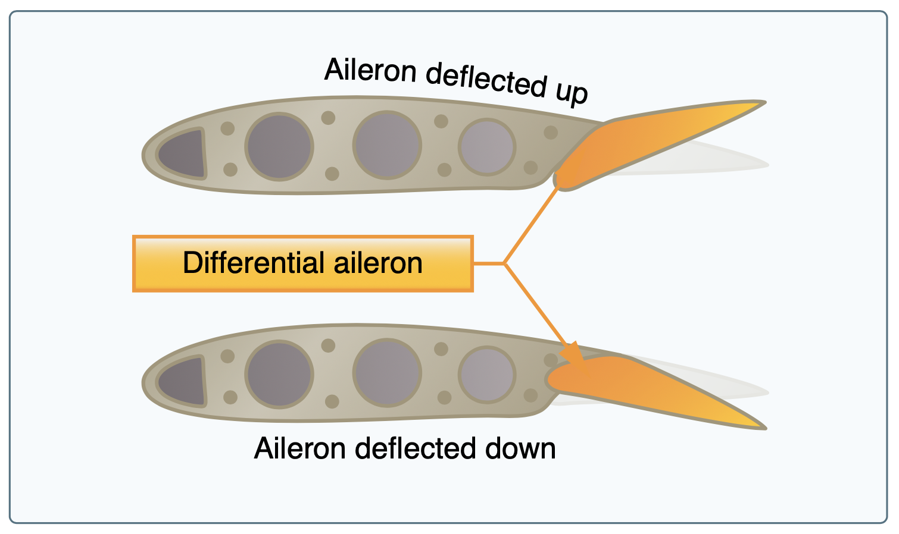
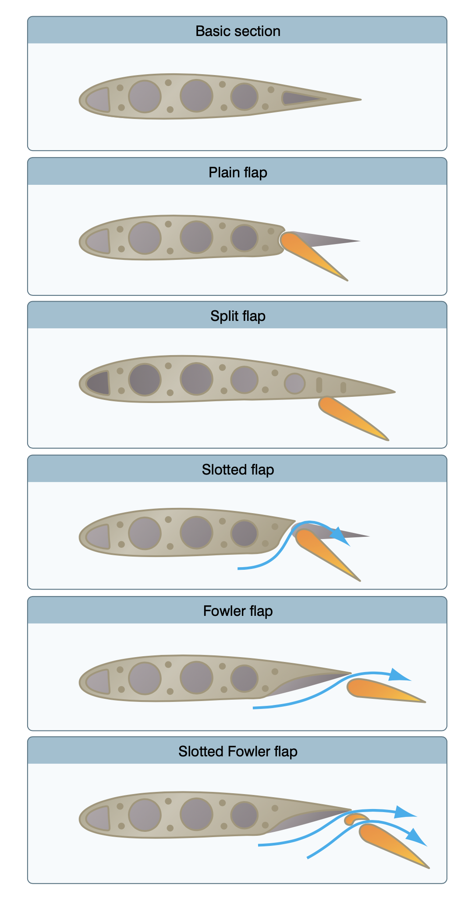

# Flight Controls

All flight controls work through the center of gravity of the airplane.

## Elevator

Controls rotation around the access, also provide downward pressure to counteract the rotational moment of the main wing.

- The bell crank is a device that translates the forward/back motion of the yoke into the movement of the elevator.
- The down-spring keeps the elevator neutral

### T-tails

- Tail mounted on the top of the rudder
- Tail is not out in the prop wash
- Requires more motion of the flight controls since there is no prop air over the control surface
- Risk of a "deep stall" because there's little airflow over the tail

### Stabilator

- A "full flying surface"
- Generates a lot of force quickly, more than an elevator
- Easy to over-control since it generates a lot of force
- Anti-servo tab, works against the movement of the elevator to counteract the over-control

### Canard

- "Elevator" mounted on the nose of the airplane
- Also not in the prop wash of the airplane
- Provides "nose-up" force

## Ailerons

- Controls the roll of the airplane around the longitudinal axis
- Introduces adverse yaw due to induced drag on the upward aileron
  - Differential ailerons: The aileron can be lowered farther than it can be raised
  - Frise ailerons: A gap between the aileron the wing and aileron surface, helps create more drag when aileron is lifting
- Coupled aileron/rudders: Mechanical linkage between rudder and ailerons, often with strings
- Flaperons: Combination flap/aileron control surface
  - Relies on a mixer to combine input

## Rudder

Provides yaw, or rotation around the vertical axis.

- Cable-acuated, should hit rudder stops

### V-tails

- "Ruddervators"
- Also requires a mixer to mix rudders and elevators

## Secondary Flight Controls

### Flaps

Flaps allow airplanes to make a steeper approach without increasing the airspeed.

- Plain flap:
  - Increases camber of the wing
  - Creates drag
  - Moves center of pressure backwards
  - Creates nose-down pitching moment
- Split flap
  - Deflects
  - More lift than a plain flap
  - Same amount of drag as plain flap
- Slotted flap
  - Most common type of flap
  - Like a split flap, but there's a gap between the wing and the flap
  - Slot energizes boundary layer behind the flap, which delays the critical AoA before stall
  - Can have multiple slots
- Fowler flap
  - Flaps which "slide" down and back from the wing
  - Common on airliners
  - Increase wing surface area
  - Small deflection adds lift
  - End of the deflection is mostly drag
- Slotted-fowler flap
  - Combines the advantages of fowlers and slotted flaps

[Pilot’s Handbook of Aeronautical Knowledge pg. 3-6](/_references/PHAK/3-6)

### Leading Edge Devices

- Fixed slot
  - Does not increase wing camber
  - Directs airflow above the wing which increase the coefficient of lift
- Moveable slat
  - Moves along a track on the front of the wing
  - Redirects airflow to the top of the wing
  - As AoA increases, the slats move forward
  - Delays stall to higher AoA
- Leading edge flaps
  - Increases wing camber
  - Usually used with trailing flaps to reduce nose down pitching moment
  - Small deflections, gives more lift
- Leading edge cuff
  - Increase wing camber
  - Fixed on the front of the wing
  - Delays stall to higher AoA

[Pilot’s Handbook of Aeronautical Knowledge pg. 6-9](/_references/PHAK/6-9)

### Spoilers

- Can also be used for roll control or adverse yaw
- Can provide a steeper decent angle
- Reduces ground roll during landing

### Trim

- Trim tabs
  - Move opposite of the control surface
  - Counters control pressures
  - Usually cable driven or electric-motor driven
- Balance tabs
  - Similar to trim tabs, but move automatically with the flight controls
  - Used to assist with forces that need more force to control
  - Can also be adjustable which can be used as trim
- Servo tabs
  - Mounted at end of control surface
  - The pilot moves the servo tab, then servo tab moves the rest of the control surface
- Anti-server tabs
  - Adds control feel, especially on stabilator
  - Provides a force opposing pilots inputs
  - Helps make the stabilator less sensitive
  - Can also be adjustable to be used as trim
- Ground adjustable tabs
  - Fixed tab that can be bent on the ground
  - Used to trim airplane for straight-and-level flight
- Adjustable stabilizer
  - Use of a jackscrew to change the angle of incidence of the entire horizontal stabilizer
