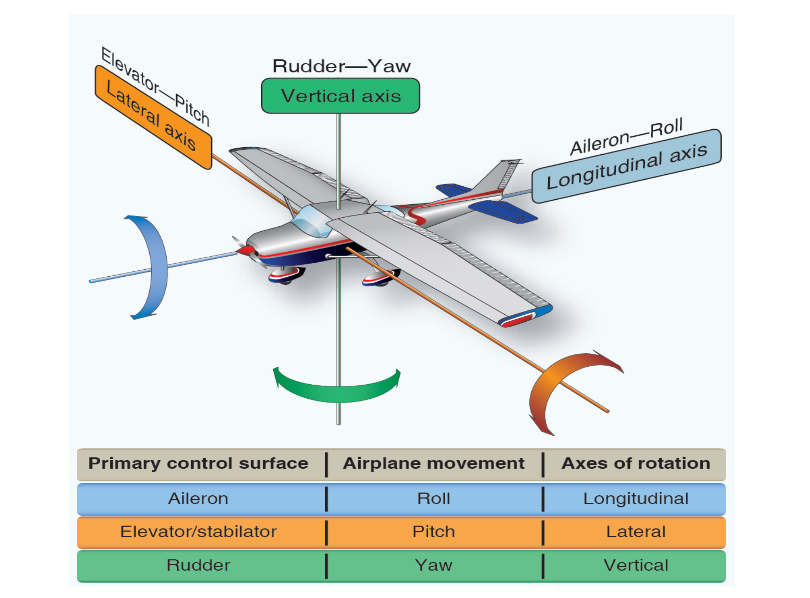
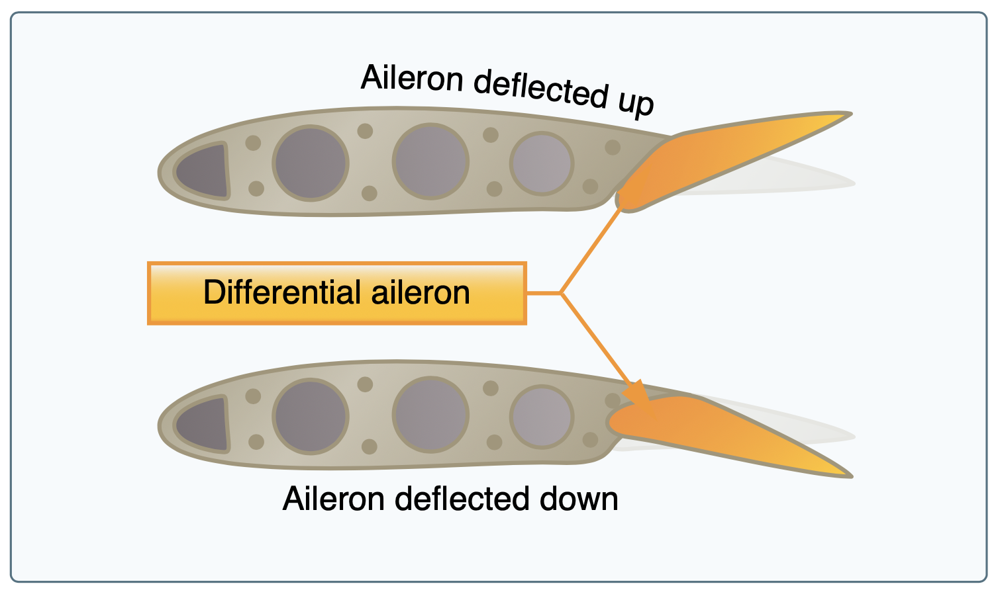

# Primary Flight Controls

All flight controls work through the center of gravity of the airplane.

## Elevator

Controls rotation around the lateral axis, also provide downward pressure to counteract the rotational moment of the main wing.

- The bell crank is a device that translates the forward/back motion of the yoke into the movement of the elevator.
- The down-spring keeps the elevator neutral

### T-tails

- Tail mounted on the top of the rudder
- Tail is not out in the prop wash
- Requires more motion of the flight controls since there is no prop air over the control surface
- Risk of a "deep stall" because there's little airflow over the tail

### Stabilator

- A "full flying surface"
- Generates a lot of force quickly, more than an elevator
- Easy to over-control since it generates a lot of force
- Anti-servo tab, works against the movement of the elevator to counteract the over-control

### Canard

- "Elevator" mounted on the nose of the airplane
- Also not in the prop wash of the airplane
- Provides "nose-up" force

## Ailerons

- Controls the roll of the airplane around the longitudinal axis
- Introduces adverse yaw due to induced drag on the upward aileron
  - Differential ailerons: The aileron can be lowered farther than it can be raised
  - Frise ailerons: A gap between the aileron the wing and aileron surface, helps create more drag when aileron is lifting
- Coupled aileron/rudders: Mechanical linkage between rudder and ailerons, often with strings
- Flaperons: Combination flap/aileron control surface
  - Relies on a mixer to combine input

## Rudder

Provides yaw, or rotation around the vertical axis.

- Cable-actuated, should hit rudder stops

### V-tails

- "Ruddervators"
- Also requires a mixer to mix rudders and elevators
