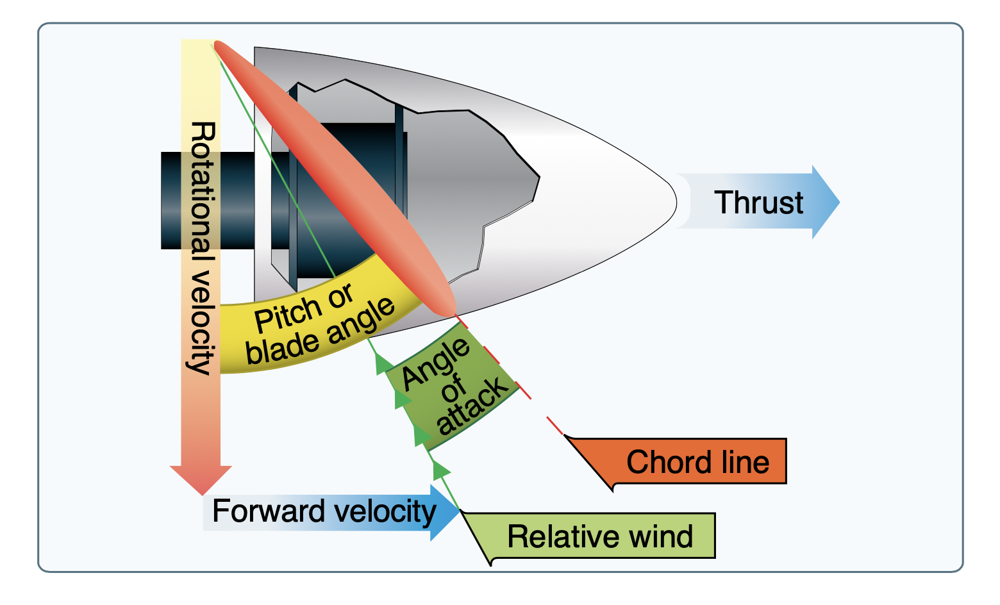
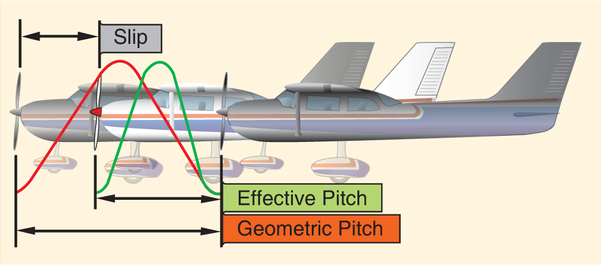
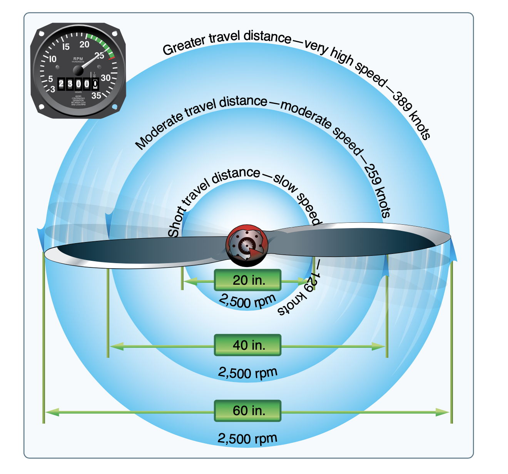

# Propellers

Propeller are rotating airfoils which produce thrust.

- When an aircraft is stationary the propeller is largely stalled
- As the aircraft speed increases the propeller becomes more efficient

## Propeller Slip

- Geometric pitch: the distance the propeller should travel based on its design
- Slippage: Distance between the geometric and effective pitch

## Propeller Twist

- For a given RPM the tip of the propeller is traveling much faster than the hub
- This means the outer portion needs a lower angle of attack to produce even thrust across the whole diameter
- For fast-spinning propeller, the tips can also approach the speed of sound

## Fixed-Pitch Propellers

- A fixed-pitch propeller is only optimal at one specific airspeed
- Different trade-offs
  - Slow speed / high angle of attack (climb propeller)
  - High speed / low angle of attack (cruise propeller)
