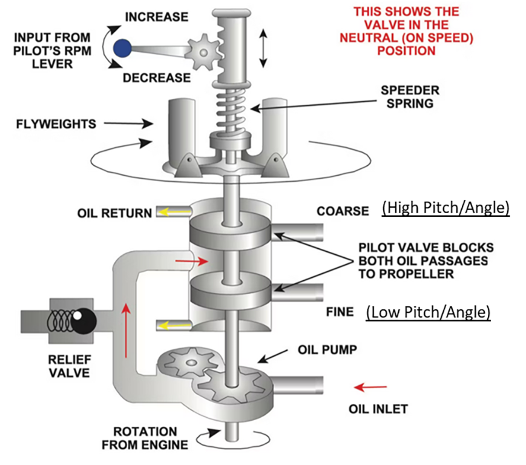

import Reg from "@site/src/components/Reg";
import Acronym, { AcronymRow } from "@site/src/components/Acronym";
import EncodedDataExplainer, {
  EncodedDataWord,
} from "@site/src/components/EncodedDataExplainer";
import StandardAtmosphereSlider from "@site/src/components/StandardAtmosphereSlider";
import ReferenceList from "@site/src/components/ReferenceList";

# Constant-Speed Propellers

Constant-speed propellers are a type of propeller that can change pitch to
maintain a constant RPM. This allows the engine to operate at its most efficient
RPM for a given flight configuration.

## Components

Changing the pitch of the propeller is accomplished by a governor, which is
housed in the spinner.

The governor uses a combination of flyweights and springs to regulate how much
oil should be let into the propeller hub.

- When the engine RPM **increases**, the flyweights move outward, which opens a
  valve and oil flows into the the propeller hub. This causes the propeller
  blades to becoming "coarser", decreasing the pitch and reducing the engine RPM.
- When the engine RPM **decreases**, the flyweights move inward, which opens the
  valve and oil flows out of the propeller hub. This causes the propeller blades
  to increase pitch, increasing the engine RPM.

### Governor Operation

- Changing the blue propeller control in the cockpit changes the loading of the speeder spring
  - Increasing the speed (blue knob in) reduces compression on the speeder spring, meaning the prop will need to spin faster to reach equilibrium
  - Decreasing the speed (blue know out) increases compression on the speed spring, meaning oil is forced into the propeller hub and the blade is coarsened

- Note that the governor will only operate within the min and max pitch stops
  - For instance you can still observe an RPM at a lower power setting in the run-up, because the prop is still at it's full-fine setting

## Usage

The constant-speed propeller is controlled by the propeller control lever in the
cockpit. The propeller control lever is connected to the governor by a series of
linkages.

- Moving the propeller control in increases the RPM by increasing the pitch of
  the propeller blades.
  - This is typically used for takeoff and climb when you want to maximize
    thrust and RPM.
- Moving the propeller control out decreases the RPM by decreasing the pitch of
  the propeller blades.
  - This is typically used for cruise when you want to maximize fuel efficiency.

## Loss of engine oil pressure

If a loss of oil pressure occurs, most airplanes will fail into the low pitch
position. This is because the governor is spring-loaded to return to the low
pitch position if oil pressure is lost.

In this case we may need to pull power to prevent overspeeding the propeller.
