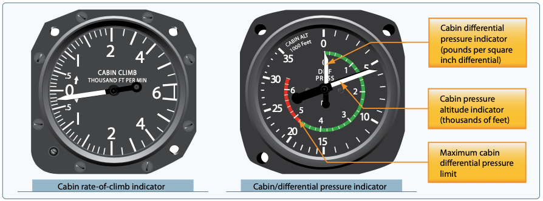

# Pressurization

Airplanes with a pressure hull that can withstand internal positive pressure. Their internal pressure is kept at a safe and comfortable altitude as the aircraft climbs.

- Pressurized to somewhere around 8000 feet pressure altitude
- Need some kind of inflow and outflow
  - Compressed air often comes from turbochargers
  - Flow control venturi system
- Terms
  - Ambient altitude
  - Ambient pressure
  - Cabin altitude
  - Differential pressure

[Pilot's Handbook of Aeronautical Knowledge pg. 7-35](/_references/PHAK/7-35)

- Explosive decompression
  - Depressurization that's faster than the lungs can expel air
- Rapid decompression
  - Decreases the period of useful consciousness because oxygen in the lungs is exhaled rapidly
