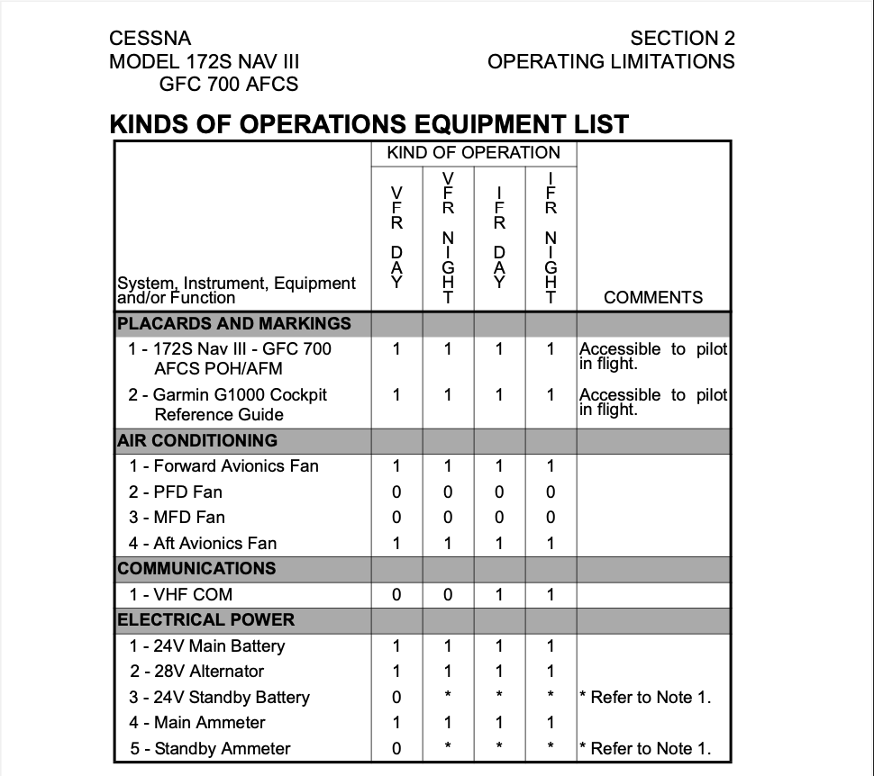

# Kinds of Operations Equipment List (KOEL)

A Kind of Operations Equipment List is a list of systems and equipment that must
be operational for a particular kind of operation (for instance day/night VFR,
IFR, or icing conditions).

They are included in the Limitations section of the FAA-approved
[Flight Manual](/docs/topics/airworthiness/documents/afms).

## References

- [91.9](/_references/14-CFR/91.9)
- [AC 91-67](https://www.faa.gov/documentLibrary/media/Advisory_Circular/AC_91-67.pdf)
