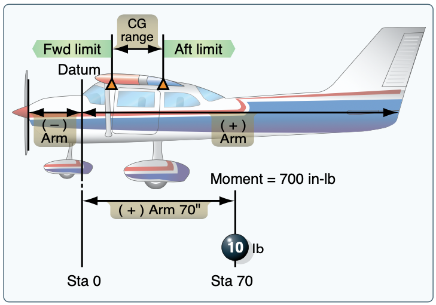

import Reg from "@site/src/components/Reg";
import Acronym, { AcronymRow } from "@site/src/components/Acronym";
import EncodedDataExplainer, {
  EncodedDataWord,
} from "@site/src/components/EncodedDataExplainer";
import StandardAtmosphereSlider from "@site/src/components/StandardAtmosphereSlider";
import ReferenceList from "@site/src/components/ReferenceList";

# Weight and Balance

Regulations requires establishment of the ranges of weights and CGs within which
an aircraft may be operated safely. The manufacturer provides this information,
which is included in the approved AFM, TCDS, or aircraft specifications.

## Terms

- Center of gravity
  - Where the weight appears to be concentrated
  - Place where the aircraft would balance if suspended at that point
- Moment
  - Rotational force about the CG
  - $\text{Moment} = \text{Arm} * \text{Weight}$
- Station
  - A location in the aircraft that is identified bya number designating its distance in inches from the datum
- Basic empty weight
  - The standard empty weight plus the weight of optional and special equipment that have been installed
  - Includes all oil, fluids, and unusable fuel
- Standard empty weight
  - All oil, fluids, and unusable fuel
  - This is the weight of the aircraft as it comes from the factory, with
    standard equipment installed
  - This is not normally used for weight and balance calculations
- Licensed empty weight
  - Similar to standard empty weight for aircraft built before GAMA standardization of standard empty weight
- Useful load
  - Weight of the pilot, copilot, passengers, baggage, usable fuel, and drainable oil
- Max ramp weight: weight for taxi but not flight
- Zero fuel weight: maximum authorized weight minus usable fuel

## Weight

Excessive weight reduces the flight performance in almost every respect. For
example, the most important performance deficiencies of an overloaded aircraft
are:

- Higher takeoff speed
- Longer takeoff run
- Reduced rate and angle of climb
- Lower maximum altitude
- Shorter range
- Reduced cruising speed
- Reduced maneuverability
- Higher stalling speed
- Higher approach and landing speed
- Longer landing roll
- Excessive weight on the nose wheel or tail wheel
- Higher maneuvering speed

[Pilot's Handbook of Aeronautical Knowledge pg. 10-2](/_references/PHAK/10-2)

## Balance (or CG)

The CG is a point at which the aircraft would balance if it were suspended at
that point.

Note that the center of lift of the wings (where the lift force is being
applied), is always aft of your CG, when loaded within limits. The tail is
providing a downward force which counteracts the torque created by the main
wing.

A CG that is too far _forward_ can:

- Make it impossible to flare for landing, in extreme cases
- Increase induced drag needed for level flight, and decrease cruise performance
  - This is due to the increase of the tail downforce, which in turn requires a
    high angle of attack to counteract

A CG that is too far _aft_ can:

- Produce very light control forces
- Can limit the ability to recover from stalls or spins
- Decrease induced drag needed for level flight, and actually increase cruise
  performance

[Pilot's Handbook of Aeronautical Knowledge pg. 10-2](/_references/PHAK/10-2)
