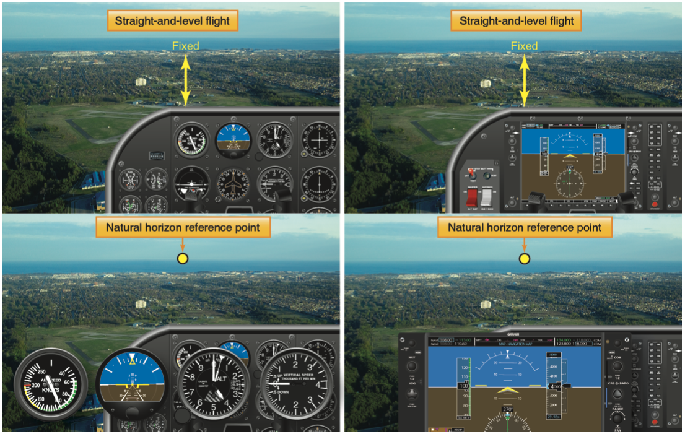
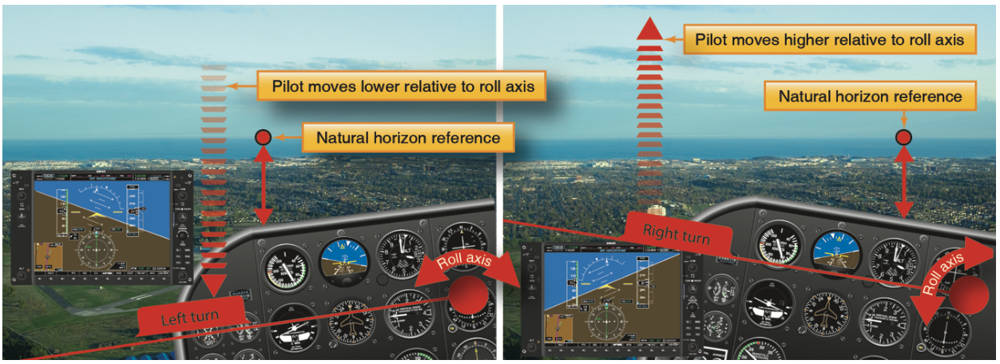
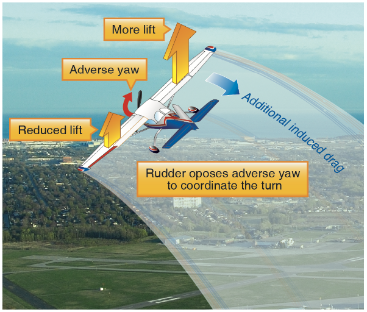

# Fundamental Maneuvers

## Straight-and-Level Flight

### Objectives

Maintain a constant altitude, constant direction, and balanced attitude in straight flight

### Operation

- Leveling the airplane from a turn/climb
  - Attitude, power, trim
- Visual reference to the cowling, 3-4" from horizon
- Altimeter = altitude, heading indicator = direction, inclinometer = coordination
- Level attitude will change with loading and airspeed
- Trim
  - Use to relieve pressure, not control the airplane
- Leveling off: 500 ft/min climb, level off around 50' below target altitude

[Aviation Instructor's Handbook pg. 3-6](/_references/AIH/3-6)

### Common Errors

- Failure to clear the area
- Failure to anticipate the level-off
- Failure to coordinate the flight controls
- Failure to use visual cues to maintain S&L flight
- Failure to scan for traffic

## Normal Climbs

### Objectives

Climb at a constant airspeed and direction while keeping the airplane coordination

### Operation

- Power, attitude, trim
- Airspeed indicator = constant airspeed, heading indicator = direction, inclinometer = coordination
- Anticipate and correct for left-turning tendencies

[Aviation Instructor's Handbook pg. 3-17](/_references/AIH/3-17)

### Common Errors

- Failure to clear the area
- Failure to anticipate the level-off
- Failure to coordinate the flight controls
- Failure to scan for traffic
- Fixation on one instrument
- Applying elevator pressure too quickly
- Pitching too steeply resulting in dissipating airspeed

## Descents

### Objectives

Maintain a descent at a constant airspeed or constant rate, constant direction, coordinated flight

### Operation

- Power, attitude, trim
- Pulling power abruptly can cause a yaw moment to the right (negative p-factor)
- Descending to a point on the ground:
  - When your target point is halfway between the horizon and straight down
  - Keep your target in the windscreen with pitch, manage airspeed with throttle

[Aviation Instructor's Handbook pg. 3-20](/_references/AIH/3-20)

### Common Errors

- Failure to clear the area
- Inadequate back-pressure resulting in a dive
- Slipping or skidding due to inadequate rudder control
- Chasing the airspeed or descent rate
- Fixation on flight instruments or a single flight instrument

## Level Turns

### Objectives

- Maintain a bank angle between 20-45&deg; with a constant altitude, while maintaining balance

### Operation

- Elevator controls altitude, ailerons controls bank, throttle controls airspeed, rudder controls coordination
- Elevator to maintain altitude
- Aileron controls bank
- Pilot's are seated on the left, so a left turn will look like a dive. A right turn will look like a climb

- Adverse yaw
  - Upward wing produces more induced drag, causing yaw in the opposite direction
  - The drag occurs as long as the ailerons are being deflected, and is proportional to the amount of aileron deflected
  - Once established in a turn the ailerons are neutral, so no adverse yaw
  - We still need to contend with left-turning tendencies
  - Use enough rudder to keep flight coordinated
- Look at which point the horizon "cuts through" the cowling
- Anticipate the roll-out of the turn by 1/2 of the bank angle (10&deg; of heading for a 20&deg; bank turn)

[Pilot's Handbook of Aeronautical Knowledge pg. 5-30](/_references/PHAK/5-30)

[Aviation Instructor's Handbook pg. 3-11](/_references/AIH/3-11)

### Common Errors

- Failure to clear the area
- Failure to use outside visual references
- Leaning in the seat, instead of remaining upright
- Insufficient feel for slip/skip without the use of the ball
- Holding more rudder than needed in the turn
- Uneven proficiency in turn direction
- Altitude gain/loss during the turn
