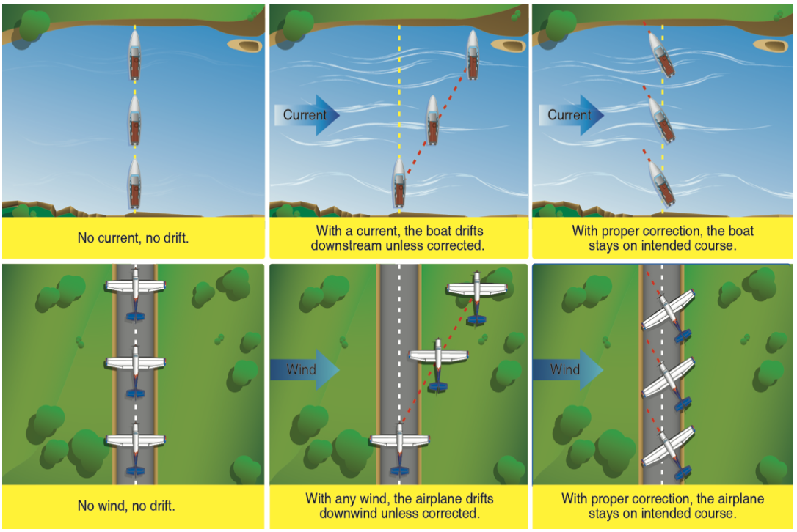
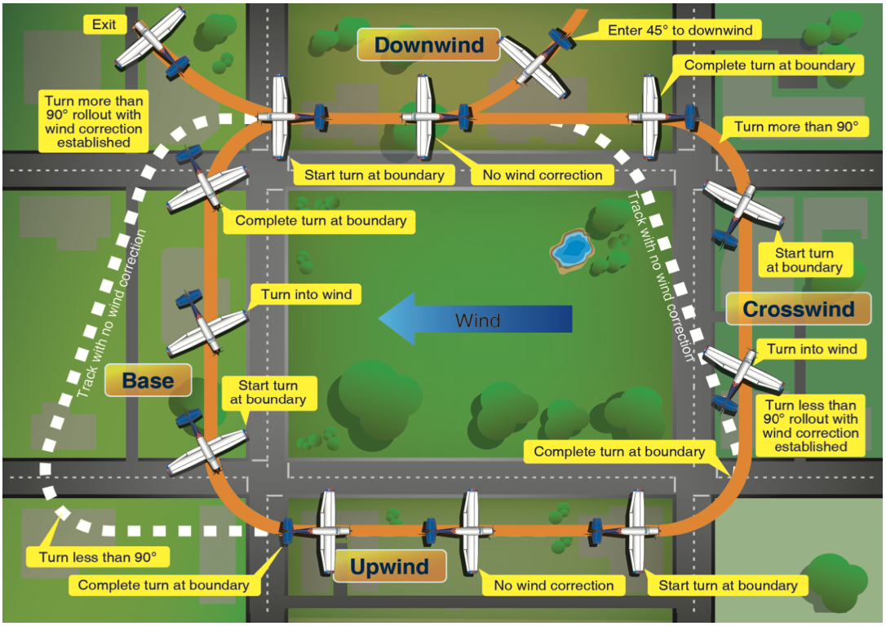
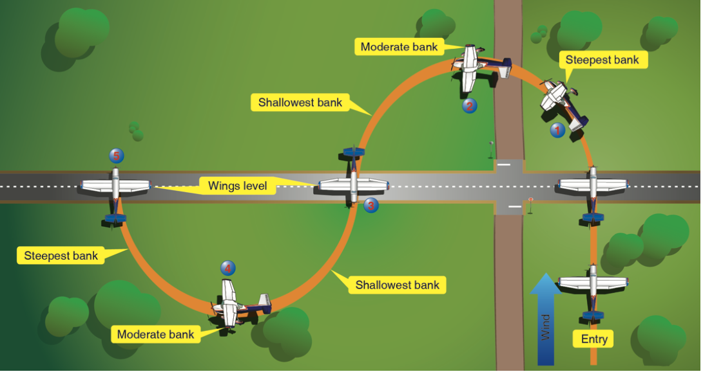
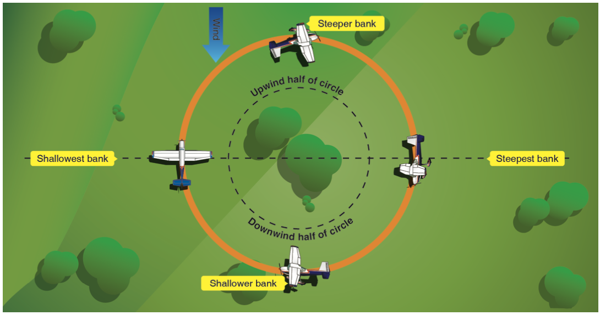
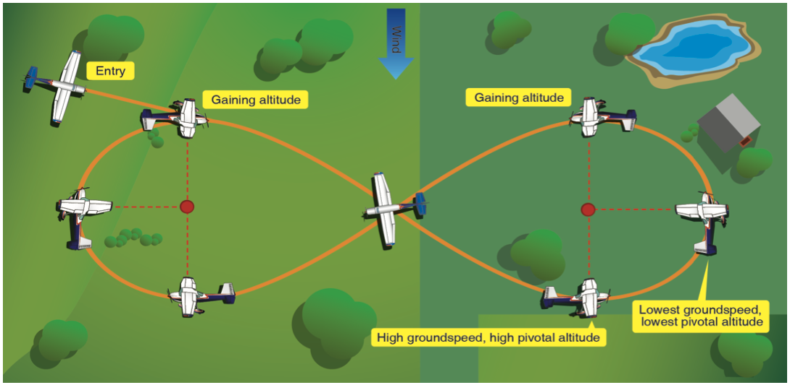
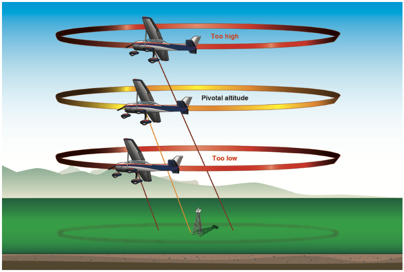

# Ground Reference Maneuvers

- Used to teach the effect of wind.
- Need to be low or slow to see the effect of wind.
- Have an emergency landing spot ahead of time.

## Tracking a Straight Line

- Determine the wind on the ground; can use GPS and ground speed.
- Find the wind correction angle that keeps you on a straight path over the ground.

[Aviation Instructor's Handbook pg. 7-4](/_references/AIH/7-4)

## Rectangular Course

- Start on the upwind leg.
- Turn 1: Less than 90 degrees onto crosswind.
- Turn 2: Turn more than 90 degrees onto downwind.
- Turn 3: Turn more than 90 degrees onto base leg.
- Turn 4: Turn less than 90 degrees onto upwind.
- Tip: Look for 1/2 mile of distance by measuring the object 1/2 up the strut in the window.

[Aviation Instructor's Handbook pg. 7-6](/_references/AIH/7-6)

## S-Turns Across a Road

- Pick a road that is perpendicular to the wind.
- Start on the downwind.
- Turn to keep a turn radius about 1/2 mile across the road.
- Turn with a softer bank angle on the upwind side.
- Turn with a steeper bank angle on the downwind side.
- You want to turn wings level just as you cross the road.

### Common Errors

- Failure to clear the area.
- Failure to remain coordinated.
- Failure to establish proper altitude and wind correction angle.
- Gaining or losing altitude.
- Abrupt control usage.
- Inability to divide attention inside and outside the airplane.

## Turns Around a Point

- Hardest of the three private ground reference maneuvers.
- Start on the downwind leg.
- Downwind requires the steepest bank.
- Upwind requires the shallowest bank.
- Students will often try to keep the wing on the pylon.

[Aviation Instructor's Handbook pg. 7-8](/_references/AIH/7-8)

## 8's on Pylons

- Dependent on flying at a "pivotal" altitude.
- There's no wind correction; just holding the pylon on the wing.
- Pick pylons about 1 mile apart.
  - Flying perpendicular between the pylons, a 1-mile pylon should be just under the tip of both wings.
- Enter on the downwind leg.
- A given ground speed is associated with one pivotal altitude.
  - A cone shape forms the path for a given ground speed.
  - The faster the ground speed, the higher the pivotal altitude.
- If we descend, the airplane will speed up, meaning the pivotal altitude increases.
- Between the pylons, wait until you are abeam the pylon before turning.
- Climb "away" from a pylon behind you, and climb "into" a pylon in front of you.

### Common Errors

- Failure to clear the area.
- Failure to maintain coordination.
- Excessive altitude change.
- Over-concentration on the pylon, failure to scan for traffic.
- Poor choice of pylons.
- Not entering on the downwind leg.
- Failure to account for wind drift when flying between the pylons.
- Abrupt control movements.
