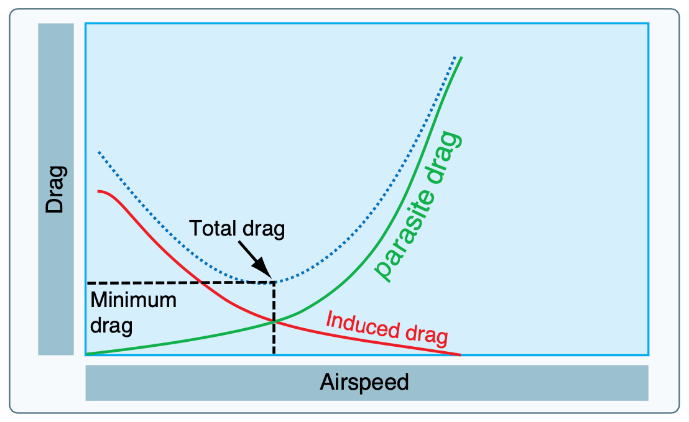

# Slow Flight and Stalls

## Slow Flight

### Objective

Maintain coordinated airplane control at speeds slower than cruise speed.

### Concepts

- Drag is minimum at best glide speed (best L/D).
  - To go faster than best L/D, we need more thrust to overcome parasite drag.
  - To go slower than best L/D, we need more thrust to overcome induced drag.
- The goal of slow flight is to operate slower than best L/D, where additional power is required.

### Operations

- Start with a reduction in power.
- Put in flaps one notch at a time, anticipating the nose-up pitching movement when flaps are lowered.
- Start pushing in power as we get slower.
- Elevator controls pitch, power controls airspeed.
- Controls become spongy.
- Left-turning tendencies will increase:
  - Higher torque from higher power.
  - Higher slipstream from higher power.
  - Higher P-factor from higher power and AoA.
- Turns should remain very shallow since most of our lift is being converted to drag.
- Good to introduce after the 4 fundamental maneuvers.

### Common Errors

- Failure to clear the area.
- Inadequate elevator back-pressure.
- Fixation on the airspeed indicator.
- Inadequate compensation for left-turning tendencies.
- Failure to anticipate changes in lift with changes in flaps.
- Inability to divide attention between inside and outside the airplane.

## Power-Off Stalls

### Objective

Develop recognition of an impending stall in a landing configuration and apply proper recovery technique, avoiding a secondary stall.

### Operations

- Slow the airplane as you would in slow flight.
- Allow the airplane to descend as in a landing.
- Slowly pitch up until a stall warning, then a stall.
- Symptoms of a stall
  - Nose-high attitude
  - Low airspeed
  - Sloppy or mushy controls
  - Stall warning horn, light
  - Buffeting
  - Nose pitching down
- Recovery
  - Move elevator forward just enough to eliminate the stall symptoms
  - Add full power, which will add left-turning tendency
  - Use enough rudder to stop wings from dropping (but not bringing the wing back up)
  - Bring wings level
- Secondary stall
  - Being too abrupt when recovering pitch with the elevator can cause a secondary stall
- Adding flaps can increase the likelihood of a wing drop

### Common Errors

- Failure to clear the area
- Inability to recognize impending stall condition
- Premature recovery
- Over-reliance on airspeed indicator
- Inadequate rudder control
- Inadvertent secondary stall
- Excessive forward pressure during recovery
- Excessive airspeed build-up during recovery

## Power-On Stall

### Objective

To develop recognition of an impending stall or stalled condition in the takeoff configuration, and initiated recovery.

### Operation

- Reduce throttle, keep the airplane level, slow to rotation speed
- At rotation speed apply full power and raise the nose to about 20 degrees
- Stalls may occur more quickly
- Recovery
  - Small reduction in elevator back pressure enough to eliminate the stall warnings
  - Use rudder to stop any wing from dropping
  - Raise any dropped wing with aileron during the climb

## Spins

A spin is caused by a stall aggravated by yaw.
