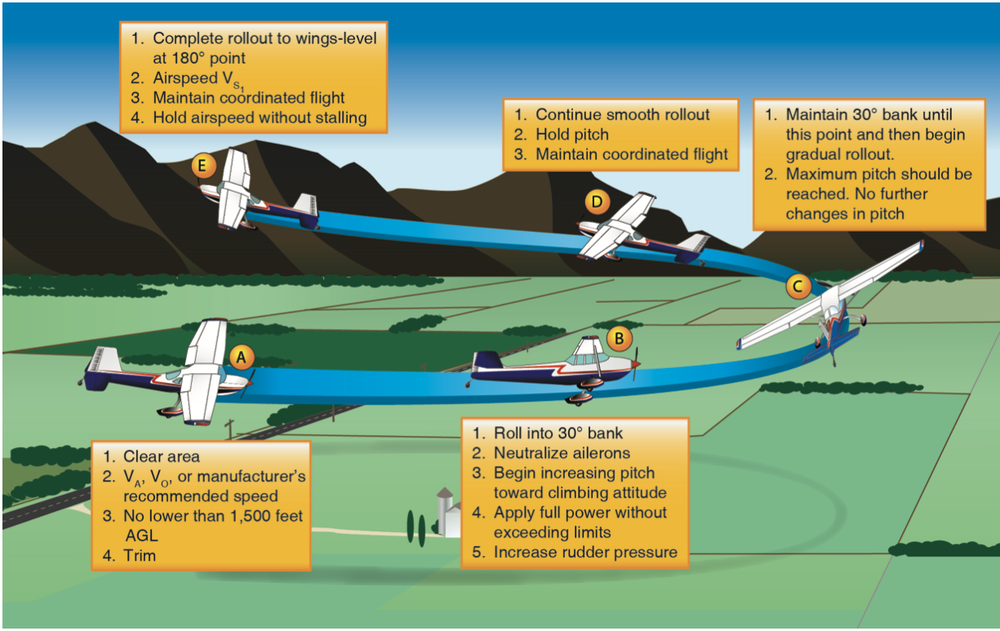
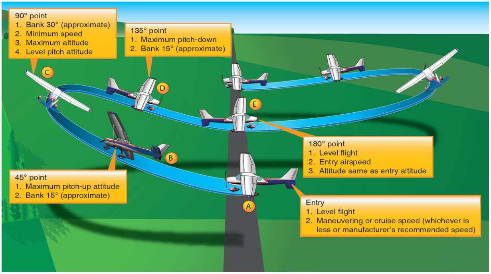
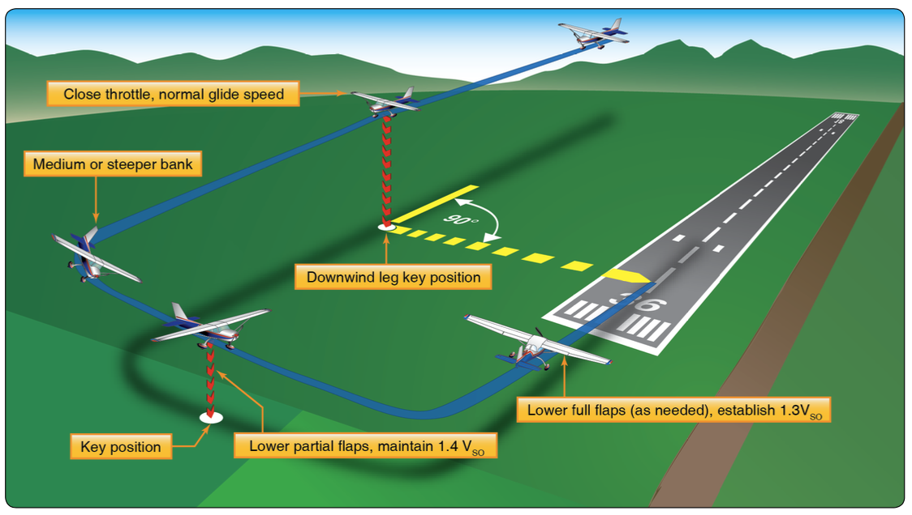

# Performance Maneuvers

## Chandelle

Maximum performance 180 degrees turn from approximately straight and level to a nose-high, wings-level, minimum airspeed condition just above stall speed.

### Procedure

1. Immediately start a 30 &deg; bank turn, add climb power
2. In the 90 degrees of turn: constant bank, increasing pitch
3. On the second 90 degrees: constant pitch, decreasing bank

Notes:

- The control effectiveness will decrease as our speed, so we need to keep adding elevator
- An increasing amount of rudder pressure will be needed as you climb
- The radius of the turn gets tighter as you slow
- Use the speed specific in the POH, or $V_a$

## Lazy 8s

Two 180 turns in opposite directions to develop the proper coordination of flight controls along a wide range of attitudes and airspeed.s

### Procedure

1. Pick an aiming point or direction, a 45&deg;, 90&deg;, and 135&deg; point
2. Enter in level light at maneuvering speed (or recommended speed)
3. Add slight amount of bank and pitch up
4. At the 45&deg; point on the turn, the bank should be able 15 degrees with the maximum pitch up
5. As the bank continues to increase the pitch will drop
6. Through the 135&deg; point you should be at 15 degrees of bank and maximum pitch down
7. Slow pull out of the dive and level as the airspeed increases

Notes:

- Be coordinated the whole way through
- All controls should be moving through the whole maneuver
- Right turns take a lot more right rudder, and it will have a tendency to overbank (you may need opposite aileron to work against this)

## Steep Spiral

Three 360&deg; gliding turns, while maintaining a constant airspeed and over constant point over the ground.

### Procedure

1. Pick a point over the ground, it will be almost directly below you
2. Throttle to idle, immediately bank to 45 degrees over the point
3. Vary bank angle with the wind to keep a constant radius over the point

Notes:

- If you overbank you may decrease your airspeed
- Airspeed can be very difficult to keep
- Bank should not exceed 60
- Conclude more than 1000' above the ground
- Clear the engine during each turn

## Power-Off 180&deg; Accuracy Landing

Starting at pattern altitude (not higher than 1000' above touchdown point) on the downwind leg, performance power-off landing, touching down at a predetermined point on the runway.

### Procedure

1. Close the throttle at the "key point" on downwind
2. Judge wind drift on the base leg
3. On the final leg, focus on making a safe landing on the runway

Notes:
- Don't coarsen the blade, even if it will reduce drag (since you may not be able to go-around)
- 
