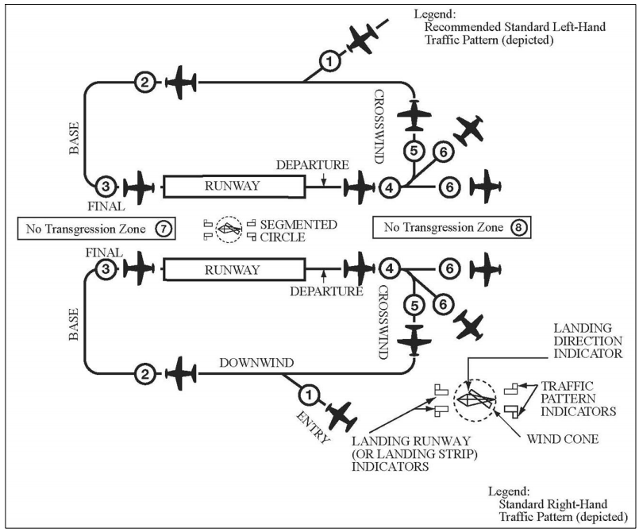

# Landings

## Normal Landings

- Team traffic patterns and stabilized approaches first
- Minimal control inputs when on glidepath
- Psychomotor skill, takes time to develop
- Practice with minimal wind
- Landing may take upwards of 15 hours and 150 landings to become proficient

### With the traffic pattern

[AIM 4-3-2](/_references/AIM/4-3-2)

- Turn crosswind 300' below pattern altitude
- 1/2 mile base leg from the runway
- Apply wind correction angle
- "Key point" -- abeam the touchdown point, reduce power
- Often first notch of flaps are put down at the key point
- 45 degrees to the runway, turn base
- Judge your height based on the cowling
- When runway is 10 degrees ahead of the wing, turn final
- Try to align front of the runway with back of the runway
  - Look at the rate at which the runway is rotating
- Judge the glidepath based on the position of the runway in the windscreen
- As you get closer to the runway, more detail will resolve
- The runway "expansion", where the runway expands in your field of view, is the flare point
- Flare to the nose just below (4 fingers) below the horizon
- Put the centerline right under your seat
- Crosswind landings
  - Keep the fuselage parallel with the runway with the rudder
  - Use aileron to account for drift from the centerline
- For gusty winds, add 1/2 of the gust factor (how much more is it gusting) to the approach speed

## Short Field Landing

Landing an airplane in the shortest distance possible.

### Operation

- Visualize an obstruction prior to the runway
- Pick a touchdown point
- Fly the approach at recommended short-field landing speed, or $1.3 * V_{SO}$
- Don't land with the brakes applied, which may cause a burst tire
- Short-field landings are often firm, and can be hard on the airplane

## Soft Field Landing

Landing an airplane on the wheels as gently as possible, such that the tires wouldn't dig into soft soil.

### Operation

- During flare, hold the nose off to slow the decent rate
- Add a little throttle to get the gear to touch down gentle
