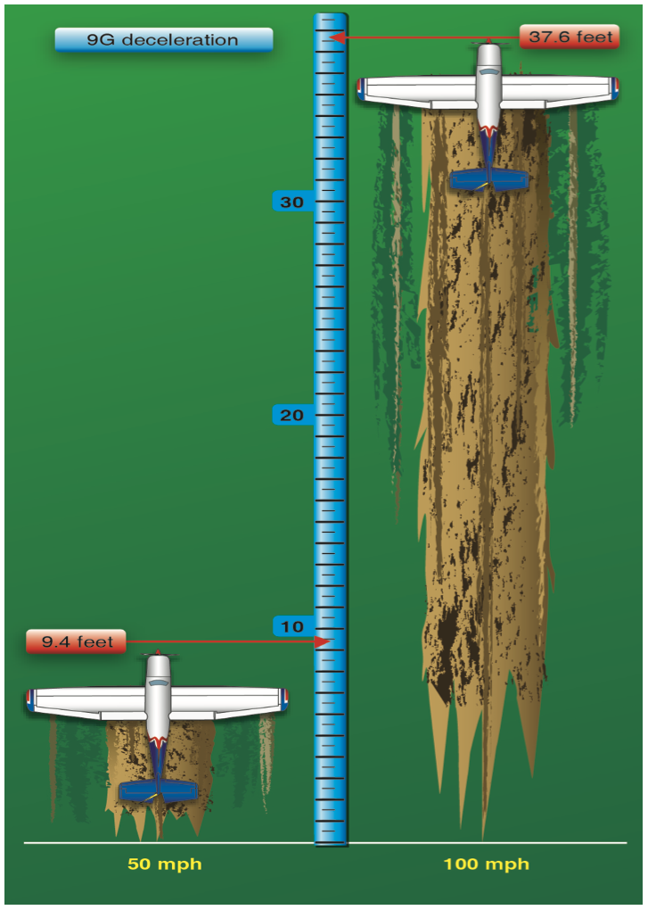

# Emergencies

## Emergency Landings

### Forced Landing

Immediate landing on or off-airport, necessitated by the inability to continue flight. Engine failures, fires.

### Precautionary Landing

Premeditated landing on or off-airport. Fuel shortage, lost.

### Ditching

Forced or precautionary landing on water.

### Psychological Hazards

- Reluctance to acknowledge the emergency situation
- Desire to save the airplane
- Undue concern about getting hurt

- Generally about 9g's of force will be deadly
- A lower speed will drastically lower the amount of deceleration distance needed to come to a stop safely

### Gear Up vs Gear Down Landing

- Ditching would necessitate a gear-up landing
- Other surfaces like fields might also benefit from a gear-up landing

## Emergency Approach and Landing

### Landing Area Selection

- 5 S's
  - Size: Big enough, use an airport
  - Shape: Square, rectangular into the wind
  - Surface: Light brown, light green
  - Slope: Look at terrain around the field
  - Surroundings: Roads, civilization nearby
- 2 W's
  - Wind: Landing into the wing as best we can
  - Wires: Power lines

### Glide

- Look at a stationary object in the windscreen to establish glide towards a field
- Fly a normal pattern, if possible, with a touchdown point some point down the field

## Engine Failure After Takeoff

- Requires a big push
- Unadvisable to turn back to the runway on takeoff, depending on the performance on the airplane
- Even with enough altitude, a large tailwind might make you overshoot

## Electrical Fire

- Don't turn anything back on

## Wing Fire

- Slip away from the smoke to keep smoke away from the windscreen

## Cabin Fire

- Use fire extinguisher
- Turn off an electrical equipment

## Flap Failures

- Stuck down or stuck up failures
- Asymmetrical flap deployment: over come with aileron

## Control Failures

- Elevator failure: Trim is all we've got
- Aileron failure: Rudder is all we got
- Rudder failure: Aileron is all we got

## Door Opening In Flight

- Fly the airplane, try to ignore it

## Inadvertent Flight into IMC

- Try a 180 degrees level turn

## Unusual Attitude Recovery

### Nose-High Scenario

1. Simultaneous add power and nose-down elevator
2. Then level the wings with aileron and rudder

### Nose-Low Attitude

1. Close the throttle
2. Level the wings
3. Slowly recovery the dive attitudes
