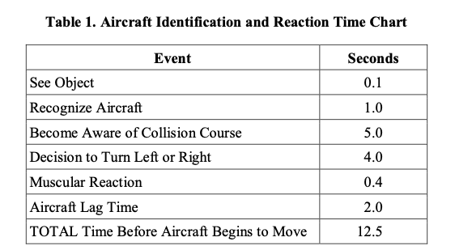

# Collision Avoidance

## Risk Factors

- Pilot conditions
  - Fatigue
  - Boredom
  - Illness
  - Distraction and preoccupation
- Environmental conditions
  - Haze
  - Smoke
  - Precipitation

[Pilot's Handbook of Aeronautical Knowledge pg. 14-28](/_references/PHAK/14-28)

## See and Avoid

- Most collision occurs within in 5nm of an airport or navaid
- Limitations of our eyes
- Relies on visual scanning techniques
- Avoid directly overflying NAVAIDs

## Scanning Techniques

- Shift your glance about 10&deg; over the sky for 3-5 seconds at a time
- Peripheral vision is good at spotting collision threats
- No relative motion: On a collision course
- More information in [AC 90-48](https://www.faa.gov/regulations_policies/advisory_circulars/index.cfm/go/document.information/documentID/1041368)

## Airport Operations

- Always check final before pulling onto a runway
- A cruise climb can use useful to lower the nose when departing an airport
- Don't descend into the traffic pattern

## Proper Clearing Procedures

- Always attempt to clear the area you're going to maneuver into
- High wing
  - 90 degree turns left/and right, make sure to look down the wing
  - For steep spirals or spins clear the area below you
- Low-wing
  - More difficult to clear below the airplane

## High-Risk Areas

- Flight in MOAs
- Practice areas
- Busy airports B, C, D
- Non-towered airports without a lot of traffic
- IFR intersections

## Collision Avoidance Systems

### ADS-B

- ADS-B Out is required anywhere a transponder is required (most controlled airspace)
- ADS-B information is broadcast from ground stations
- Many airplanes do not have ADS-B
- ADS-B has a maximum number of targets and delays

### TIS

- Traffic Information Service
- Essentially an uplink of traffic data from ground radar stations

### TCAS

- Querying the transponders of other aircraft (no ground station relay)
- Resolution advisory (RAs):
  - Commands to climb or descend
  - Airliners are required to respond to RAs
