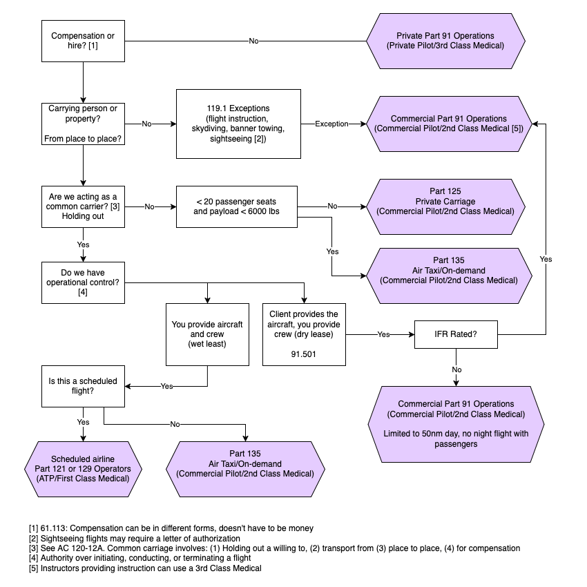

import Reg from "@site/src/components/Reg";
import Acronym, { AcronymRow } from "@site/src/components/Acronym";
import EncodedDataExplainer, {
  EncodedDataWord,
} from "@site/src/components/EncodedDataExplainer";
import StandardAtmosphereSlider from "@site/src/components/StandardAtmosphereSlider";
import ReferenceList from "@site/src/components/ReferenceList";

# Commercial Operators

A person OR an organization can be a commercial operator.

[119.1](/_references/14-CFR/119.1) requires that an air carrier or commercial operator obtain a operator
certificate.

Any operations of a [common carrier](/docs/topics/regulations/commercial/carriage) requires an
operator certificate.

Even when common carriage is _not_ involved, carrying passengers or cargo for
hire requires a certificate:

- For airplanes with >20 seats, or a payload capacity of >6000 lbs.:
  - The operations should be conducted under Part 125
- For airplanes with &lt;20 seats, or a payload capacity of &lt;6000 lbs.:
  - The operations should be conducted under Part 135 or Part 121

<Reg part="119.23" />

Part 119 also defines a list of exceptions. These operations _can_ be performed
by a commercial pilot without a operator certificate:

- Student instruction
- Non-stop commercial air tours\*
- Ferry or training flights
- Aerial work
  - Crop dusting
  - Banner towing
  - Aerial photography
  - Fire fighting
  - Helicopter in constrution work
  - Powerline or pipeline patrol
- Parachute jump operations

<Reg part="119.1" />

## \*Non-stop Commercial Air Tours

Although non-stop commercial air tours are permitted under Part 119 without an
operators certificate, some addition requirement apply:

- The operator must receive a letter of authorization from the FAA, and comply
  with it
- The operator must register and implement a drug and alcohol testing programs
  in accordance with <Reg part="120" />

<Reg part="91.147" />

## Commercial Operations Flowchart

<ReferenceList
  references={[
    {
      name: "14 CFR 119.1",
      link: "https://ecfr.federalregister.gov/current/title-14/chapter-I/subchapter-G/part-119/subpart-A/section-119.1",
    },
    {
      name: "14 CFR 119.23",
      link: "https://ecfr.federalregister.gov/current/title-14/chapter-I/subchapter-G/part-119/subpart-A/section-119.23",
    },
  ]}
/>
