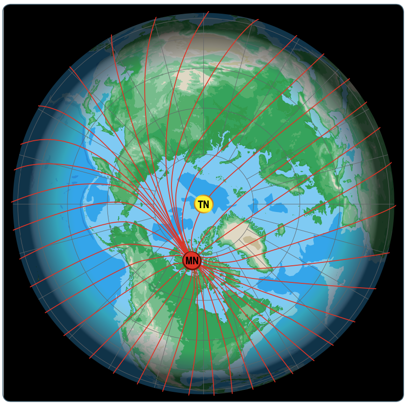

# Course to Fly

## Magnetic Course

- The magnetic north pole does not exist at the true north pole, so there's a slight error between true north and magnetic north
- This error gets more pronounced as you travel further north

## Flight Plan Checkpoints

- Use large airports, not small ones
- Big, unique lakes
- Mountains
- Use big features first
- Check the terrain

## Dead Reckoning

Navigation solely by the means of pre-calculated headings, times, wind direction, using airspeed, groundspeed, and elapsed time.

## Track Error

- Estimate closing angle vs track error, using 10&deg; reference lines on the chart
- 1 in 60 rule:
  - For every 60 miles from a point, every 1 degree of course is 1 mile off course
  - Course error = $\frac{(\text{distance from station})}{\text{60}} * \text{(distance from course)}$
