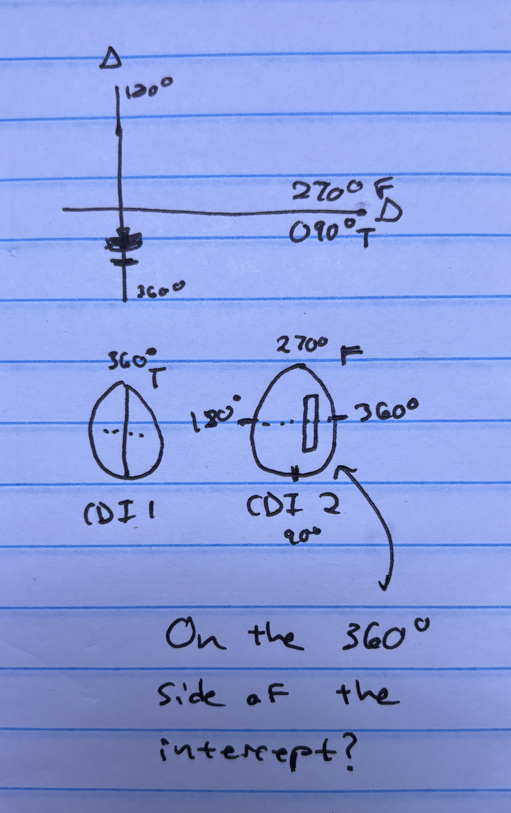

# Ground-Based Navigation

## VHF Omni-directional Range (VOR)

VORs operate within the 108.0 to 117.95 MHz frequency band and have a power
output necessary to provide coverage within their assigned operational service
volume. They are subject to line-of-sight restrictions, and the range varies
proportionally to the altitude of the receiving equipment.

- During periods of maintenance, the facility may radiate a T-E-S-T code
  (- ● ●●● -) or the code may be removed
- Most VORs are equipped for voice transmission on the VOR frequency. VORs
  without voice capability are indicated by the letter “W” (without voice)
  included in the class designator (VORW).
- Charted: VOR / VORDME / VORTAC
- Signal sweeps around starting at north
- We turn our VOR to a specific frequency, which corresponds
- TO/FROM flag
- To go to the VOR, go "to it and through it", meaning through the course
- Intercepting radial:
  - Fly an intercept
  - Radials get further apart as you get farther from the station

### Same-side safe

"Same side safe" is a convenient mental process when intercepting between two radials to determine which side of the radial you are on.

## Service Volumes

For IFR flight VOR must be [checked every 30 days](/docs/topics/airworthiness/inspections/vor-checks).
