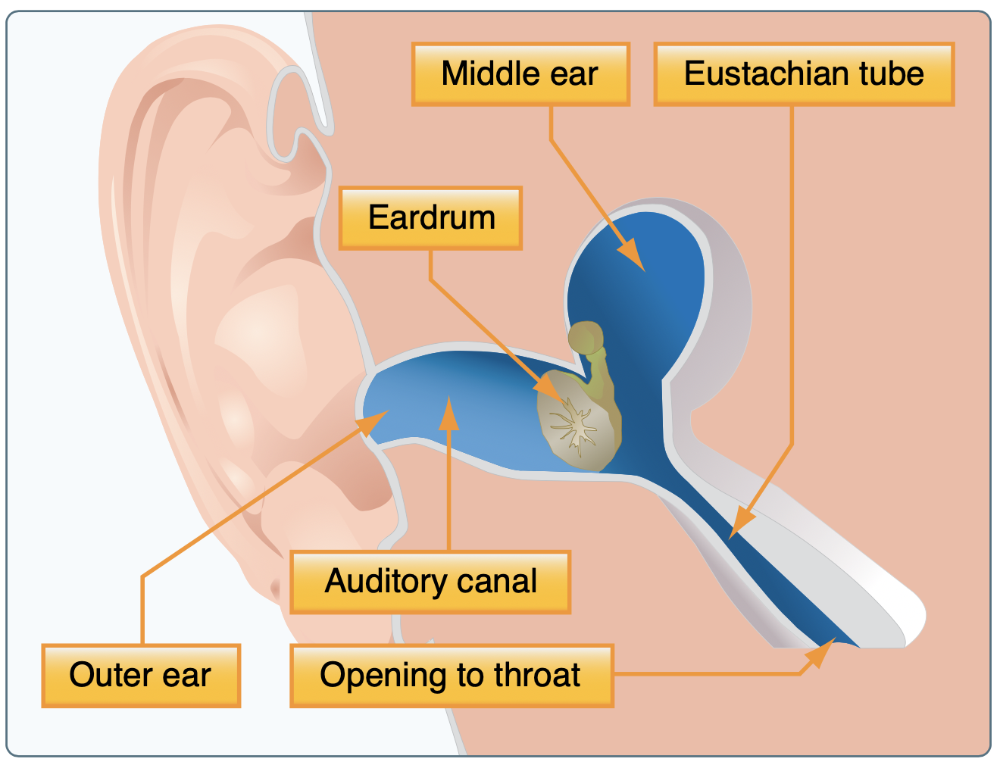

# Middle Ear

A "plugging" of the Eustachian tube which equalizes pressure between both sides of your ear drum. If the tube gets blocked or inflamed, pressure changes due to changes in altitude can cause ear pain.

## Symptoms

- Ear pain or pressure, especially when climbing or descending

## Remedy

- Descend slowly
- Valsalva method
  - Pinch your nose and breath gently to relieve the pressure
- Decongestants can be helpful, though they cannot be taken by pilots
