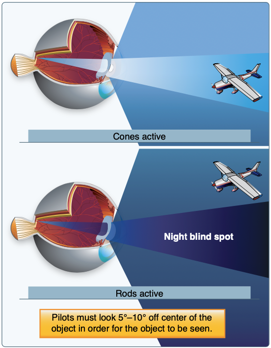

# Night Operations

## Night vision

### Rods vs Cones

- Cones: Used for bright light, color vision
- Rods: Better at detecting movement and vision in dim light. They provide almost no color information

### Effectiveness

- 30 minutes of avoiding bright lights
- Above 5000' oxygen use can be very beneficial
- Move eyes more slowly at night
- Blink eyes if they are blurry
- Look off-center at night
- Use red light for reference in the cockpit

# Night Illusions

- Autokinesis
  - Caused by staring at a single point of light against a dark background
  - After a few seconds the light will appear to move on its own
- Distant stationary lights
- Cloud layers can provide false horizons
- No visual horizon can make IFR-like conditions
- Flicker vertigo
  - A light flickering at a rate between 4 and 20 cycles per second can produce dangerous reactions
- Black hole approach
  - Approach with no other visual references other than the runway
  - This often causes you to fly lower than usual
- Bright approach lights can make it look like you are closer than you actually are

[Pilot's Handbook of Aeronautical Knowledge pg. 17-26](/_references/PHAK/17-26)
