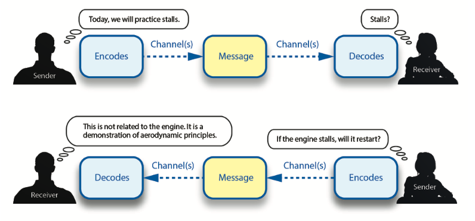

# Effective Communication

## Elements of Communication

- Source: sender, teacher, speaker
- Symbols: words, signs, props
- Receiver: listener, student

[Aviation Instructor's Handbook pg. 4-2](/_references/AIH/4-2)

## Barriers to Communication

- Lack of common experience
  - Communication can only be effective when there are experiences that are similar to what is being described
  - The learner's experience determines how they interpret symbols
  - For example, using aviation terminology before the learner has learned the vocabulary
- Confusion between the symbol and the object
  - Misunderstanding between a symbol that the listener interprets and the one intended by the speaker
- Overuse of abstractions
  - Using words are concepts that are too general
  - For example, "aircraft" could be a helicopter, airplane, airship
- Interference
  - Somehow the message is cut short or disrupted, but the listener isn't aware
- External factors
  - Difficulty hearing, external pressures, external pressures, multitasking

[Aviation Instructor's Handbook pg. 4-4](/_references/AIH/4-4)

## Developing Communication Skills

- Role playing
  - Practice instruction communication with someone other than a student
- Listening
  - Do not interrupt
  - Do not judge
  - Think before answering
  - Be close enough to hear
  - Watch nonverbal cues
  - Beware of biases
  - Look for underlying feeling
  - Concentrate
  - Don't rehearse answers while listening
  - Do not insist on the last word
- Questioning
  - Open-ended questions are good for large concepts
  - Closed-ended questions are good when you want a specific answer
  - Paraphrasing an answer back to the learner can be helpful
- Instruction enhancement
  - Always keep learning as an instructor

[Aviation Instructor's Handbook pg. 4-6](/_references/AIH/4-6)
