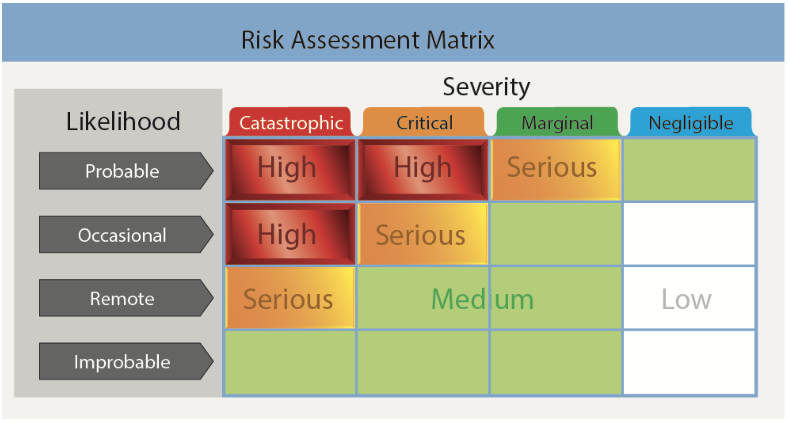

# Teaching Risk Management During Flight Instruction

## The PAVE Checklist

- The PAVE checklist should be used to identify risk factors that need to be mitigated
- Pilot, Aircraft, EnVironment, and External Pressure are broad buckets

[Aviation Instructor's Handbook pg. 10-2](/_references/AIH/10-2)

## When to Teach Risk Management

- At the start of the first lesson, starting with ground lessons
- Included in post-flight briefings of each flight

### Assessing and Mitigating Risk

- Risk should be evaluated with their regard to severity (how bad is it if it occurs), and likelihood (how likely is it to occur)
- Thinking about risk can start days before the flight
- If risks cannot be mitigated, consider cancelling the flight

Risk mitigation process:

- **T**: Transfer
- **E**: Eliminate
- **A**: Accept
- **M**: Mitigate

[Aviation Instructor's Handbook pg. 10-3](/_references/AIH/10-3)

## Risk Management by Phase of Instruction

- During private pilot training
  1. Pre-solo: Introduce risk management and discuss before/after each flight
  2. Pre-solo-XC: Learner should perform the risk analysis, with some coaching
  3. XC training: XC risk management with the complexities it involves
- For experienced pilots
  - Instrument training: Unique IFR condition risks
  - Transition training: Risks associated with new and complex aircraft
  - Recurrent/Flight Review/IPCs: Use scenarios during any kind of recurrent training to evaluate risk management proficiency

[Aviation Instructor's Handbook pg. 10-4](/_references/AIH/10-4)

## Managing Risk During Flight Instruction

- Pilot risks
  - Instructor should expect the learner to make mistakes, and need margin to allow for those mistakes
  - Instructors also need to be qualified and proficient
- Aircraft risks
  - Instructors may not be in control of the maintenance of trainer aircraft
  - Weight and balance may have limitation in two-place trainer aircraft
- Environment risks
  - Training airspace can be crowded
  - Airspace may have haze or pollution
- External pressures
  - External distractions
  - Pressures to complete training

[Aviation Instructor's Handbook pg. 10-6](/_references/AIH/10-6)

## Best Practices for Managing Risk during Flight Instruction

- Pilot
  - Pilots should remain current and proficient
  - Instructors should use the IMSAFE checklist for aeromedical risks
- Aircraft
  - Instructors should ensure aircraft is airworthy before flight
  - Deal with maintenance issues before the preflight
- Environment
  - Diligence is required around weather, terrain, night operation, airports, airspace
  - Instructor should involve the learner in the assessment and mitigation process
- External pressures
  - Instructors should be conscious of the learners schedule and pressures
  - Be willing and able to switch to a ground lesson if flying is unadvisable

[Aviation Instructor's Handbook pg. 10-7](/_references/AIH/10-7)

## Managing Risk while Teaching Takeoffs

- Takeoffs happen so quickly that there is not much time instruct
- Strive for a sterile cockpit to avoid over-stimulating the learner
- Brief the takeoff with the learner beforehand
- Create realistic scenarios for short field, soft field maneuvers, but ensure its safe to do so
- Be cognizant of other aircraft

[Aviation Instructor's Handbook pg. 10-8](/_references/AIH/10-8)

## Managing Risk while Teaching Landings

- Landing are complex and require conceptional understand of power, control, configuration, wind
- Pick aiming and touchdown points carefully
- Use concise prompting during landings
- Instructors should be familiar with the airports and areas

[Aviation Instructor's Handbook pg. 10-9](/_references/AIH/10-9)
