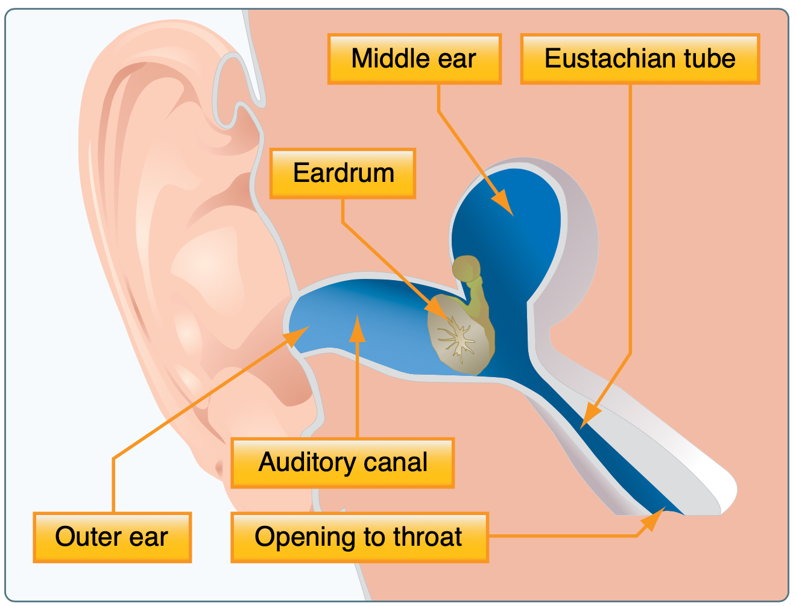
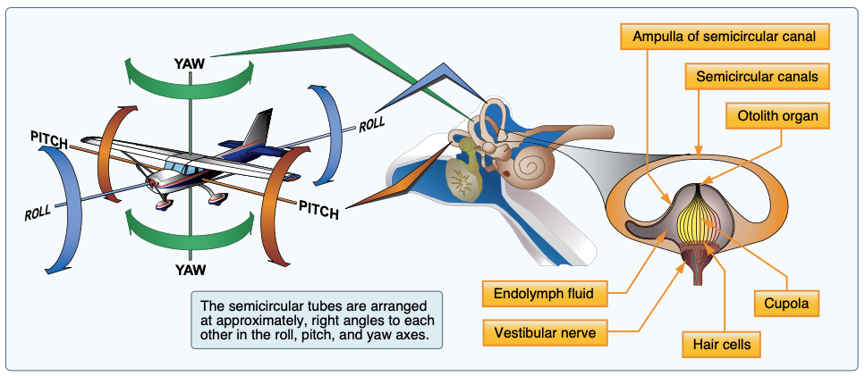
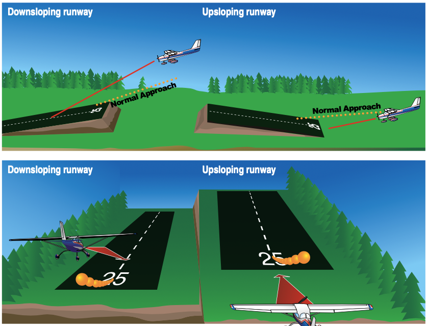

# Human Factors

---

## Objective

To become familiar with and apply the knowledge related to aeromedical factors.

## Motivation

Understand the risks and mitigations for aeromedical factors that can effect flight safety, as they may happen to you, another pilot, or your passengers.

---

# Hypoxia

Hypoxia is a state of oxygen deficiency in the body sufficient to impair functions of the brain and other organs

### Symptoms

Cyanosis, headache, dizziness, euphoria, impaired vision, drowsiness

### Corrective Actions

- Use supplemental oxygen
- Fly at a lower altitude
- Address any pollution in the air
- Time of useful consciousness

---

## Time of Useful Consciousness

- From AC 61-107B

---

## Types of Hypoxia

- **Hypoxic**: Caused by the reduction in partial pressure of oxygen at
  high altitude
- **Hypemic**: Caused by the blood not being able to take up and
  transport a sufficient amount of oxygen
- **Stagnant**: Caused by a lack of circulation of oxygenated blood in
  the body
- **Histotoxic**: Caused by the inability of the cells to effectively
  use oxygen

---

# Hyperventilation

Excessive rate and depth of respiration leading to abnormal loss of carbon dioxide

### Symptoms

Rapid breathing, visual impairment, sweaty skin, dizziness

### Corrective Actions

- Breath slowly
- Speak something slowly
- Breathe into a bag

---

# Middle Ear and Sinus Problems

- Blockage of the Eustachian tube which equalizes pressure between both sides of your ear drum, which often happens with inflammation

---

## Middle Ear and Sinus Problems

- **Symptoms**:
  - Ear pain and pressure
  - Muffled hearing
- **Corrective Actions**
  - Valsalva method
  - Descend slowly
  - Decongestants can be used for passengers

---

# Spatial disorientation

Disagreement or confusion between your sensory systems about the aircraft's position, attitude, or movement.

---

## Illusions that contribute to spatial disorientation

# "The Leans"

- After a long gradual turn, the airplane is returned to level
- The plane may feel as though it's banking in the opposite direction

# Graveyard Spiral

- The pilot erroneous banks back into the turn
- The airplane will tend to lose altitude, so the pilot pulls back on the elevator
- The result is a nose-low, descending, high-G turn

---

## Illusions that contribute to spatial disorientation

# Coriolis illusion

- Rapid head movement during a turn
- The plane may feel as though it's banking in the opposite direction

# Somatogravic Illusion

- Acceleration may feel like a pitching-up movement
- Especially true with limited visual reference, like a night
- Pilot may consequently push into a nose-low attitude
- Likewise, deceleration may cause the sensation of pitching down

---

## Illusions that contribute to spatial disorientation

# Inversion illusion

- Abrupt change from climbing to straight-and-level flight can create the
  illusion of tumbling backwards
- Pilots may then push the aircraft into a nose-low attitude

# Elevator Illusion

- Upward vertical acceleration like an updraft can create the illusion of being in a climb
- Pilots may may pull into a nose-up attitude

---

# Overcoming Disorienting Illusions

- Trust flight instruments
- Limit maneuvering
- Limit rapid head movements
- Use autopilot if needed

---

# Motion Sickness

Discomfort caused by the brain receiving conflicting messages about the state of the body's position in space.

- **Symptoms**:
  - Nausea, vomiting
  - Dizziness
  - Paleness, sweaty, clammy skin
- **Corrective Actions**
  - Fresh air
  - Focus on objects outside the airplane
  - Avoid unnecessary head movements

---

# Carbon monoxide poisoning

Hypemic hypoxia caused by the presence of CO in the air, which attaches to hemoglobin in the blood.

- **Symptoms**:
  - Headache, drowsiness
  - Blurred vision
  - Loss of muscle power
- **Corrective Actions**
  - Close header vent
  - Land and ventilate the cabin
  - Open fresh air vents

---

# Stress

The body’s response to physical and psychological demands placed upon it. Stress can be chronic or acute.

- **Symptoms**:
  - Agitation
  - Not thinking well
  - Fatigue
- **Corrective Actions**
  - Correct underlying stressors, which may
  - Chronic stress require medical treatment

---

# Fatigue

- Acute fatigue is caused by lack of sleep
- Chronic fatigue usually has medical underpinnings

### Symptoms

- Drowsiness
- Errors in judgment, timing, computation
- Loss of muscle control

### Corrective Actions

- Chronic fatigue: correct underlying issues, may require medical attention
- Acute fatigue: Rest

---

# Dehydration

A critical loss of water or electrolytes from the body.

- **Symptoms**:
  - Headache
  - Fatigue
  - Drowsiness
  - Cramps
- **Corrective Actions**
  - Drink plenty of fluids and electrolytes
  - Drink before you become thirsty

<!-- Your thirst response may work too slowly to warn of the onset of dehydration -->

---

# Hypothermia

- **Cause**: Exposure to cold temperature for extended periods.
- **Symptoms**:
  - Coldness, shivering
  - Drowsiness
  - Loss of consciousness
- **Corrective Actions**
  - Move to a warmer environment
  - Add clothing, blankets, or coats
  - Cover exposed areas

---

# Alcohol

## Effects

- Symptoms similar to that of hypoxia
- Impaired judgement, coordination, reaction time

## Regulations

Part [91.17](/_references/14-CFR/91.17):

- 8 hours "bottle to throttle"
- 0.04% BAC limit
- Cannot carry drunk passengers, except in an emergency

---

# Drugs

### Regulations

Part [61.53](/_references/14-CFR/61.53):

A pilot cannot act as PIC if:

- They have any known condition that would make them ineligible for a medical
- Are receiving treatment or taking medication that would make them ineligible for a medical

### AOPA Drug Database

https://www.aopa.org/go-fly/medical-resources/medications-database

- Check the half-life of any drug you intend to take

---

# Drugs

## Substances to Avoid

- Nicotine: Impaired night vision, CO poisioning
- Amphetamines: Impaired vision, impaired judgement
- Caffeine: Impaired judgement, dehydration, headaches
- Antacids: Release CO2 at altitude
- Antihistamines: Drowsiness, dizziness
- Aspirin: Contribute to hypoxia
- Prescription pain killers
- Illicit drugs

---

# Dissolved Nitrogen After SCUBA dives

Dissolved nitrogen in the blood being forced out of the body's tissues.

## Guidance

- Flights below 8,0000' MSL:
  - Dive does _not_ require a controlled ascent: Wait at least **12 hours**
  - Dive require controlled ascent: Wait at least **24 hours**
- Flights above 8,000' MSL: At least **24 hours**

---

## Knowledge Check

> You are flying at 7,500 feet and your passenger complains of fatigue and a headache.

- Suspect some form of hypoxia
- Check CO detector, if installed
- Use a pulse-oximeter if you have one
- Descend if possible

---

# IMSAFE Checklist

Preflight self-evaluation:

1. Illness
2. Medication
3. Stress
4. Alcohol
5. Fatigue
6. Emotion

---

# False Horizon

---

# Runway Width Illusion

---

# Sloping Runway Illusion

---

# Other Illusions

- Featureless terrain
  - Over water at night
  - Aircraft may appear higher than it actually is
  - "Black hole" approach
- Water on windscreen
  - The aircraft may seem higher than it actually is
- Haze
  - Aircraft may appear to be further away
- Fog
  - Flying into fog: Illusion of pitching up
- Mistaking city lights for runway lights