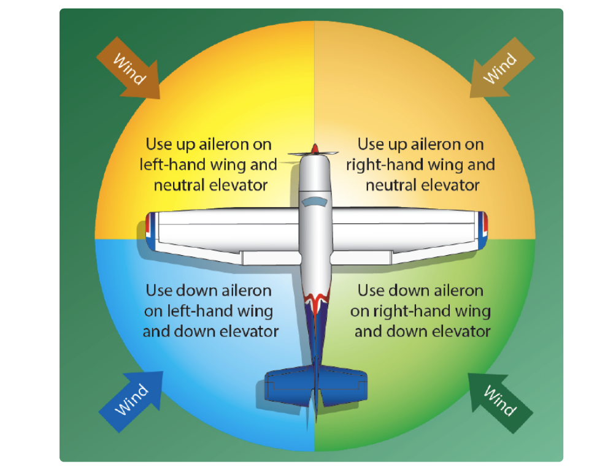
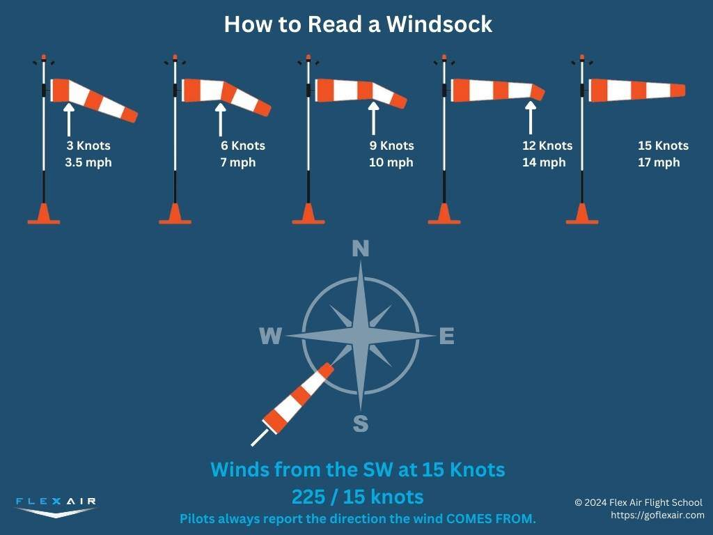
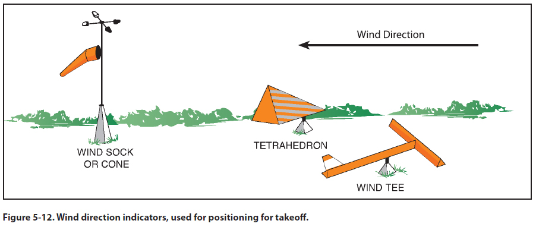
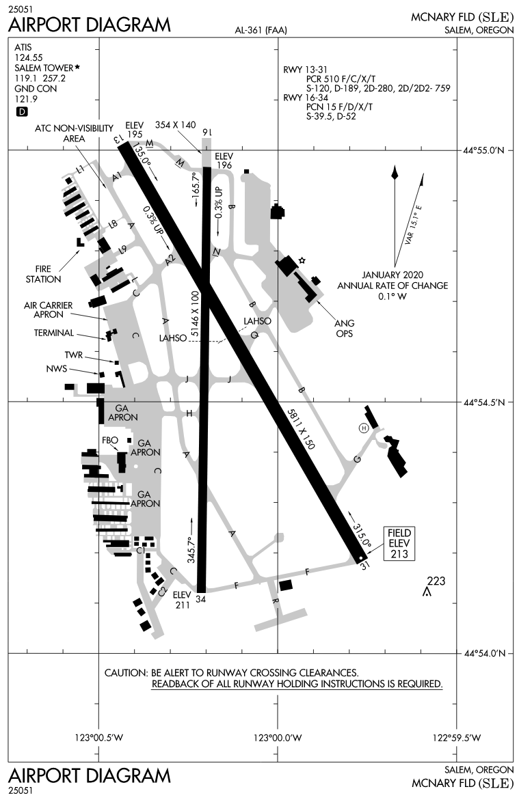
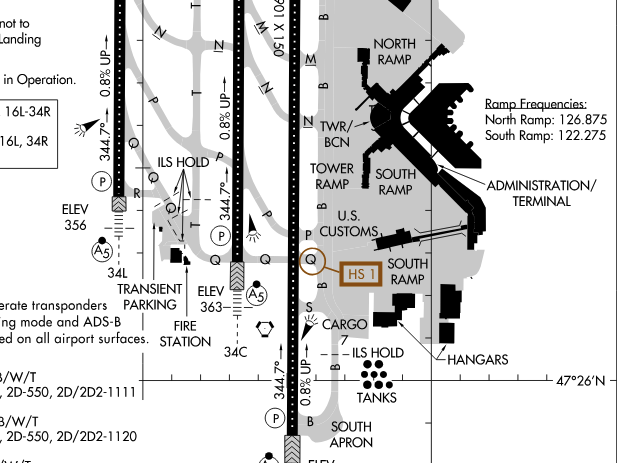
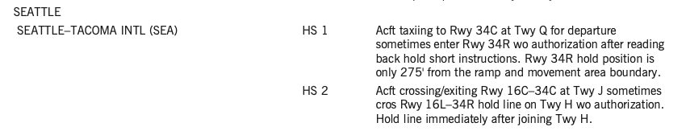
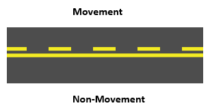
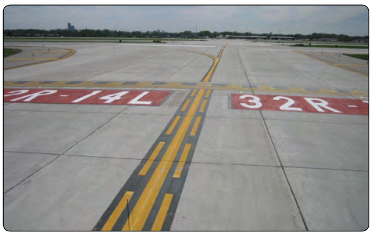

# Taxi Operations

---

## Taxi Speed

- Taxi slow enough that you can stop quickly
- Don't ride the brakes
- Turn with rudder/nosewheel first, then use differental braking
- Position controls into the wind

---

## Wind

- Turn into the wind
- Dive away from the wind

---

## Windsocks

---

## Wind Tee and Tetrahedrons

- Can also be manually positioned
- No indication of velocity

---

## Airport Diagrams

- Included in Chart Supplements

---

## Airport Hotspots

- Areas that may cause confusion or have a higher potential for runway incursions

---

## Hotspot Information

- Hotspot information is included in the "back pages" of the Chart Supplement (along with the airport diagrams)

---

## NOTAMS

- Notice to Air Missions
- Check before flight
- Found in an EFB or FAA NOTAM site

---

## Copying Taxi Instructions

1. Anticipate the expected clearance
2. Write down taxi instruction and cross reference with airport diagram
3. Call out any taxi hotspots
4. Monitor progress on airport diagram

---

## Taxi Clearance

- Need a clearance to move into a movement area
- If unable, reply "unable" prior to taxiing

---

## Entering and crossing runways

- ATC Clearance required to cross any runway at a towered airport
- Runway crossing instructions must be explicit
  - "N12345 cross runway 36 at A3"

---

## Low visibility operations

- Harder to see signs, other aircraft, and tell direction
- Taxi speed should be slower
- ATC may not be able to see you visually from the tower

---

## Night taxi operations

- Easy to get confused about position or direction
- Not all airport signs are illuminated
- Taxi speed should be slower
- Taxi lights should be used
  - But avoid shining into another airplane's cockpit
- Don't use strobe lights when taxiing

---

## Aircraft Lighting (91.209)

- Anti-collision/beacon lights must be on all the time
- Position lights (red/green) must be turned on from sunset to sunrise
- Taxi light used for taxi
- Taxi + landing lights should be used for takeoff

---

## General ATC Phraseology

1. Who are you calling
2. Who you are - your type and callsign (Cessna N12345)
3. What information do you have?
4. What do you want to do?

`Salem Ground, Cessna N13212 with information Papa, ready to taxi for VFR departure.`

---

## Departure

1. "Closed traffic" - remain the traffic pattern
2. North/south/west/east bound departure
3. VFR arrival/departure procedures: Ask if not familiar

---

## Example Taxi Clearance

`Cessna N12312, Salem Ground, taxi runway 13 via Alpha.`

---

## Progressive Taxi

- At an unfamiliar airport you can ask ATC for progressive taxi
- They will give you turn-by-turn directions as you taxi to your destination
