# Airport Signs, Markings, and Lighting

---

## Parts of an Airport

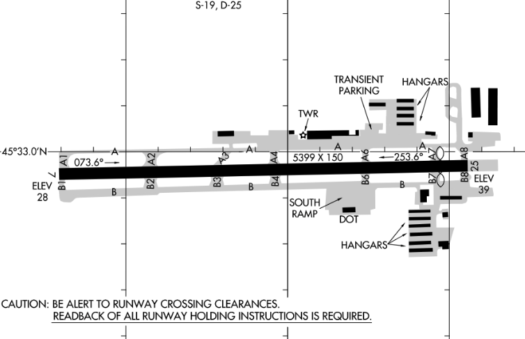

<!--
- Ramp
- Taxiway
- Runway
- "Movement area" - runways, taxiways, and other areas that are used for taxiing, takeoff, and landing of aircraft
-->

---

## Signs We'll Encounter as We Taxi

---

## Movement Area Boundary

- Separates ramp from movement area
- Need a clearance to cross at an airport with a control tower

---

## Taxiway signs

- Black-backed text indicates taxiway you are on (taxiway direction sign)
- Yellow-backed text indicates direction to destination (taxiway location sign)

---

## Taxiway Intersection

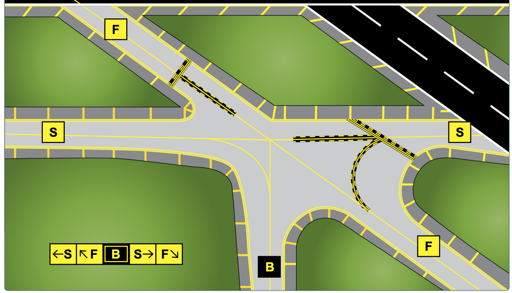

- A dashed yellow lines indicates a hold short, then a clearance is required to cross

---

## Destination Signs

- Runway destination signs
- Dot separates multiple runways

---

## Runway Safety Area

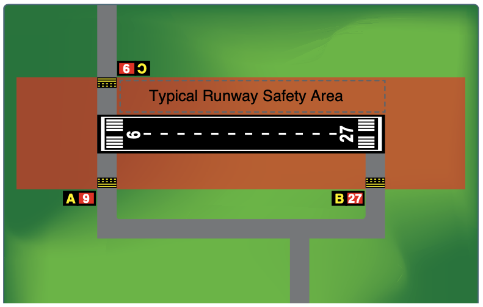

- Buffer zone which reduces the risk of damage to airplanes in the event of an undershoot overshoot, or excursion from the runway

---

## Crossing a Runway

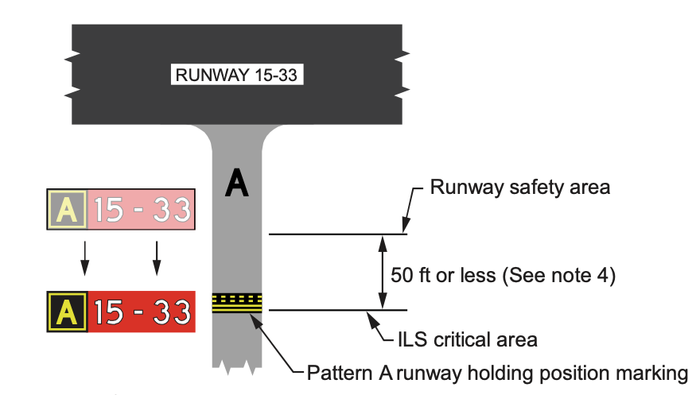

<!--
Sign: Runway holding position sign
 -->

- Stop before the hold short bars
- Need a clearance to cross
- Runways numbers are placed on the corresponding side of the sign

---

## Crossing a Runway

- Dashed to solid, crossing ok
- Solid to dashed, need a clearance
- Completely cross the entire line to be clear of the runway

---

## Crossing a Runway

- Runway identifiers also painted on the ground
- See red, think STOP

---

## Holding Short of a Runway

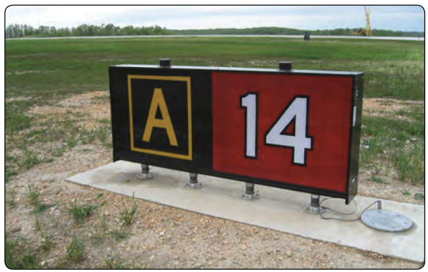

- Runway holding position sign (at runway end)

---

## ILS Hold Position Area

- ILSs have critical areas that must be kept clear of all obstacles

---

## ILS Hold Position Area

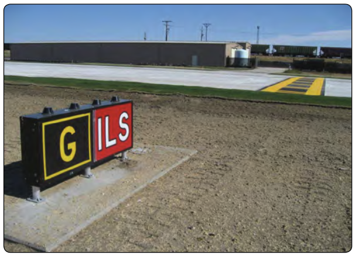

- ATC phraseology will be `HOLD SHORT OF RUNWAY 36 ILS CRITICAL AREA.`

---

## Runway Approach Area Holding

- ATC: `Hold short of Runway XX approach or Runway XX departure area`

---

## Runway Approach Area Holding

---

## No Entry Sign

---

# Runway Signs and Markings

---

## Non-Precision Runway Markings

---

## Precision Runway Markings

---

## Runway Location Sign

- Identifies which runway you are on

---

## Runway Distance Remaining

- Identifies how much runway is remaining in 1000's of feet

---

## Displaced Threshold

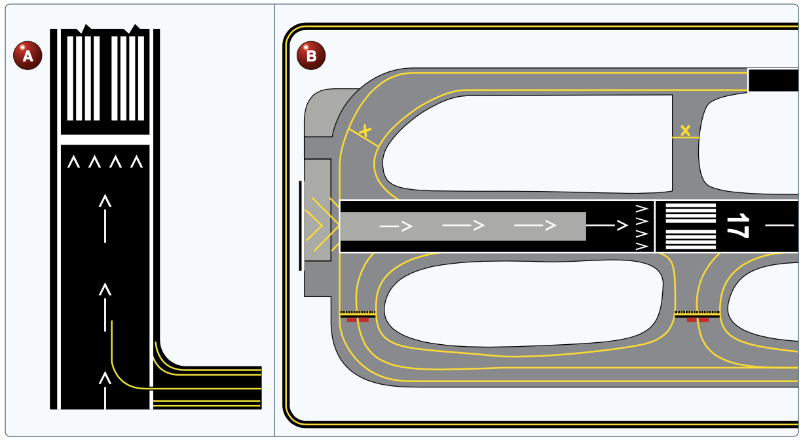

- Can be used for takeoff, but not for landing
- Ok to rollout when landing from opposite direction

---

## Relocated Runway Threshold

- Cannot be used for takeoff or landing, taxi only

---

## Blastpad or Stopway

- Cannot be used for taxi, takeoff, or landing

---

## EMAS

- Engineered materials arresting system

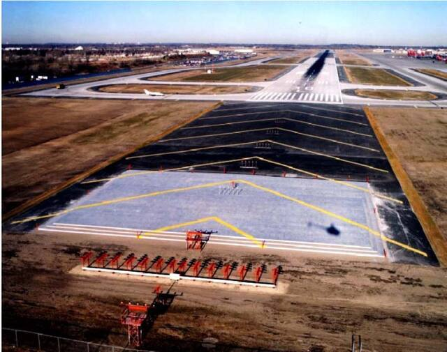

---

## Closed Runway "X"

---

# Airport Lighting

## Overview

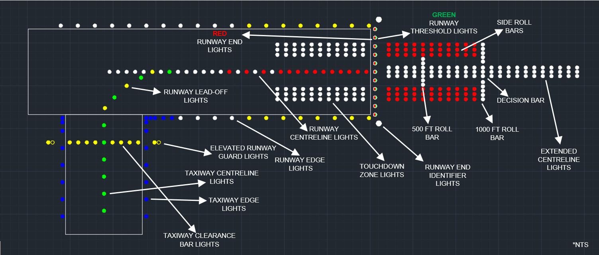

---

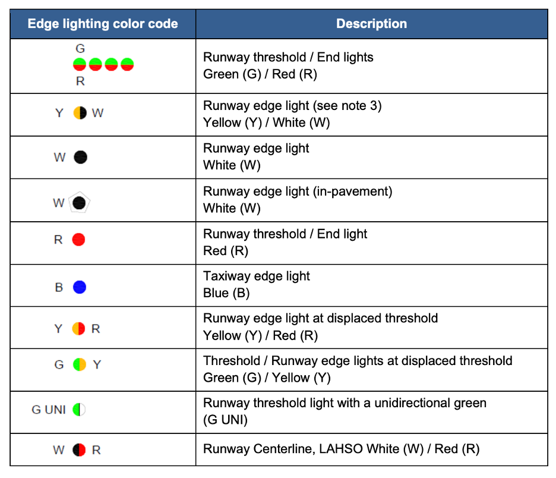

---

## VASI and PAPI

- Visual approach slope indicator (VASI)
- Precision approach path indicator (PAPI)

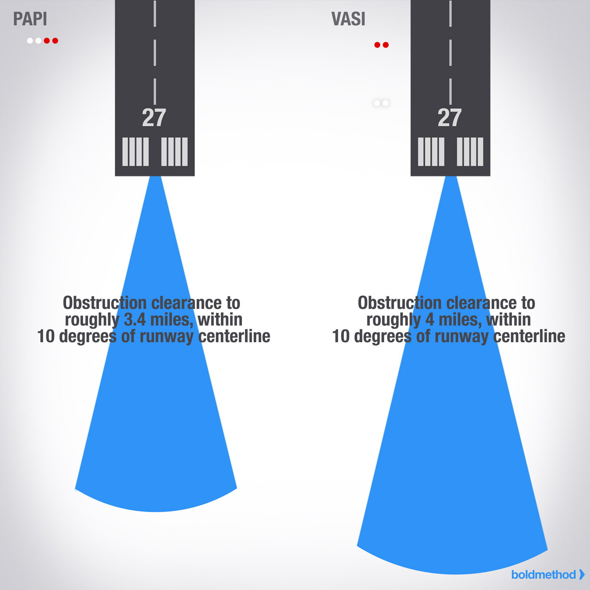

---

## Two-Bar VASI

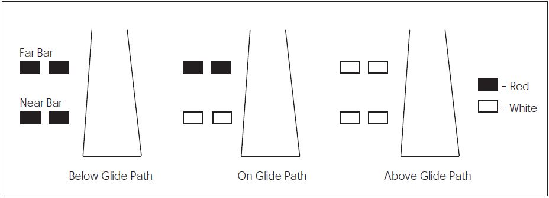

---

## PAPI

---

## Runway Centerline Lighting

- Precision approach runways
- Spaced at 50' intervals

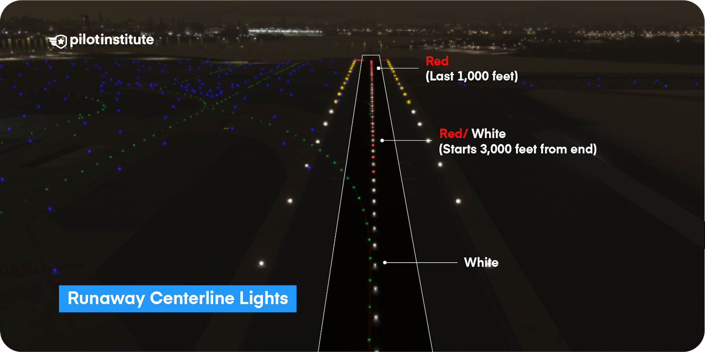

---

## REIL

- Runway end identifier lights
- Two flashing strobes
