# Flight Controls

---

## Three basic flight control: Elevator, aileron, and rudder

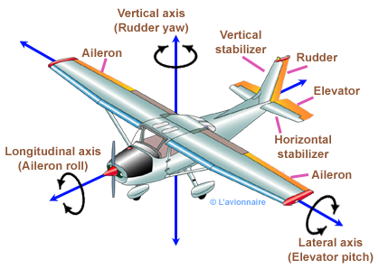

---

## Airplane rotates about its center of gravity

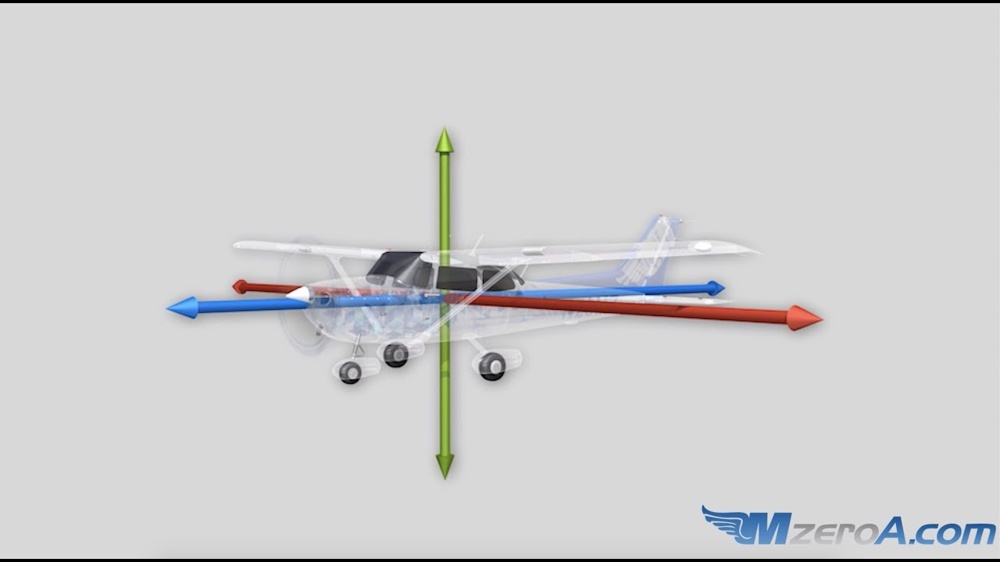

---

- Control surfaces are lifting surfaces, and require airspeed to function
  - Control effectiveness increases as airspeed increases
  - The more disturbance the more drag

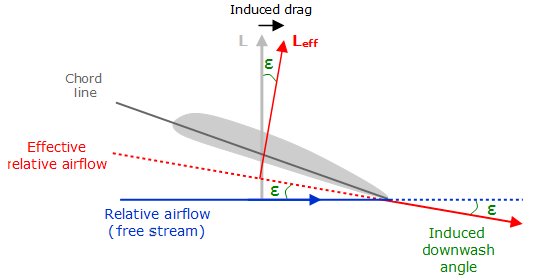

---

## Ailerons: Control wheel, bank left or right

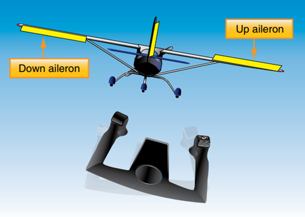

---

## Differential Ailerons

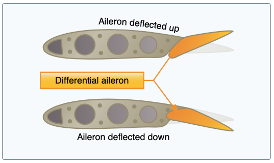

- Differential ailerons can help with adverse yaw
  - Up aileron is raised more than the down aileron is lowered

<!--

The effect of adverse yaw isn't symmetrical:
  - The up aileron (lower AoA) decreases drag a relatively small amount
  - The down aileron (higher AoA) increase drag a relatively large amount

So adding more drag to up the up aileron, evening out the drag

-->

---

## Frise Ailerons

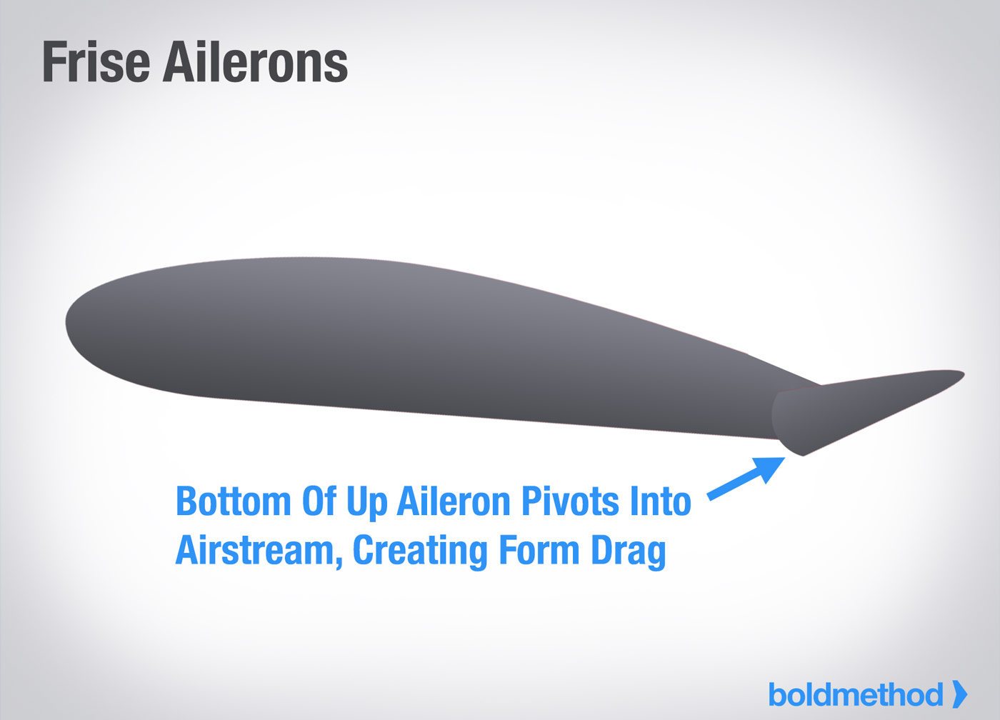

---

## Elevator: Control wheel, pitch up or down

- Airplanes can also have a stabilator, where the entire surface moves
- Elevator induces additional drag

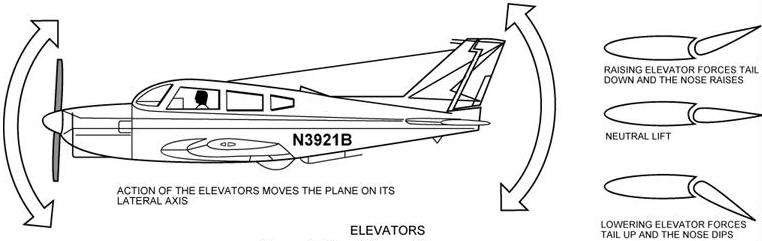

---

## Elevator Operation

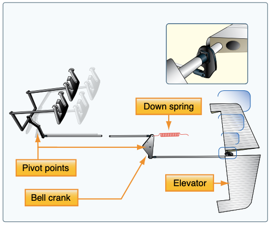

---

## Rudder: Yaw left or right

- Most airplanes have brakes on the top of the rudder pedals

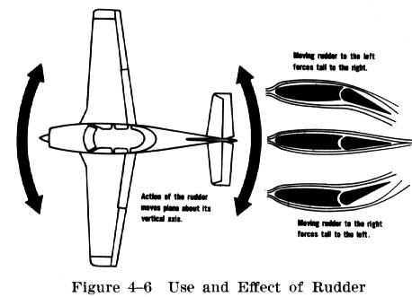

---

## Toe Brakes

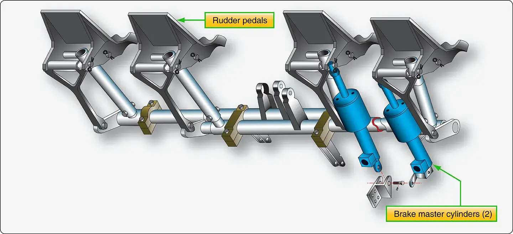

---

## Flaps

---

## Effect of Flaps

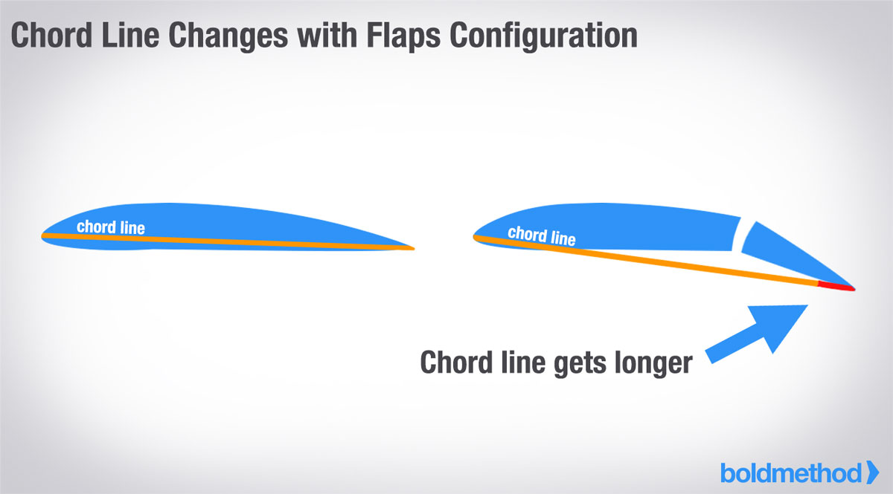

- Increase chord of the wing, which increases angle of attack
- Increases lift and increases drag
- Useful when you want to descend without gaining airspeed, like during landing

---

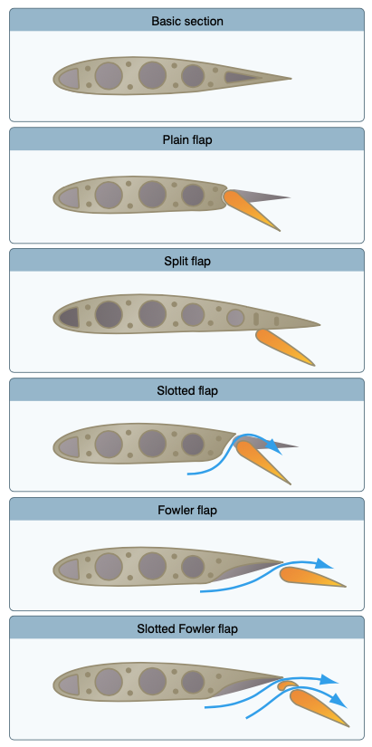

## Types of flaps

- Some types produce more lift
- Some types produce less pitching up movement when deployed

---

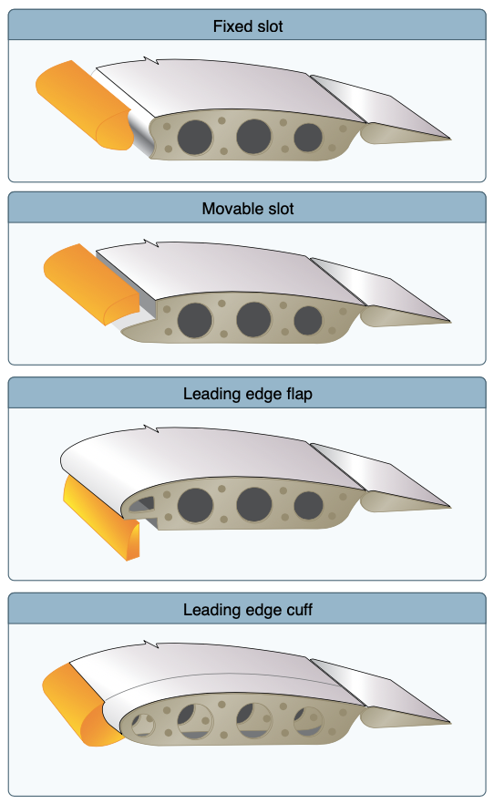

## Leading edge devices

- Delay the separation of the boundary layer until a higher AoA, meaning more lift/slow stall speed
  - Fixed slats are set out in front of the wing
  - Moveable slats more in and out with AoA, or deployed manually
  - Leading edge flaps: Change wing camber
  - Leading edge cuff: Extension of the wing camber

---

### Leading Edge Slots

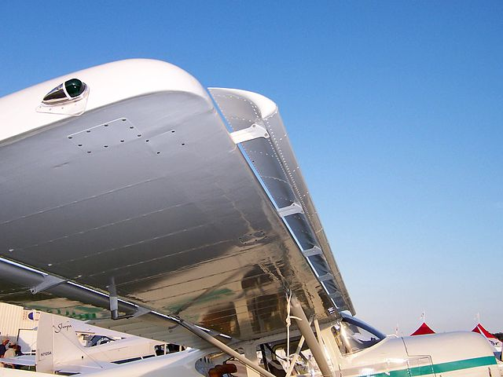

---

### Moveable Slats

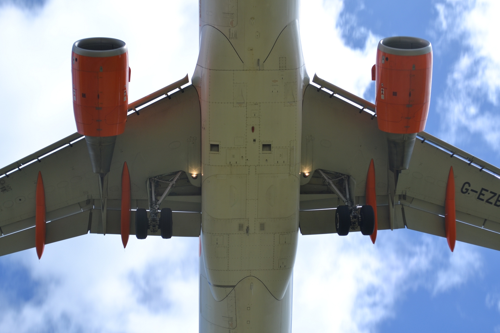

---

## Trim

### Elevator trim

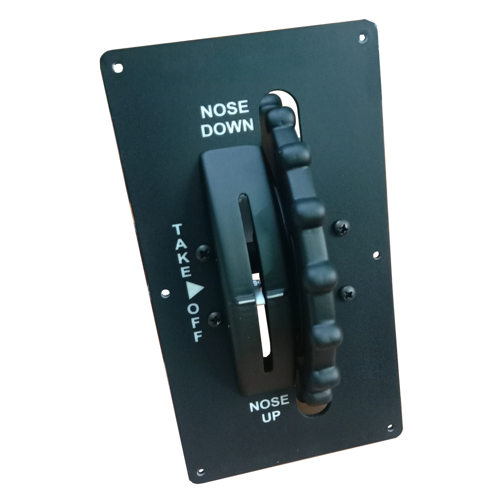

- Can be a trim tab (e.g. Cessnas)

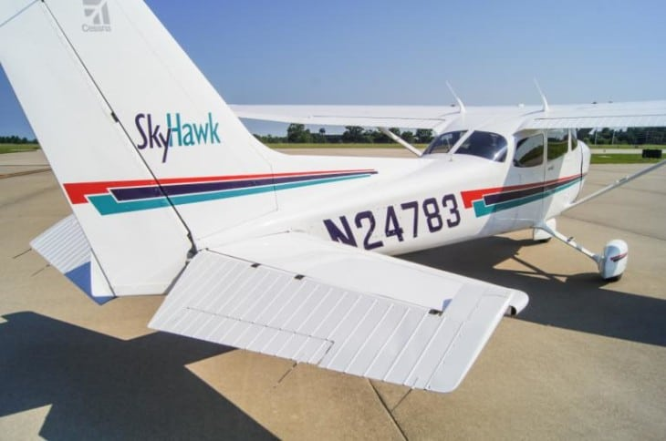

---

### Trim Tab Movement

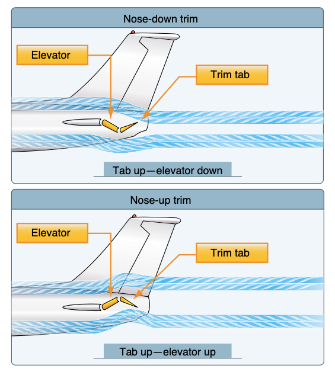

---

### Anti-servo tab (Pipers)

- Stabilators can produce a lot of force, so the antiservo tab counteracts the motion, making the controls less sensitive
- They are still adjusted up/down with the trim control in the cockpit

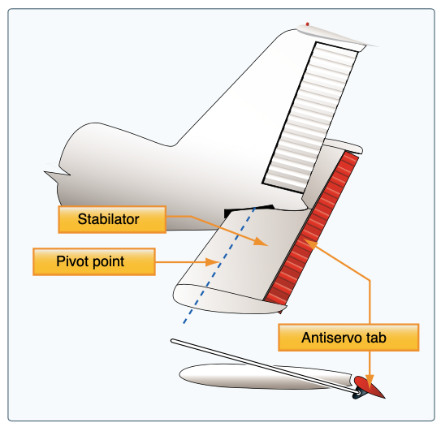

---

### Rudder trim

- May be flight or ground adjustable

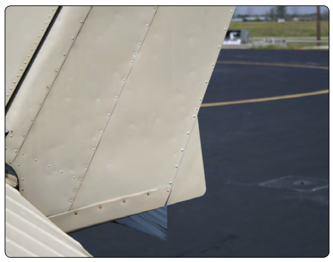

---

## Construction

- Most flight controls are cable driven
- Flaps are often driven by an electronic motor, or a manual rod

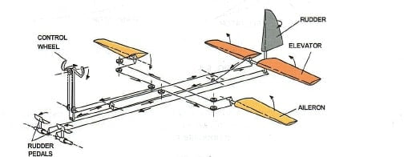
