# Powerplants and Propellers

---

### Reciprocating Engines

- Most light airplane engines are 4- or 6-cylinder, horizontally-opposed, air-cooled

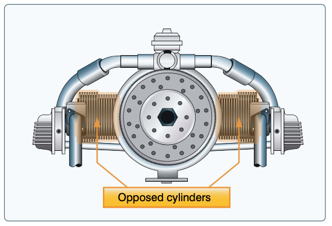

---

# 4-stroke vs 2-stroke

- 4-stroke engines are most common
- 2-stroke engine are available

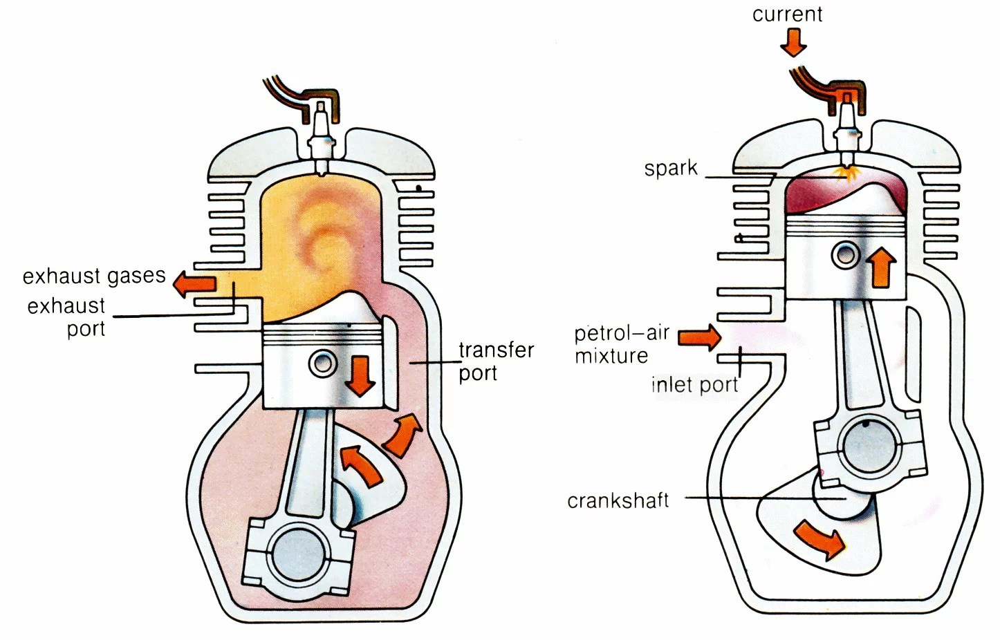

---

## Component of a 4-Stroke Engine

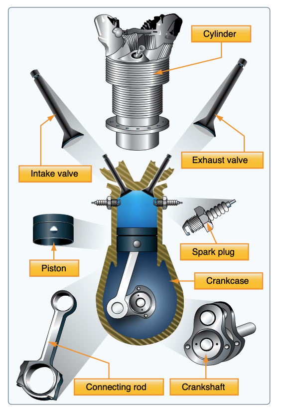

---

## 4-Strokes of an Engine

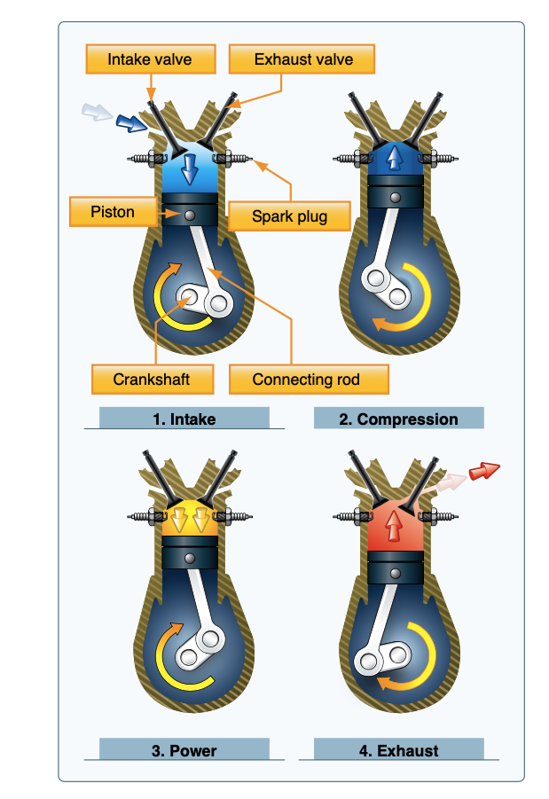

- 4 strokes of an engine
  - Intake: Air sucked in
  - Compression: Air and fuel is compressed
  - Combustion: Spark plugs ignite fuel/air mixture
  - Exhaust: Exhaust gasses are expelled
- Each cylinder makes two up/down movements for a power cycle
- Each cylinder is a different part of this cycle at any point

---

# Engine RPM

- Primary indication of power on a fixed-pitch propeller

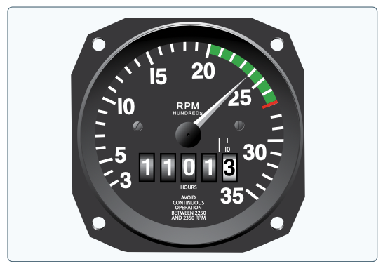

---

# Manifold Pressure

- Manifold pressure is the partial vacuum of the airplane "sucking in" air
- Primary power indication with a constant-speed propeller

---

## Ignition

- Provides the spark which ignite the fuel/air mixture

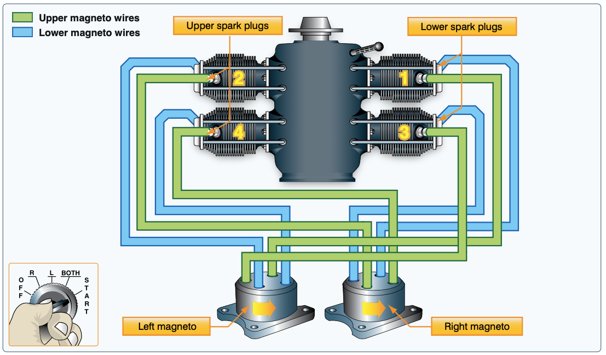

---

## Magneto Operation

- Magnetos generate electrical current, independent of the airplane's electrical system
- Magneto are spinning magnets driven by the crank shaft of the engine
- Two sets of spark plugs in each cylinder, one from each magneto
- Magnetos can be selected independently, and will be checked before flight
  - Running with both magnetos results in better burning of the fuel/air mixture
  - Running with one magneto has a slightly lower power output

---

## Induction System

- Gets air from the outside into the cylinder

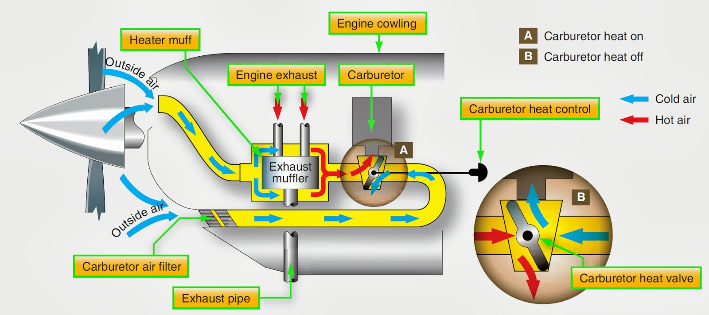

---

#### Carburetor

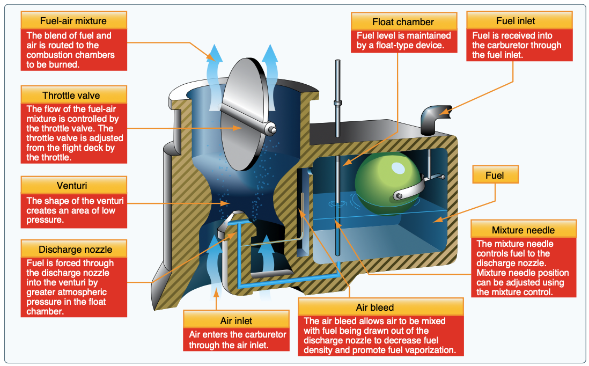

<!--

- Mechanical control of the fuel-air mixture
- Venturi is a narrowing that accelerates the air, forcing fuel to flow out of the discharge nozzle
- Mixture needle control mixture
- Throttle valve controls flow of entire fuel/air mixture into the cylinders
- Float-type carburetor: Float regulates the fuel entering the float chamber
- Carburetor icing occurs due to the decrease in air pressure in the venturi

-->

---

## Carburetor Icing

- Most likely at &lt; 70&deg;F and &gt; 80% humidity
- Carburetor heat

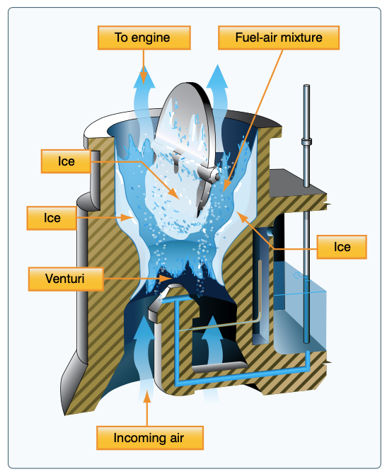

---

## Fuel-injection

- Uses a electronically/computer controlled unit to regulate fuel to air mixture

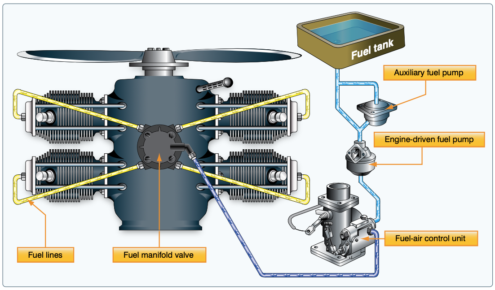

<!-- - Cylinder temperatures tend to be more even -->

---

## Oil: Lubricates, cools, cleans, seals

- Wet-sump systems hold oil within the engine itself

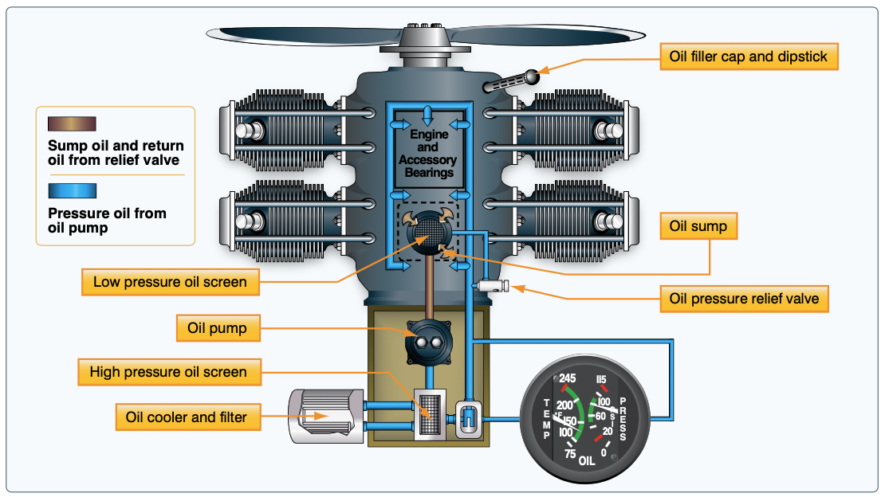

<!--

- An oil pump is used to circulate oil to the primary component
- Dry-sump systems hold oil in a separate tank

 -->

---

## Engine cooling

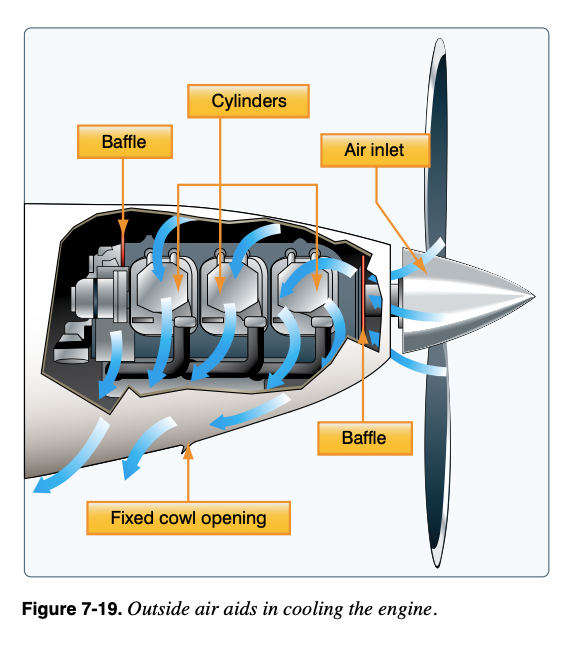

- Air-cooling through baffles
- Oil cooler at the front of the airplane

---

## Detonation

- Detonation: Uncontrolled, explosive ignition of the fuel-air mixture within the cylinder
  - Lower fuel grade
  - Excessively lean mixture / high power
  - Low RPM / high power

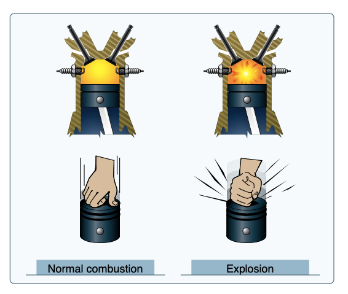

---

## Pre-Ignition

- Preignition occurs when the fuel-air mixture ignites prior to the engine’s normal ignition event
- Residual hot spot in the combustion chamber
- Can cause damage since the cylinder is being pushed on the compression stroke

---

## Fuel System

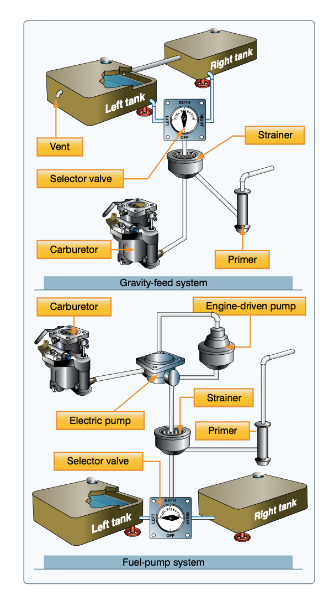

- High-wing airplanes are usually gravity-fed
- Low-wing airplanes have a fuel-pump system
  - Electrical pump and an engine-driven pump
- Fuel tanks: Wet wings vs wing tanks

---

## Fuel System (cont.)

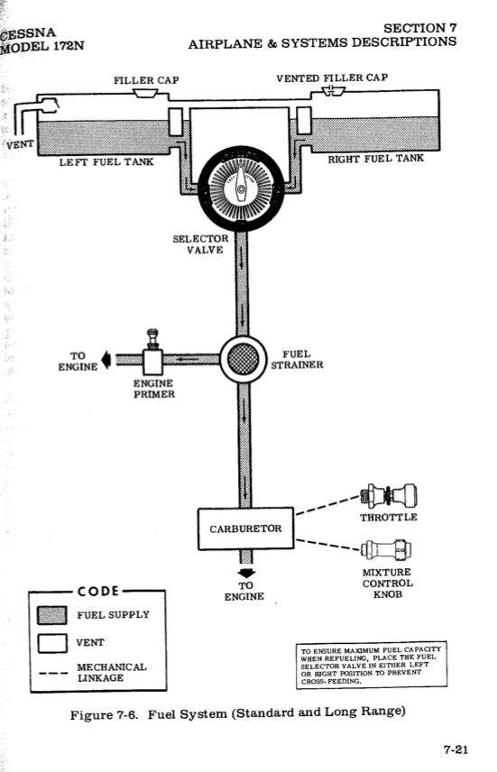

- Fuel primer is used to draw fuel into the cylinders prior to starting
- Fuel selector valves
  - High-wing airplanes may have a "both" option
  - Low-wing airplanes often do not, must be switched periodically
- Running a fuel tank dry may cause vapor lock and impurities to enter the engine
-

<!-- One of the most common fuel-starvation causes is failure to switch tanks -->

---

## Fuel Sumps

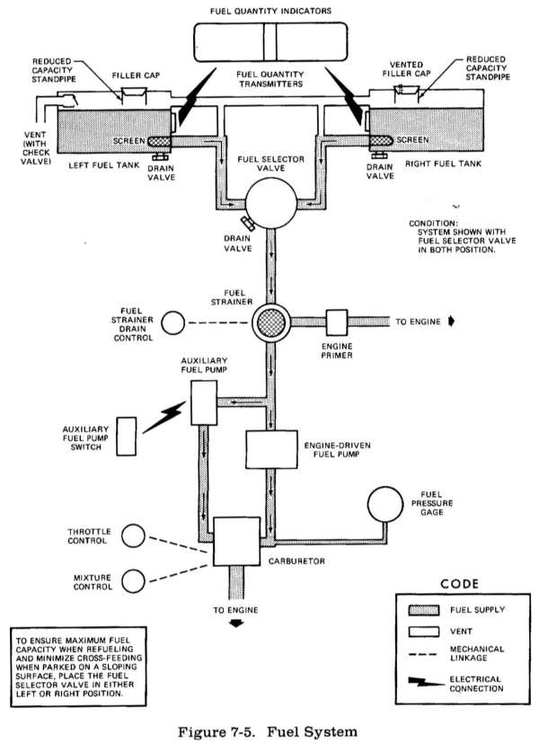

- Fuel sumps and drains are usually present
  - At the lowest point on each tank
  - At the lowest point in the system

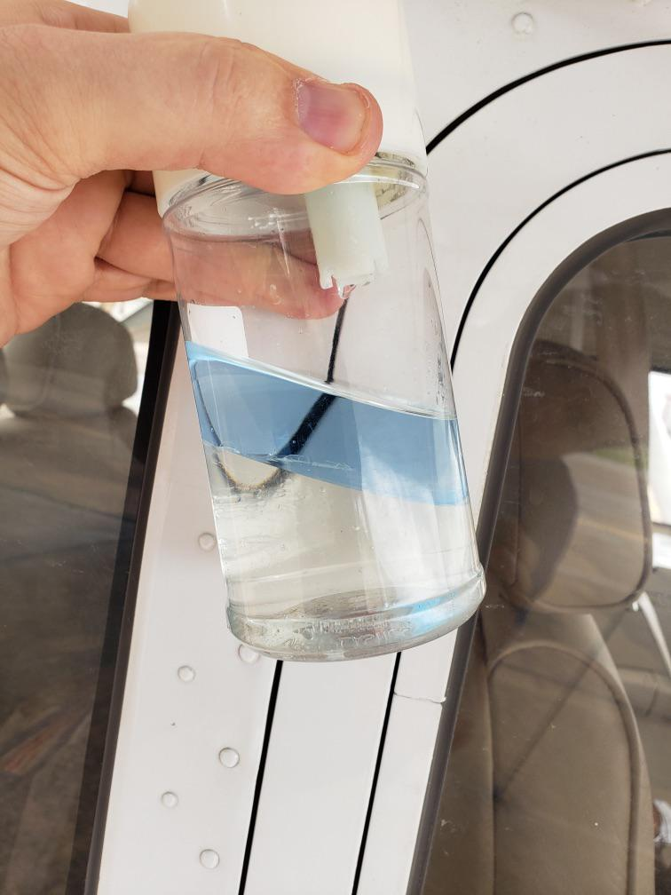

---

## Fuel grades

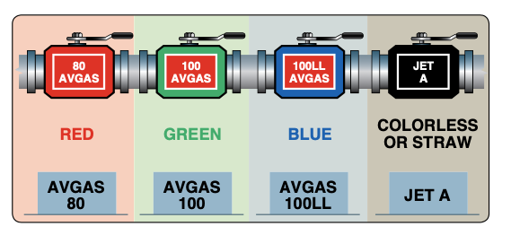

---

# Turbochargers

- What is a turbocharger?
  - Normally-aspirated engines lose horsepower as they climb
  - Boosting intake air pressure can maintain horsepower
  - Turbonormalization vs turboboosting
- They are especially useful when flying high

---

## Turbocharger Operation

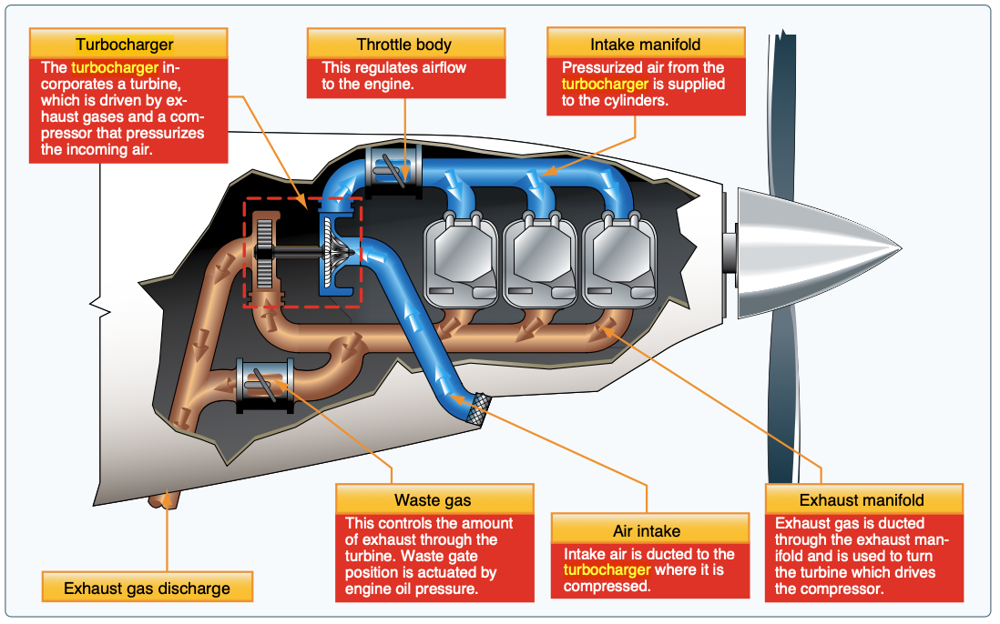

<!--

- Turbo turbine can spin as fast as 80,000 rpm
- Lubricated with engine oil
- Turbo-cool down
- Overboosting can lead to detonating

 -->

---

# Turbo Wastegate

- Controls how much exhaust is vented into the turbine
- Wastegate slowly closes as you climb, meaning more pressure and constant power
- At the critical altitude the wastegate is completely closed, no more boost

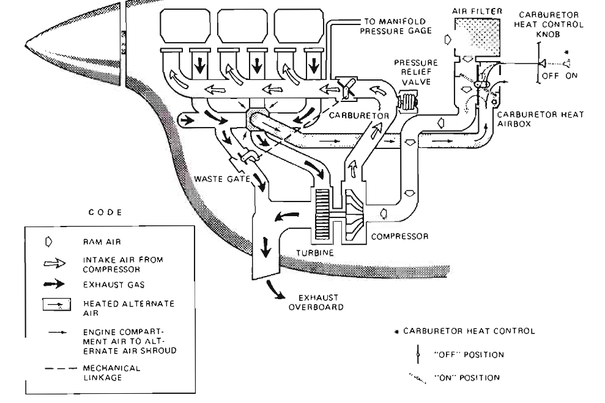

---

## Wastegate Control

- Different airplanes have different wastegate control mechanisms
  - Some airplanes open/close automatically to maintain a give manifold pressure
  - Manual wastegates are common on aftermarket turbochargers
  - The T182 is mechanically linked to the throttle

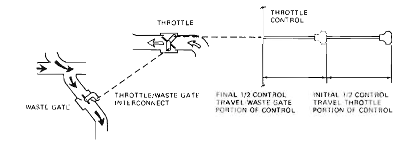

---

# Turbo Failures

- Failure of the turbine/compressor
  - Engine essentially because a normally-aspirated engine with constricted airflow

---

# Propellers

---

## Rotating airfoils

- Subject to angle of attack, stalls (exceeding critical AoA)

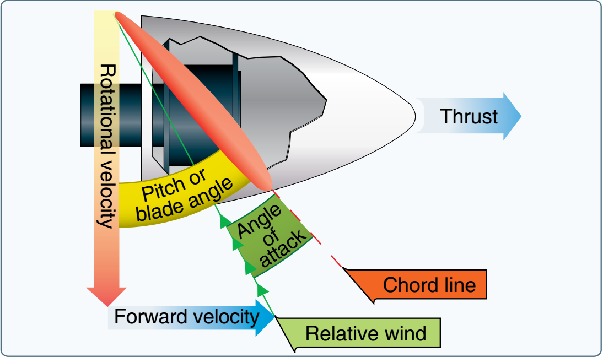

---

## Propeller Twist

- The propeller area near the hub is spinning slower than the tip

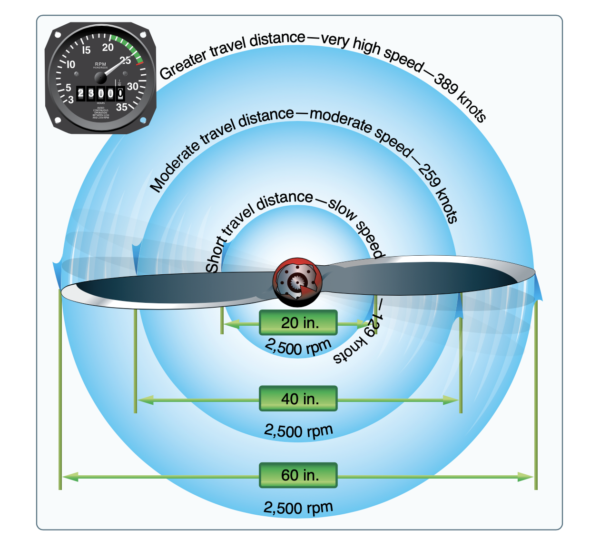

---

# Fixed-pitch propellers

- Propellers are calibrated for a single speed
  - High/fine pitch: Small "bite" of air
  - Low/coarse pitch: Big "bite" of air
- Corollary to gears on a bike: Climb prop is a low gear, cruise prop is a high gear
- A climb prop has lower pitch, less drag:
  - More RPM, horsepower, which increases takeoff and climb performance
- A cruise prop has a higher pitch, more drag:
  - Less RPM, bigger "bite" of air, but increased efficiency

---

# Ground-Adjustable Propeller

- Some airplanes have "adjustable" pitch propellers, which can be adjusted on the ground

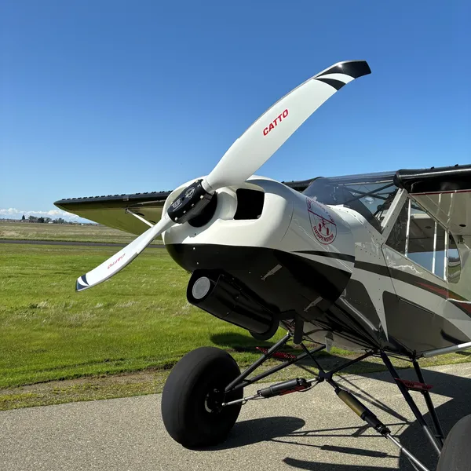

---

# Constant-Speed Propellers

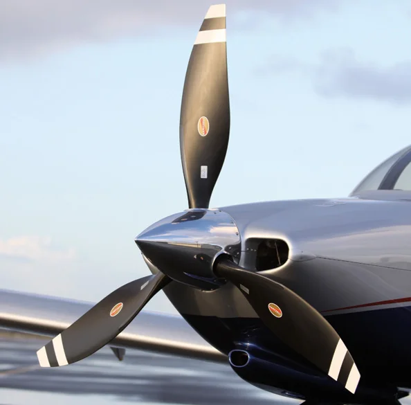

- What if we could vary the prop angle in flight?
  - Variable-pitch propellers, precursors to constant-speed propellers
- Constant-speed propellers vary the pitch of the propeller to maintain an given RPM
- Effect of pitch on RPM
  - A "finer" or large pitch of a propeller increases RPM
  - A "coarser" or smaller pitch of the propeller decreases RPM

---

## Propeller Governor

- The propeller governor controls the pitch of the propeller to maintain a pilot-selected RPM

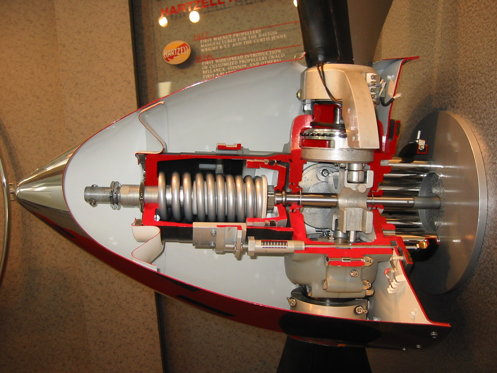

---

## Constant-Speed Prop Operation

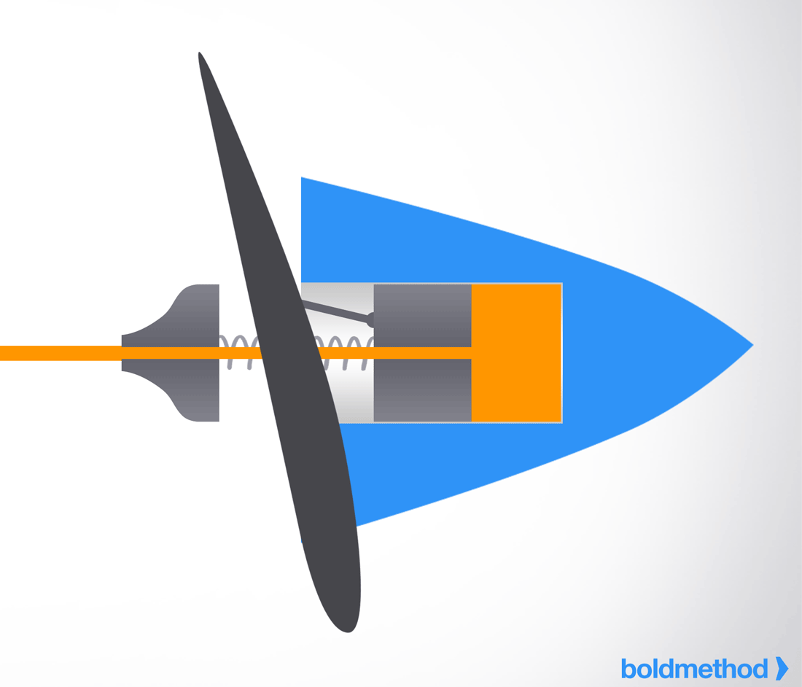

- Engine oil is boosted into the propeller hub assembly
- A spring is tensioned to hold the prop in the full fine or large pitch setting
- Engine oil must work against this to coarsen the blade
  - The engine oil forces a piston which changes the angle of the blade

---

## Governing Oil Pressure

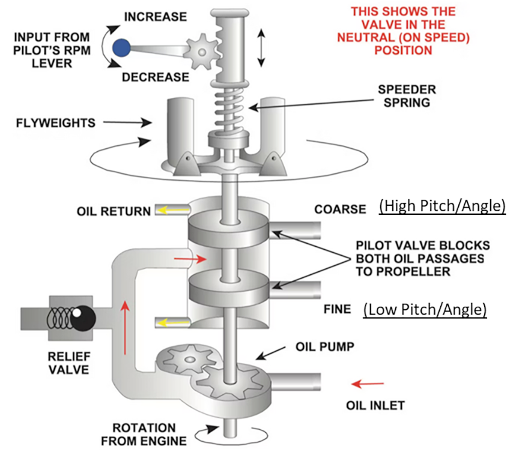

Oil pressure is governed by a set of fly-weights, tuned to a specified RPM

- Prop spins faster: flyweights move outward, more oil is forced into the blade angle piston
- Prop spins slower: flyweights fall inward and less oil is allowed to enter the blade angle piston

---

## Constant-Speed Prop Usage

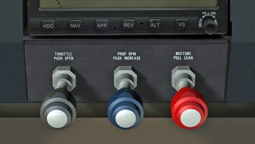

- When increasing power: Increase prop first, then engine power
- When decreasing power: Decrease power first, then decrease power

---

## Constant-Speed Prop Failures

- Loss of oil pressure
  - Propeller should fail in the high pitch position
  - This may result in an overspeed condition if power is set too high
