# Aircraft Systems

---

## Hydraulic systems

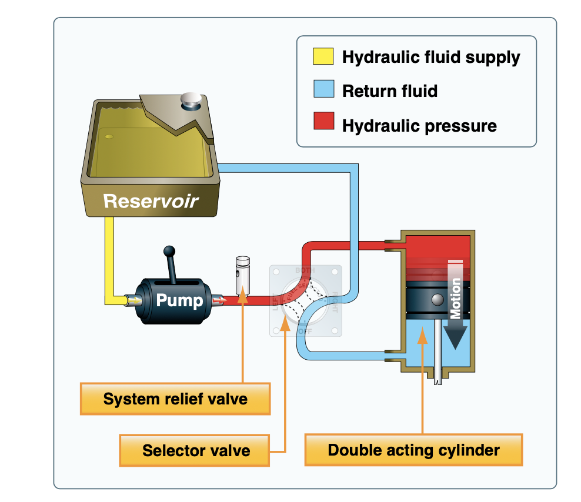

- Incompressible fluid is forced through a hydraulic line to a piston
- Piston moves whatever needs to be moved

---

## Hydraulic Brakes

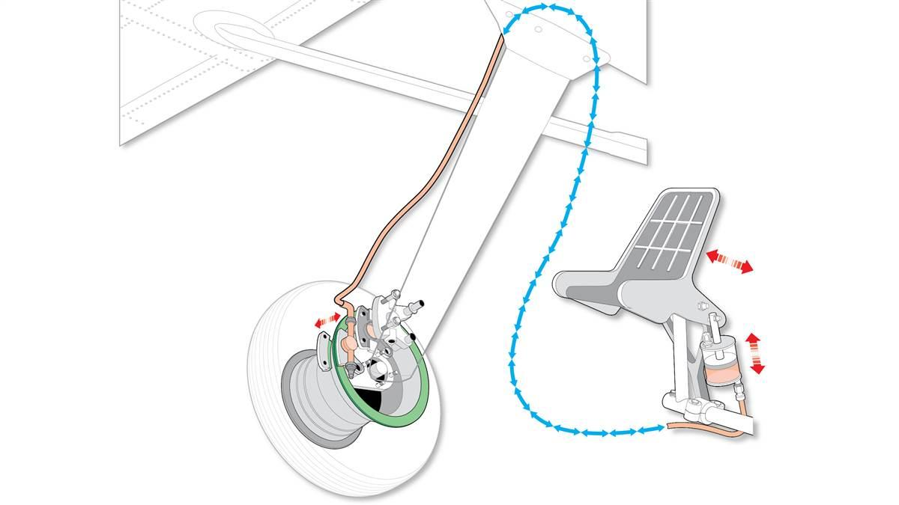

- Hydraulic lines connect brake pedals to brake calipers
- Toe pedals applies pressure to the fluid, which in turn closes the brake caliper

---

## Landing gear

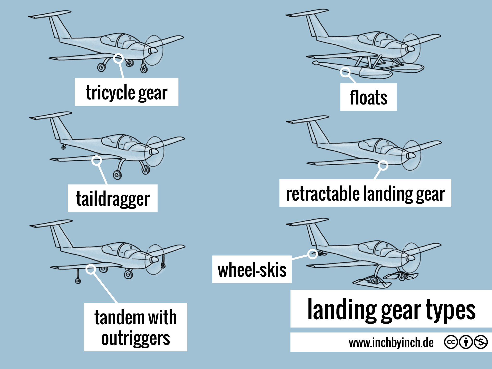

- Tricycle landing gear common on trainers
- Nosewheels can be steerable or free-catering
- Retractable landing gear
  - Electronic or hydraulically actuated

---

## Electrical system

- Basic circuit:
  - Voltage (pressure)
  - Current (volume)
  - Resistance/load (anything impeding the flow of water)

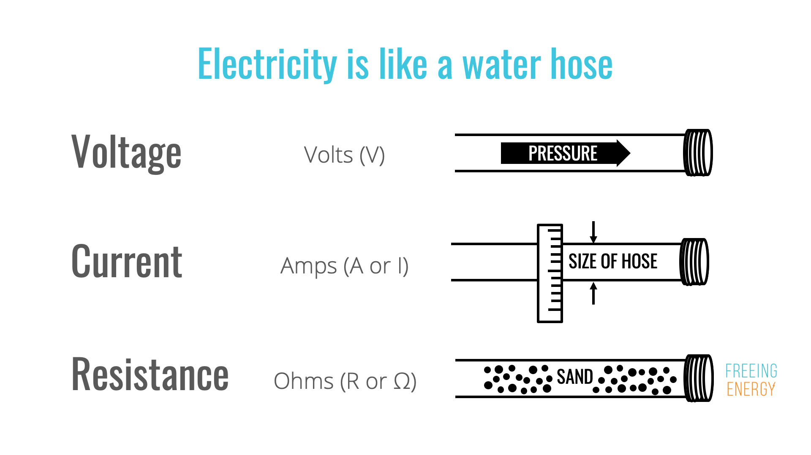

---

## Circuit vs Water

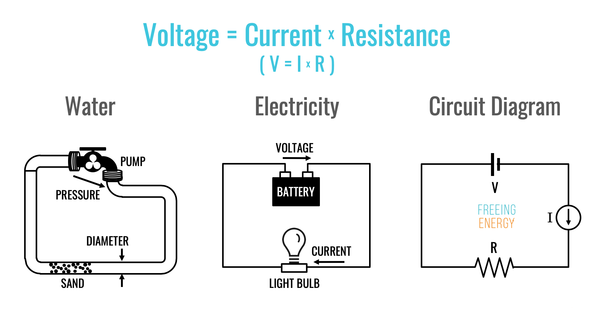

---

---

## Light Aircraft Electrical Systems

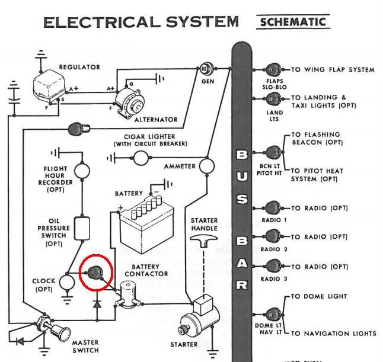

- Direct current systems are common in most training airplanes
- Cessna usually have 28V electrical systems
- Batteries: Capacity measured in amp-hours (17 amp-hours means 17 amps for 1 hour, or visa-versa)

---

### Generating Electricity: Generators

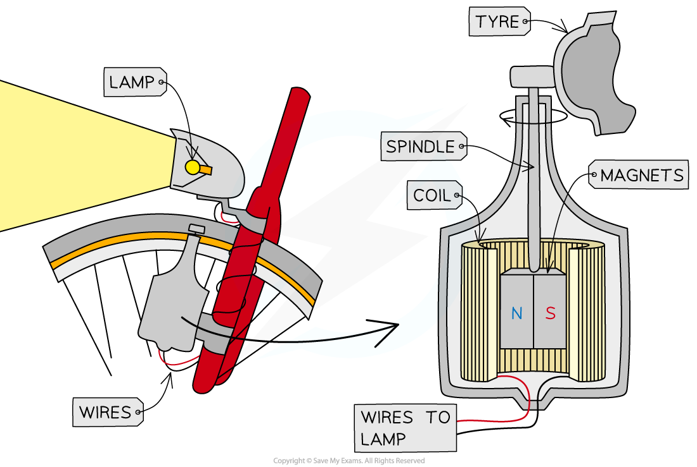

- DC current is induced by the spinning magnet
- Current is proportional to the speed of the spin

---

## Generating Electricity: Alternators

- A generator that produces AC, a conversion is then done to DC using a rectifier
- Has more consistent current output at low RPMs
- Voltage must be higher than the battery to charge it
  - At 24V battery with a 28V alternator is common

---

### Electrical Components

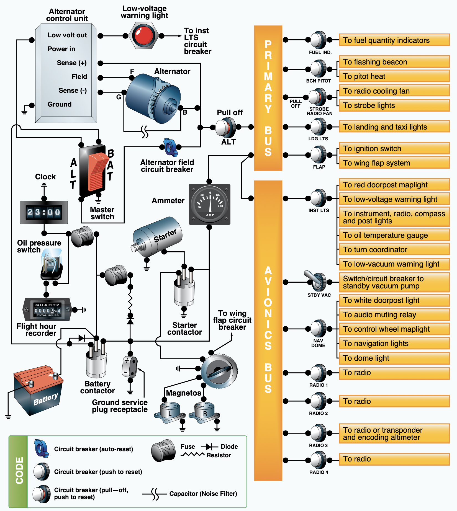

- Contactors/Relays/Solenoid
  - Essentially a "remote switch"
  - Avoids all the current to have to pass through the physical switch
- Master switch
  - Left half for alternator master
  - Right half for battery master
- Bus bars: efficient way of connecting may components to power
- Overcurrent protection
  - Circuit breakers can be reset
  - Fuses are consumable

---

### Electrical Instrumentation

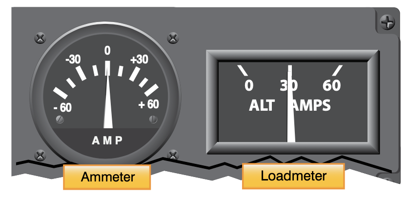

- Ammeter: Is the alternator is producing sufficient power for the current load?
  - A discharge on the ammeter indicates a draw from the battery
- Load meter: Shows a percentage of the load placed on the alternator/generator
- Low voltage warning light

---

### Electrical Problems

- Alternator failure
  - Discharge on the ammeter, meaning we're drawing from the battery
  - Eventually a LOW VOLTS illumination

---

## Environmental Systems

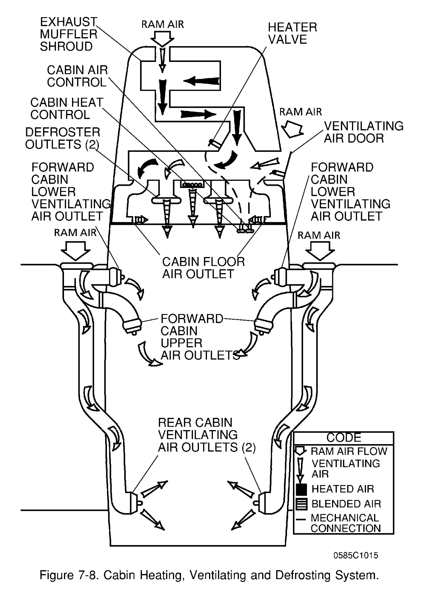

- Fresh air vents
- Heated air vents, potential source of CO

---

## Deice and Anti-ice system

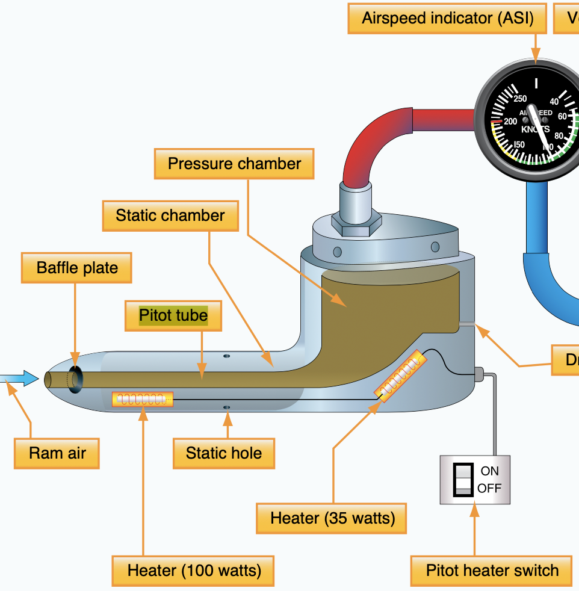

- Airplanes can be certified for flight into known icing (FIKI)
  - See 91.527
  - Most training aircraft are not FIKI certified
- Pitot heat (deice and anti-ice)
- Windscreen defrost can also be used

---

## Deicing Systems

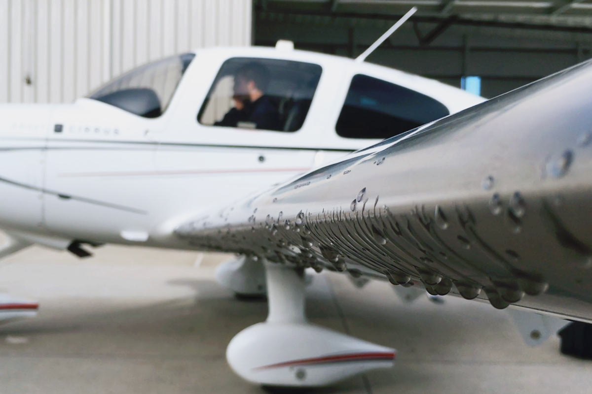

- Deicing "boots": pneumatic boots used to break off ice
- Cirrus aircraft use a "weeping wing"
  - TKS fluid (a ethylene-glycol liquid) is force out of a porous membrane on the leading edge
- Ground-based deicing
