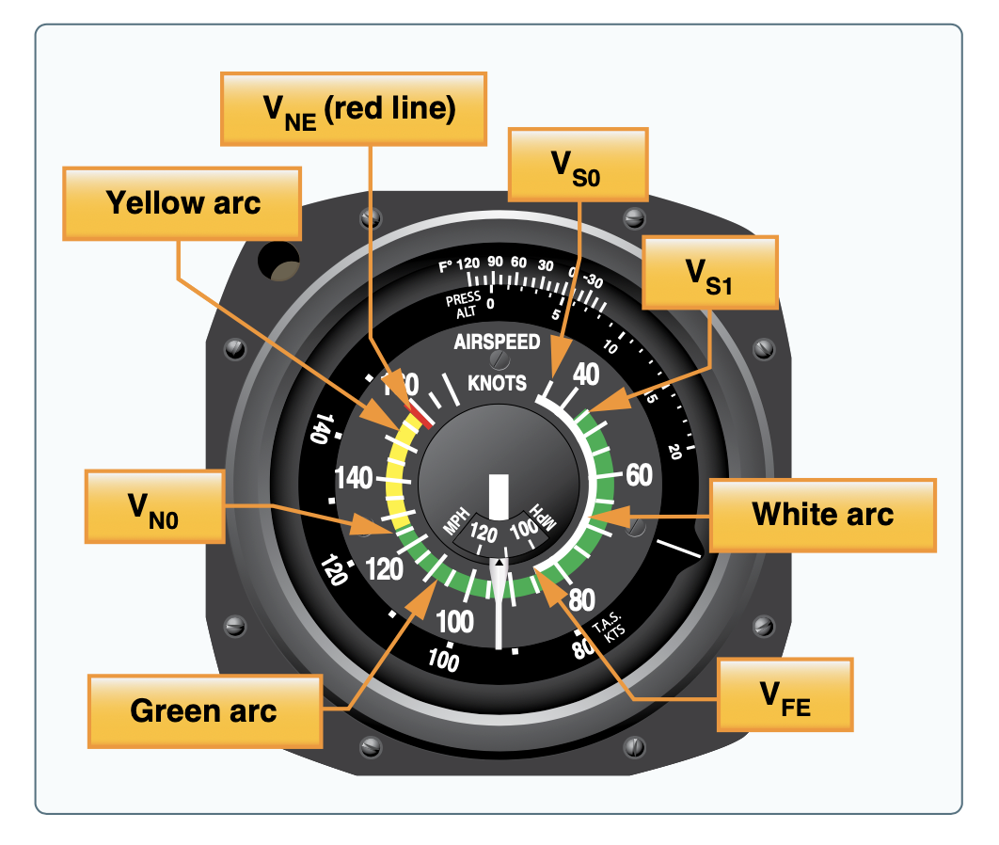

# Flight Instruments and Avionics

---

---

### Pitot-static instruments

- Static port: Ambient air pressure
- Pitot tube: Ram air pressure, in the relative wind flow

---

## Altimeter

- Converts barometric pressure into altitude
- Calibrated to the lapse rate of the standard atmosphere (2&deg; per 1000', 1" Hg per 1000')
- Calibrated to the temperature of the standard atmosphere (15&deg; @ S.L.)
- Kollsman window allows for calibrating the atmosphere indicator up and down
  - Window does have a set range

---

## Nonstandard Temperature Errors

- Colder temperatures: "Compress" the column of air below, altimeter reads higher
- Hotter temperature: "Expand" the column of air below, altimeter reads lower

---

## Types of Altitude

- Indicated altitude: Read from the altimeter
- True altitude: Vertical distance from mean sea level
- Absolute altitude: Vertical distance above terrain (AGL)
- Pressure altitude: Read from altimeter when set to 29.92"
  - Height in the standard atmosphere where the ambient pressure is found
- Density altitude: Pressure altitude corrected for nonstandard temperature

---

## Vertical Speed Indicator

- Rate of change of the altitude/ambient pressure
- Will lag considerable with pressure alone

---

## Instantaneous Vertical Speed Indicator (IVSI)

- Accelerometer weights help lead the indication before pressure changes

---

## Airspeed indicator

- Airspeed = (Ram air pressure - static pressure)
- Operates with a diaphragm

---

## Types of Airspeed

- Indicated airspeed (IAS): Read from altimeter
- Calibrated airspeed (CAS): Calibrated for position/instrument errors
  - At slow airspeeds this may be several knots off
- True airspeed (TAS): CAS corrected for altitude and nonstandard temperature
- Ground speed (GS): Actual speed over the ground
  - TAS adjusted for wind

---

## Airspeed Indicator Markings

- VS0: Stall speed in landing configuration
- VS1: Stall speed in clean configuration
- VFE: Flap extension speed (full flaps)
- VN0: Maximum structural cruising speed (smooth air only)
- VNE: Never exceed speed
- Notice VA is not marked

---

## Pitot Blockages

- Ram air block: Airspeed reads 0
- Ram air + drain hole blocked:
  - Airspeed reads whatever it was when it was blocked
  - If you descend it'll read lower, higher if ascending

---

## Static Port Blockages

- Alternate static source vents into the cockpit
- Pressure is **higher**, since there is usually a venturi effect around the static port
  - Altimeter reads slightly high
  - Airspeed will read slightly higher (RAM - static = airspeed)
  - VSI will momentarily indicate a climb, then settle

---

## Gyroscopic Instruments

- Operate on the principle of gyroscopic stability
- Corollary: Bicycle wheel stability at low vs high speeds
- Mechanical flight instruments use a spinning rotor
  - Vacuum pump (engine-driven or electric)
  - Pressure
  - Electrical motor
- Aircraft rotates around the gyro

<!-- Why a vacuum? Gyros need low-friction environment -->

---

## Vacuum Instruments

- In a standard "six pack":
  - Vacuum-driven gyroscopic system drive the attitude and heading indicators
  - Sometimes the turn coordinator

---

### Turn Coordinator

- 1-axis gyro
- Indicates rate of yaw/turn rate around the vertical axis
- No primary bank information

---

## Inclinometer

- Not a gyro instrument
- Ball with mass in a fluid, like a level

---

## Attitude indicator

- Indicates rotational position of the longitudinal (pitch) and lateral axis (roll)
- Adjustment knob to set horizon to level
- Pitch limit usually around 100-110&deg;
- Bank limit around 60-70&deg;

---

## Directional Gyro/Heading Indicator

- Indicates rotational position about the vertical axis
- Must be continually calibrated with the magnetic compass
  - Earth rotates in space at a rate of 15° in 1 hour
  - Gyroscopic precession: gimbal is not frictionless, small forces cause position drift

---

## Horizontal Situation Indicator (HSI)

- Often overlay VOR CDI needles
- Some can be "slaved" to a magnetic sensing device
  - Eliminates the need to manually calibrate with the magnetic compass

---

## Attitude and Heading Reference System (AHRS)

- No moving parts, uses accelerometers for roll/pitch/yaw information
- Use a magnetometer for heading information, often mounted on the wing
- Used for modern glass-panel displays
- Less susceptible to failures

---

## Vacuum System Failures

- A loss of vacuum pressure will result in a slow spin-down of gyros
- An attitude indicator will show a slow lean/dive
- Utilize a cross-checking scan

---

## Electronic Flight Display (PFD)

---

### Magnetic compass

- Turning errors
- UNOS
- ANDS
