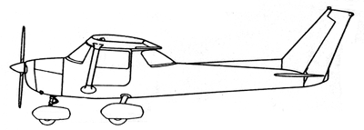

# Forces in Flight

---

## Objective

To understand the effects of the balance of forces on the airplane in different scenarios, and how turning tendencies impact the control of the airplane.

## Motivation

Helps a student develop an intuitive understanding of the turning forces present when flying so they can better anticipate and compensate for these forces.

---

## Overview

- Turning tendencies, torque
- Forces in flight
- Forces in straight and level
- Forces in a climb
- Forces in a decent
- Acceleration in a turn
- Forces in a turn
- Adverse yaw

---

## Turning Tendencies

---

## Turning Tendencies: #1 Torque

Newton's 3rd law, tendency to roll aircraft to left

---

## Turning Tendencies: #2 Propeller Slipstream

---

## Turning Tendencies: #3 Gyroscopic Procession

---

## Turning Tendencies: #3 Gyroscopic Procession

---

## Turning Tendencies: #4 P-Factor

---

## Forces in Flight: S&L

---

## Forces in a Climb

---

## Forces in a Descent

---

## Turns - Centripetal Acceleration

Force is proportional to acceleration

---

## Forces in a Turn

S&L, Medium Bank, Steep Bank

[Forces in a turn widget](https://flightdocs.io/docs/widgets/forces-in-a-turn/)

---

## Load Factor = Lift force / Weight force

---

## Load Factor = Stall Speed Increase

---

## Adverse Yaw - Initial Turn

---

## Adverse Yaw - Established in the Turn

Rudder with roll rate

---

## Turns - Slip: Not enough rudder

---

## Turns - Slip: Too much rudder

---

# Summary

- Turning tendencies, torque
- Forces in flight
- Forces in straight and level
- Forces in a climb
- Forces in a decent
- Acceleration in a turn
- Forces in a turn
- Adverse yaw
