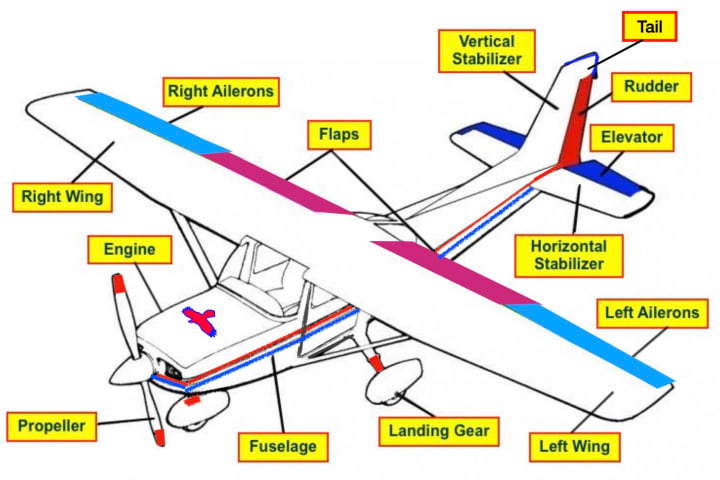
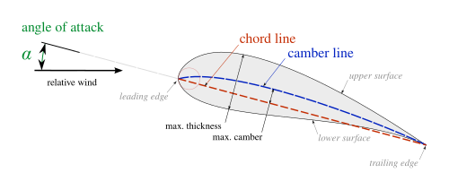
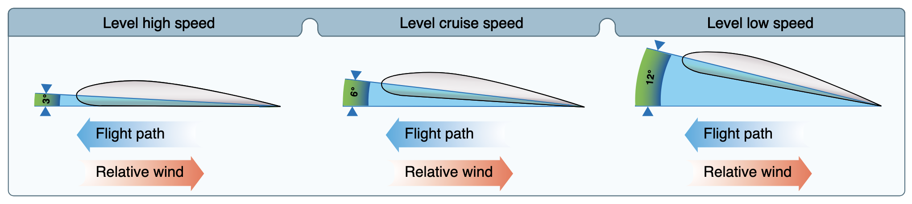
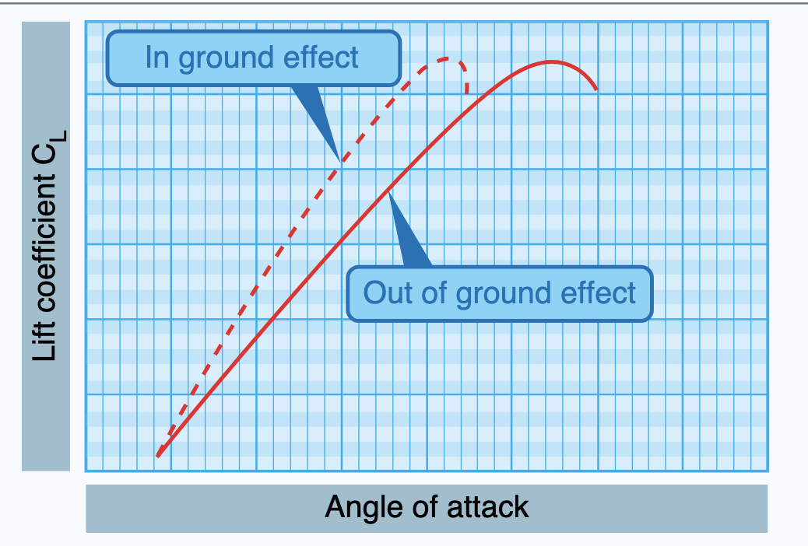
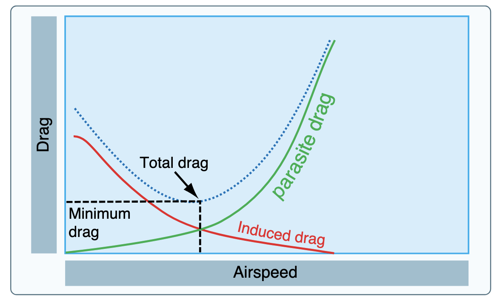

# Aerodynamics: Lift and Drag

---

## Objective

To understand basic aerodynamic concepts like lift, drag, and the nomenclature we use to describe it.

## Motivation

Forms foundational knowledge for more advanced aerodynamic topics and provides a useful mental model for pilots so they can better anticipate and understand the operation of an airplane.

---

## Overview

- Airplane components
- Newton's laws of motion
- Four forces of flight
- Lift theories
- Basic airfoil
- Lift on an airfoil
- Angle of attack
- Lift equation

- Thrust vs drag
- Parasite drag
- Induced drag
- Wingtip vortices
- Ground effect
- Parasite drag vs induced drag
- Wing design

---

## Components of an Airplane

---

## Newtons Laws of Motions

1. Objects in motion want to stay in motion
2. Fnet = mass \* acceleration
3. For every action there is an equal and opposite reaction

---

## Four Forces in Flight

Fnet = 0 for unaccelerated flight

---

## Principles of Lift: Bernoulli

Higher speed = lower pressure

---

## Principles of Lift: Barn door / Newton

Equal and opposite reaction

---

## Basic Airfoil

---

## Lift on an Airfoil: Bernoulli

---

## Lift on an Airfoil: Newton

---

## Angle of Attack

---

## Lift Equation

$$
\text{lift} = \frac{\frac{1}{2} \rho V^2 S C_l}{2}
$$

$$
\text{Where:}\\
\rho = \text{air density}\\
V = \text{velocity}\\
S = \text{surface area}\\
C_l = \text{coefficient of lift}
$$

---

## Critical Angle of Attack

---

## Thrust and Drag

Thrust = drag in unaccelerated flight

---

## Parasite Drag

---

## Induced Drag

---

## Ground Effect

---

## AoA in Ground Effect

---

## Thrust vs Drag

---

# Summary

- Airplane components
- Newton's laws of motion
- Four forces of flight
- Lift theories
- Basic airfoil
- Lift on an airfoil
- Angle of attack
- Lift equation

- Thrust vs drag
- Parasite drag
- Induced drag
- Wingtip vortices
- Ground effect
- Parasite drag vs induced drag
- Wing design

