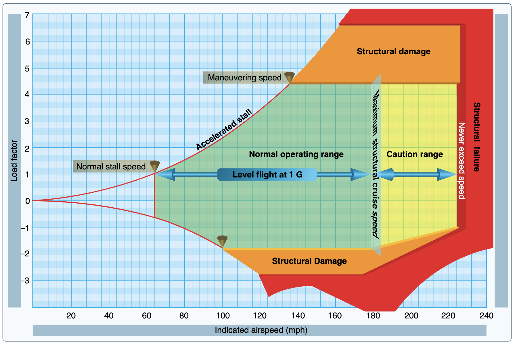
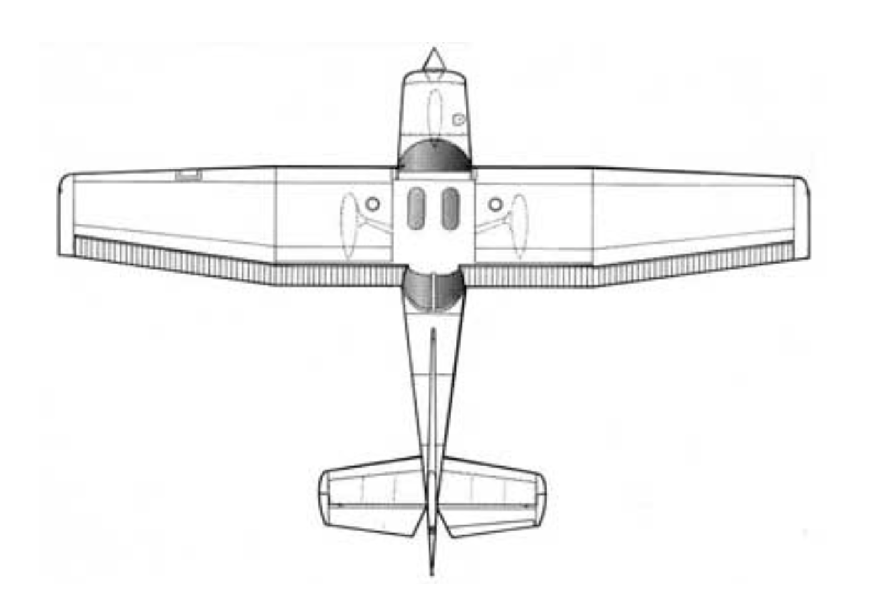
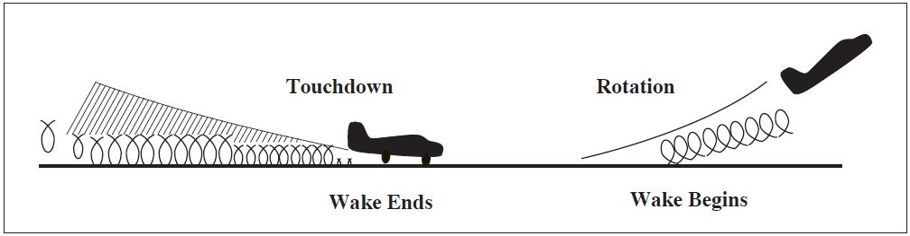
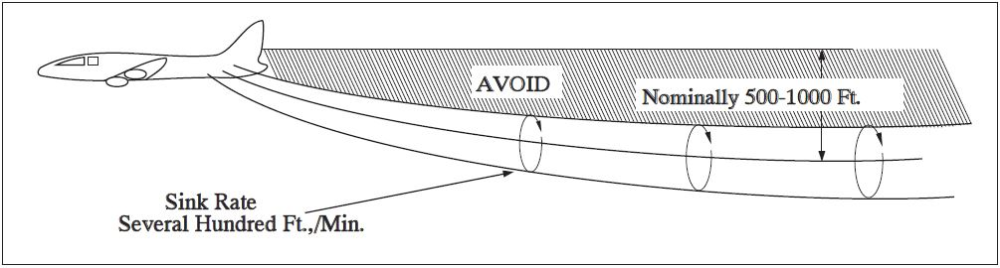

# Load Factor and Wingtip Vortices

---

## Objective

To understand how load factor is induced on an airframe, and how to avoid an excessive amount. Also the effect of wingtip vortices on performance and their dangers when operating near other aircraft.

## Motivation

Gives students an intuitive understand of the causes that induce load factor on airframe and their corresponding dangers, so they can recognize them in flight. Also give the students a conceptualization of wing tip vortices, so they can better visualize vortices from their own airplane and others.

---

## Overview

- Load Factor
- Load Factor Limits
- Maneuvering Speed
- Wingtip Vortices
- Wake Turbulence Avoidance

---

## Load Factor

---

## Load Factor Limits

- Normal: +3.8 to -1.52g
- Utility: +4.4 to -1.76g
- Aerobatic +6 to -3g

---

## Maneuvering Speed: Wind gust from below

- Sudden increase in AoA
- $L = k * V^2 * C_L$
- Which is going to produce more lift? 100 knots or 200 knots?
- Maneuver speed = Stall before we reach +3.8G

---

## Maneuvering Speed: VG Diagram

---

## Maneuvering Speed: Weight vs VA

---

## Wingtip Vortices

Most = Heavy / Clean / Slow

---

## Wake Turbulence Avoidance

---

## Landing behind a arriving larger aircraft

- Remain above their flight path and land beyond their touchdown point

## Landing behind a departing larger aircraft

- Land well before their rotation point

---

## Departing behind a departing larger aircraft

- Rotate prior to larger aircraft's rotation point
- Climb clear of their wake, off-setting left or right as needed

## Departing after a large aircraft's low-approach, go-around, touch-and-go

- Wait 2 minutes

---

## Summary

- Load Factor
- Load Factor Limits
- Maneuvering Speed
- Wingtip Vortices
- Wake Turbulence Avoidance
