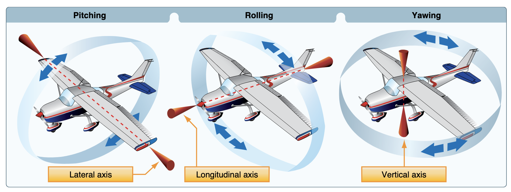
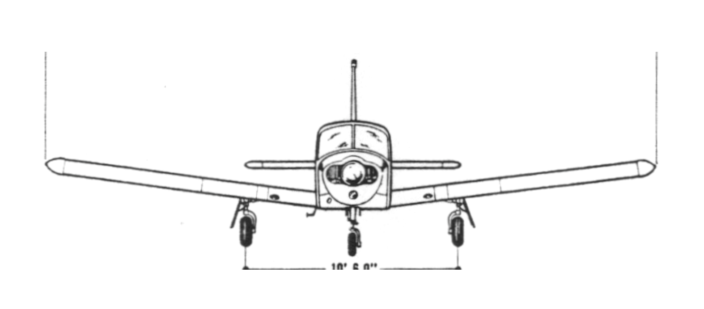
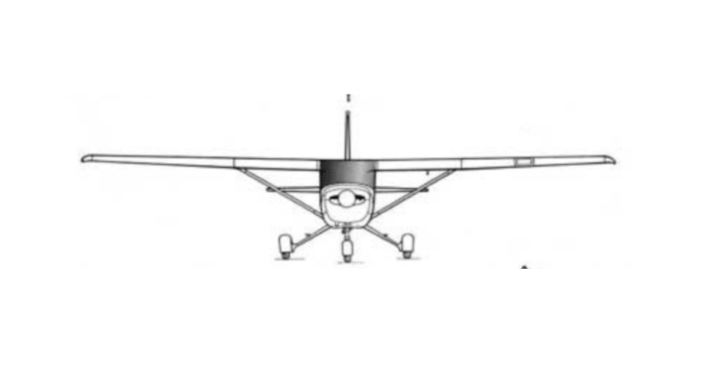

# Stability

---

## Objective

To understand the effects of design choices on the stability of an aircraft along its three axes.

## Motivation

Helps a student develop an intuitive understanding of stability and controllability that they can use to make sense of the control inputs as they fly in different conditions.

---

## Overview

- Airplane Axes
- Static Stability and Dynamic Stability
- Yaw / Directional Stability
- Longitudinal / Pitch Stability
- Lateral / Roll Stability
- Maneuverability vs Controllability

---

## Airplane Axes

---

## Static Stability and Dynamic Stability

---

## Yaw / Directional Stability

---

## Longitudinal / Pitch Stability

Pitch dampens over time

---

## Lateral / Roll Stability

Dihedral angle make large AoA on down wing, raising wing

---

# Deeper, Commercial-Level Discussion

---

## Lateral / Roll Stability - High vs Low Wing

---

#### Spiral Instability - Strong directional (yaw) stability and weak lateral (roll) stability

---

#### Dutch Roll - Strong lateral (roll) stability and weak directional (yaw) stability

---

## Maneuverability vs Controllability

---

## Maneuverability vs Controllability - Forward CG

Nose heavy, more stable, higher stall speed, lower cruise speed, more drag

---

## Maneuverability vs Controllability - Aft CG

Tail heavy, less stable, sensitive controls, lower stall speed, higher cruise speed, less drag

---

# Summary

- Airplane Axes
- Static Stability and Dynamic Stability
- Yaw / Directional Stability
- Longitudinal / Pitch Stability
- Lateral / Roll Stability
- Maneuverability vs Controllability
