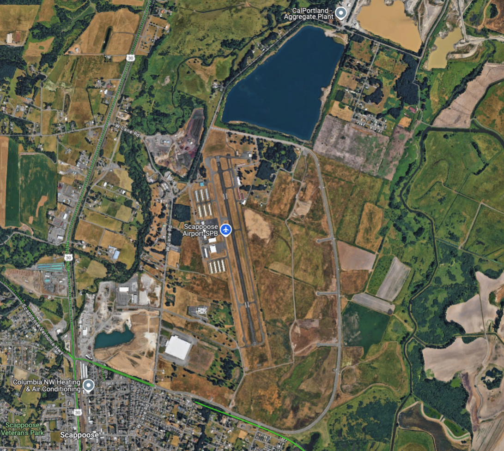

# Airport Operations

---

## Objective

Identify airport operations and procedures, including traffic patterns, runway identifiers, and light gun signals. Understand the role of ATC and the importance of communication with them.

## Motivation

Understanding airport operations is critical for safe flight operations. Pilots need to be familiar with traffic patterns and the role of ATC in managing air traffic. This knowledge will help pilots navigate airports safely and efficiently.

Instruction: Simple to complex, common to uncommon

---

## What are some hazards when flying near an airport?

- Traffic congestion
- Climbing/descending aircraft
- Different aircraft at different speeds
- Pilot preoccupation
- Mix of IFR and VFR traffic

---

## Overview of Airport Operations

- Untowered airports
  - Runway Identifiers
  - ASOS/AWOS
  - Traffic Patterns
  - CTAF/Unicom frequencies
  - Traffic pattern communication
  - Right-of-way Rules
- Airports with a Control Tower
  - ATC procedure
  - Loss-of-communications
  - Light gun signals
  - Wake turbulence and LAHSO

---

## Let's Go to Scappoose

- What runways do they have?
- What is the weather like?
- How do we know which runway to land on?
- When do we line up with the runway?
- How do we avoid other airplanes?
- How do communicate with those airplanes?

---

## Runway Identifiers: What runways do they have?

---

## Runway Identifiers

- Aligned with magnetic north heading
- Example: Heading 140&deg;M gives runway 14
- Shift slowly over time
- Parallel runways will be given L, R, or C designations

---

## Runway Identifiers: KSEA

---

## Weather: What is the weather like?

- Many airports will have weather reporting systems
- These stations will give you basic weather information:
  - Altimeter setting
  - Wind direction and speed
  - Temperature/dewpoint
  - Visibility
  - Sky condition (clouds, ceilings)
  - Precipitation

---

## Weather: Automated Weather Observations

- AWOS: Automated Weather Observing System - basic
- ASOS: Automated Surface Observing System - more advanced
- Machine-generated voices
- Not all systems will give all fields

---

## Weather: ATIS Broadcasts

- Found at towered airports
- Usually recorded by a controller
- Will include a letter identifier
  - "Information Golf"
  - You'll include this when you call the controller

---

## Weather: Visual Wind Indicators

- Show which direction to fly a traffic pattern
- Segmented circle/traffic pattern indicator: Shows traffic pattern direction
- Tetrahedron: Land in the direction that it's pointed

---

## Runway Winds: What runway are we going to land on?

- Pick a runway facing the wind
- Wind values are given as the direction the wind is blowing from
- If the wind was 150 at 10 knots: Wind is straight down runway 15
- Also listen for other traffic, see what runway they are using

---

## Runway Winds: Knowledge Check

The wind is reported at 040 at 8 knots. Which runway would we land on, 15 or 33?

---

## Runway Winds: Knowledge Check

The wind is reported at 040 at 8 knots. Which runway would we land on, 15 or 33?

- Favoring runway 33: 240 - 060&deg;
- Favoring runway 15: 060 - 240&deg;

<u>040 would favor runway 33 slightly, though this is a sizable crosswind.</u>

---

## Traffic Patterns: How do we line up with the runway?

We will use a standardized _traffic pattern_, which is a big rectangle that airplanes fly around a runway.

---

## Traffic Patterns: How high do we fly the traffic pattern?

- Chart supplement
- Propeller-driven aircraft: 1000' above field elevation
- Large or turbine aircraft: 1500' above field elevation
- Helicopters: 500', but may vary

---

## Traffic Patterns: What direction do we turn?

- By default, all traffic patterns are made to the <u>left</u>
- Some airport have exceptions, shown on sectional ("RP 36"), and in ForeFlight

---

## Traffic Patterns: Legs for Landing

- Downwind leg
- Base leg
- Final approach
- Departure

---

## Traffic Patterns: Entry

- Enter on 45&deg; to the <u>downwind</u> leg, at pattern altitude (1)
  - Look for traffic that may already be on downwind
- Turn <u>base</u> 45&deg; from touchdown point (2)
- Turn <u>final</u> to line up with runway (3)

---

## Traffic Patterns: Mid-Field Entry

- What if you're on the "wrong" side of the airport?
- Preferred entry: Overfly midfield at pattern altitude + 500 ft.
- Fly ~2 mi clear of the pattern, make a right turn to join the 45

---

## Traffic Patterns: Exit

- If remaining in the pattern, start crosswind leg within 300' of pattern altitude (4)
- When departing the pattern, depart straight-out or 45&deg; in the direction of the pattern (6)

---

## Untowered Airport Communications: How will we announce our intention to land?

- Airports will have a published **common traffic advisory frequency (CTAF)**
  - What we will use to announce our position
- UNICOM
  - These allow you to communicate with a station on the ground
  - Often, these are manned by a fixed-based operator (FBO) on the ground
  - You can use them to request services like fuel

---

## Untowered Airport: Position Calls

- Make initial call 10 miles out
  - `Scappoose traffic, N12382 10 mi east, 2000, entering 45 runway 15, Scappoose`
- Call when joining the 45
  - `Scappoose traffic, N12382 3 mi left 45 runway 15, full stop, Scappoose`
- Call when mid-field downwind
  - `Scappoose traffic, N12382 left downwind runway 15, full stop, Scappoose`
- Call when on base
  - `Scappoose traffic, N12382 left base runway 15, full stop, Scappoose`

---

## Untowered Airport: Position Calls (cont.)

- Call when on final
  - `Scappoose traffic, N12382 final runway 15, full stop, Scappoose`
- When clear of runway
  - `Scappoose traffic, N12382 clear of runway 15, Scappoose`

---

## Untowered Airport Communication: How do we avoid other airplanes?

- See-and-avoid
  - Look for airplanes in all legs of pattern
- Listen for other airplanes on the radio
  - Some airplanes may not have a radio

---

## Runway Distances: How Long is the Runway?

- TORA: Takeoff runway Available, usually the length of the runway
- TODA: Takeoff distance available, TODA + any clearway/stopway beyond the end of the runway
- ASDA: Accelerate-Stop Distance Available: Distance available to accelerate and stop
- LDA: Landing distance available: Runway length, minus any displayed threshold

<!--
These may be less than physical distances to account for runway safety area buffers
-->

---

## Runway Distances: How Long is the Runway?

---

## Right-of-way Rules ([91.113](/_references/14-CFR/91.113))

- Airplane in distress have right-of-way
- Balloons > Gliders > Airships > Airplane, Rotocraft, Weight-shift control, powered parachute
- When two airplanes are approaching to land, the lower one has right-of-way
  - However, you cannot take advantage of this by cutting in front of another aircraft

---

# Airports with a Control Tower

---

## Control Tower Operations

- Maintain contact with the control tower while you're in the airspace
- Make initial call-up 15 miles out
- Some airports have a radar display, but not all
  - Traffic advisories
  - Recommended headings

---

## Control Tower: Arrival

- Get the ATIS
- Initial call 15 miles out
  - Call: `Salem Tower, N12382, 15 miles southwest, inbound to land with information Papa`
  - Response: `N12382, Salem Tower, enter left base runway 34. Report 2 mile base.`

---

## Control Tower: Arrival

- On a 2mi base
  - Call: `Salem Tower, N12382, 2 mile left base runway 34`
  - Response: `N12382 cleared to land runway 34`
- Once on the ground
  - Tower: `N12382 turn left A4, contact ground point 9`
  - "Ground" point 9 means `121.9`
- Once over the hold short line at A4
  - `Salem Ground, N12382 at A4, request taxi to FBO`

---

## Types of Landings

- "Full stop": land and depart runway
- Touch-and-go: Touch and immediately takeoff again
- Stop-and-go: Land, stop on runway, then takeoff again
- Low approach: Fly low over the runway
- "Cleared for the option", means cleared for any of the above

---

## Radio Failure: Loss of Two-Way Radio

- Can be loss of receive, transmit function, or both
- Squawk 7600
- Landing at an untowered airport
  - Remain outside the traffic pattern
  - Observe wind, traffic flow
  - Enter pattern when it is safe to do so
- Towered airport (Class D)
  - Try calling tower
  - Squawk 7600
  - Remain outside traffic pattern
  - Look for light gun signals from tower

---

## Light Gun Signals

---

## Land And Hold Short Operations (LAHSO)

- Land before an intersecting runway or taxiway
- PIC needs to accept or decline
- Land and hold short points are listed in the Chart Supplement
  - Available Landing Distance (ALD) listed for each
- Example: `N12382 cleared to land runway six right, hold short of taxiway bravo for crossing traffic B737.`
- Need basic VFR weather conditions

---

## Wake Turbulence Holds

- ATC will hold light aircraft for 3 minutes if a large aircraft has just takeoff
- "Hold for wake turbulence"
- Pilots can request to waive this, "Request to waiver 3 minute interval"

---

## Intersection Takeoffs

- Controller will give you take off distance available from intersection
- Pilots need to accept or decline
- Risks of intersection takeoffs:
  - Reduced takeoff distance
  - Less runway in case of an engine failure

---

# Summary

- Uncontrolled airports
  - Runway Identifiers
  - Weather: ATIS/AWOS/ASOS
  - How to select a runway
  - Traffic Patterns: Direction, altitude, entry, exit
  - Communications
  - Runway Distances
  - Right-of-way Rules

- Control Tower Operations
  - Control Tower: Arrival
  - Types of Landings
  - Radio Failure: Loss of Two-Way Radio
  - Light Gun Signals
  - Land And Hold Short Operations (LAHSO)
  - Wake Turbulence Holds
  - Intersection Takeoffs

---

## Knowledge Check

Preparing to land at an untowered airport, you listen to the AWOS and hear the wind is 270&deg; at 10 knots. Looking at the wind sock though, you see it's point towards a heading of 180&deg;

Which direction should you fly the traffic pattern and land?

---

## Knowledge Check

You're on final to runway 36 at a towered airport. The controller tells you to "cleared for the option". What does that mean?

---

## Knowledge Check

You're on final to runway 18 at a towered airport with crossing runways. The controller tells you to "cleared to land runway 18, hold short of runway 36 for crossing traffic".

What does that mean? Do you have to comply?
