

# Airspace

## Lesson 1: Class Airspace and Identification

---

## Objective

Understand the purpose of the National Airspace System, the 5 classes of airspace, and how to identify the airspace that you are in.

## Motivation

Flying in the National Airspace System is an important component of flight planning and a consideration for almost every flight. A pilot needs to know what airspace they are in and what are the requirements for flying in each of the different kinds of airspace.

---

## Airspace Lesson Overview

Airspace is a large topic and can be difficult to understand intuitively. We'll cover topics in 4 lessons:

- Lesson 1: Class airspace, identification
- Lesson 2: Class airspace, entry requirements
- Lesson 3: Class airspace, weather minimums, speed limits, etc.
- Lesson 4: Special-use airspace

---

## Overview

- What is airspace?
- Why do we have airspace?
- Class Airspace
- Shape, size, identification of airspace classes
  - Class A
  - Class B
  - Class C
  - Class D
  - Class E
  - Class G
- Other Airspace

---

## What is airspace?

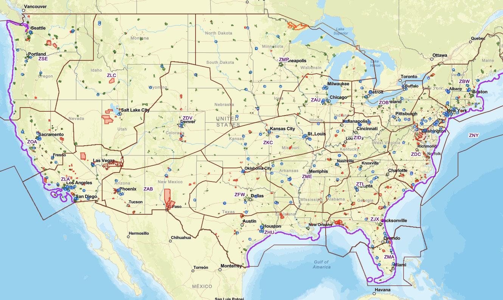

Airspace is a volume of the sky, defined with lateral and vertical boundaries, which has certain requirements for aircraft flying through it.

---

## Why do we have airspace?

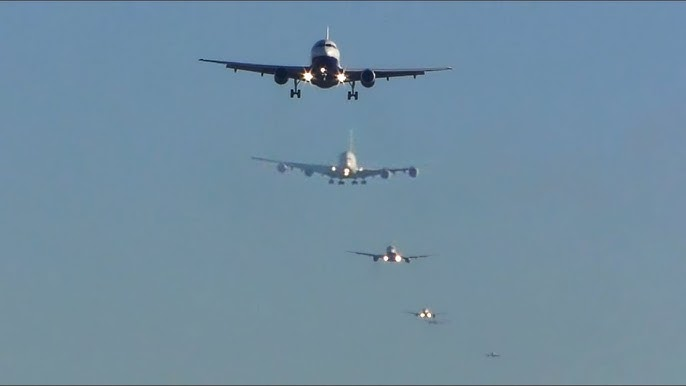

- Separation of airborne aircraft (especially VFR/IFR aircraft)
- Facilitates efficient flow of traffic
- Determine level of air traffic control services
- Protects facilities on the ground, or activities in the air

---

## Class Airspace

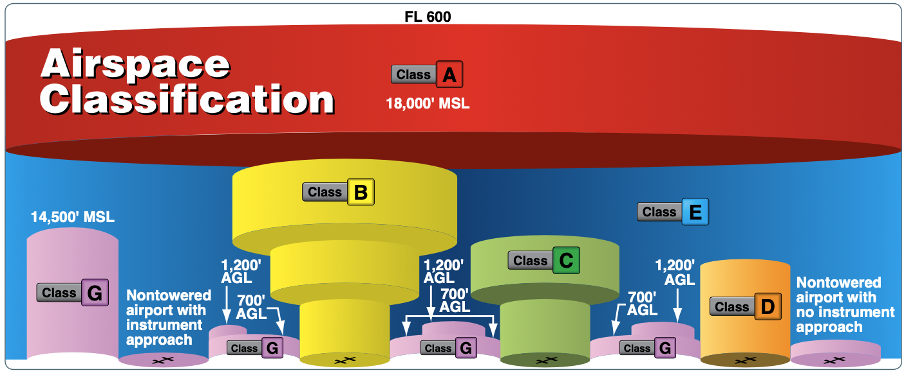

Airspace is divided into 5 class:

- Controlled Airspace: A, B, C, D, and E
- Uncontrolled Airspace: G

<!-- Class A: Most restrictive, Class G: least restrictive -->

---

## Class A Airspace

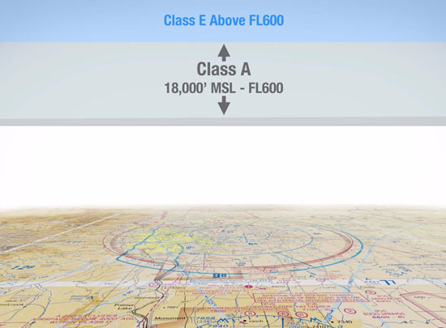

- 18,000' MSL up to FL600
- Requires an active IFR flight plan to enter
- Not charted
- FL = Flight levels, thousands of feet
  - Used for altitude above 18,000' MSL
  - FL240 = 24,000' MSL

---

## Class B Airspace

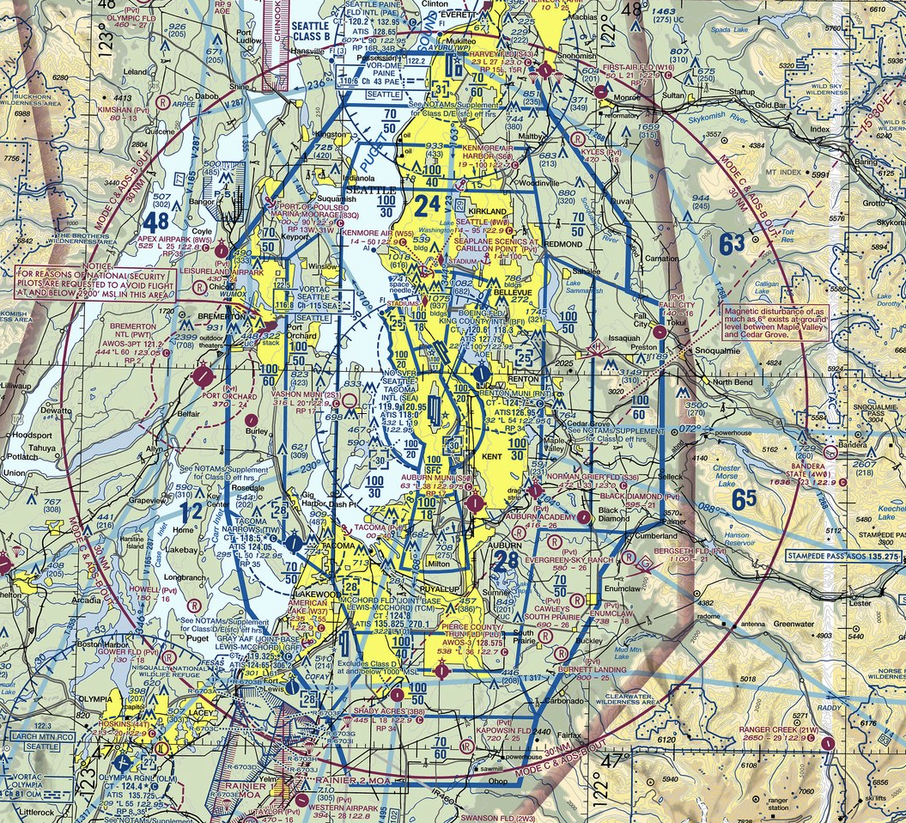

- Surrounds the busiest airports
- Control tower + approach control
- Generally from surface to 10,000' MSL
- Custom layout, protects approaches to the primary airport
- Charts
  - Solid blue line
  - Thin magenta line: Mode-C Veil, 30nm ring around the center

---

## Class B Airspace: Shape

"Upside-down wedding cake"

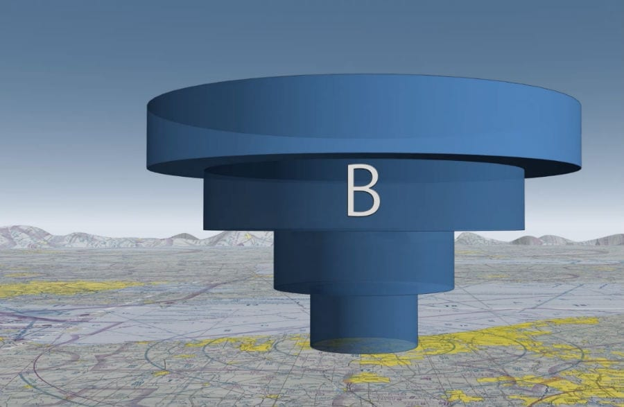

---

## Class B Airspace: Vertical Extents

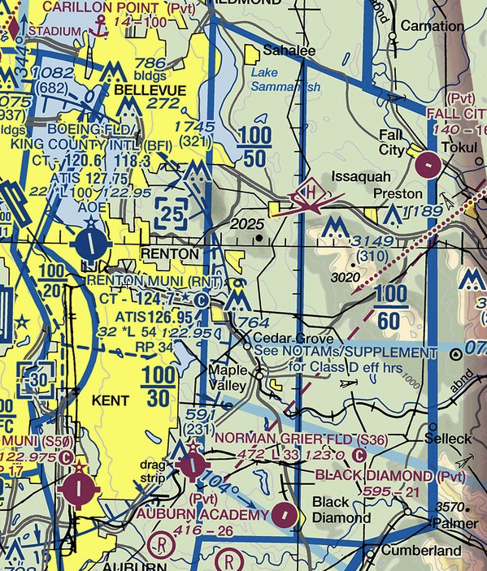

`100 / 50` = Airspace 5000' MSL to 10,000' MSL

---

## VFR Sectional vs Terminal Area Chart (TAC)

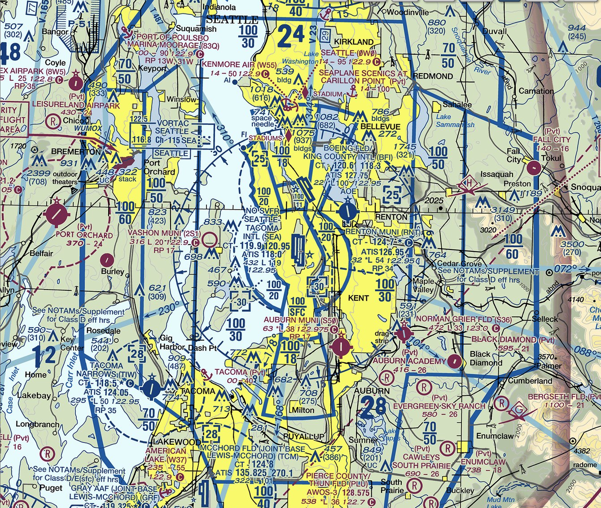

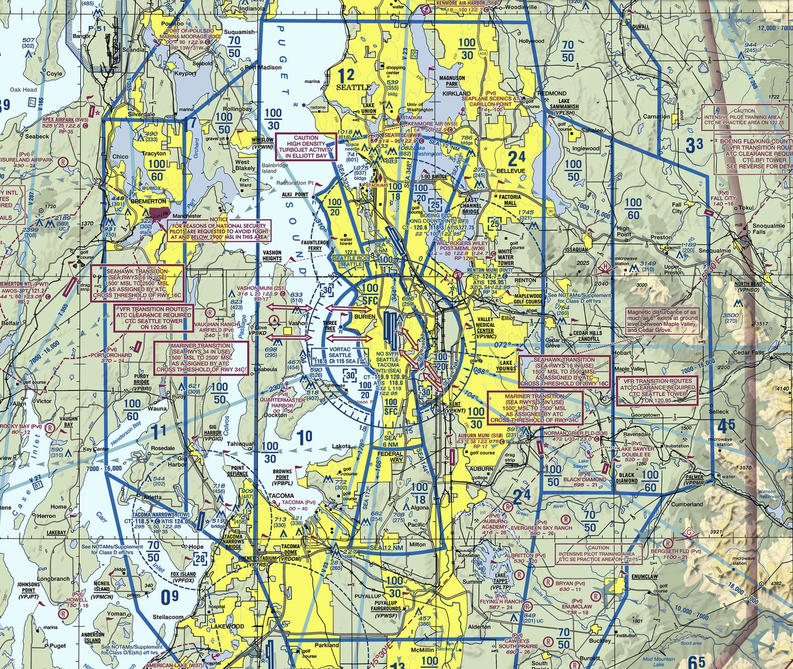

- TAC has more detail around the Class B surface area

---

## Class C Airspace

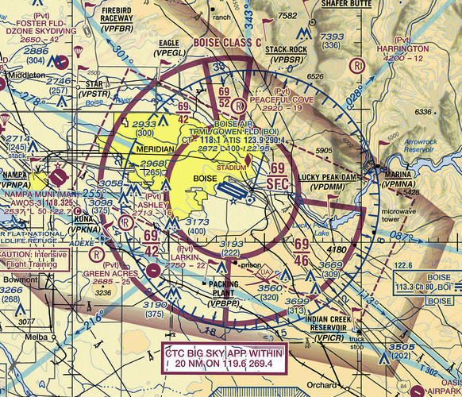

- Surrounds busy airports with tower and approach control
- Extents
  - 5nm inner ring: Surface to 4000' AGL
  - 10nm outer ring: 2000' AGL to 4000' AGL
- Charts: Thick magenta line

---

## Class C Airspace: Shape

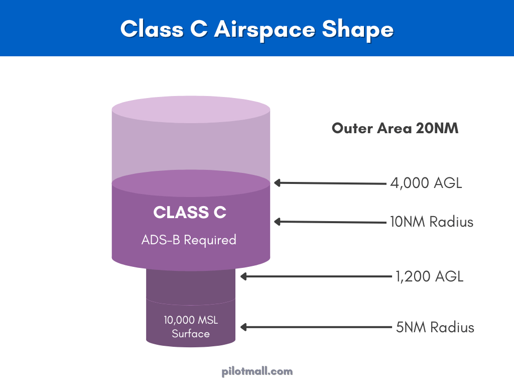

---

## Class C Airspace: Vertical Extents

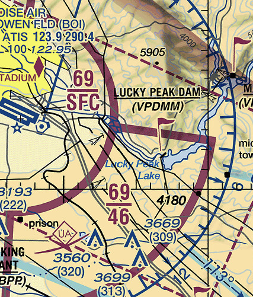

- `69 / SFC` = Surface to 6900' MSL
- `46 / 69` = 4600' MSL to 6900' MSL

---

## Class D Airspace

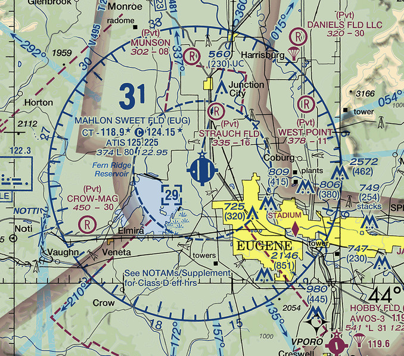

- Surrounds airports with a control tower
  - Tower may be part-time
- May or may not have a approach control
- Surface to 2500 ft. AGL
- Chart: Dashed blue line

---

## Class D Airspace: Vertical Extents

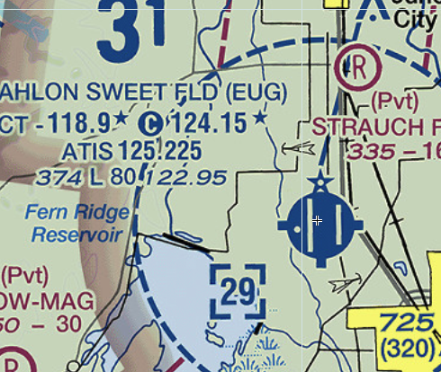

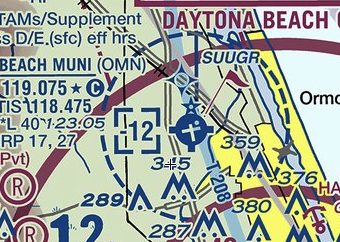

- Boxed `29` = Surface to 2900' MSL
- Boxed `-12` = Surface to below 1,200' MSL

---

## Class E Airspace

- Controlled airspace other than A, B, C, or D
- Starts at 1,200' **AGL** over most of the U.S.
- Usually extends to 18,000 ft. MSL, where Class A begins

---

## Class E Airspace: Why do we have it?

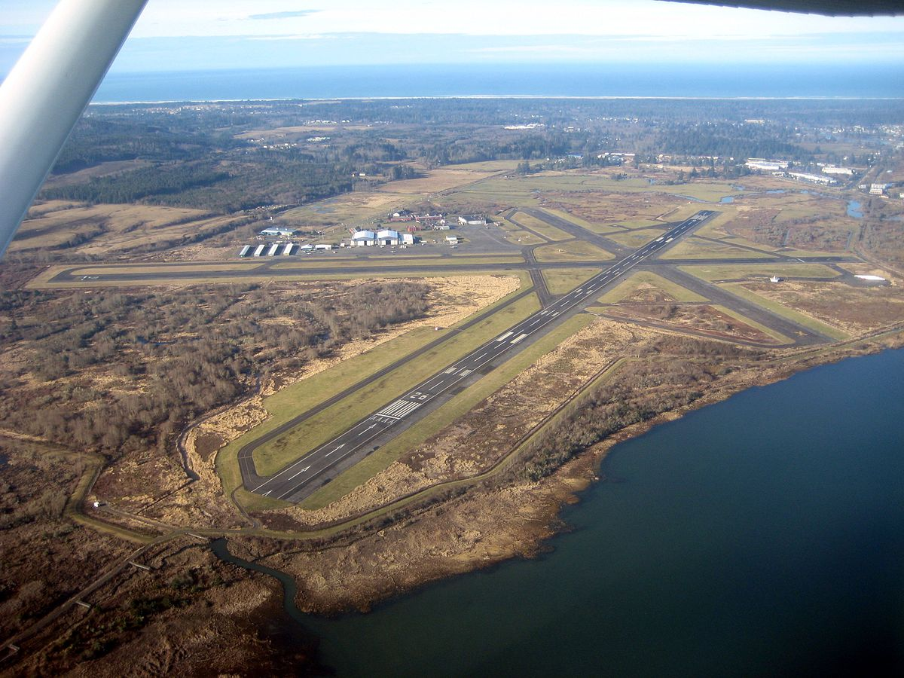

- Keeps IFR traffic in controlled airspace during an instrument approach
- Higher VFR weather minimums (more in Lesson 3)

---

## Class E Airspace: Starting at 1,200' AGL

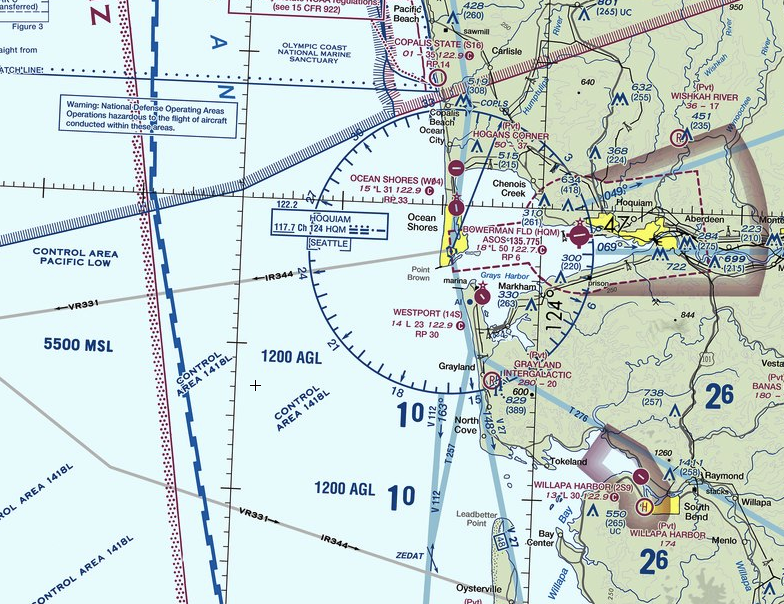

- Chart: Blue zipper line
- `1200 AGL`
  - Class E starts at 1,200' AGL within zipper boundary
- Outlines most of the continental U.S.

---

## Class E Airspace: Around Airports at Surface

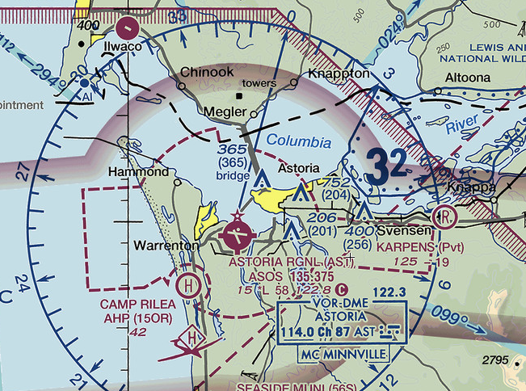

- Chart: Magenta dashed line
- Class E surface to 18,000 ft.

---

## Class E Airspace: Around Airports at 700' AGL

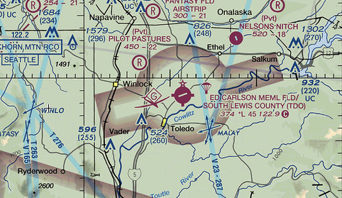

- Chart: Shaded magenta
- On shaded side
  - Class E from 700' AGL to 18,000 ft.

---

## Class E Airspace: Enroute at 14,500' MSL

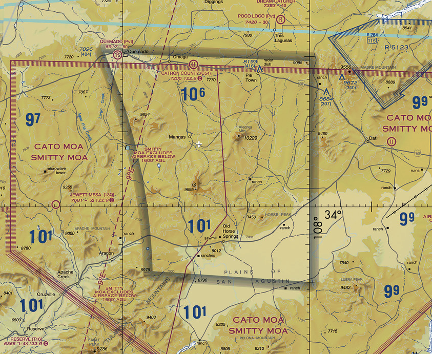

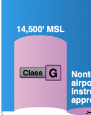

- Chart: Shaded blue
- On shaded side: Class E begins at 1,200' AGL
- On inside: Class E begins at 14,5000' MSL
- These areas are being removed

---

## Class E Airspace: Above 60,000'

---

## Class G Airspace

- From the ground up to the overlying controlled airspace
- Not charted explicitly

---

## Class G Airspace: Class E at 700' AGL

- Inside shading: Surface to 700' AGL
- Outside shading: Surface to 1,200' AGL

---

## Other Airspace

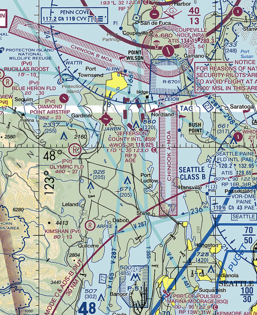

- Military Operation Areas
- Restricted Areas
- Covered in detail in Lesson 4

---

## Knowledge Check: Over KSBP

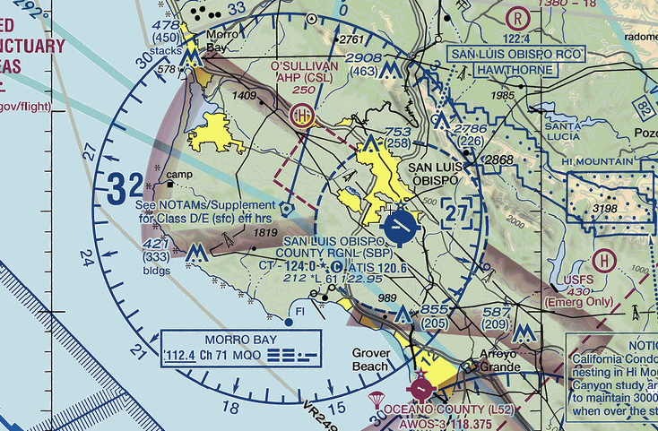

If you were in a rocket ship blasting off from the surface, what are the layers of airspace you'd pass through as you ascend?

---

## Knowledge Check: Over KSBP

- Class D: Surface to 2700' MSL
- Class E: 2700' to 18,000' MSL
- Class A: 18,000' MSL to FL600
- Class E: FL600 and above

---

## Knowledge Check: NW of KSBP

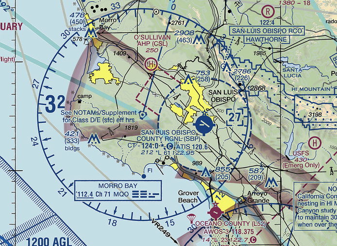

What are the layers of airspace above this point?

---

## Knowledge Check: NW of KSBP

- Class E: Surface to 18,000'
- Class A: 18,000' MSL to FL600
- Class E: FL600 and above

---

## Knowledge Check: Over Morro Bay

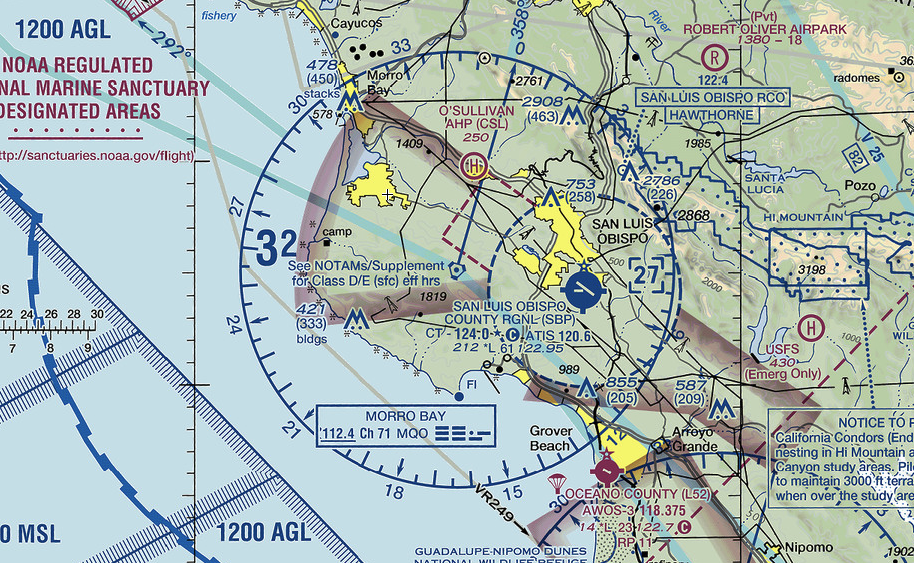

What are the layers of airspace above this point?

---

## Knowledge Check: Over Morro Bay

- Class G: Surface to 700' AGL
- Class E: 700' AGL to 18,000' MSL
- Class A: 18,000' MSL to FL600
- Class E: FL600 and above

---

## Knowledge Check: Over KRNT

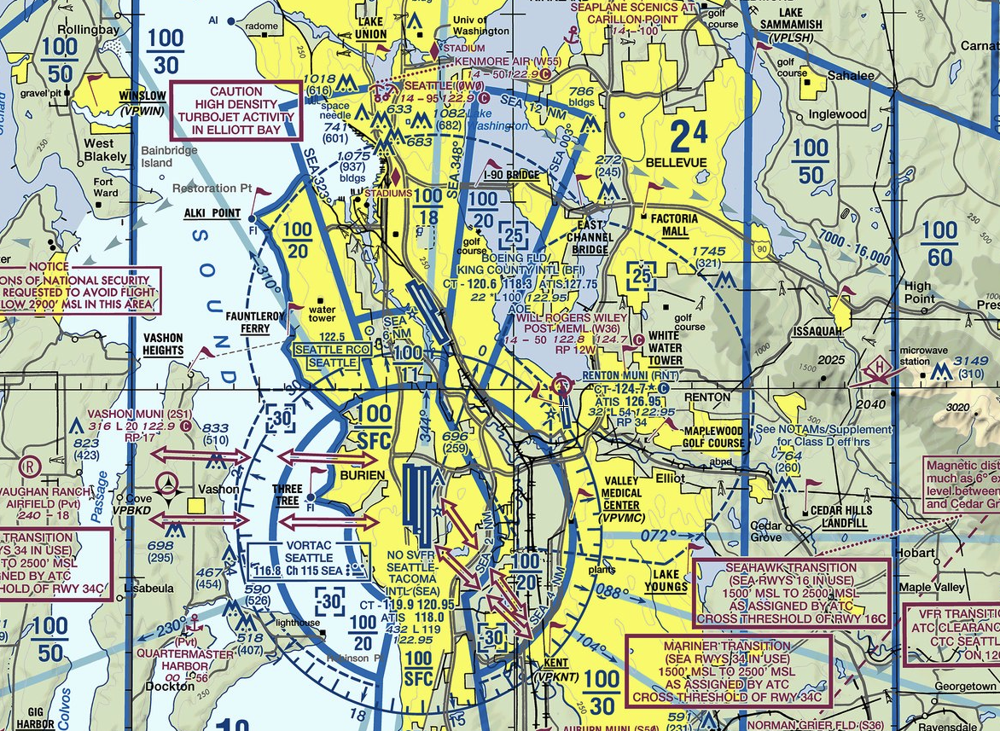

What are the layers of airspace above this Renton Municipal?

---

## Knowledge Check: Over KRNT

- Class D: Surface to 2500' MSL
- Class E: 2500' to 3000' MSL
- Class B: 3000' to 10,000' MSL
- Class E: 10,000 to 18,000' MSL
- Class A: 18,000' MSL to FL600
- Class E: FL600 and above

---

# Summary

- Airspace are 3D boundaries with different requirements
- Airspace separates the flow of traffic
- 5 Classes of Airspace: A, B, C, D, E, G
- Controlled
  - Class A: 18,000' to FL600
  - Class B: Busiest airports, surface to 10,000'
  - Class C: Busy airports, surface to 4,000' AGL
  - Class D: Towered airports, surface to 2500' AGL
  - Class E: Other controlled airspace
- Uncontrolled
  - Class G: Surface to controlled airport
