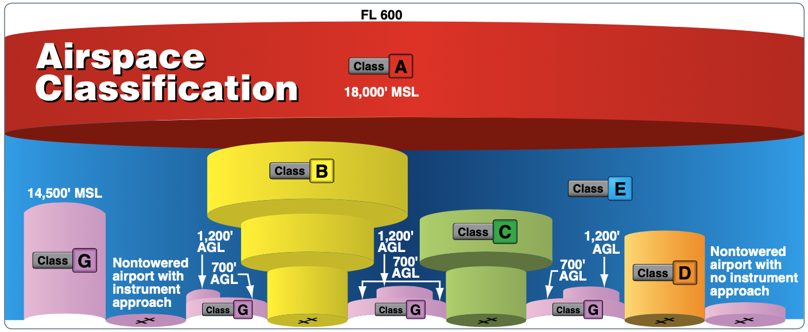

# Airspace

## Lesson 2: Airspace Entry Requirements and Services

---

## Objective

Identify airspace on a sectional chart and determine the requirements for entering that given airspace.

## Motivation

Different classes of airspace have different entry requirements and provide different level of services to aircraft. We need to know the entry requirements for each class before flying into them.

---

## Overview

- Communication requirements, Transponder/ADS-B requirements, ATC services for:
  - Class A
  - Class B
  - Class C
  - Class D
  - Class E
  - Class G

---

## Class A Entry Requirements

- Flights above 18,000' MSL to FL600
- IFR rated and IFR equipped
- Requires an IFR flight plan and IFR clearance
- Equipment
  - Mode C transponder and ADS-B Out
- ATC services
  - Separation services for IFR traffic

---

## Class B Entry Requirements

- Need 2-way radio communication with controlling facility
- VFR traffic need explicit clearance:
  - "N549SR cleared into the Class B, maintain 3000"
- Mode-C Transponder + ADS-B Out
  - Within and above Class B lateral bounds
  - Within 30nm (Mode C Veil)
- ATC services
  - Separation from other traffic
  - Sequencing into primary airport

---

## Class C Entry Requirements

- Need 2-way radio communication with controlling facility
- Need acknowledgement of your callsign
  - "N549SR, Portland Tower." - sufficient
  - "Aircraft calling, standby" - not sufficient
- Mode-C Transponder + ADS-B Out
  - Needed within and above the Class C bounds
- ATC services
  - Sequencing to the primary airport
  - Separation of VFR/IFR traffic

---

## Satellite Airports

- Some Class D airports have Class C airspace above them
- Arriving from within Class C airspace
  - Class C will hand you off to the Class D tower
- Departing from the Class D airport:
  - May issue you a squawk code before departure
  - Class D will hand you off to a Class C frequency
  

---

## Class D Entry Requirements

- Need 2-way radio communication with controlling facility
- Need acknowledgement of your callsign
- No transponder/ADS-B requirements
- ATC services
  - Sequencing to the primary airport
  - No separation services
  - Traffic advisories

---

## Class D: Part-time Towers

- Some Class D control towers are part-time
- Look for star on sectional next to frequency
- Refer to Chart Supplement for hours
- Airspace will revert to Class E or G when tower is closed

---

## Class E Entry Requirements

- No entry requirements for VFR
- No separation services for VFR traffic
- Can receive ATC services (IFR, VFR flight following)
- Mode-C Transponder + ADS-B Out
  - Required above 10,000' MSL

---

## Class G Entry Requirements

- Uncontrolled airspace, no entry requirements
- No ATC services provided
- No radio, transponder, or ADS-B required

---

## Summary

- Class A: ADS-B/Transponder, IFR flight plan + clearance
- Class B: ADS-B/Transponder within 30nm, "Cleared in the bravo", separation/sequencing
- Class C:
  - ADS-B/Transponder within + above
  - Acknowledgement by call sign
  - Separation/sequencing
- Class D: Acknowledgement by call sign, sequencing only
- Class E: ADS-B/Transponder above 10,000 ft., no entry requirements
- Class G: No entry requirements

---

## Knowledge Check

You are looking to transition KPDX's airspace at 3000' MSL. You call Portland Tower and ask for a northbound transition.

They reply "N12382, standby." Are you cleared to enter the airspace?

What if they reply "Aircraft calling, standby?"

---

## Knowledge Check

- What's the meaning of the `*L` on a airport block?
- What about the star symbol next to 124.4?

---

## Knowledge Check

You are flying an airplane with no transponder or ADS-B equipment. You plan to make a flight to the Eugene airport for some repairs.

Are you able to land there? Do you need to make any prior arrangements?

