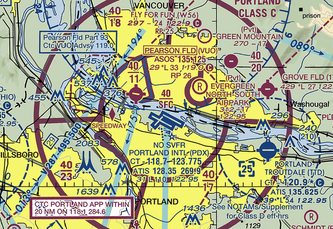

# Airspace

## Lesson 3: Airspace Minimums

---

## Objective

Identify class airspace on a sectional chart and describe any weather, equipment, or speed restrictions needed to operate within the airspace. Also determine what pilot qualifications are needed for each class.

## Motivation

Each class of airspace has different weather minimums for VFR flight, equipment requirements, speed limits, and pilot qualification. A pilot will need to know and apply these rules before flying into any airspace.

---

## Overview

- Required VFR Cloud Clearance and Visibility
- Special VFR
- Aircraft Speed Limits
- Transponder and ADS-B
- Pilot Qualifications

---

## Basic Controlled Airspace Minimums (91.155)

- In order to operate VFR in controlled airspace:
  - Ceiling must be at least 1,000 feet
  - "Ceiling" means lowest broken, overcast, or obscured layer
- In order takeoff, land, or enter the traffic pattern in controlled airspace:
  - Ground visibility must be at least 3 s.m.
  - If ground visibility is not reported, flight visibility

---

## VFR Cloud Clearance Requirements (91.155)

- Each class of airspace has weather minimums for VFR traffic
- These are defined as:
  - Minimum _flight_ visibility in statue miles
  - Distance above, below, or horizontally from clouds
- Distances support see-and-avoid aircraft separation

---

## VFR Weather Minimums: Class B Airspace

- 3 s.m. flight visibility
- Clear of clouds

---

## VFR Weather Minimums: Class C & D Airspace

- 3 s.m. flight visibility
- "512 rule"
  - 500 feet below clouds
  - 1000 feet above cloud
  - 2000 feet horizontally from clouds

---

## VFR Weather Minimums: Class E Airspace

- Below 10,000 ft. MSL
  - 3 s.m. visibility
  - "512 rule"
- Above 10,000 ft. MSL
  - 5 s.m. visibility
  - "111 rule"
    - 1000 feet below
    - 1000 feet above
    - 1 s.m. horizontally

---

## VFR Weather Minimums: Class G Airspace

- During the day
  - Below 1,200 ft. AGL
    - 1 s.m., clear of clouds
  - From 1,200 ft. AGL to 10,000 ft. MSL
    - 1 s.m., "512 rule"
  - 10,000 ft. and above
    - 5 s.m. visibility
    - "111 rule"
- At night
  - 3 s.m.
  - "512 rule"

---

## VFR Weather Minimums: Summary

---

## Special VFR (91.157)

- Special VFR allows you to operate below VFR in some circumstances
- Special VFR requires:
  - An ATC clearance
  - Must maintain clear of clouds
  - _Flight_ visibility is at least 1 s.m.
- At night special VFR requires
  - Pilot must be instrument rated and current
  - Airplane must be equipped for instrument flight
- Special VFR must be requested by the pilot. ATC will never assign it or ask you for it

---

## Special VFR Clearances (91.157)

- IFR traffic will have priority over SVFR traffic
- ATC Phraseology
  - "N12382 request special VFR, departure to the north"
  - "Cleared out of Salem airspace northbound, maintain special VFR conditions."
- Some airport prohibit special VFR (NO SVFR on sectional)

---

## Aircraft Speed Limits

- Above 10,000 ft: **Mach 1** ([91.817](/_references/14-CFR/91.817))
- Below 10,000 ft: **250 KIAS** ([91.117](/_references/14-CFR/91.117))
- Class B Airspace
  - Within Class B: **250 KIAS** ([91.117](/_references/14-CFR/91.117))
  - Under Class B or within VFR corridor: **200 KIAS** ([91.117](/_references/14-CFR/91.117))
- Within 4nm of primary Class C or D airport, up to 2500 AGL: **200 KIAS** ([91.117](/_references/14-CFR/91.117))

---

## Transponder and ADS-B Requirements

- ADS-B and Mode C Transponders are required
  - In Class A airspace
  - Required within the Mode C veil of Class B airspace, up to 10,000 ft.
  - Above and below Class B airspace
  - Within and above Class C airspace
  - In Class E airspace at and above 10,000 MSL
- ADS-B is specifically required:
  - Within 12 NM of the US coastline in the Gulf of Mexico, in Class E airspace at and above 3,000 MSL

---

### Transponder + ADS-B Requirements Chart

---

## Pilot Qualifications

- Class B airspace: Open to private pilots and above, except:
  - Student pilots need a endorsement to operate in a given Class B airspace (61.95)
  - Student pilots need a endorsement to land at a primary airport within Class B
  - Recreational and sport pilots need a one-time endorsement for Class B airspace
- Some Class B airports (listed in Part 91, Appendix D) will require a private pilot license minimum

---

# Summary

- VFR weather minimums: 1000' ceiling and 3 s.m. visibility
- VFR cloud clearances: Ensure we can see-and-avoid IFR traffic
- Special VFR: Allows for 1 s.m. visibility + clear of clouds, must be requested
- Speed limits:
  - 250 knots below 10,000 ft.
  - 200 knots near a Class C or D airport
- ADS-B + transponder requirements: Class A, B, C airspace, above 10,000 ft.

---

## Knowledge Check

An localized bank of stratus clouds are over your airport at 900 ft. AGL, but there are clear skies to the west. The clouds are forecast to dissipate as the day warms up.

Assuming you're departing from an airport with a control tower, is there any way you can depart?

---

## Knowledge Check

You plan to cruise at 4,500 feet to your destination, just below a bank of overcast clouds at 4800 feet.

Is this legal? Is there anything you would be concerned about?

---

## Knowledge Check

You want to practice landings in the traffic pattern at an uncontrolled airport in Class G airspace. The AWOS is reporting 1100 ft. overcast with ground visibility of 1.5 s.m.

Are you legal to fly in the traffic pattern? Is it a good idea?

---

## Knowledge Check

You are approaching to land at an airport AWOS says the surface visibility is 2.5 s.m. 4 miles from the airport you have the runway in sight.

Are you able to land legally?
