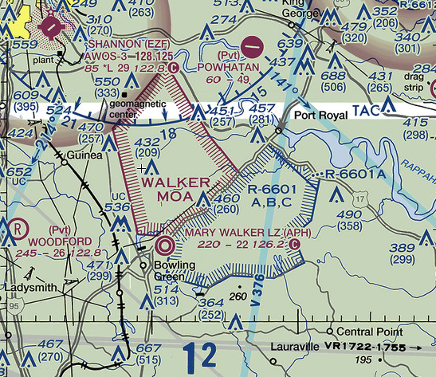
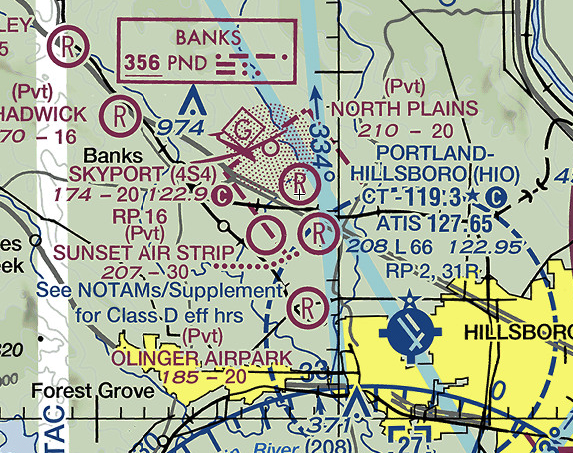

# Airspace

## Lesson 4: Special Airspace

---

## Objective

Identify special use airspace on a chart and describe their limitations and entry requirements. Also understand chart publication frequencies and effective dates.

## Motivation

There is a large collection of special-use airspace (SUA), which supplements the basic classes of airspace. This airspace is used to protect special activities on the ground or in the air. Pilots need to to know which airspace they are allowed to operate in or through.

---

## Overview

- Prohibited Areas
- Restricted Areas
- Warning Areas
- Military Operation Areas (MOAs)
- Alert Areas
- Controlled Firing Areas (CFAs)
- National Security Areas

- Military training routes
- Temporary Flight Restrictions (TFRs)
- Parachute, Glider, Ultralights
- Terminal Radar Service Area (TRSA)
- Special Flight Rules Area
- Currency of Publications

---

## Special-Use Airspace Information

- Listed on chart margins
- Airspace controlling agency
- Airspace regular hours
- Some will be activated via NOTAM
- "2 HRS IN ADVANCE": NOTAM will be published 2 hours prior

---

## Accessing Chart Legends in Foreflight

---

## Prohibited Areas

- Entry is not allowed
- Vertical extents will be listed on the margin information

---

## Restricted Areas

- Permission needed from controlling agency to fly through
- Controlling agency listed on margin
- Contains unusual, often invisible, hazards to aircraft (artillery firing, aerial gunnery, or guided missiles)

---

## Warning Areas

- Similar hazards as restricted areas
- Located 3 s.m. offshore
- Doesn't require permission to enter, but be very cautious

---

## Military Operation Areas (MOAs)

- Doesn't require permission to enter
- Be extremely cautious if flying through when one is active
- See and avoid aircraft

---

## MOA Exclusion Areas

Lists airspace which is excluded from the MOA for an airport

---

## Alert Areas

- Areas of unusual flight activity or large amounts of flight training
- Does not require permission to enter
- Exercise caution to see and avoid other aircraft

---

## Controlled Firing Areas (CFAs)

- Areas of operations which would be hazardous to non-participating aircraft
- Spotter aircraft are used to watch for incoming aircraft
- Not charted

---

## National Security Areas

Aircraft are asked to avoid due to the sensitivity of national security.

---

## Military Training Routes

- Special military routes where aircraft speeds can be in excess of 250 knots
- IR routes: Training in any weather conditions
- VR routes: Training conducted in basic VFR weather

- Numbering system
  - IR1206: Four digits, no segment above 1,500' AGL
  - IR207: Three digits, one or more segments above 1,500' AGL
  - Alternates end in A or B (IR206A, VR10007B)

---

## Temporary Flight Restrictions (TFRs)

- A NOTAM closing a certain radius of airspace for prohibited, airspace, national security
- Reason for a TFR
  - Airshows
  - NFL/MLB stadiums during games
  - Firefighting
  - Presidential visits
- Use an EFB map overlay or NOTAM briefing

---

## Parachute, Glider, Ultralights

---

## Terminal Radar Service Area (TRSA)

- Precursors to Class C airspace, and some still exist
- Provides same ATC services as a Class C, but participation is voluntary
- Surrounds a busy Class D airport
- Charted vertical extents
  - Black `60/30` = 3000-6000 ft. MSL

---

## Special Flight Rules Area (SFRAs)

- Areas with unique characteristics that require special rules
- Specific information in 14 CFR Part 93
- Examples
  - Grand Canyon
  - Niagara Falls
  - Washington DC
  - Pearson Airport

---

### Example SFRAs

- Pearson Airport: Proximity to PDX has special rules
- Washington D.C.: Inner ring and outer ring

---

## Currency of Publications

- Aeronautical charts are published every 56 days
- Effective and expiration days are listed on the chart

---

| Special Airspace Summary             | Entry Requirements                        |
| ------------------------------------ | ----------------------------------------- |
| Prohibited Areas                     | No entry                                  |
| Restricted Areas                     | With permission only                      |
| Warning Areas                        | Entry allowed, use caution when active    |
| MOAs                                 | Entry allowed, use caution when active    |
| Alert Areas                          | Entry allowed                             |
| Controlled Firing Areas (CFAs)       | Not charted                               |
| National Security Areas              | Avoid should avoid                        |
| Military training routes             | Use caution when in use                   |
| Temporary Flight Restrictions (TFRs) | No entry                                  |
| Parachute, Glider, Ultralights       | Use caution for activity                  |
| Terminal Radar Service Area (TRSA)   | Class C services, voluntary participation |
| Special Flight Rules Area            | Part 93 lists special rules               |

---

## Knowledge Check

Your flight plan will take you over a military operation area (MOA).

Where can you find information about whether it's active? If it is active, can you still fly through it?

---

## Knowledge Check

You hear on the news that the president is visiting town on Saturday, the same day you were planning to fly.

What would be sure to check before you depart?

---

## Knowledge Check

You're planning a scenic flight over the Grand Canyon. Where would you find information about the flight operations allowed there?

---

## Knowledge Check

Your flight has you cross this military training route VR1084.

Where would you expect to find military aircraft along that route?
