## Airworthiness Requirements

---

## Objective

To understand the requirements and documents that proves that our airplane is airworthy, both from a legal perspective and a safety perspective.

## Motivation

A pilot should be able to determine the airworthiness status of an airplane given the logbooks and maintenance records to determine if it is safe and legal to fly.

---

## Overview

- Type certificates and airworthiness certificates
- ARROWS documents - in the plane
- AV1ATED checklist - maintain the plane
- Aircraft logbooks
- Aircraft equipment lists
- 91.205, required VFR equipment
- Kind of Equipment List (KOEL)
- Minimum Equipment List (MEL), 91.213
- Special Flight Permits
- Preventative Maintenance

---

## Airworthiness Definition

Airworthiness means the aircraft is legal to fly, meeting the airworthiness criteria defined by the FAA.

---

## Who is responsible for determining airworthiness?

Per [91.7](<https://www.ecfr.gov/current/title-14/part-91/section-91.7#p-91.7(b)>):

> The pilot in command of a civil aircraft is responsible for determining whether that aircraft is in condition for safe flight. The pilot in command shall discontinue the flight when unairworthy mechanical, electrical, or structural conditions occur.

---

## Aircraft Certification

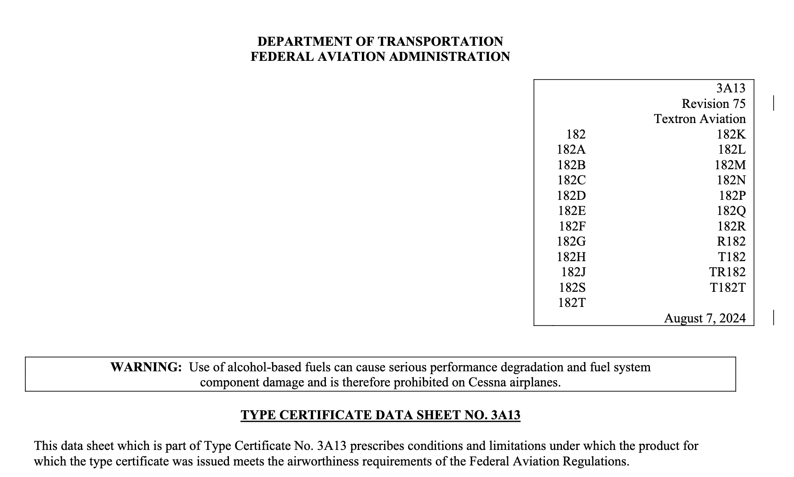

- When an aircraft is designed it undergoes a certification process for the model being produced
- Following certification, the model receives a type certificate and authorization for production
- When that model of aircraft is manufactured they receive an airworthiness certificate
- Each type has a type certificate data sheet (TCDS), which includes various information about the type

---

## Standard vs Special Airworthiness Certificate

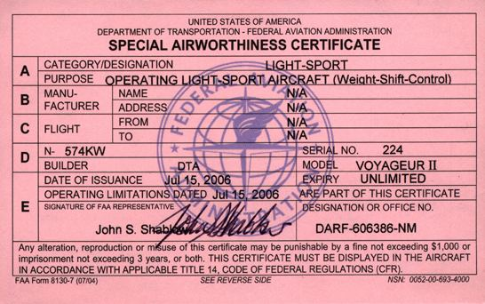

- Standard Airworthiness Certificate: "Certified" aircraft
- Special Airworthiness Certificate, other types of aircraft:
  - Experimental
  - Restricted
  - Limited
  - Provisional
  - Light-Sport Aircraft (LSA)

---

## Supplemental Type Certificates - Changes to Original Designs

- Used for major modifications to an existing certified aircraft
- Requires engineering work to prove the safety of the aircraft following the change
- Examples:
  - Retrofit avionics and autopilots
  - Different engines or propellers
  - After-market turbochargers

---

## What documents do we need to legally fly?

ARROW:

1. **A**irworthiness certificate: Displayed where passengers can see it
2. **R**egistration certificate: State and local
3. **R**adio station license from FCC, for flight outside the U.S.
4. **O**perating Limitations: AFM/POH, placards, markings
5. **W**eight and balance information: Latest measurements
6. **S**erial number data plate

---

## A - Airworthiness Certificates

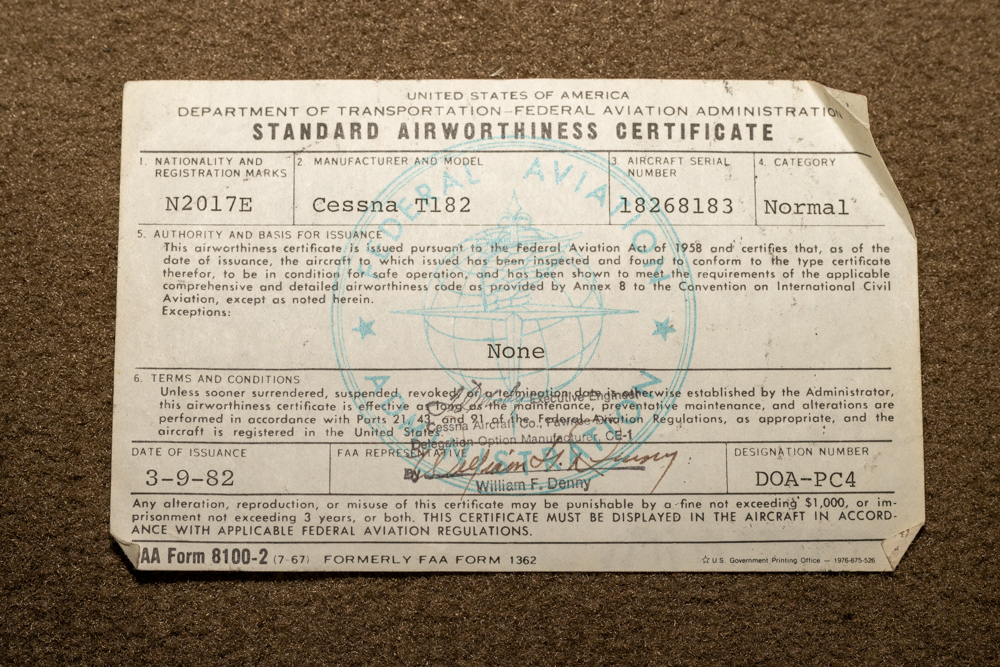

- Issued with the airframe when it was manufactured
- No expiration date: Good as long as the aircraft is maintained in an airworthy condition
- Required per [91.203(a)](<https://www.ecfr.gov/current/title-14/part-91/section-91.203#p-91.203(a)(1)>)

---

## R - Registration Certificate

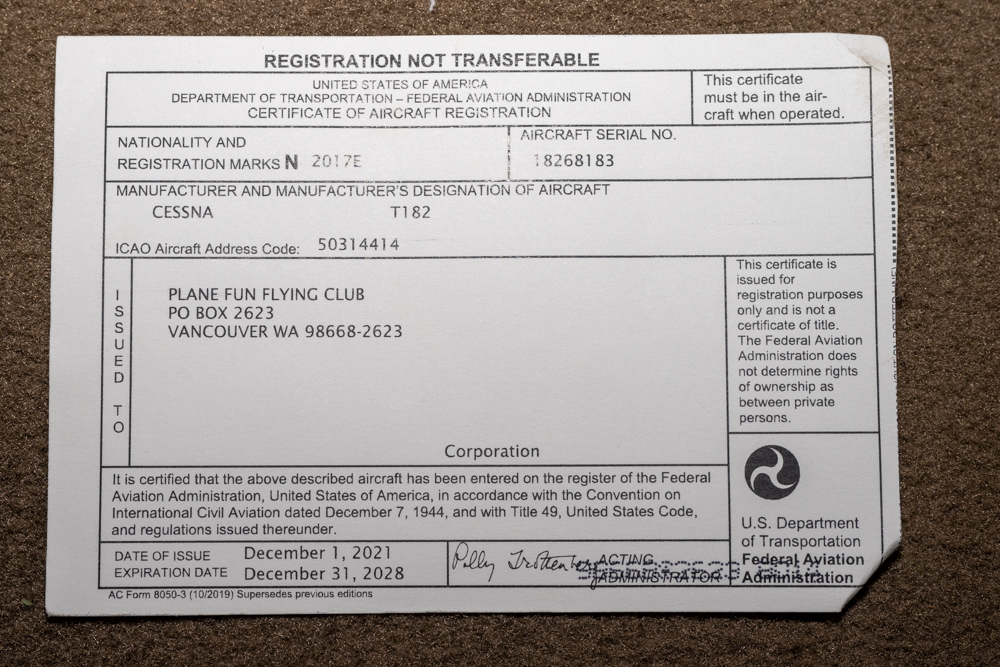

- Federal aircraft registration for a given N-number
- Good for 3 years from issuance ([47.31](https://www.ecfr.gov/current/title-14/section-47.31))
- Required per [91.203(a)](<https://www.ecfr.gov/current/title-14/part-91/section-91.203#p-91.203(a)(2)>)

---

## R - State Registration Certificate

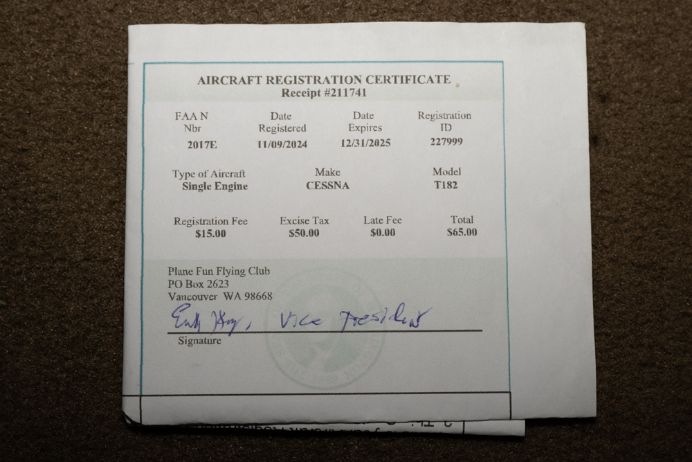

- Some states require their own registration certificate
- Varies between states

---

## R - Radio Station License - FCC

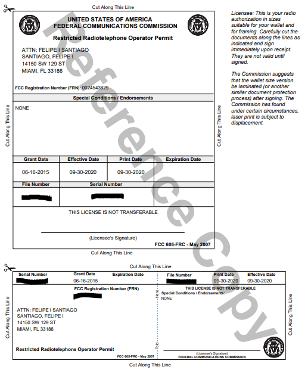

- Required for flights outside the U.S.
- [87.18](https://www.ecfr.gov/current/title-47/section-87.18)

---

## O - Operating Limitations / Approved Flight Manual

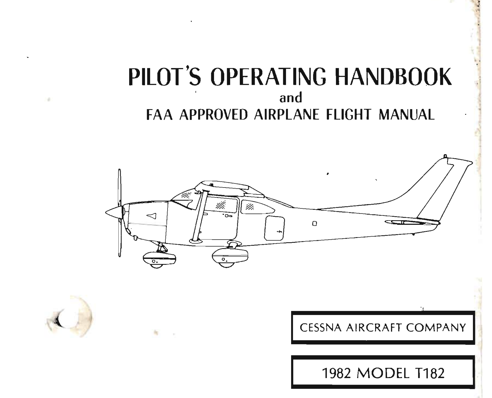

- Aircraft produced since 1979 should have an approved flight manual (AFM)
- These are standardized into common chapters (general, limitation, performance)
- Limitation are in conjunction with placards in the aircraft
- Standardized by [21.5](https://www.ecfr.gov/current/title-14/section-21.5)

---

## W - Weight and Balance

- Current weight and balance information including:
  - Latest empty weight
  - Latest empty moment
  - Latest empty CG location (inches aft of datum)

---

## S - Serial Number and External Data Plate

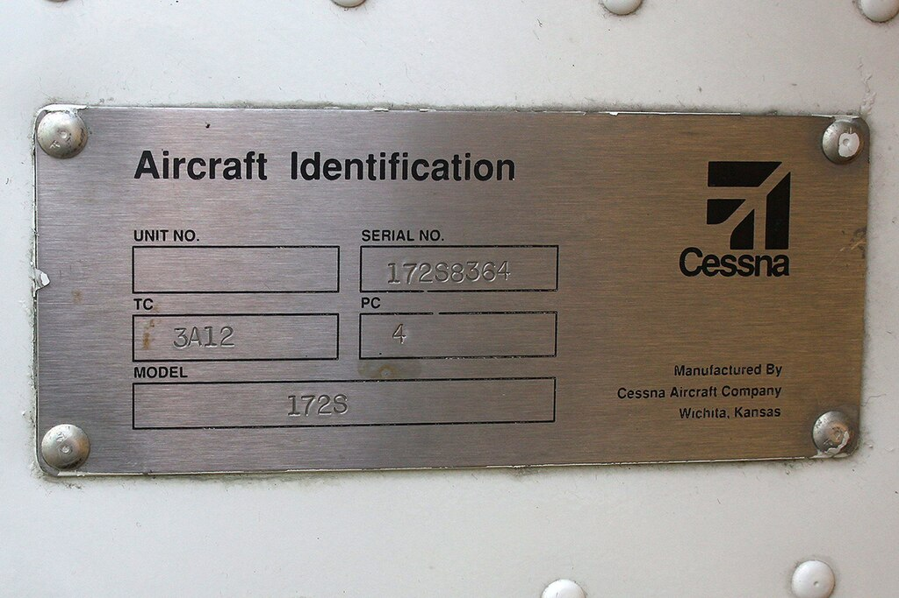

- Required per [45.11(a)](<https://www.ecfr.gov/current/title-14/part-45/section-45.11#p-45.11(a)>)

---

## Airworthiness Checklist

1. **A**nnual inspection
2. **V**OR test
3. **1**00-hour inspection
4. **A**ltimeter/pitot-static inspection
5. **T**ransponder inspection
6. **E**LT
7. **D**irectives - Airworthiness directives and life-limited parts

---

## A - Annual Inspection - Every 12 months

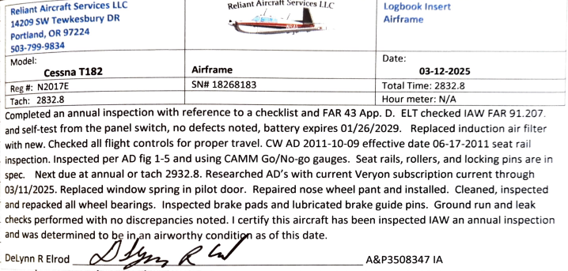

- Required per [91.409](https://www.ecfr.gov/current/title-14/section-91.409)
- Check of the aircraft systems by an authorized mechanic
- Details of work in [Part 43 Appendix D](<https://www.ecfr.gov/current/title-14/part-43/appendix-Appendix D to Part 43>)
- Airframe, propeller, and engine have separate annuals (usually done at the same time)

---

## V - VOR test - Every 30 days (IFR flight only)

- [91.171](https://www.ecfr.gov/current/title-14/section-91.171)
- Only required for IFR flight
- Check of the accuracy of the VOR receiver
- Can be done by a pilot

---

## 1 - 100-hour inspection (Compensation/hire only)

- [91.409(b)](<https://www.ecfr.gov/current/title-14/part-91/section-91.409#p-91.409(b)>)
- Required for airplanes flying for hire, or for flight instruction if the instructor is providing the aircraft
- Can be exceeded by 10 hours, to relocate to a location where the inspection can be done
- Good for 24 months, to the end of the month
- Tachometer time (not Hobbs time)
- Same inspection as annual, details in [Part 43 Appendix D](<https://www.ecfr.gov/current/title-14/part-43/appendix-Appendix D to Part 43>)

---

## A - Altimeter/Pitot-Static - 24 months (IFR flight only)

- Required per [91.411](https://www.ecfr.gov/current/title-14/section-91.411)
- Ensure the accuracy of the altimeter, airspeed indictor, VSI
- Only needed for IFR flight

---

## T - Transponder - 24 months

- Required per [91.413](https://www.ecfr.gov/current/title-14/section-91.413)
- Tests the operation of the transponder radio
- Often done concurrently with the pitot-static test

---

## E - ELT - 12 months

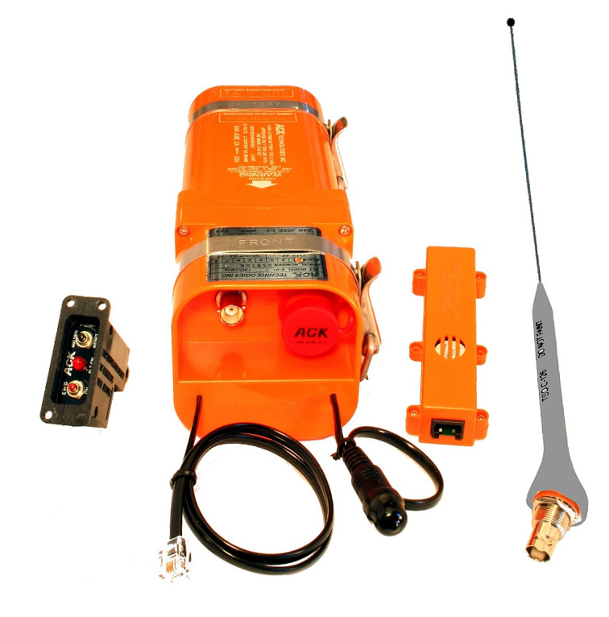

- Required per [91.207](https://www.ecfr.gov/current/title-14/section-91.207)
- Inspection of the ELT, including
  - Installation
  - Battery corrosion
  - Operation of the crash sensor
  - Signal from the antenna

---

## E - ELT - Battery Requirements

The battery for an ELT must be replaced (or recharged) after:

- 1 hour of cumulative use
- When 50% of its useful life has been consumed
  - Batteries are rated for a certain lifespan (2-year battery, etc.)
- This is separate from the ELT test

---

## D - Airworthiness Directives

- Airworthiness directives are legally-required mandates made by the FAA to correct an unsafe condition in a product
- Used to correct deficiencies after an airplane has been certified
- Can require a one-time fix or inspection
- May require a recurring inspection
- Two types:
  - Emergency issue: Addressing a urgent, safety-of-flight issue
    - Example: 737 MAX groundings
  - Normal issue: Less urgent, usually requires compliance within a specified period

---

## Example A.D.

---

## D - Life-Limited Parts

- Parts that have a fixed lifetime and must be replaced at some interval in the life of an aircraft
- Life-limited parts may be required per the original type certificate or an AD
  - Listed in the type certificate data sheet
- Examples: Helicopter rotor blades, turbine fan blades
- Less common on light airplanes

---

## Service Bulletins (S.B.'s)

- Service bulletins are issued by the manufacturer
- Describe recommended inspections or maintenance
- Not regulatory
- Some SB's are labelled as "Mandatory Service Bulletins", which usually affect flight safety
- A.D.'s often start as service bulletins

---

## Time Between Overhauls (TBO)

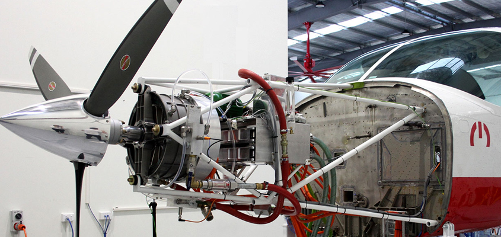

- Aircraft engines have recommended hours between engine overhauls
- An engine overhaul usually requires a replacement or rebuild
- TBOs for reciprocating engines are around 1,200 to 2,000 hours
- Specific aircraft will list the time since major overhaul (SMOH)
- Not required for Part 91 operators

---

## Airworthiness Checklist Review

1. **A**nnual inspection - 12 month
2. **V**OR test - 30 days
3. **1**00-hour inspection - 100 hours
4. **A**ltimeter/pitot-static inspection - 24 months
5. **T**ransponder inspection - 24 months
6. **E**LT - 12 months, plus battery requirements
7. **D**irectives - ADs/Life-limited parts - As needed

---

## Aircraft Logbooks

- Often broken down into separate logbooks for airframe, propeller, engine, and sometimes avionics
- A&P: Airframe and powerplant mechanic
- I.A.: Inspection authorization, an A&P allowed to sign-off annuals

---

## Required Equipment

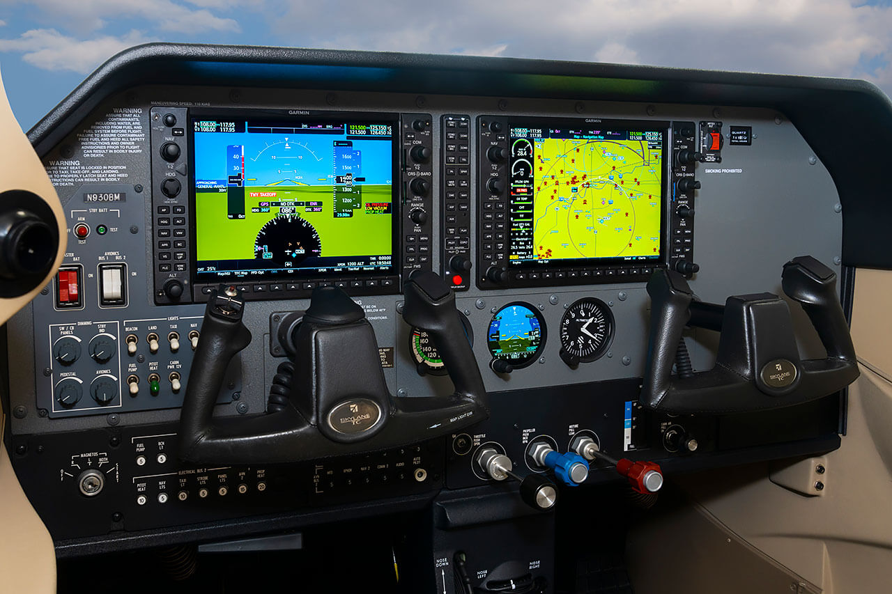

- What equipment is required to be in the airplane?
- What do we do if we find equipment that's inoperative?

---

## Required Equipment - Day VFR

[91.205(b)](<https://www.ecfr.gov/current/title-14/part-91/section-91.205#p-91.205(b)>) - ATOMATOFLAMES

- **A**ltimeter
- **T**achometer
- **O**il pressure gauge
- **M**anifold pressure gauge
  - For each altitude engine (turbocharged)
- **A**irspeed indicator
- **T**emperature gauge
  - For each liquid-cooled engine
- **O**il temperature gauge

- **F**uel gauge for each tank
- **L**anding gear position indicator
- **A**nti-collision lights
- **M**agnetic compass
- **E**LT
- **S**eat belts with shoulder restraint system

---

## Required Equipment - Night VFR

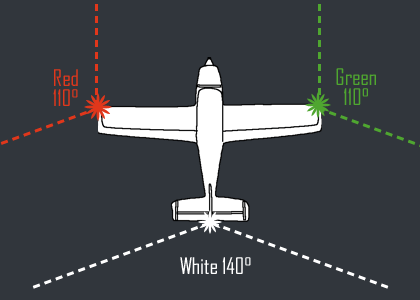

- All the day VFR required equipment (ATOMATOFLAMES), plus
- [91.205(c)](<https://www.ecfr.gov/current/title-14/part-91/section-91.205#p-91.205(b)>) - FLAPS
  - **F**uses
  - **L**anding light - if the aircraft is operated for hire
  - **A**nti-collision lights - beacon or strobes
  - **P**osition lights / nav lights - red and green
  - **S**ource of power

---

## Inoperative Equipment

- Under 14 CFR, all installed equipment must be operational prior to a flight
- If a piece of equipment is not operational we can:
  - Fix the piece of equipment
  - Defer maintenance of the item, for some items

---

## Equipment We Have to Fix ([91.213(d)(2)](<https://www.ecfr.gov/current/title-14/part-91/section-91.213#p-91.213(d)(2)>))

- Those required for specific operations by Part 91, including:
  - Day VFR equipment 91.205(b) - ATOMATOFLAMES
  - Night VFR equipment 91.205(c) - FLAPS
- Those required per the Kinds of Operations Equipment List (KOEL), if present
- Those required by an AD to be operative

---

## Kinds of Operation Equipment List

- Define what is required for the kind of operation being performed
  - Day
  - Night
  - IFR
  - VFR

---

## Deferral of Maintenance ([91.213(d)(3)](<https://www.ecfr.gov/current/title-14/part-91/section-91.213#p-91.213(d)(3)>))

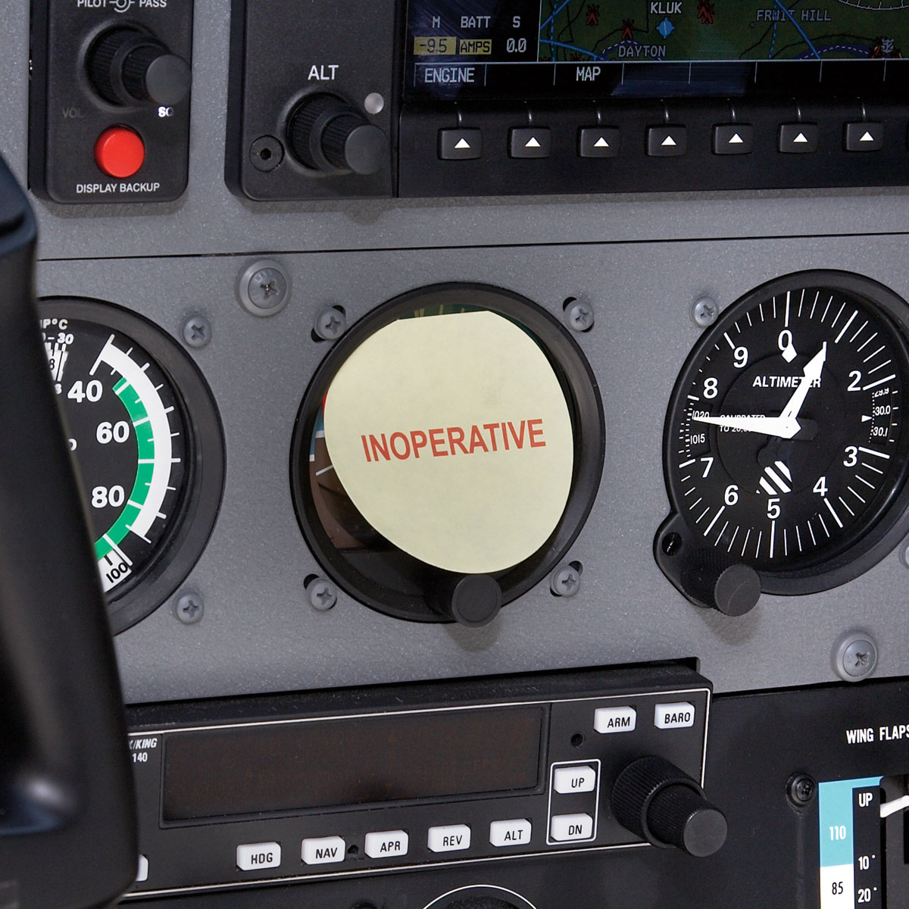

If we deem the system is not required, we can:

- Remove it, or deactivated
- Placard it as inoperative

If the deactivation requires a mechanic, then it will need to be done by a mechanic and logged appropriately.

Note: Removal of equipment may change the W&B of the airplane.

---

## Minimum Equipment List

If our aircraft has a minimum equipment list, refer to the list

- Gives specific instruction on what can be inoperative
- Inoperative equipment must be dealt with per the MEL (can't use the previous process)
- Master MELs (MMELs) are publish by the manufacturer
  - Operators can then create their own MEL for a specific aircraft

---

## Non-MEL Aircraft Flow Chart

---

## Special Flight Permits

- What happens if we need to move the airplane to make repairs while it's not airworthy?
- A Special Flight Permit allows for a specific flight
- Can requested from the local Flight Standards District Office (FSDO)
- May require an A&P to determine the safety of flight
- Reasons for a permit:
  - To fly to base where repairs, alterations, or maintenance can be done
  - Delivering or exporting an aircraft
  - Evacuating an aircraft from an area of impending danger
  - Allow an overweight aircraft to fly beyond its normal range over water

---

## Preventative Maintenance

- As a private pilot, you are permitted to do some maintenance tasks on your airplane
- Permitted tasks are listed in [Part 43 Appendix A](<https://www.ecfr.gov/current/title-14/appendix-Appendix%20A%20to%20Part%2043#p-Appendix-A-to-Part-43(c)>)
  - Remove, install, and repair landing gear tires
  - Service landing gear wheel bearings
  - Replenish hydraulic fluid
  - Replace safety belt
  - Replace bulbs, reflectors, and lenses of lights
  - Replace or clean spark plugs
  - Replace and service batteries
  - Replace hose connections, except hydraulic connection

---

## Logging of Preventative Maintenance

Pilots who perform preventive maintenance must make an entry in the maintenance record:

Include the following information:

1. A description of the work, such as “changed oil (Shell Aero-50) at 2,345 hours”
   - Should be logged "in accordance with" a maintenance document
2. The date of completion of the work performed
3. The pilot’s name, signature, certificate number, and type of certificate held

---

## Summary

- Airworthiness certificate - Valid as long as the aircraft is airworthy
- ARROW documents - Documents the airplane needs to legally fly
- AV1ATED checklist - Required inspections
- Aircraft logbooks - Where we record maintenance performed
- 91.205, required VFR equipment
- Aircraft equipment lists
  - Kind of Equipment List (KOEL)
  - Minimum Equipment List (MEL), 91.213
- Special flight permits - used to get to a shop
- Preventative Maintenance - stuff we can do ourselves

---

## Knowledge Check

You find an airplane with fuel gauge inoperative. Can you fly it?

What if we need to fly the airplane to another airport to get it fixed?

---

## Knowledge Check

Can a private pilot do an oil change?

What about a student pilot?

---

## Knowledge Check

Does a flight school's 172's need a 100-hour inspection?

What about a flying club?

---

## Knowledge Check

Do you need a landing light to fly for flight instruction?
