

# Visual Scanning and Collision Avoidance

---

### Objective / Motivation

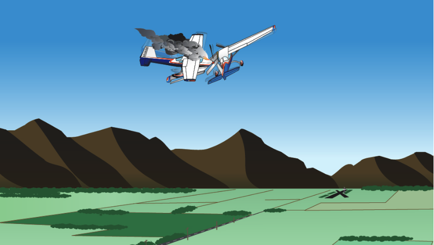

We want a _systematic_ approach to visual scanning and collision avoidance.

"See-and-avoid" is the primary method by which VFR pilots will maintain separation from other aircraft, so we want effective habits when scanning for other aircraft.

---

## Overview

- Vision system and its limitations
- "See and avoid"
- Scanning techniques
- Collision-course aircraft
- Clearing procedures
- Aircraft blind spots
- Situations with the greatest collision risk
- TIS-B and ADS-B
- Tools for collision avoidance

---

## Vision System

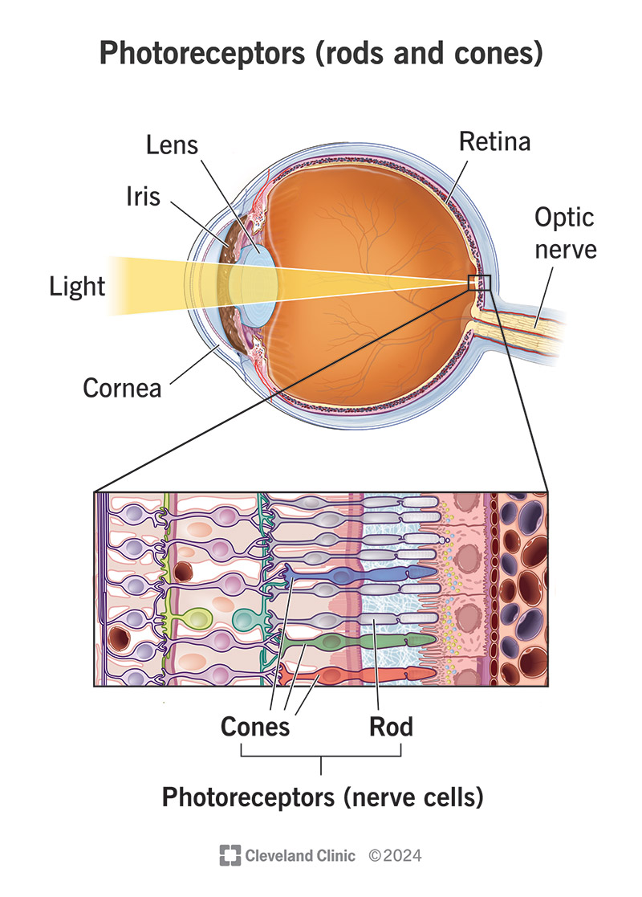

Visual receptors in our eyes:

- Cones: Very acute, color, detail, daytime
- Rods: Very sensitive, gray, peripheral, day and night
  - Become deficient with even mild hypoxia

---

## Vision Types

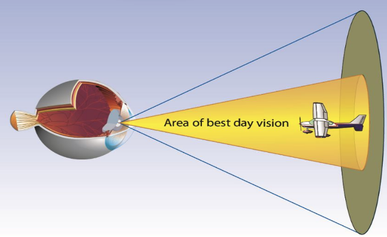

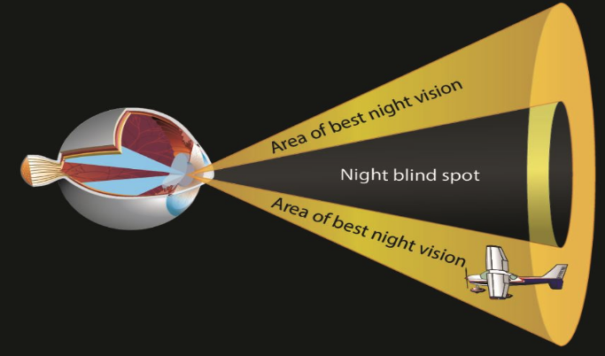

Vision types:

- Photopic vision: Primary central vision - cones
- Mesopic vision: Fading light vision - mix of cones and rods
- Scotopic vision: Dark conditions - rods

---

## Vision System Health

- Good eyesight depends on good health
  - Fatigue, illness, smoking, drugs, alcohol, oxygen deprivation, diet
- Dark adaptation
  - Allow for 30 minutes for eyes to adjust
  - Avoid bright lights
  - Impaired by cabin altitude above 5,000' - Oxygen use recommended at night

---

## Environmental Factors Affecting Vision

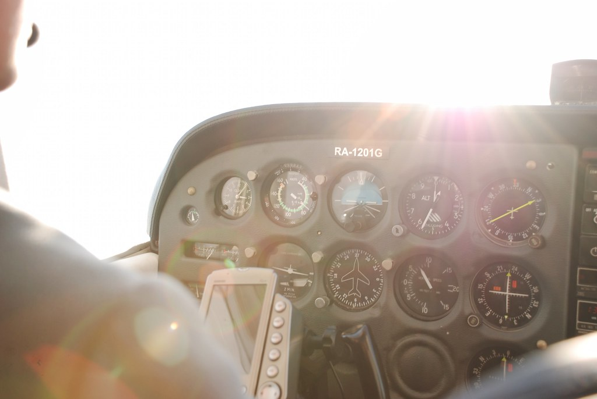

- Atmospheric conditions: Fog, haze, clouds
- Glare: Reflection off water or the aircraft
- Lighting: Sun angle
- Windshield deterioration and distortion
- Aircraft design
- Cabin temperature
- Oxygen supply (particularly at night)

---

## Limitations of the Human Eye

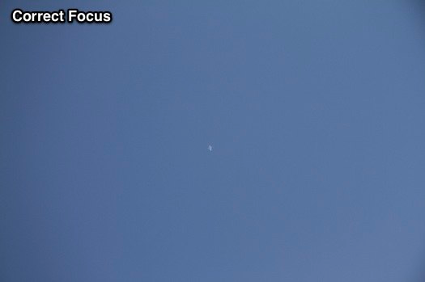

- Accommodation and Refocusing
  - It can take 1-2 seconds for you eye to refocus
- Empty-Field Myopia
  - Eyes tend to not focus when there is nothing to focus on
  - Common on hazy days
- Narrow Field of Vision/Tunnel Vision
  - Our eye can only focus in a narrow center range
  - Particular dangerous when focused on a task
- Binocular Vision
  - Something seen by one eye but not the other
  - Move your head and your eyes

---

## See and Avoid

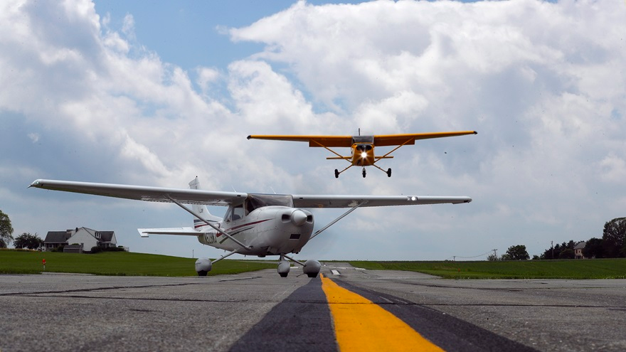

- "See and avoid" is the main method in which we maintain separation from other aircraft, terrain, and obstacles
- This applies to all aircraft: big and small, slow and fast, VFR or IFR

---

## Scanning Technique

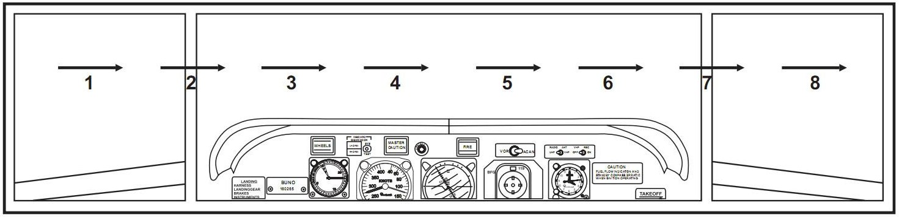

- Pilot should shift glances and refocus at intervals
- Each movement should not exceed **10&deg;** and should last for **1 second**
- Spend 3/4 of of the time with eyes outside the aircraft

---

## Collision-Course Aircraft (The Blossom Effect)

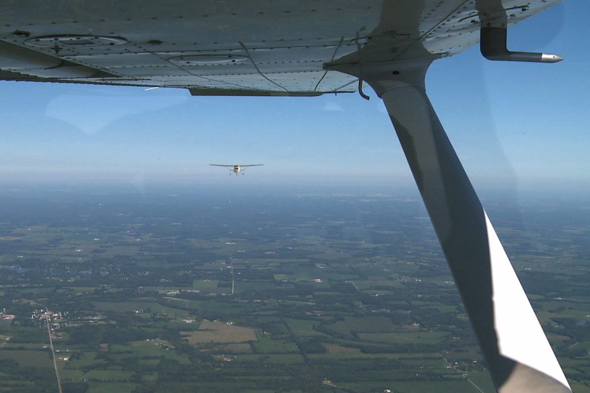

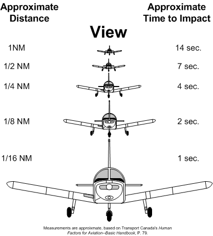

- An aircraft on a collision course will appear stationary in the wind screen
- Object will appear approximately on the horizon

---

## Reaction Time

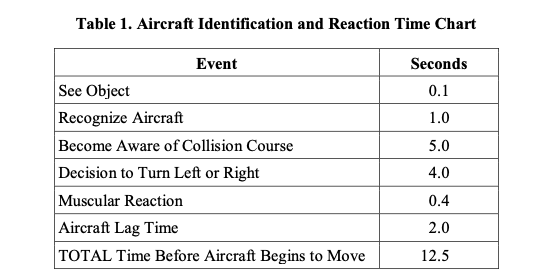

- Take action early!
- Even if you're unsure about the collision risk

---

## Closure Rate

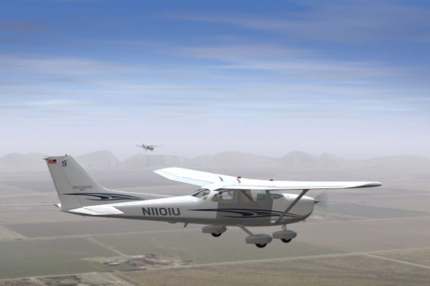

- Aircraft above the horizon: Probably above you
- Aircraft below the horizon: Probably below you
- Aircraft may not be pointed toward you
- The faster the aircraft the faster the closure rate
  - Why we have bigger weather minimums at higher altitudes

---

## Wind and Closure Rate

Aircraft may not be pointed at each other if on a collision course, due to wind correction angle

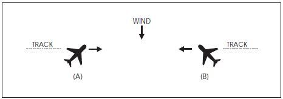

---

## Clearing Procedures for Maneuvers

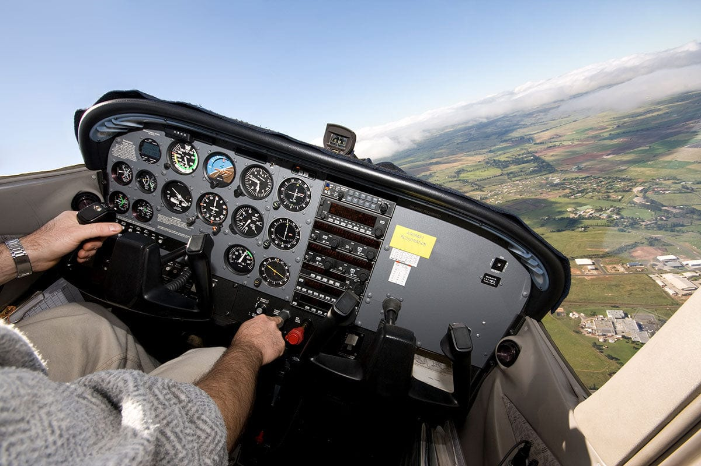

- Clear the area that the airplane is going to maneuver in
- Clearing turns help eliminate blind spots
- Verbalize where you're looking
- Back-up visual scanning with radio calls and ADS-B traffic data (if available)

[AIM 4-4-15](https://www.faa.gov/air_traffic/publications/atpubs/aim_html/chap4_section_4.html)

---

## Other Scenarios

- Taking a runway: Always check base, final, and the runway
- Climbs and descents: Gentle banks for continuous scanning
- Straight and level flight: Periodically perform clearing turns
- Traffic patterns: Avoid entering while descending
- VOR intersections: Be extra vigilant for other traffic

---

## Preferred Mid-Field Traffic Pattern Entry

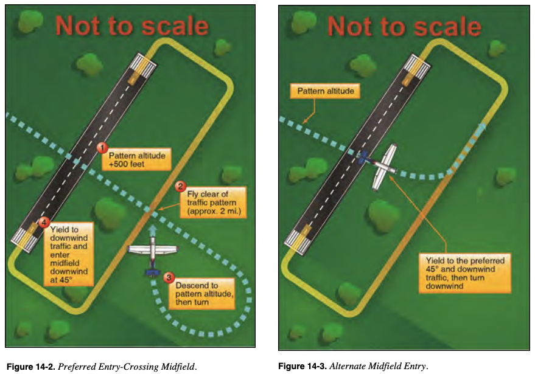

---

## Blind Spots

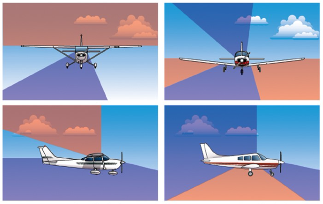

- High wing airplanes tend to have large spots above the wing
  - A clearing turn should raise the wing
- Low wing airplanes tend to have blind spots below the wing
  - A clearing turn should lower the wing

---

## Situations with the Greatest Risk

The NTSB provides statistics on midair collisions:

- VFR, daylight, weekend
- Below 3,000' AGL at uncontrolled airports within 10nm, 8,000' AGL within 25nm
- Great weather
- All pilot skill levels
- Pleasure flight, no flight plan
- Within 5 miles of towered and 10 miles of non-tower airports
- Transitioning to/from the traffic pattern (crossing or overtaking maneuvers)
- Primarily in the traffic pattern

---

## TIS-B and ADS-B

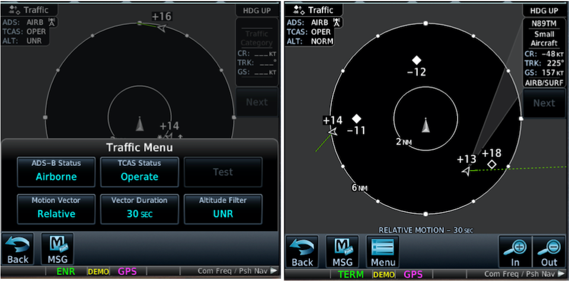

- Traffic Information Service - Broadcast
- Provided by ADS-B uplink
- Some systems provide traffic alerts
- Not all aircraft are equipped with ADS-B
- Traffic information may be old

---

## Operation Lights On

- Pilots are encouraged to turn on their landing lights during takeoff
- Keep your lights on when operating below 10,000  feet, day or night
- Especially within 10sm of an airport

[AIM 4-3-24](https://www.faa.gov/air_traffic/publications/atpubs/aim_html/chap4_section_3.html)

---

## Tools for Avoiding Collisions

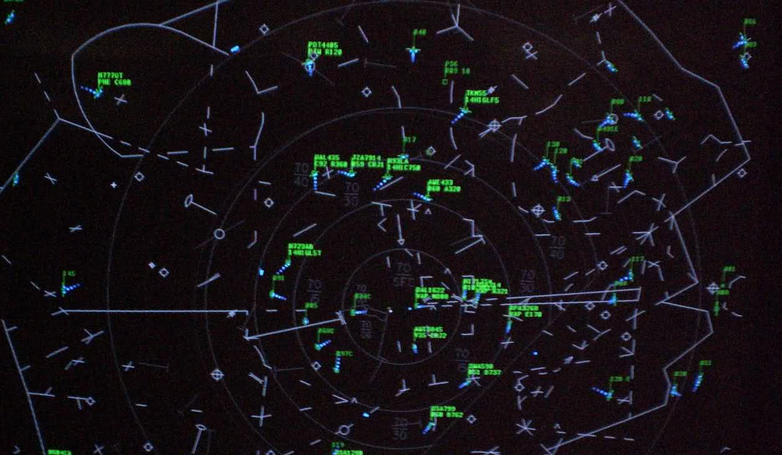

- Sunglasses - can be a necessity
- Sterile cockpits - minimize distractions in high-risk areas
- Have passengers look for traffic
- Right of way rules - 91.113
- Proper non-towered airport procedures - AIM
- TIS-B and traffic displays - Understand their limitations
- ATC and flight following - Traffic alerts from ATC

---

## Summary

- Vision system and its limitations: Night vision, peripheral vision
- "See and avoid": Everyone's responsibility
- Scanning techniques: Small chunks of sky at time
- Collision-course aircraft: Stationary in the windscreen
- Clearing procedures: Clearing turns
- Aircraft blind spots: High-wing vs low wing
- Situations with the greatest collision risk: Day VFR, uncontrolled airports
- TIS-B and ADS-B: Not a replacement for scanning
- Tools for collision avoidance

---

## Knowledge Check

Where should you look when pulling out onto a runway?

---

## Knowledge Check

You're all set to fly on a beautiful sunny day in a low-wing aircraft with a bubble canopy. You get to the airport and realize you've forgotten your sunglasses. What do you do?

---

## Knowledge Check

What are some reasons why an aircraft would not appear on a ADS-B In display?

---

## Knowledge Check

What is the preferred entry for crossing mid-field and entering the downwind?
