<style>
.h-stack {
  display: flex;
  column-gap: 1em;
  justify-content: center;
}

</style>

# Flight Planning

---

## Objective

Safely plan a VFR cross-country flight, use various types of navigation to get there, and use a navigation log to compute expected distances, times, and fuel requirements. Also use ForeFlight to plan a flight and interpret its output.

## Motivation

Flying to another airport requires additional planning and multiple forms of navigation. A pilot needs to understand the information needed to accurately plan a flight and have the skills to execute that flight plan.

---

## Overview

<div class="h-stack">

<div>

</div>

<div>

</div>

</div>

---

# Picking a Destination

---

## What airport do we want to go to?

- Someplace we want to go!
- How far can we make it in 1 hour of flying time?
- Airport
  - Elevation: Aircraft performance
  - Runway lengths, within our personal minimums?
  - Night flight: Lighting, VASI or PAPI?
- Services
  - Is there an FBO (Fixed-base operator)?
  - Self-serve fuel?
  - Crew cars?
- Weather

---

## Going to the Coast

<div class="h-stack">

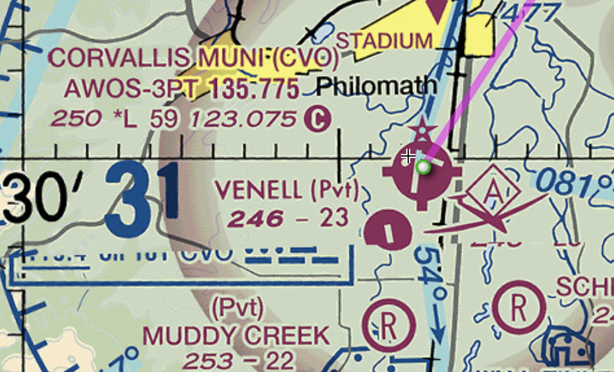

- We hear Corvallis has a good restaurant, where should we land?
- Considering KCVO
  - At least 5900' runway
  - Airport is lighted
  - Airport has a beacon
  - Airport has fuel
  - Has an AWOS - Automated weather
  - Fuel available - tick marks

</div>

---

## More Information: Chart Supplement

<div class="h-stack">

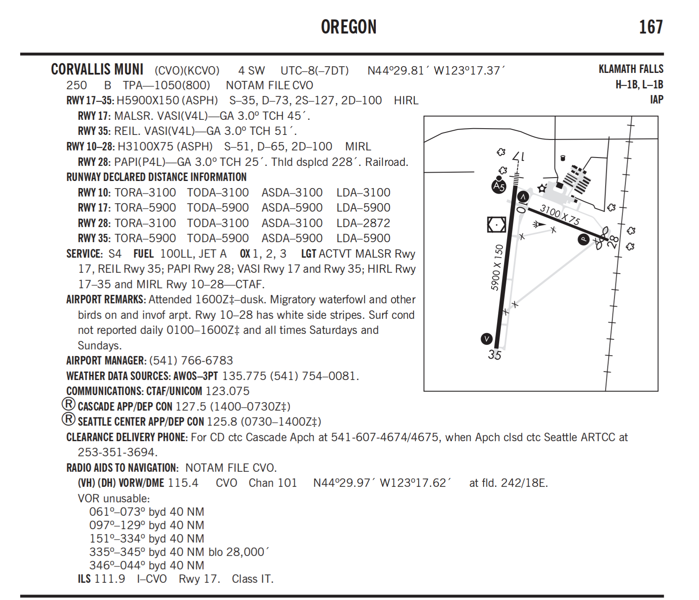

- 2 runways: 5900' and 3100'
- 4 mi SW of city of Corvallis
- 100LL available
- Has a VOR on the field

</div>

---

## More Information: Services

<div class="h-stack">

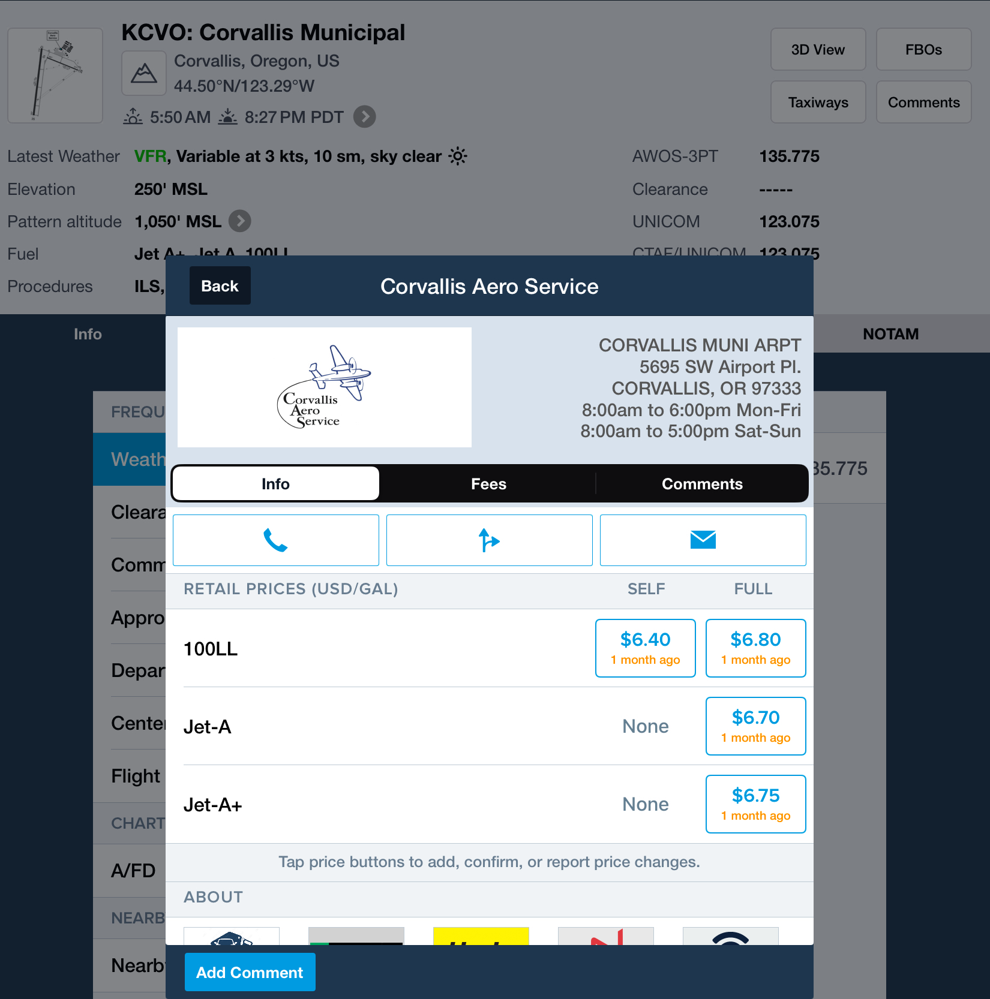

- FBO: Fixed-based operator
- Self-serve fuel
- Rental cars
- Attended 8-6pm M-F

</div>

---

# Routing to our Destination

---

## Direct Route

<div class="h-stack">


- What's the terrain like?
- Airspace:
  - B/C/D airspace
  - Restricted or prohibited areas
  - MOAs
- Where would we go in an emergency?
- Diversion options

</div>

---

## Terrain Shading

<div class="h-stack">

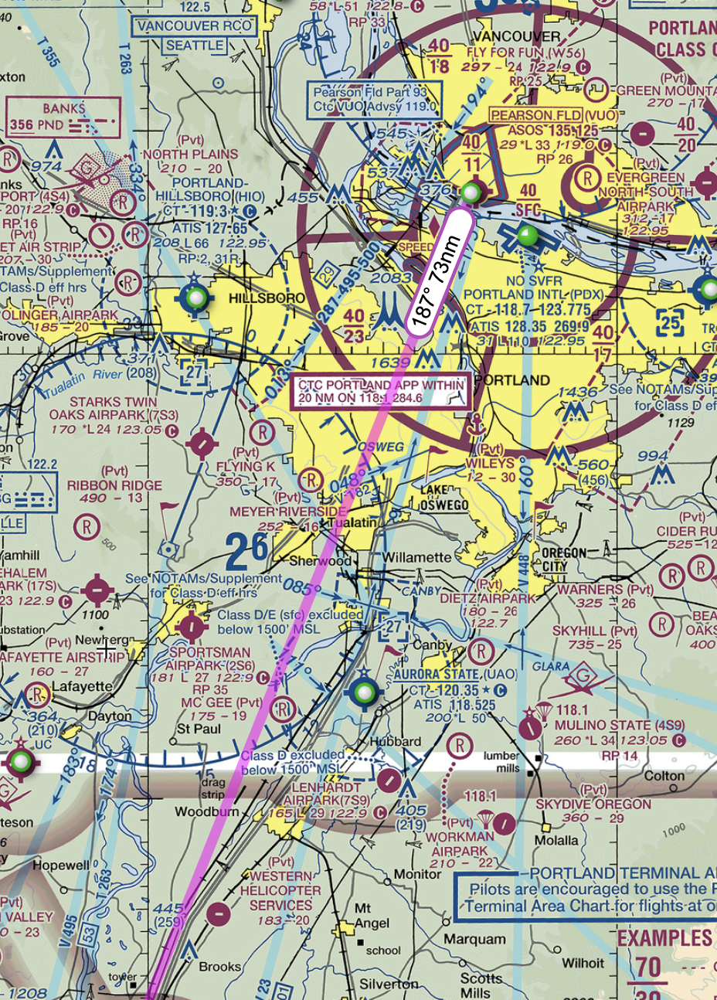

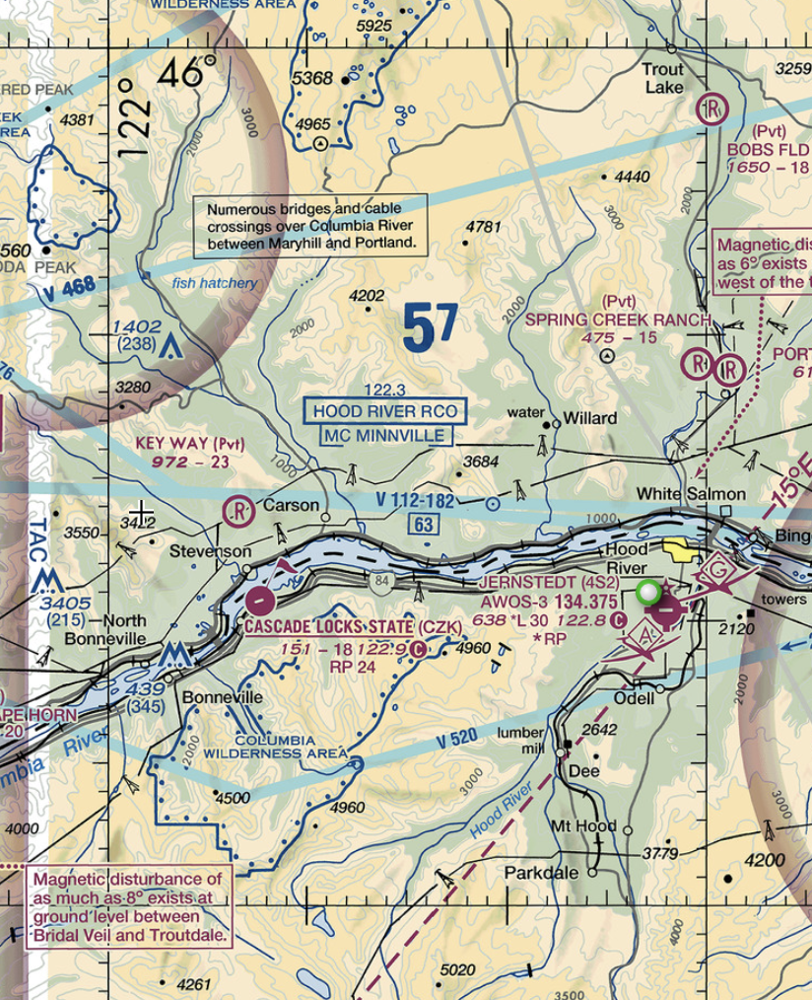

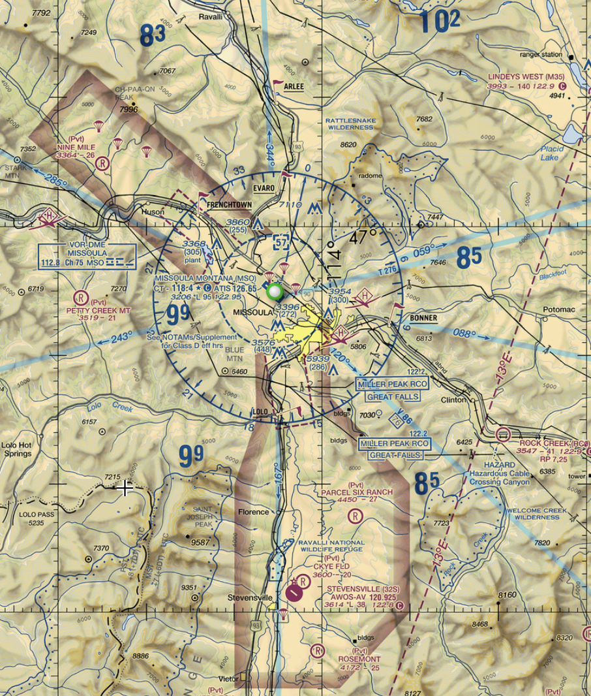

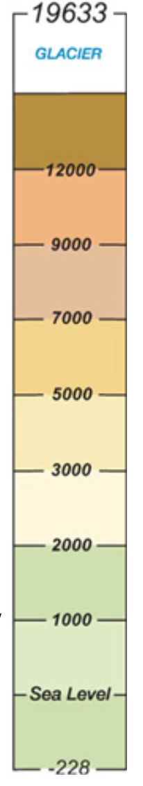

</div>

---

## Maximum Elevation Figures (MEF)

<div class="h-stack">

- Height of the highest terrain or obstacle in MSL
- +100 foot buffer
- Rounded up to near 100' level
- With a MEF of 6600, where would we want to cruise at?

</div>

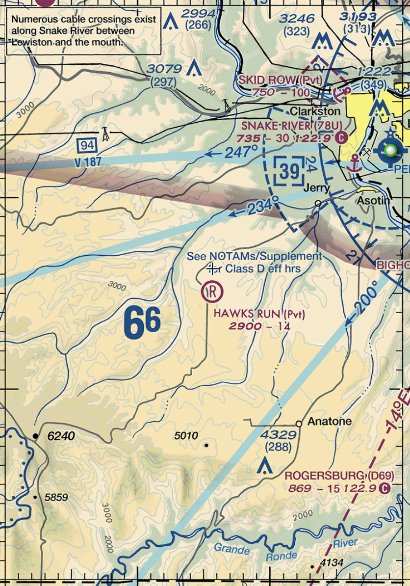

---

## Obstacles

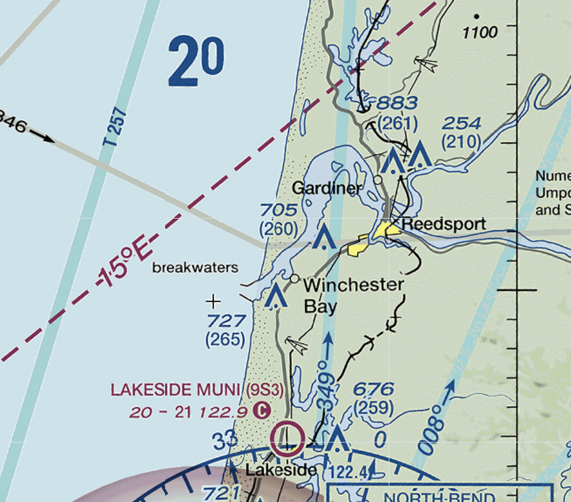

- Top number: MSL altitude
- Bottom number: AGL altitude
- Some are lighted

---

## Airspace

<div class="h-stack">

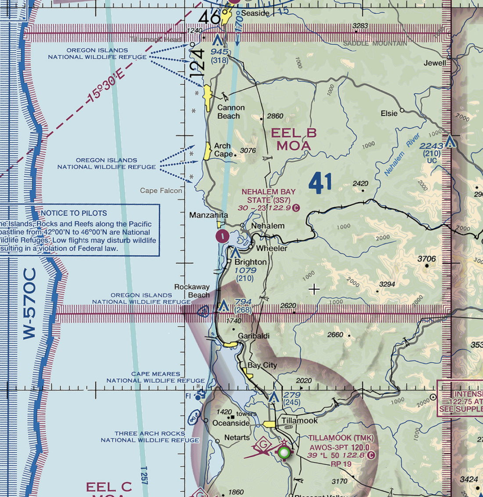

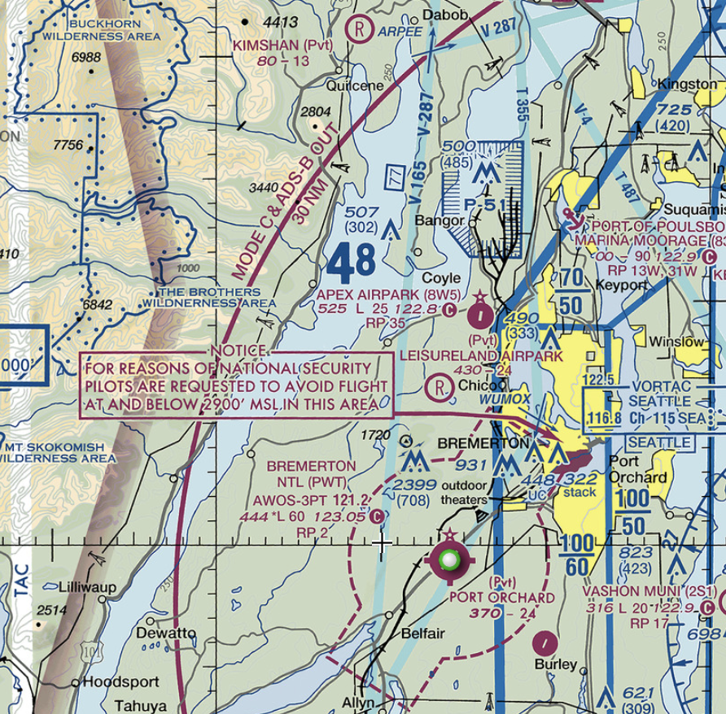

</div>

---

## Emergencies

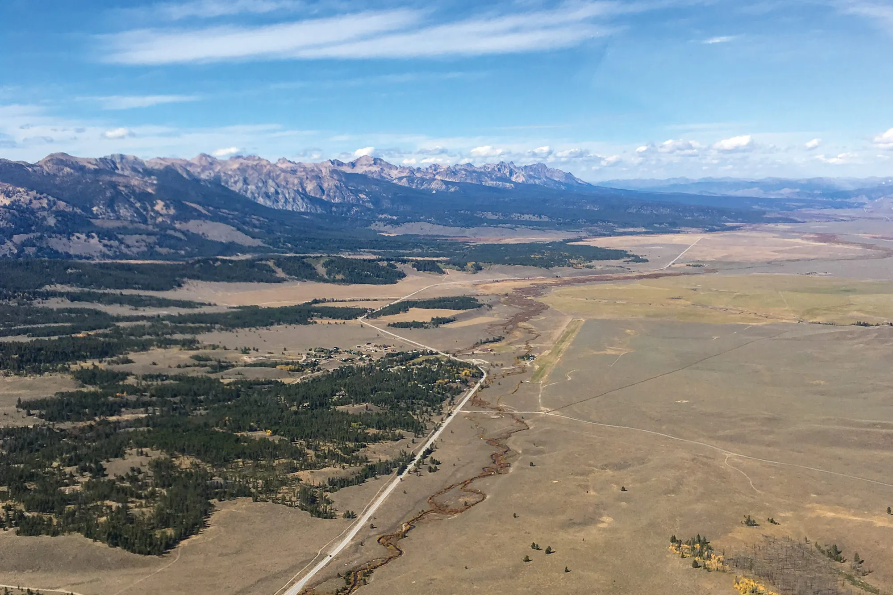

- Where would go if our engine quits?
  - Airports
  - Type of terrain
  - Roads
  - Civilization

---

### Our Corvallis Flight

Terrain?
Airspace?
Emergencies?


---


### Our Corvallis Flight

- Terrain
  - MEFs: 3,200, 4,700, 2,600
- Airspace
  - Class C transition over PDX (up to 4000')
  - Aurora Class D (2700')
  - Salem Class D (2700')
- Emergencies
  - Lots of valley fields
  - Several towns
  - I-5

---

## Picking Waypoints


- Use waypoints to route along a path that works best
- Picking good waypoints: Something you can see easily from the air
  - Rivers, lakes, mountains
  - Towns, roads
  - VFR waypoints
  - Airports: Can be great
    - Small grass strips can be hard to see
    - Difficult to see at night

---

## Corvallis Flight Waypoints

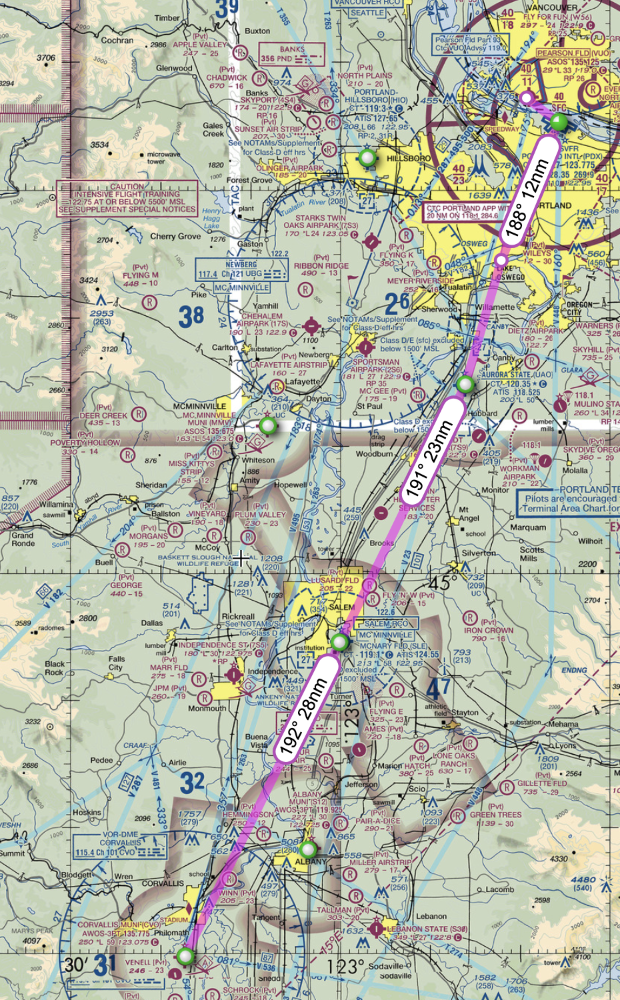

- KVUO
- KPDX
- Lake Oswego
- KUAO - Aurora
- KSLE - Salem
- KCVO

---

## VFR Cruising Altitudes (91.159)

<div class="h-stack">

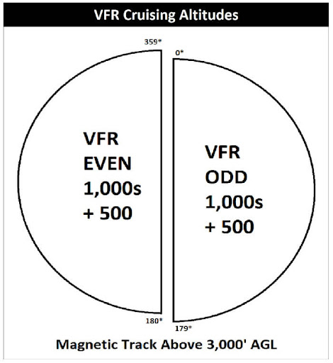

<div>

Above 3000' AGL, VFR traffic in level cruising flight shall fly:

- On **eastbound** headings (0 thru 179&deg; magnetic)
  - Odd thousands + 500'
  - E.g. 3500', 5500', 7500'
- On **westbound** headings (180 thru 359&deg; magnetic)
  - Even thousands + 500'
  - E.g. 4500', 6500', 8500'

</div>

</div>

---

## Cruising Altitudes


- Select based on:
  - Terrain
  - Performance
  - Emergency considerations
- Our Corvallis flight
  - Highest terrain 3000'
  - Class D up to 2700'
  - Let's pick **6500** ft

---

## Simple Altitude Planning - Climb

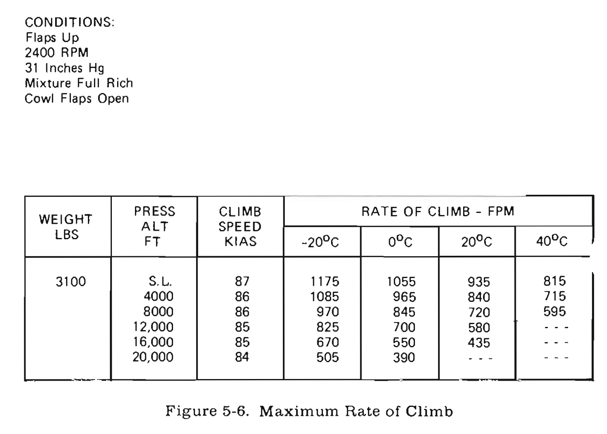

- Takeoff from Pearson
- Start climbing to our cruising altitude
  - Let's say 1000 ft/min. climb
  - Climb from S.L. to 6,500 ft.
  - **6.5 minutes**
- Cruise at 6,500'

---

## Simple Altitude Planning - Descent

- Takeoff from Pearson
- When do we want to descend?
  - Let's use 500 fpm down
  - Decent from 6,500 to KCVO pattern altitude (1250')
  - 6500 - 1500 = 5000'
  - **10 minutes** before arrival
    - Plus some extra to enter traffic pattern

---

## Final Plan


- KVUO
- KPDX
- Top-of-climb (TOC) - 6,500' MSL
- Lake Oswego
- KUAO - Aurora
- KSLE - Salem
- Top-of-decent (TOD)
- KCVO

---

## How are we going to get there?


- Pilotage: Look out the window
  - See our waypoints
  - (and everything in between)
- Dead reckoning:
  - Speed \* Time = Distance
- Radio navigation:
  - Newberg VOR
  - Corvallis VOR
- GPS

---

## Dead Reckoning

How much time will it take to take to fly from waypoint A to waypoint B?

Time = Distance / Speed

We need to know our speed over the ground (groundspeed)

---

## Dead Reckoning - Ground Speed

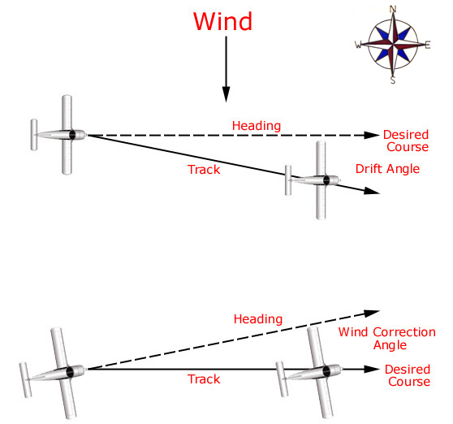

How do we find our speed over the ground?

1. Start with our expected airspeed from performance
2. Account for atmospheric conditions (pressure, temperature)
3. Use forecasted winds to account for wind drift

---

## Dead Reckoning - Wind Correction


What heading do we need to fly to get to waypoint B?

- We need to turn to correct for the direction the wind is blowing us
- We call this the **wind correction angle**
- It depends on wind speed and wind direction

---

## Navigation Log

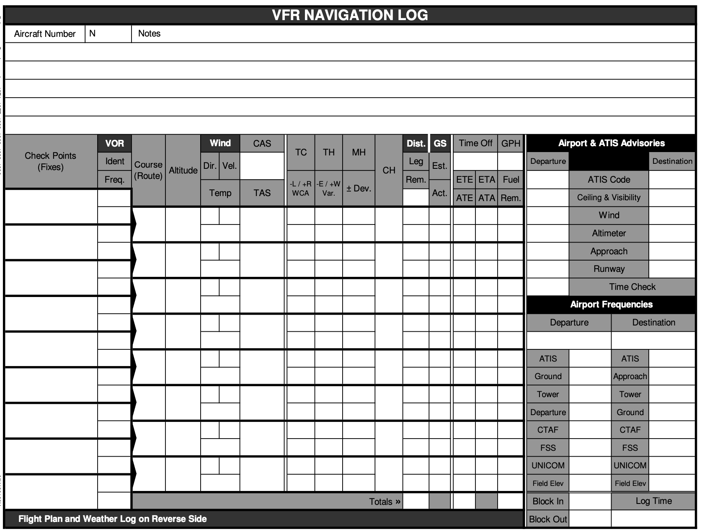

- Fill out left to right
- Includes preplanned fields
  - Start with distance and true course
  - Compute heading to fly
  - Compute time
  - Compute fuel burn

---

## Navlog - Step 1: Enter our Waypoints

<div class="h-stack">

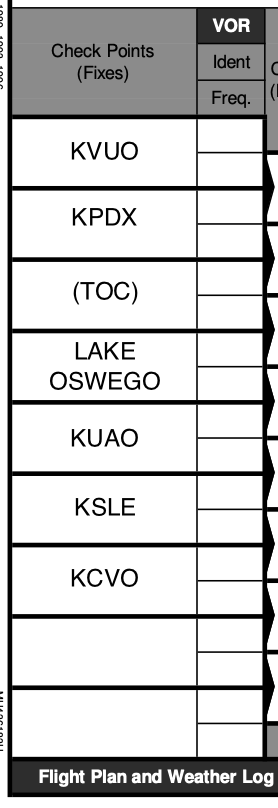

- List our fixes
- We list our top-of-climb (TOC) after PDX

</div>

---

## Navlog - Step 2: Determine true courses


- Use a plotter
- Use SkyVector.com

---

## Navlog - Step 2: Determine true courses

<div class="h-stack">

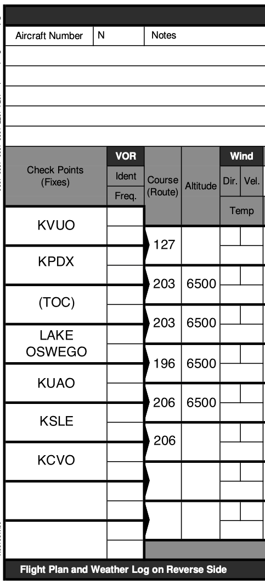

- True course for each leg
- Note (TOC) leg has same course as next leg
- Also added our altitudes

</div>

---

## Navlog - Step 3: Determine distances


- Use a plotter and a paper chart
- Use an SkyVector.com

---

## Navlog - Step 4: Compute Climb

<div class="h-stack">

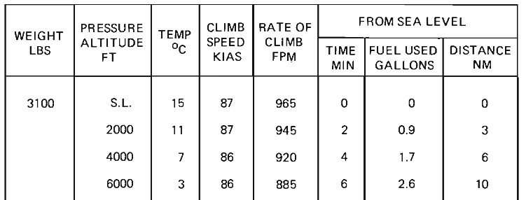

- From S.L. to 6000'
  - Time = 6 - 0 = 6 minutes
  - 10 - 0 = 10nm
  - 6 / 60 = 0.1 hours
  - 10nm / 0.1 hours = **100 knots** groundspeed (no wind)
- Use this as our TAS for the climb

</div>

---

## Navlog - Step 4: Compute Climb

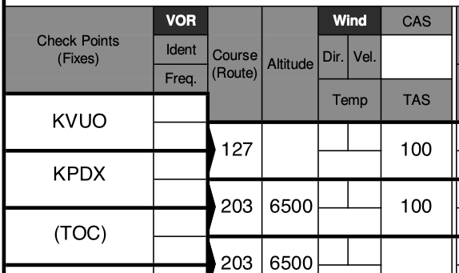

---

## Navlog - Step 4: Determine Cruise, Winds

```
(Extracted from FBUS31 KWNO 101358)
FD1US1
DATA BASED ON 101200Z
VALID 101800Z   FOR USE 1400-2100Z. TEMPS NEG ABV 24000

FT  3000    6000    9000   12000   18000   24000  30000  34000  39000
PDX 2306 2318+05 2229+00 2242-06 2164-17 2177-28 218843 218852 228861
```

- Climb: 230&deg; true @ 6 knots
- Cruise: 6000 ft: 230&deg; true @ 18 knots, 5&deg; C

---

## ForeFlight Winds

<div class="h-stack">


- We can also get winds over an airport using ForeFlight
- Uses weather model to predict winds

</div>

---

## Navlog - Step 4: Determine Cruise, Airspeed

<div class="h-stack">

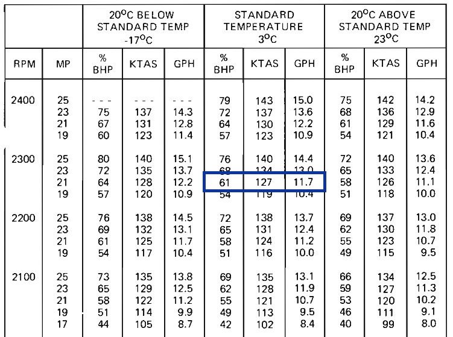

<div>

Pressure altitude, 6000' chart

- Use standard temperature (3&deg; vs 5&deg; C)
- 61% BHP
- 127 knots true airspeed (TAS)
- 11.7 gph fuel burn, with proper leaning

</div>

</div>

---

## Airspeed Calibration

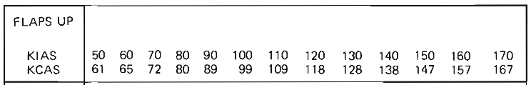

- 127 knots indicated airspeed (IAS)
- ~125 knots calibrated airspeed (CAS)

---

## Navlog - Step 4: Determine Cruise, Airspeed

<div class="h-stack">


</div>

---

## Navlog - Step 4: Determine Cruise, Add Winds

<div class="h-stack">

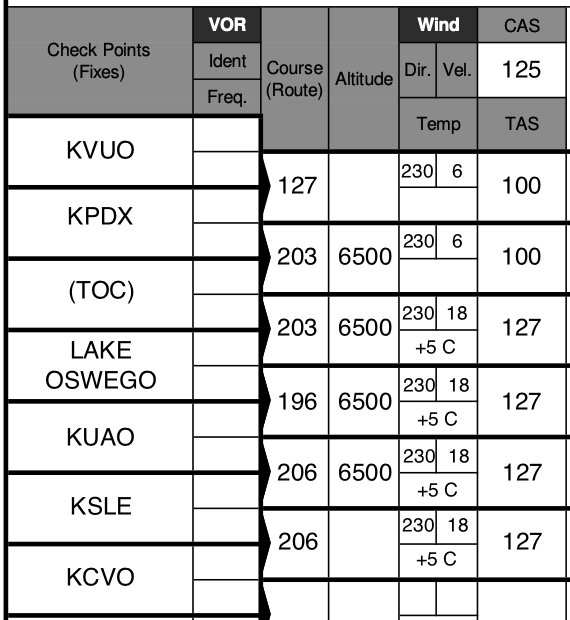

</div>

---

## Navlog - Step 5: Course and Headings

- We need to convert the true course we got from the chart into a heading we can follow in the airplane
- We need to correct for
  - Wind
  - Magnetic variation (magnetic vs true heading)
  - Compass deviation (interference with our airplane's compass)

---

## Navlog - Step 5: Course and Headings

1. Compute true heading (TH) = True course (TC) + wind correction angle (WCA)
2. Compute magnetic heading (MH) = True heading + magnetic variation
3. Compute compass heading (CH) = Magnetic heading (MH) + compass deviation

---

## Navlog - Step 5: Course and Headings, True Heading

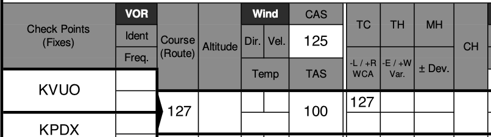

<div>

Using an E6B, compute heading/groundspeed:

- Climb leg winds (3000'): 230&deg; true @ 6 knots
- Course: 127 &deg; True
- True airspeed: 100 knots

Result: Heading **130 &deg; True**, Wind correction angle (WCA): **+3&deg;**, Groundspeed: **101 knots**

</div>

---

## Navlog - Step 5: Course and Headings, True Heading

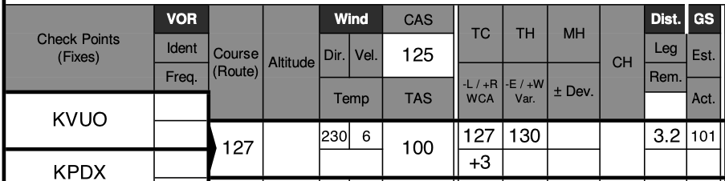

Result: Heading **130 &deg; True**, Wind correction angle (WCA): **+3&deg;**, Groundspeed: **101 knots**

---

## Navlog - Step 5: Course and Headings, Magnetic Heading

<div class="h-stack">

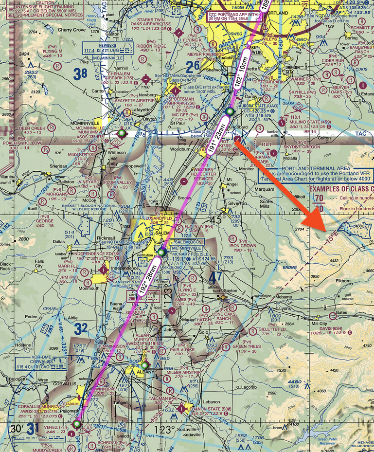

- On the section find an "isogonic line"
- "East is least"
  - Subtract easterly variation
  - Add westerly variation
- We have 15&deg; E, so we'll subtract 15&deg;

</div>

---

## Navlog - Step 5: Course and Headings, Magnetic Heading

<div class="h-stack">

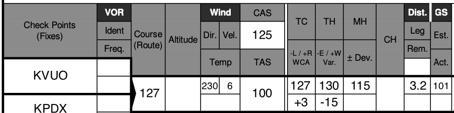

</div>

---

## Navlog - Step 5: Course and Headings, Compass Heading

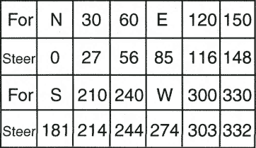

- Compasses installed in airplanes are subject to magnetic interference due to
  - Skin and surface of the aircraft
  - Electrical components in the airplane
- This error is called **compass deviation**
  - A compass deviation card will be in your airplane
  - This card shows corrections for this error

---

## Navlog - Step 5: Course and Headings, Compass Heading

<div class="h-stack">


- For our magnetic heading of 115&deg;
  - Use the 120&deg;. Error is -1&deg;
- 115&deg; - 4 = 111 &deg; Magnetic
- This is our **compass heading**

</div>

---

## Navlog - Step 5: Course and Headings, EFIS Heading

<div class="h-stack">

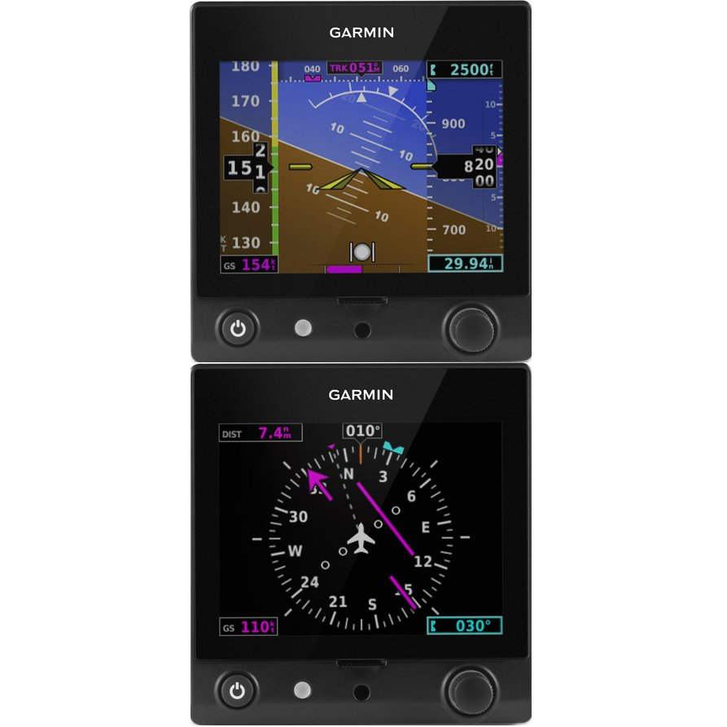

<div>

Note that an airplane with an EFIS (like the Garmin G5), are calibrated for deviation error during installation

- We will fly **magnetic heading** when navigating with the G5
- We will fly with **compass heading** when navigating with our magnetic compass

</div>

</div>

---

## Navlog - Step 5: Course and Headings, Compass Heading

<div class="h-stack">

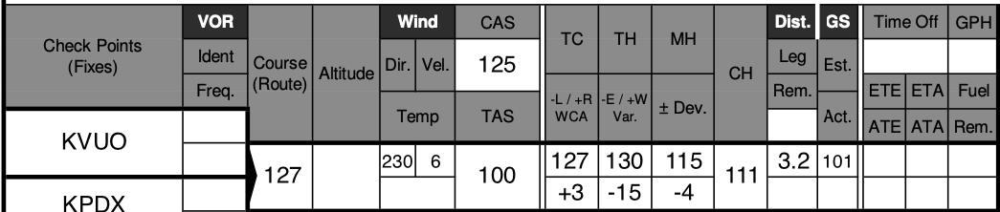

</div>

---

## Navlog - Step 6: ETE and Fuel

Now that we know our groundspeed we can compute:
- Estimated time enroute (ETE): Time between waypoints
- Estimate fuel burn 


---

## Flight Planning with ForeFlight


---

# Summary

---

## Knowledge Check

Descent planning

---

## Knowledge Check

120 knots grounds speed and you have 50nm. How long will it take you get there?

---

How do you convert calibrated airspeed into indicated airspeed?
