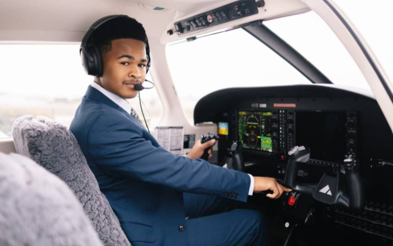
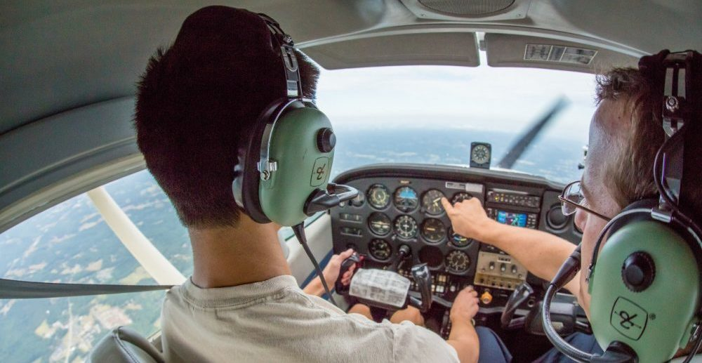
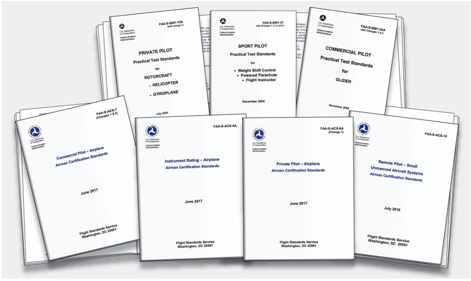
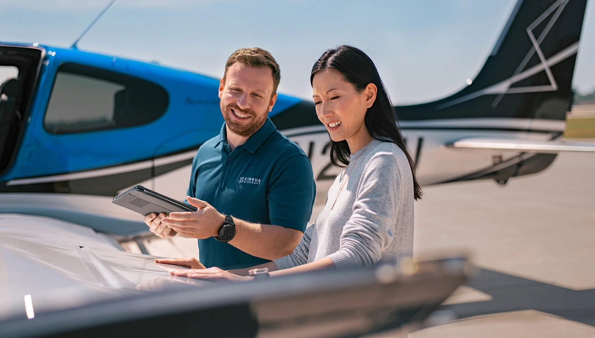
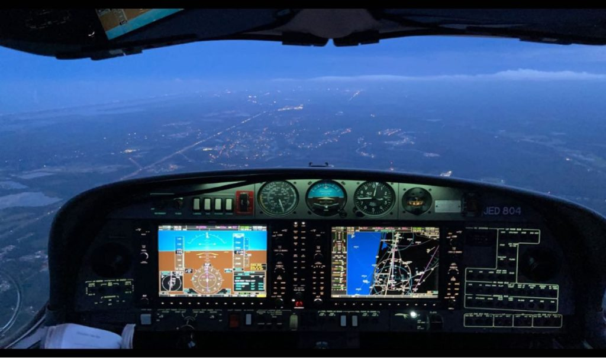

### Fundamentals of Instruction

# Effective Teaching in a Professional Environment

---

## Overview

- Aviation Instructor Responsibilities
- Flight Instructor Responsibilities
- Flight Instructor Qualifications & Professionalism
- Exhibiting Professionalism
- Professional Development
- Instructor Ethics & Conduct
- Fulfilling Instructor Responsibilities

---

## Motivation

Since learners look to aviation instructors as role models, it is important that instructors not only know how to teach, but that they project a knowledgeable and professional image.

## Objective

Understand the importance of projecting a professional image, promoting aviation safety, and acting ethically.

---

## Aviation Instructor Responsibilities

Aviation instructors have a broad set of responsibilities, including:

- Helping learners
- Providing adequate instruction
- Training to established standards of performance
- Emphasizing the positive
- Minimizing learner frustrations

---

## Helping Learners

- Make each lesson a pleasurable experience
- Learners should be challenged and interested
- Understand the learners constraints, worries, and motivations
  - Structure training around those things
- Don't give unfair criticism

---

## Providing Adequate Instruction

- Instruction should be tailored to each learner's personality, thinking, and abilities
- Instruction may need to be:
  - Slower / faster
  - More hands-on / More theoretical
- Some learners may be more quiet and reserved, some more talkative
- Split complex tasks into simpler component tasks

---

## Training to Standards

- Teach to the required standards in the PTS/ACS
- Use the standard as a guide throughout the training to determine objectives
  - Avoid "teaching to the test", however
- Remember: PTS is a testing document, not a teaching document

---

## Emphasizing the Positive

- Conduct yourself with a positive attitude
- Use the fun of flying a tool to motivate students
  - Expose the students to new flying experiences
- Negative self-concept and fear are major barriers to learning

---

## Minimizing Learner Frustrations

- Motivate learners
- Keep learners informed
- Approach learners as individuals
- Give credit when due
- Criticize constructively
- Be consistent
- Admit your own errors
- Maintain a light-hearted tone

---

## Flight Instructor Responsibilities

- Evaluate learner piloting abilities
- Provide pilot supervision
- Make practical test recommendations
- Give endorsements and additional training
- Ensure pilot proficiency
- Maintain see-and-avoid responsibility
- Guide pre-solo flight thought process
- Emphasize special items in the PTS

---

## Flight Instructor Qualifications & Professionalism

- Be very familiar with aircraft and its systems
- Showcase expertise in flying and theory
- Stay current with training techniques and certification requirements
  - Subscribe to publications to get notified of changes
  - Be extra alert for changes to regulations and training standards

---

## Exhibiting Professionalism

- Be sincere
- Accept the learner as they are
- Maintain appropriate personal appearance
- Maintain a professional demeanor
- Use proper language

---

## Professional Development

- Continuously update skills and knowledge
- Avoid complacency
- Seek new ways to improve effectiveness
  - Seek additional training or ratings
  - Opportunities for new experiences

---

## Instructor Ethics & Conduct

**Instructor Code of Ethics:**

1. Make safety the number one priority
2. Develop and exercise good judgment in decisions
3. Recognize and manage risk effectively
4. Be accountable for actions
5. Act with responsibility and courtesy
6. Adhere to prudent operating practices and personal parameters
7. Follow applicable laws and regulations

---

## Fulfilling Instructor Responsibilities

- Continuously evaluate learner ability based on established standards
- Keep learners informed of their progress
  - Use a syllabus and share it with your student
  - Use and continuously update a rubric, also shared with your student
  - Be honest with your students abilities and limitations

---

## Summary

- Aviation Instructor Responsibilities - Help students, use standard, emphasize positive
- Flight Instructor Responsibilities
- Flight Instructor Qualifications & Professionalism - Maintain professional appearance and demeanor
- Professional Development - Continue learning and growing
- Instructor Ethics & Conduct - Safety #1 priority
- Fulfilling Instructor Responsibilities - Continuously evaluate your students
