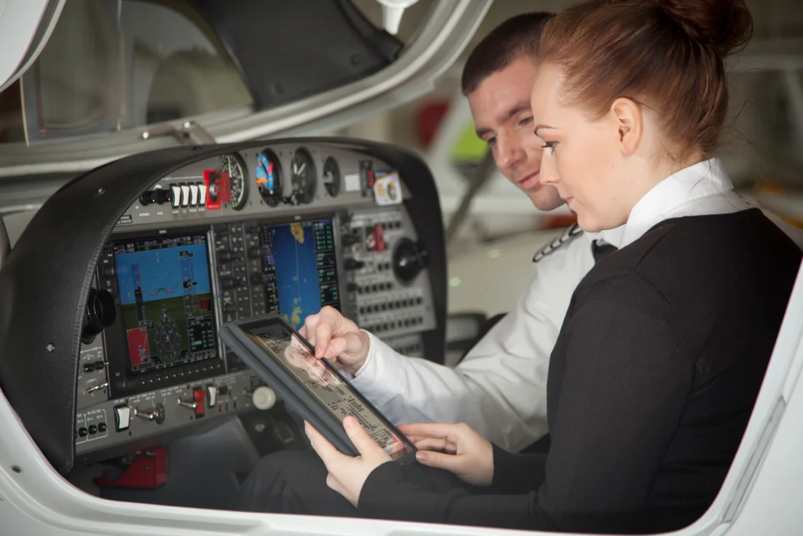
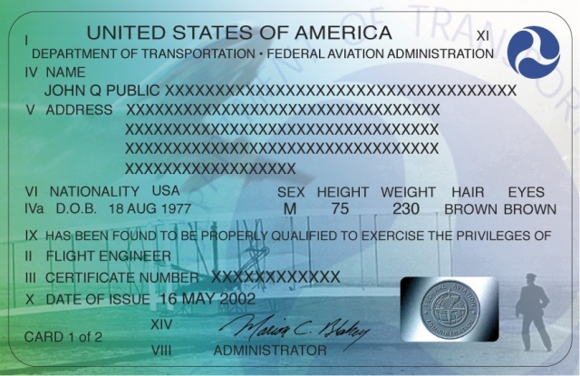
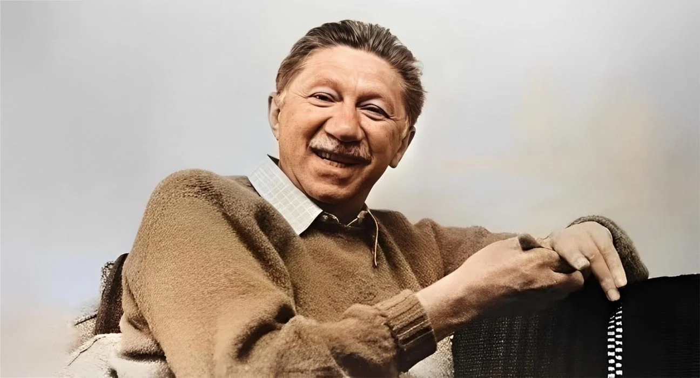
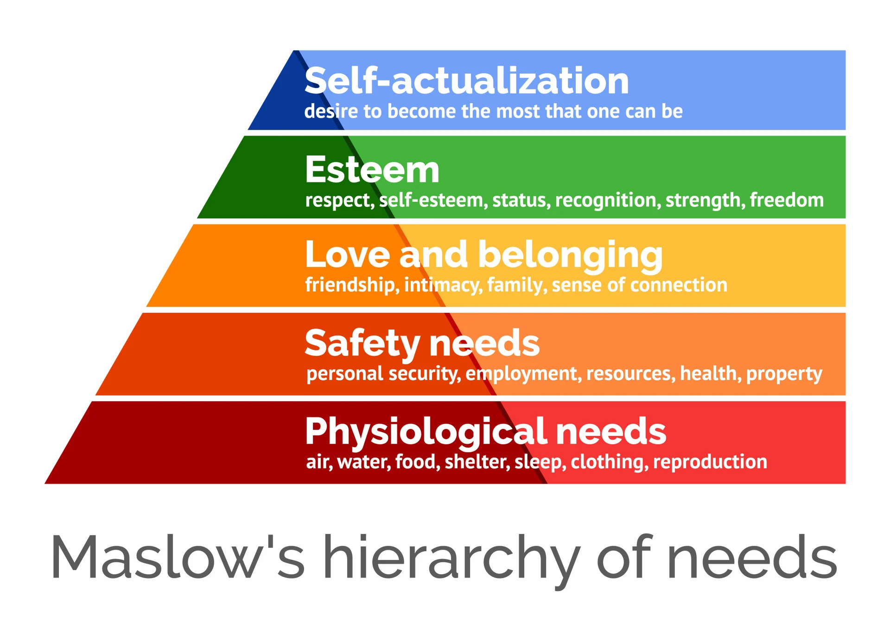
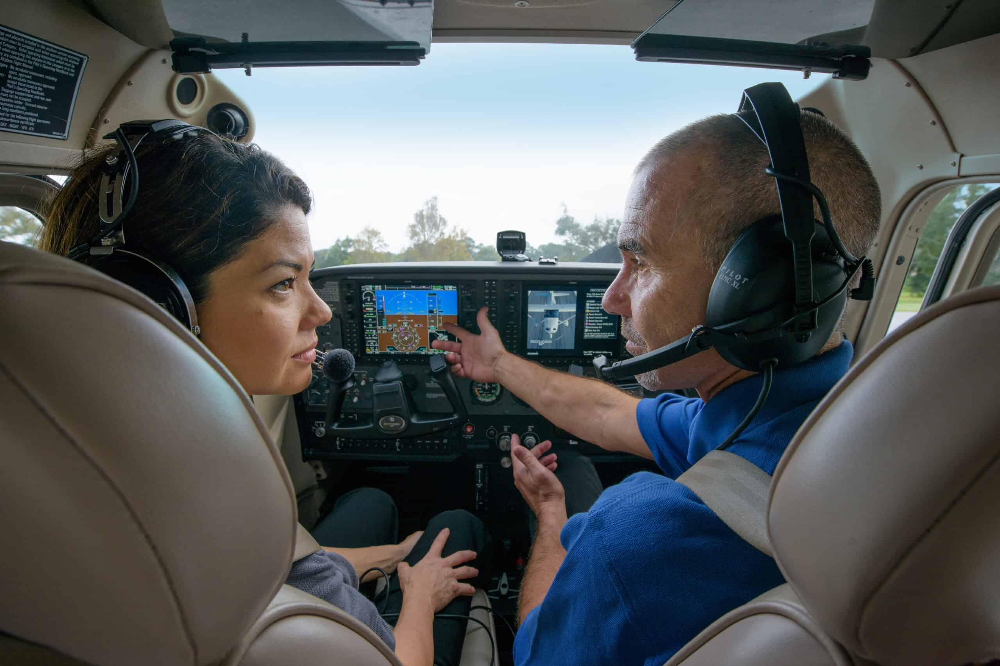
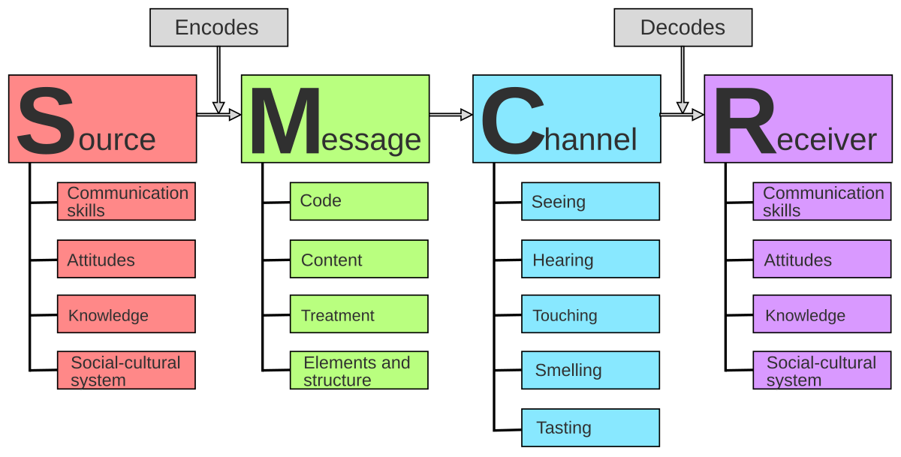
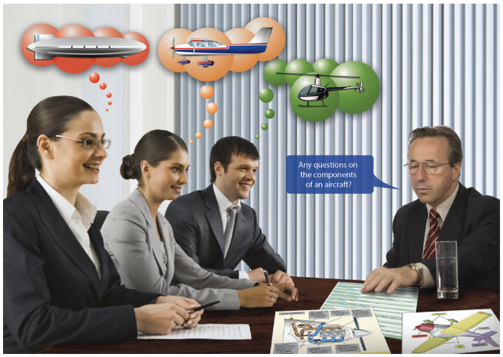

### Fundamentals of Instruction

# Human Behavior & Communication

---

## Objective

Understand human behavior and effective communication skills and how it applies to flight instruction.

## Motivation

The tendencies and habits of human behavior have a significant impact on the effectiveness of flight and ground instruction.

---

## Overview

- Definitions of Human Behavior
- Instructor and Learner Relationship
- Motivation
- Maslow’s Hierarchy of Needs
- Defense Mechanisms
- Learner Emotional Reactions
- Adult Learners
- Recognizing and Accommodating Human Behavior
- Effective Communication
  - Barriers to Effective Communication
  - Developing Communication Skills

---

## Definitions of Human Behavior

- Why do humans function the way that they do
- Encompasses actions, thoughts, and feelings
- Influenced by environment, experience, and individual differences
  - Teens are going to act much differently than adults

---

## Instructor and Learner Relationship

- Instructors set the tone for learning
- You will teach all sorts of people with different personalities.
- Be aware of how your teaching style is compatible (or incompatible) with a students learning style
  - Example: A detail-oriented engineer with a young pilot who just wants to fly

---

## Motivation

Motivations can be positive or negative:

- Negative motivation can be the result of fear.
- Positive motivation is provided by the promise or achievement of rewards like financial gain, satisfaction of the self-concept, personal gain, or public recognition
- _Positive_ motivation is essential to true learning.

---

## Maintaining Motivation

- Give praise during incremental successes in training
- "Challenge" the student to continue getting better
- Training plateaus are to be expected
- Emphasize what you can do with aviation
- Play down the negatives when appropriate
- Monitor your student motivation and adjust accordingly

---

## Human Needs

Abraham Maslow studied human needs and motivation, discovering that certain needs take precedent over others.

Learners tend to show little to no motivation or attention if most of their needs are not met:

- If a student is hungry, they will focus on that instead of a lesson.
- If a student feels unsafe, they will be distracted by a flight response.

---

## Maslow’s Hierarchy of Needs:

1. Physiological: Food, water
2. Security: Feel safe
3. Belonging: Feel accepted
4. Esteem: Positive self-image
5. Cognitive: Mentally engaged
6. Self-actualization: Realizing potential

---

## Defense Mechanisms

Sigmund Freud hypothesized that humans utilize mental defenses to protect oneself from anxiety, unpleasant emotions.

- They are often unconsciousness and somehow distort reality
- They provide a temporary refuge from the uncomfortable anxiety

---

## Defense Mechanisms

- **Repression**: Placing uncomfortable thoughts in an inaccessible area of the mind
- **Denial**: Refusal to accept external reality because it is too threatening
- **Compensation**: Emphasizing strengths in one area to distract from or disguise a weakness in another
- **Projection**: Projecting the blame of a personal failing onto someone else
- **Rationalization**: Justifying poor performance on external factors outside of their control
- **Fantasy**: Daydreams about how thing should be in the future, ignoring current reality
- **Displacement**: Redirecting anger or frustration to someone or something else

---

## Dealing with Defense Mechanisms

- The main objective should be to restore motivation and self-confidence
- Add a purely fun flight to the schedule to restore positivity
- Understand if their are other stressors in their life causing the defensive behavior
- Refer to professional help, if needed

---

## Learner Emotional Reactions

- Anxiety and stress
- Impatience
- Worry or lack of interest
- Physical discomfort, illness, fatigue, and dehydration
- Apathy due to inadequate instruction

---

## Anxiety and Stress

- Anxiety is a normal emotion for new pilot learners
- Can be minimized by making the experience pleasurable and introducing topics with care
- Example: Performing stalls with a limited drop of the nose

---

### Reactions to Stress

- Stress will cause a fight or flight response in the body.
- **Normal reactions to stress:**
  - Normal individuals respond rapidly and exactly.
  - They will utilize their training and experience.
- **Abnormal reactions to stress:**
  - Inappropriate response to actions, like over-elation.
  - Extreme over-cooperation.
  - Painstaking self-control.
  - Big changes in mood from lesson-to-lesson.
  - Severe anger towards an instructor.

---

## Impatience

- Can be a large deterrent to student success
- Often learns only seek the objective, not the training steps taken to get there
- Remedies
  - Train one step at a time
  - Train at a pace appropriate for the learner, not too fast/too slow
  - Ensure the student understands their progress through the syllabus

---

## Worry or Lack of Interest

- Learners who are worried or emotionally upset are not ready to learn
- Use the learner's enthusiasm and interests to get them engaged, and divert attention from worries and troubles
- If you suspect motivation is waning, check-in with the student

---

## Physical Discomfort, Illness, Fatigue, and Dehydration

- Any physical discomfort greatly affects the ability of a student to learn
- The first signs of dehydration is fatigue
  - Always carry an ample supply of water, and drink frequently
- End a flight as soon as air sickness symptoms are experience

---

### Fatigue

- Fatigue can be acute (short-term) or chronic (long-term)
- Acute fatigue accumulates as mental effort is utilized
  - Only continue lessons if the learner is alert and performing at an expected level
- Acute fatigue can be indicated by:
  - Inattention
  - Distractibility
  - Errors in timing
  - Lack of awareness
  - Irritability
- Chronic fatigue may have deep-seated origins and requires a prolonged and deliberate solution.

---

## Apathy Due to Inadequate Instruction

- Poor instruction leads to disengagement and lack of motivation
- Student recognize when instructors are given inconsistent information, or appear insincere
- Instructors must be prepared, enthusiastic, and responsive

---

## Teaching the Adult Learner

Adults have certain expectations about what it takes to learn and succeed:

- Adults are autonomous and self-directed
- Bring life experience to learning
- Goal-oriented and relevancy-oriented
- Need to see the practical relevance of presented material
- Need to feel independent and in-control
- Want to maintain their self-esteem and self-image

- Provide a clear training syllabus
- Clarify and articulate all learner expectations early on
- Refrain from “spoon-feeding” the learner
- Create opportunities for mutual planning

---

## Recognizing & Accommodating Human Behavior

- Observe learner cues (verbal & nonverbal)
- Understand a learners motivations, learning style, and habits
- Adjust instruction accordingly
- Be cognizant of behaviors that would inhibit instruction
  - Fatigue, stress, apathy, mood

---

## Recognizing Serious Abnormal Emotional Behavior

- If you suspect a serious psychological abnormality, you have a responsibility to discontinue instruction
- Ask another instructor for an evaluation lesson, either on the ground or in flight
- Withhold instructor-grated privileges as needed (solo, endorsement for practical test)

---

## Effective Communication

---

## Basic Elements of Communication

- Source (sender, teacher, speaker)
- Symbols (words, gestures, props)
- Channel (medium for communication)
- Receiver (learner, student)

---

## Barriers to Effective Communication

- Confusion between the symbol and the symbolized object
  - Example: Confusion between an aerodynamic stall and an engine stall
- Overuse of abstractions
  - Abstract words may conger different images in the student's mind than you intended
  - "Aircraft" may mean a Cessna to you, but an airliner to someone else

---

## Barriers to Effective Communication

- Interference
  - Something preventing the message from getting through
  - Physical injury, hearing loss, psychological issue, noise, or fear
- Lack of common experience
  - A student may have very different life experiences than the instructor
  - Single greatest barrier to communication

---

## Developing Communication Skills - Good Listening

Practice good listening skills:

- Do not interrupt
- Think before answering
- Watch nonverbal cues
- Beware of biases
- Look for underlying feeling
- Don't rehearse answers while listening
- Do not insist on the last word

---

## Developing Communication Skills

- Role playing
  - Practice instructional communication with someone other than a student
- Use good questioning
  - Open-ended questions are good for large concepts
  - Closed-ended questions are good when you want a specific answer
  - Paraphrasing an answer back to the learner can be helpful

---

## Summary

- Definitions of Human Behavior
- Instructor and Learner Relationship
- Motivation
- Maslow’s Hierarchy of Needs
- Defense Mechanisms
- Learner Emotional Reactions
- Adult Learners
- Recognizing and Accommodating Human Behavior
- Effective Communication
  - Barriers to Effective Communication
  - Developing Communication Skills
