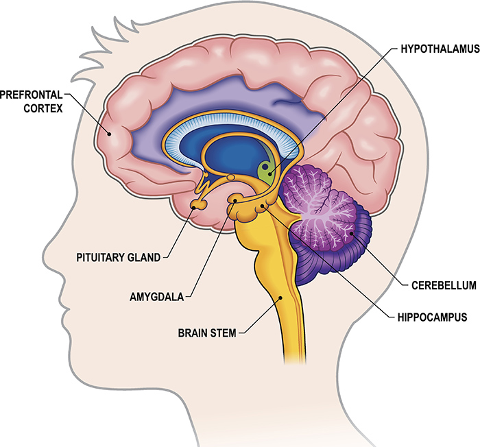
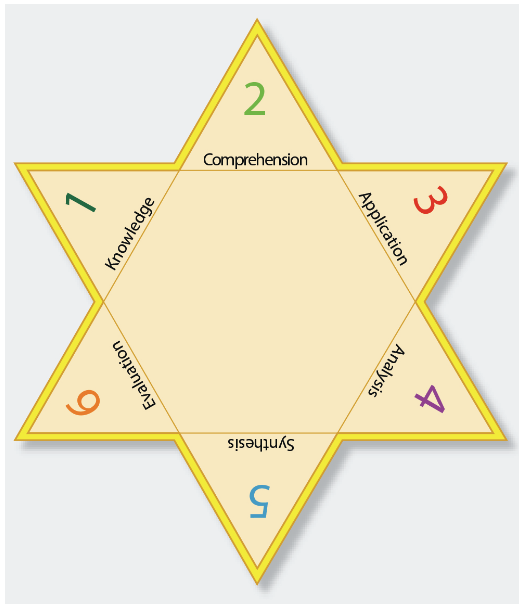
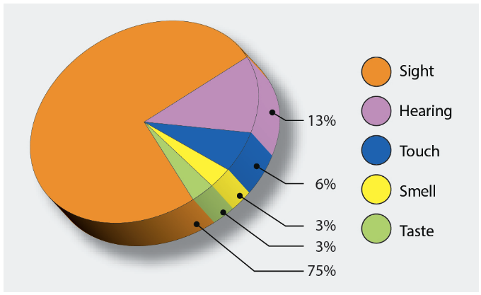
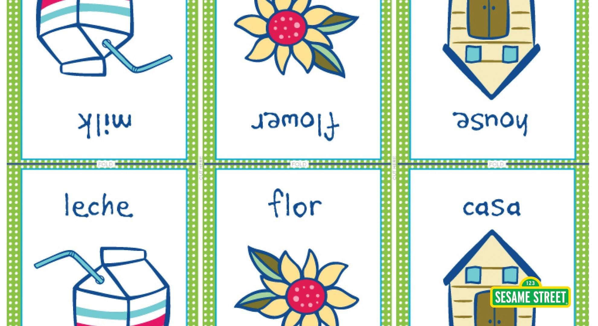
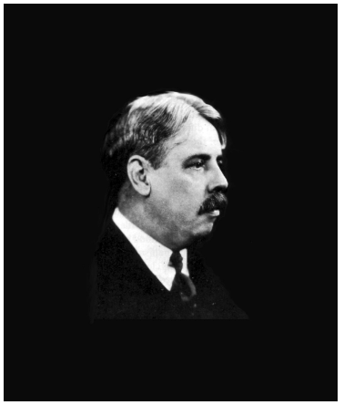
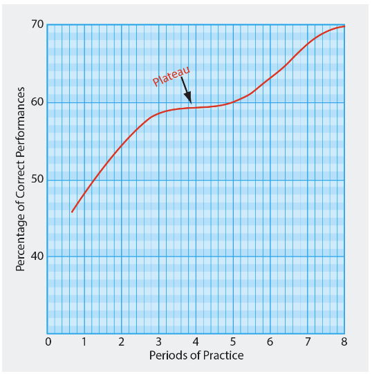
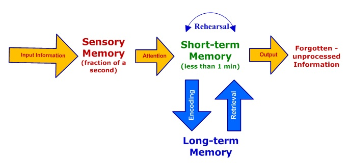
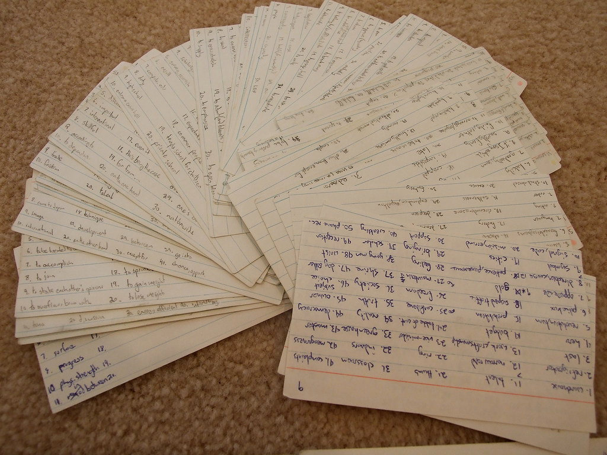
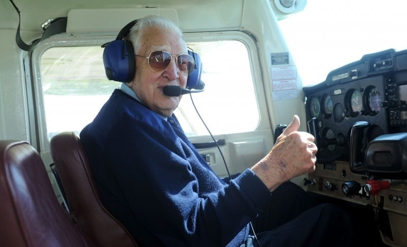

### Fundamentals of Instruction

# The Learning Process

---

## Objective

Understand the learning process and apply the information to provide effective flight and ground instruction.

## Motivation

An competent instructor uses knowledge of the learning process and human behavior to structure effective training and ensure students are progressing.

---

## Overview

- Definitions of learning
- Learning theories (Behaviorism, Cognitive)
- Perceptions and insight
- Levels and laws of learning
- Domains of learning
- Scenario-based training
- Acquiring skill knowledge and practice types
- Evaluation, critique, and error management
- Memory, retention, and forgetting
- Transfer of learning

---

## Definitions of Learning

- A process resulting in a change in behavior
  - This change by be good or bad, fast or slow
- Gaining knowledge or skills through study, instruction, or experience

---

### Learning Theory in Instruction

## Behaviorism

- Oldest theory of learning
- Behavior explained as observable responses to stimuli
- Human behavior is conditioned by environmental events
- "Carrot-and-stick" approach to learning
- Humans are complex, thinking creatures however
  - Modern theories of learning de-emphasize this approach

---

## Cognitive Theory

- Focuses on internal mental processes
- Involves reflection, problem-solving, and critical thinking
- Learning is not just a change in behavior, but also a change in the way a learner thinks, understands, or feels
- Notable cognitive theories:
  - John Dewey: Reflective thought is where effective learning occurs
  - Jerome Bruner: Known to the unknown, or from the concrete to the abstract
  - Benjamin Bloom: Bloom's taxonomy, simple to complex continuum

---

## Perceptions

- Perception is sensory input that is interpreted by the brain
- The process of learning involves mapping this new sensory input into useful information
- Filtering and extracting meaning from sensory input comes from experience
- Perceptions can involve all sense
  - Learning is most effective when more than one sense is involved

---

### Factors that Affect Perception

- Physical organism
  - The physical apparatuses for sensing the world around us
- Goals and values
  - Sensory input is colored by one's own beliefs and values, goals are the produce of one's value structure
- Self-concept
  - Self image (e.g. confident, insecure), affects a persons perception
  - Negative experiences can contradict a person's self-concept

---

### Factors that Affect Perception

- Time and opportunity
  - We need time and practice to develop perception of something
- Element of threat
  - Fear adversely affects perception by narrowing the perceptual field
  - An overwhelming situation can be threatening
  - If a learner feels they can handle a situation, then it's viewed as a challenge

---

## Perceptions and Insight

- Insight: Grouping perceptions into meaningful wholes
- Instructors guide learners to synthesize perceptions into insights
- Example: Steep turns
  - Sight picture
  - Propeller and engine noise
  - G-force
  - Feel on the controls

---

#### Acquiring Knowledge

## Levels of Learning

- **Rote:** Memorization, first attempt
- **Understanding:** Making associations, building mental models
- **Application:** Using knowledge meaningfully in context
- **Correlation:** Generalizing concepts, forming schemas

---

## Thorndike's Laws of Learning

- **Readiness:** Student must be motivated and ready
  - Basic needs are met (remember our hierarchy of needs)
- **Exercise:** Practice is essential
  - Repetition is necessary to form insight, habits, automatic responses
- **Effect:** Positive experiences reinforce learning
  - Negative experiences hinder learning, induce stress, promote negative self-concept

---

## Thorndike's Laws of Learning (continued)

- **Primacy:** First-learned is best remembered
  - First impression are solidified and difficult to un-learn
- **Intensity:** Vivid and realistic experiences are retained better
  - The more real or intense a situation is, the better it will be remembered
- **Recency:** Most recent information is remembered best
  - The reason behind recurrent training

---

## Laws of Learning – Example

**Intensity:**
A flight instructor random simulates an engine failure during a training flight when the student is not expecting it. The student will remember emergency procedures much better than if covered in a lecture.

**Recency:**
Briefing a takeoff emergency before each flight gives you the best chance on remembering the procedure if a real emergency were to occur.

---

## Domains of Learning

Major areas of learning and thinking, developed by Dr. Bloom

- **Cognitive:** "Thinking" - Recall, understanding, application
- **Affective:** "Feeling - Attitudes, emotions, values.
- **Psychomotor:** "Doing" - Physical skills, habits, muscle memory

---

## Domains of Learning – Example

**Cognitive:**
A student can recite the VFR weather minimums for classes of airspace, the reasons they exist, and how to use them in different scenarios.

**Affective:**
A student likes their instructor, is motivated to learn, and excited about aviation. They are therefore more willing and open to learning.

**Psychomotor:**
A student practices and refines the physical skills required for a flare to landing. They adjust their timing and pressure until it become automatic, not requiring deliberate thought.

---

## Characteristics of Learning

- **Purposeful**
  - Learners seek relevance, colored by a person's experience
- **Result of Experience**
  - Built from prior experiences
- **Multifaceted**
  - Involves many elements, not always intended
  - Involves information in different form
- **Active Process**
  - Not a passive process
  - Requires continuous engagement

---

## Scenario-Based Training (SBT)

- Uses real-world scenarios to meet training objectives
- Supports understanding, application, and correlation
- Helps students apply past experiences and strengthen decision-making
- Supports _decision objectives_ of training

---

#### Acquiring Skill Knowledge

## Stages

1. **Cognitive:** Initial attempt, rote and understanding levels
2. **Associative:** Practice, self-assessment, critique by instructor
3. **Automatic Response:** Skill becomes smooth and automatic

---

### How to Develop Skills

- Repeated, focused practice transitions skills from effortful to automatic
- Early attempts are often awkward and slow, becoming easier and smoother
- "Power law of practice": Speed of a task improves as a power of the number of times that the task is performed

### Knowledge of Results

- Feedback should be early and frequent
- Students should learn to judge their own performance

---

## Learning Plateaus

- May result from consolidation, waning interest, or cognitive limits
- May require new practice methods to overcome
- Ways to approach learning plateaus
  - Transition to working on another skill
  - Have a student work with another instructor

---

## Types of Practice

- **Deliberate:** Goal-oriented, with feedback
  - A typical lesson with an instructor with stated goals
- **Blocked:** Repetitive, short-term memory
  - Typical solo student landing practice
- **Random:** Varies tasks, best for long-term retention
  - A ground session with an instructor who will quiz on lots of different topics

---

## Evaluation vs Critique

- **Critique**: Providing immediate, actionable feedback to a student as a skill is being performed
  - Includes positive and negative feedback
  - Most useful early in training
- **Evaluation**: More holistic test where a skill is evaluated from start-to-finish, and completion standards are used
  - More useful in later stages of training
  - Example: Checkride, stage check

---

## Distractions, Interruptions, Fixation, Inattention

- Minimize distractions early in training
  - Introduce them as a students progress
- Teach task prioritization over time
  - Ensure students can perform each task individually before combining it
- Fixation: Over/under-focusing on information
- Inattention: Missing important cues

---

## Errors

- **Slip:** Right intention, wrong action.
- **Mistake:** Wrong intention.
- Minimize errors by taking time, using checklists, developing routines, and raising awareness.
- Instructors should help students recover and learn from errors.

---

## Errors – Example

**Slip:**
A student intended to raise the flaps after the go-around, but go distracted looking for traffic.

**Mistake:**
A student believes the traffic pattern altitude is 1,000 feet MSL at all airports, but it's really 1000' AGL.

---

## Memory

- Sensory Memory
  - Receives initial stimuli, filters for importance
  - Based on person's values/experience
- Short-Term Memory (STM)
  - Holds info for ~30 seconds
  - Encoding required for long-term storage
- Long-Term Memory (LTM)
  - Permanent, infinite storage
  - Recall involves reconstructing information

---

## How Usage Affects Memory

- Repetition and meaningful association improve retention
- "Depth of processing" - Deeper thinking helps improve memory and retention
- Another reason for using multi-faceted, multi-sensory learning experiences

---

## Forgetting

- **Fading**
  - Information fades over time (remember repetition and recency)
- **Retrieval Failure**
  - "Tip of the tongue" forgetting in the moment, may be temporary
- **Interference**
  - Similar, more recent information may confuse older information
- **Suppression**
  - Subconscious may block unpleasant memories from surfacing

---

## Retention of Learning

- Praise and positive attitudes aid memory - Law of Effect
- Association and repetition help recall
  - Another reason for striving for understand, application, correlation levels of learning
- People learn and remember only what they wish to know
- Learning with all senses is most effective
- Use mnemonics (ATOMATOFLAMES)

---

## Transfer of Learning

- Applying existing knowledge to new situations
- Near/Far
  - **Near Transfer:** Apply in similar context
  - **Far Transfer:** Apply knowledge in different context, but with some shared structure
- Positive/Negative
  - **Positive Transfer:** Previous learning helps new learning
  - **Negative Transfer:** Previous learning interferes with new learning

---

## Transfer of Learning – Examples

**Near Transfer:**
A student who has learned to land a Cessna 172 applies the same landing technique to a Cessna 182.

**Far Transfer:**
Seeing a new taxiway sign that you've never seen before, but shares commonalities with ones you have seen.

---

## Transfer of Learning – Examples

**Positive Transfer:**
Using skills flying shallow turns to help with steep turns.

**Negative Transfer:**
Trying to steer on the ground with the yoke instead of the rudder pedals, a skill transferred from driving a car.

---

## Summary

- Definitions of learning
- Learning theories (Behaviorism, Cognitive)
- Perceptions and insight
- Levels and laws of learning
- Domains of learning
- Scenario-based training
- Acquiring skill knowledge and practice types
- Evaluation, critique, and error management
- Memory, retention, and forgetting
- Transfer of learning
