

### Fundamentals of Instruction

# Course Development and Lesson Planning

---

## Overview

- Teaching: Process and Essential Skills
- Course of Training
- Preparation of a Lesson
- Organization of Material
- Training Delivery Methods
- Electronic Learning (e-Learning)
- Instructional Aids & Training Technologies
- Integrated Flight Instruction
- Problem-Based Instruction
- Planning Instructional Activity

---

## Motivation:

Building upon the learning process to develop effective lesson objectives, lesson plans, and curriculum.

## Objective:

Understand appropriate and effective techniques for teaching and planning instructional sessions.

---

## Teaching: The Process

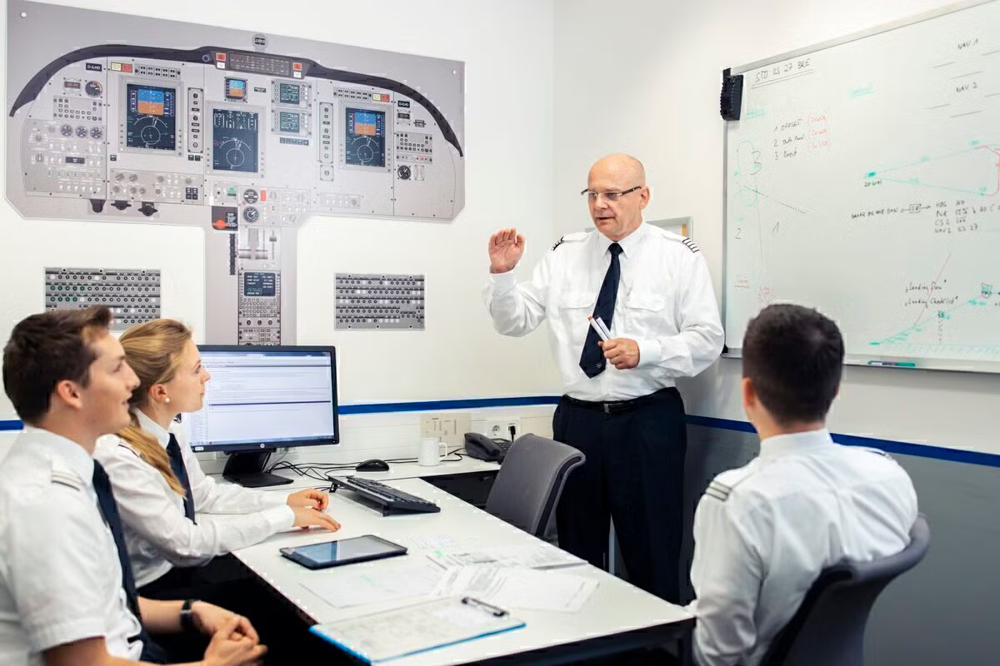

- Teaching = Organizing and presenting material for learner understanding
- Four basic steps:
  1. Preparation
  2. Presentation
  3. Application
  4. Assessment

---

## Teaching: Essential Skills

- **People skills:** Effective communication, listening
- **Subject matter expertise:** Deep knowledge of the subject
- **Management skills:** Planning, leading, organizing, supervising
- **Assessment skills:** Evaluating student progress

---

## Course of Training

- A curriculum or training plan for a specific goal (e.g., rating or certificate)
- Outlines the sequence and scope of instruction
  - Informed by blocks of learning, stages of instruction, overall objectives

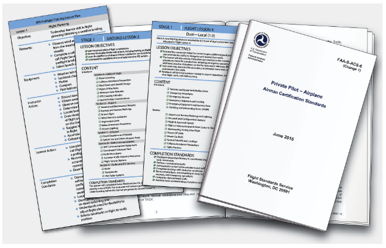

---

## Planning Instructional Activity

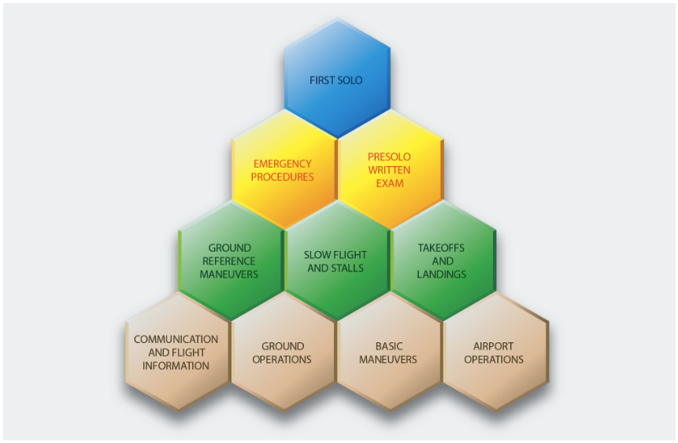

- Identify **blocks of learning**
  - Skills that are required for the overall course objective
  - Break-down skills into their basic components
  - Blocks should build upon one another
- Develop a **syllabus**
  - Using these blocks of learning, determine lesson objectives
  - Lesson should have specific objectives that contribute to one or more blocks

---

## Planning Instructional Activity (cont.)

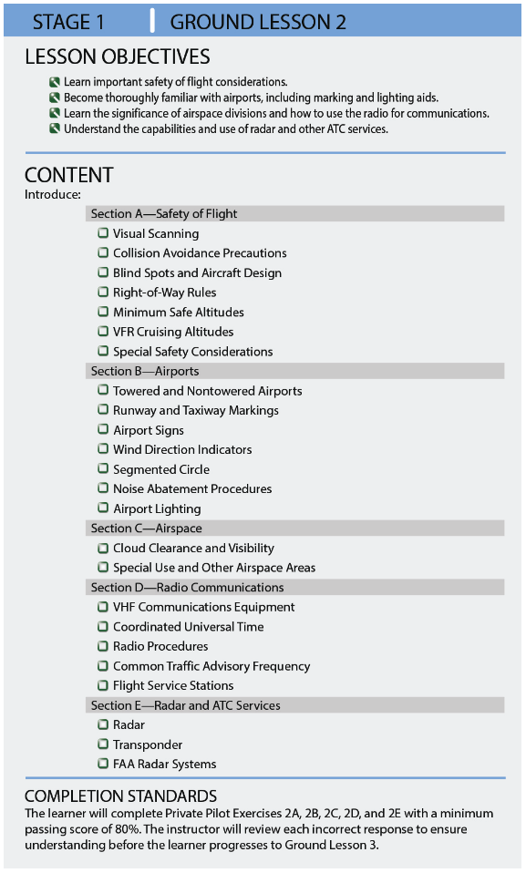

- Develop individual **lesson plans**
  - Detailed information about each lesson
  - Objectives for individual lessons
  - Include timing, materials, instructor actions, student actions

---

## Preparation of a Lesson

- **Training objectives:** Define what the learner should learn, perform, or exhibit
  - Performance objectives: Specific, performance criteria
  - Decision-based objectives: Evaluate decision-making and risk management
- **Completion standards:** Criteria for successful performance

---

## Performance-Based Objectives

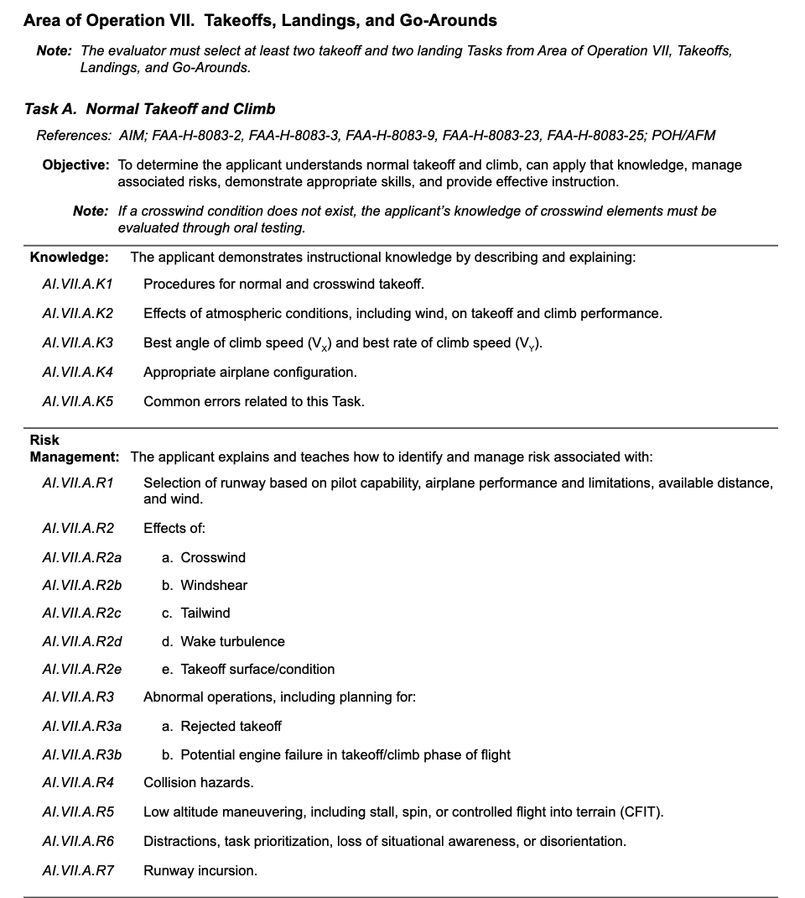

- Reasonable, measurable standards for judging learner progress
- Used to determine readiness to advance
- ACS maneuver tolerances are examples of performance-based objectives

---

## Decision-Based Objectives

- Evaluate judgment and risk management
- Used for complex topics (e.g., cross-country, emergencies, ADM)
- Scenario-based training is well-suited for decision-based objective lessons

---

## Importance of ACS in Aviation Training

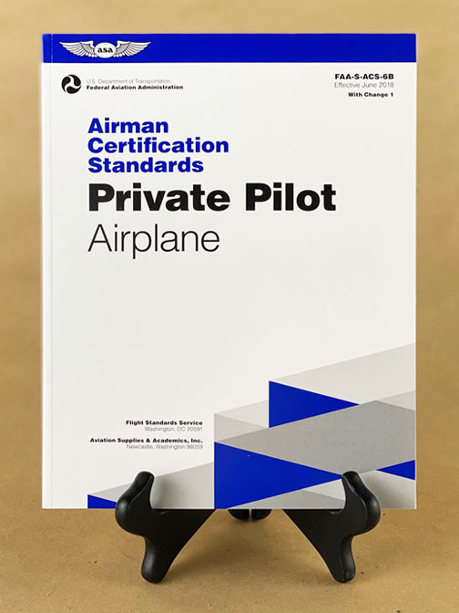

- ACS/PTS provides specific skills and objectives for learning
- ACS encourage use of scenario-based and maneuver-based training for ground and flight instruction
- Note ACS/PTS is an evaluation document, not a teaching document

---

## Organization of Material

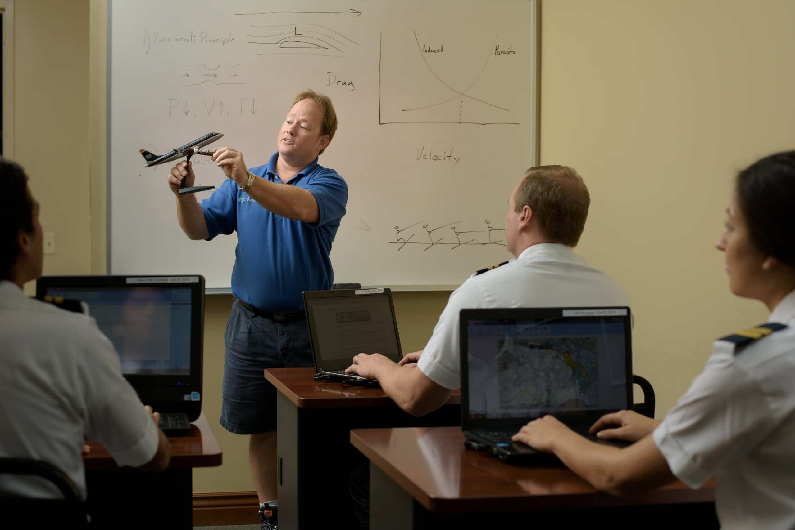

Lesson plans should consistently and thoughtfully outlines and organized

**Introduction:**

- Attention: Get the student interested and introduced to the topic
- Motivation: What are we learning this?
- Overview: Roadmap of what is to be covered

---

## Organization of Material

**Development:** How should we present the material?

- Different lessons will require different strategies
- Remember our cognitive learning theories:
  - Chronological
  - Simple-to-complex
  - Known-to-unknown
  - Most-to-least used

**Conclusion:**

- Recap important items
- Leave a good impression

---

## Structure of a Lesson Plan

- Objective
- Motivation
- Timing
- Content / Elements
- Completion Standards
- Risk Management
- Instructor actions
- Student actions

---

## Training Delivery Methods

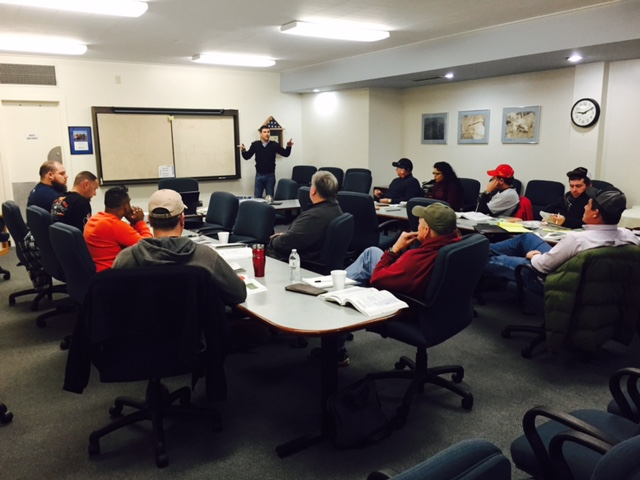

- **Lecture:** Good for background info, large groups; less interactive
- **Discussion:** Engages higher-order thinking, can be instructor- or learner-led
- **Guided Discussion:** Instructor steers with questions
- **Cooperative/Group Learning:** Small groups, active participation
- **Demonstration-Performance:** Instructor demonstrates, learner performs
- **Drill and Practice:** Repeated application for skill mastery

---

## Electronic Learning (e-Learning)

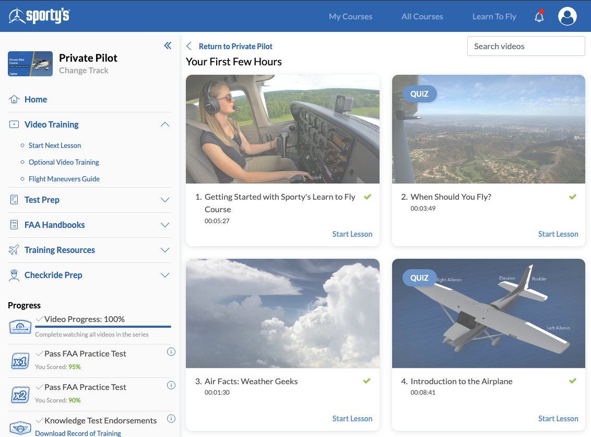

- **Advantages:** Flexible, low cost, updatable, self-paced
- **Disadvantages:** Less peer interaction, less personalized feedback

---

## Instructional Aids & Training Technologies

- Using things like
  - Whiteboards
  - Printed materials
  - Videos
  - Interactive systems
  - Models
- Simple, clear, supports training objectives
- Hold attention, reduce barriers, speed instruction
- Plan ahead, check for accuracy

---

## Integrated Flight Instruction

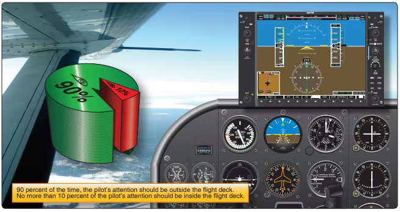

- Learners perform flight maneuvers by outside visual references and by flight instruments
- 90% of time spent outside, 10% inside
  - Emphasize "glances" down at the instruments
  - Much like a speedometer in a car
- This should be emphasized early in training (law of primacy)

---

## Problem-Based Instruction

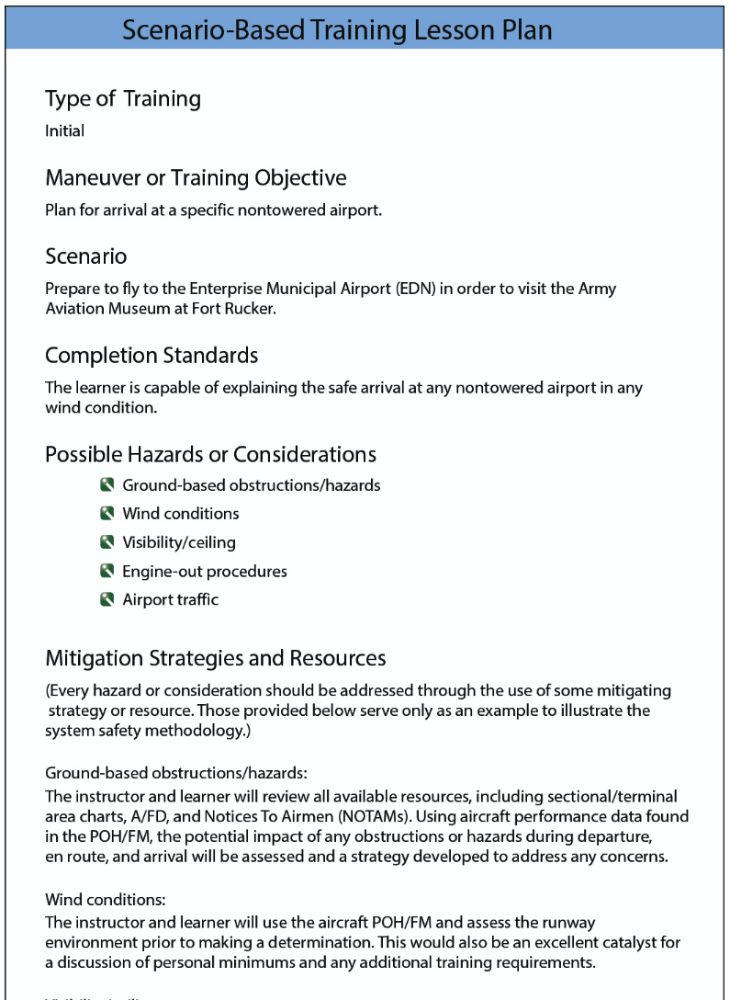

- Uses realistic, open-ended problems to motivate learning
- Encourages decision-making and critical thinking
- Examples:
  - Flight planning task taking your family to a particular location, given a certain weather forecast, airplane configuration, and time constraint

---

## Summary

- Teaching: Process and Essential Skills - People, communication, organization
- Course of Training
- Planning Instructional Activity
- Preparation of a Lesson
- Organization of Material
- Training Delivery Methods
- Electronic Learning (e-Learning)
- Instructional Aids & Training Technologies
- Integrated Flight Instruction
- Problem-Based Instruction
