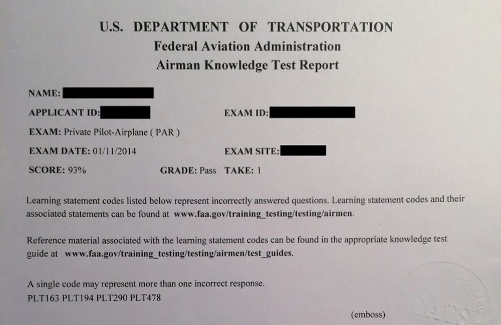
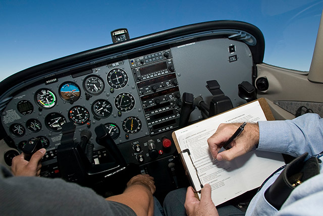
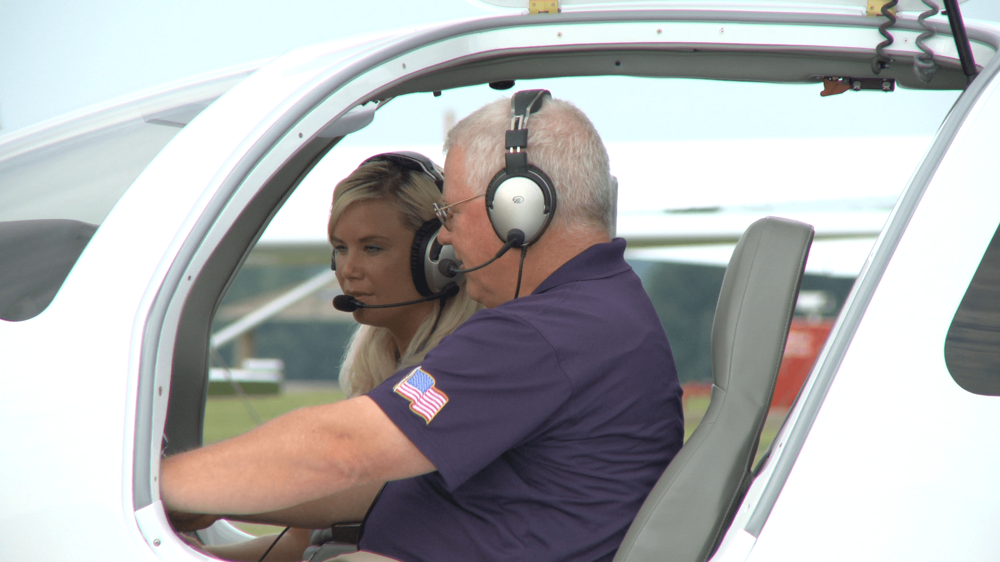
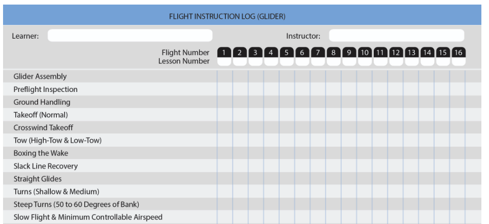
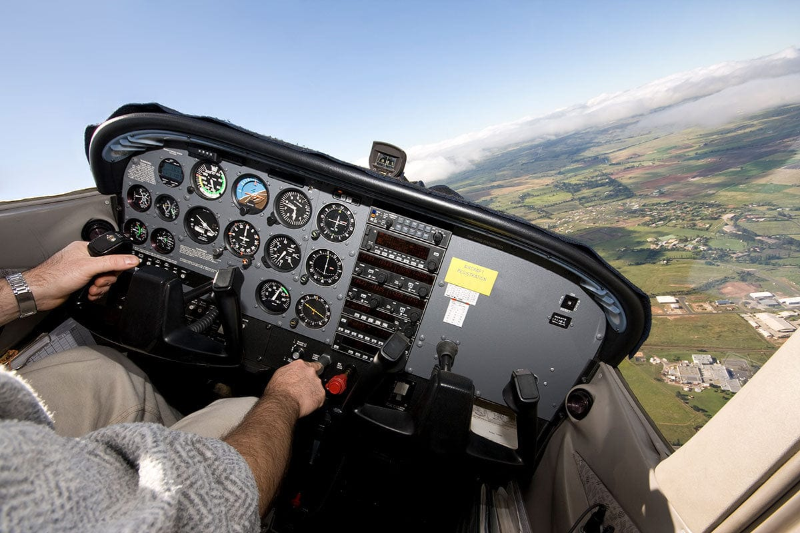
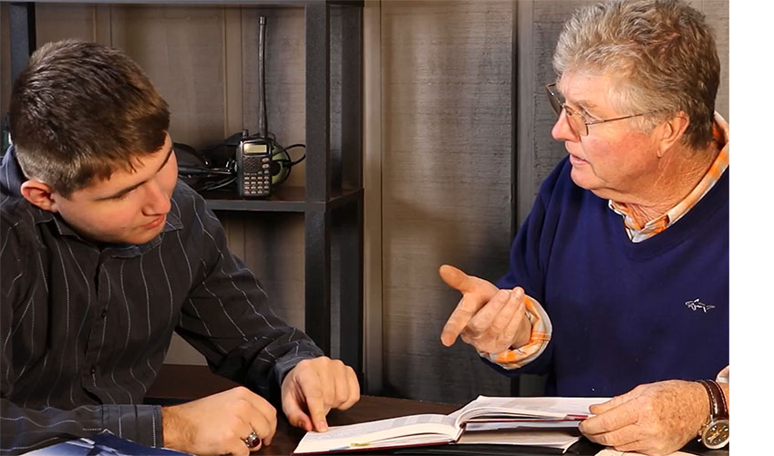

### Fundamentals of Instruction

# Student Evaluation and Assessment

---

## Overview

- Purpose and characteristics of effective assessment
- Traditional assessments
- Authentic assessments
  - Learner-centered assessment
  - Maneuver or procedure grades
  - Assessing risk management skills
- Choosing an effective assessment method
- Purposes and types of critiques
- Oral assessment
- Assessment of piloting ability

---

## Motivation

Assessment is an integral component of student instruction.

## Objective

Understand and apply the strategies for effective student evaluation and assessment.

---

## Why do we use assessments?

- We want to assess learning progress and provide feedback to both learner and instructor
- Identify strong and weak areas of learning
- Determine whether a student is ready for the next phase of training

---

## What makes a good assessment?

- Objective: Free from bias, honest
- Flexible: Adapted to the situation
- Acceptable: Learner understands the reason for assessment
- Comprehensive: Covers all necessary areas
- Constructive: Includes praise where appropriate
- Thoughtful: Respects learner's feelings
- Specific: Provides actionable feedback

---

## Traditional Assessments

- Generally written tests (multiple choice, true/false, fill-in-the-blank)
- Usually time-limited
- Example: FAA Written Exams, pre-solo knowledge test

---

## Traditional Assessments

**Good written tests should be:**

- Reliable: Consistent results across students/graders
- Valid: Measures intended objectives
- Usable: Easy to read and complete
- Objective: Single, clear scoring
- Comprehensive: Covers required learning
- Discriminating: Differentiates performance quality

---

## Authentic Assessments

- Involves real-world tasks and demonstration of skills
- Focuses on higher levels of learning: Understand, Application, Correlation
- May incorporate higher-order thinking skills, scenario-based questions
- Example: Practical test or stage check for student pilot

---

## Learner-Centered Assessment

A four-step self-assessment process:

1. **Replay:** Learner recounts the activity; instructor clarifies as needed
2. **Reconstruct:** Learner identifies what could have been done differently
3. **Reflect:** Learner finds meaning in the experience
4. **Redirect:** Learner considers how to apply lessons in the future

---

## Example: Learner-Centered Assessment

**Scenario:** After a crosswind landing, the instructor asks:

- "Walk me through your approach and landing. What went well? What would you do differently next time?"
- The student reflects: "I flared a bit high and landed with a bit of side-load. Next time I'll correct for drift using a forward slip."

---

## Maneuver or Procedure Grades

Can be used as part of a training syllabus rubric to measure progress.

Levels of performance:

1. **Describe:** Can describe, but needs help to perform
2. **Explain:** Understands, but still needs help to perform
3. **Practice:** Can execute with some coaching/correction
4. **Perform:** Can perform independently

---

## Maneuver Grade - Steep Turns

- **Describe:** Student knows they need back pressure, understands over-banking tendency
- **Explain:** Student can explain entry, exit, and correction procedures
- **Practice:** Student can do the turn, with critique from the instructor
- **Perform:** Automatic response stages, student can perform without instructor

---

## Assessing Risk Management Skills

Used for measuring decision-based objectives related to risk management.

Levels of risk management:

1. **Explain:** Identifies and understands risks, needs prompting for decisions
2. **Practice:** Applies SRM principles with some coaching, active decision-maker
3. **Manage/Decide:** Gathers information and makes autonomous decisions

---

## Risk Management Assessment - Weather Assessment

- **Explain:** Student can read weather forecasts, understands the risk of thunderstorms
- **Practice:** Student works with instructor through several go/no-go decision, learning what the instructor decides
- **Manage/Decide:** Student can effectively understand forecasts and make their own decision

---

## Choosing an Effective Assessment Method

1. Determine the level of learning - Rote, Understanding, Application, Correlation
2. List indicators of desired behaviors
3. Establish performance-based objectives
4. Develop test items or activities targeting those objectives

---

## Critiques

- Critiques are immediate and actionable feedback to a student about their performance
  - They can be positive or negative
  - They should occur soon after performance

**Types:**

- Instructor/learner critique - Typical 1-1 flight instruction
- Learner-led critique
- Small group critique
- Self-critique
- Written critique

---

## Oral Assessment

- Direct questioning of a student by the instructor
- Kinds of questions
  - **Fact Question:**: "What does the mixture control do?"
  - **HOTS Question:**: "The weather is deteriorating at our destination but we still have two hours to go. What are our options?"
  - **Follow-up:**: Instructor adapts questions to the student's experience and responses.

---

## Characteristics of Effective Questions

- Written in advance
- Can be factual (rote) or higher-order (HOTS)
- Should be:
  1. Relevant to the subject
  2. Brief, clear, and definite
  3. Adapted to learner's experience
  4. Focused on one idea
  5. Challenging

---

## Types of Questions to Avoid

- Bewildering questions
- Oversized questions
- Toss-up questions
- Trick questions
- Irrelevant questions

Remember the law of effective and the affective domain. Instructors should provide fail, accurate, and managable assessments.

---

## Answering Learner Questions

- Encourage students to ask questions
- Avoid introducing unnecessary complexity when answering
- After answering, check learner's understanding
- Student questions give a great insight into their knowledge and decision-making

---

## Assessment of Piloting Ability

- Utilize post-flight debrief and evaluation
- Provide specific, actionable feedback for improvement
- Evaluate both technical and decision-making skills

---

## Summary

- Assessment is essential for learning and instruction
- Use both traditional and authentic methods
- Choose assessment methods based on objectives and learner needs
- Provide clear, constructive feedback
- Effective questioning and critique enhance learning
