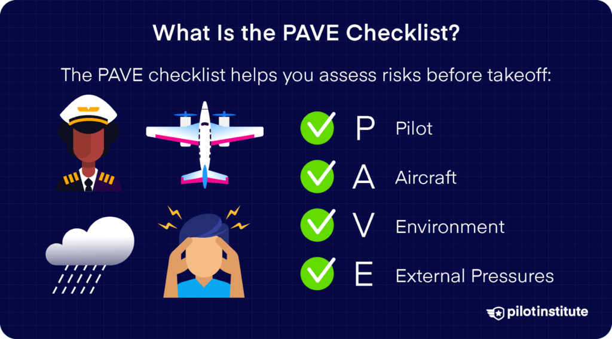
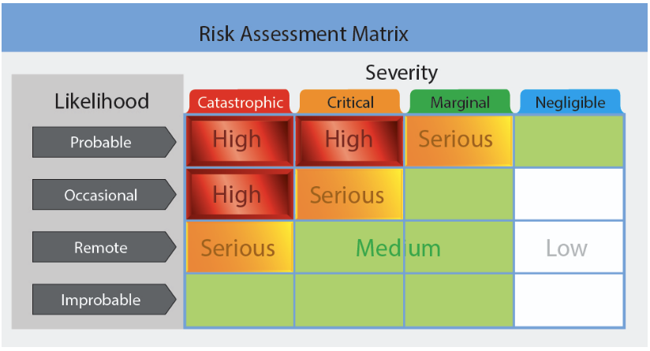
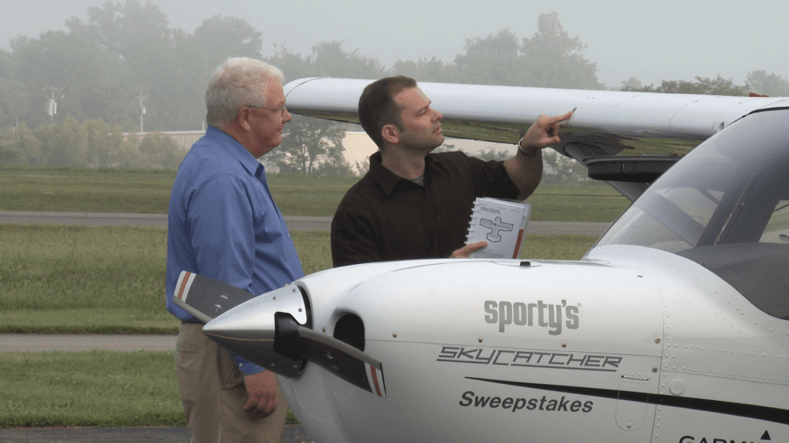
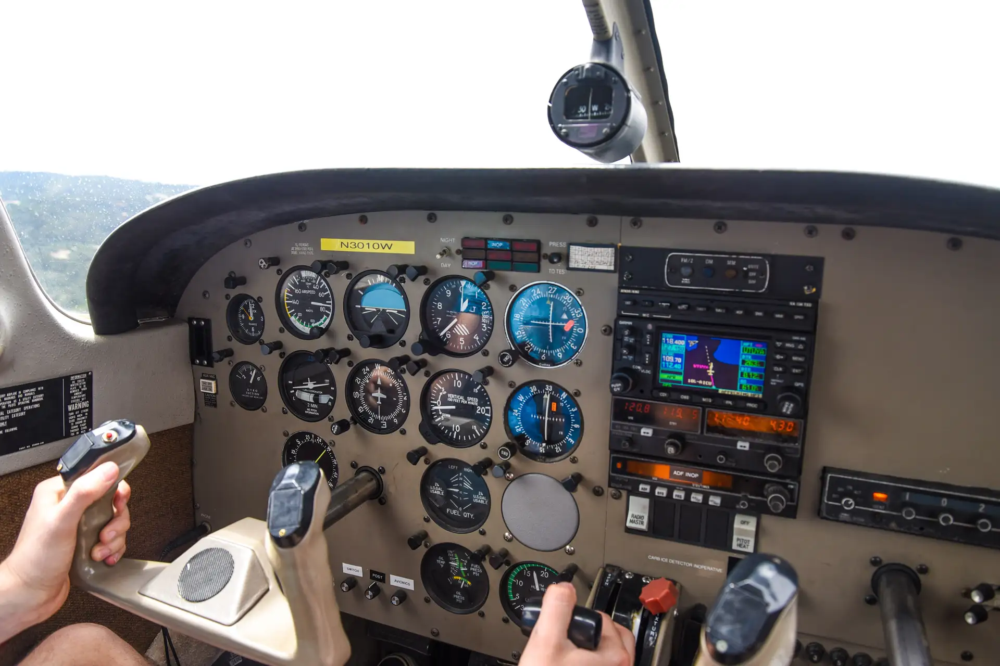
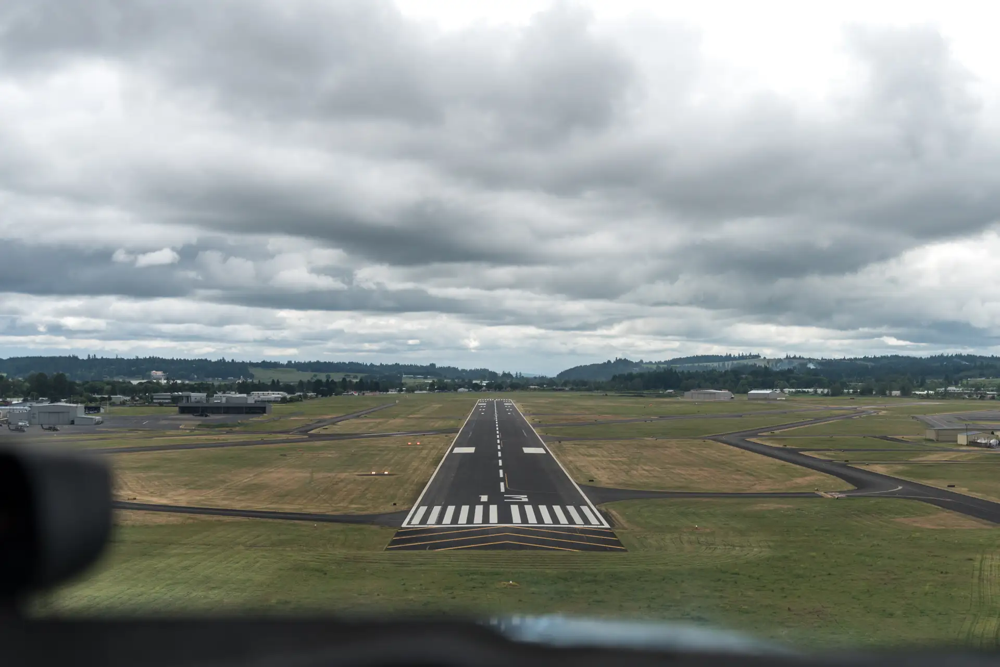
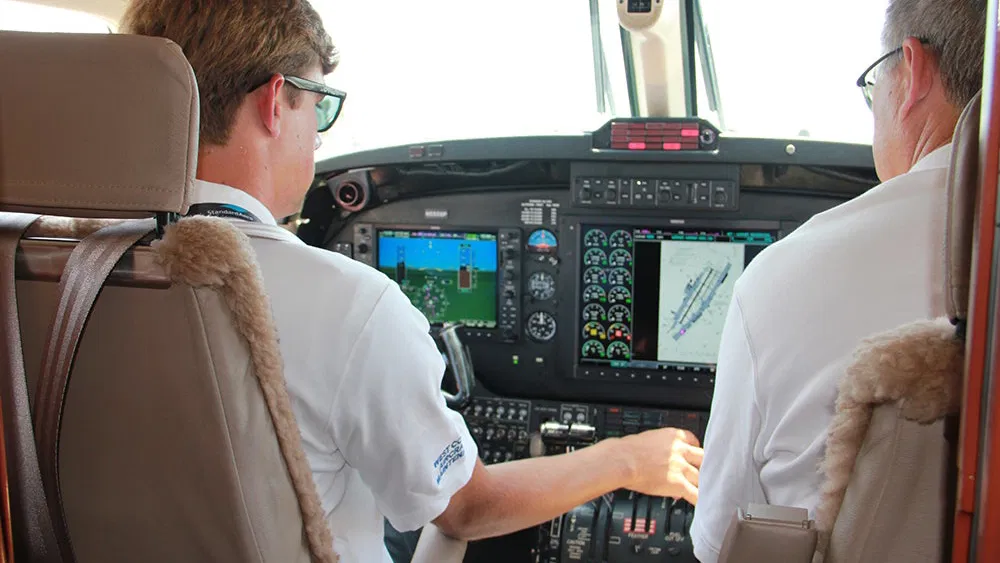
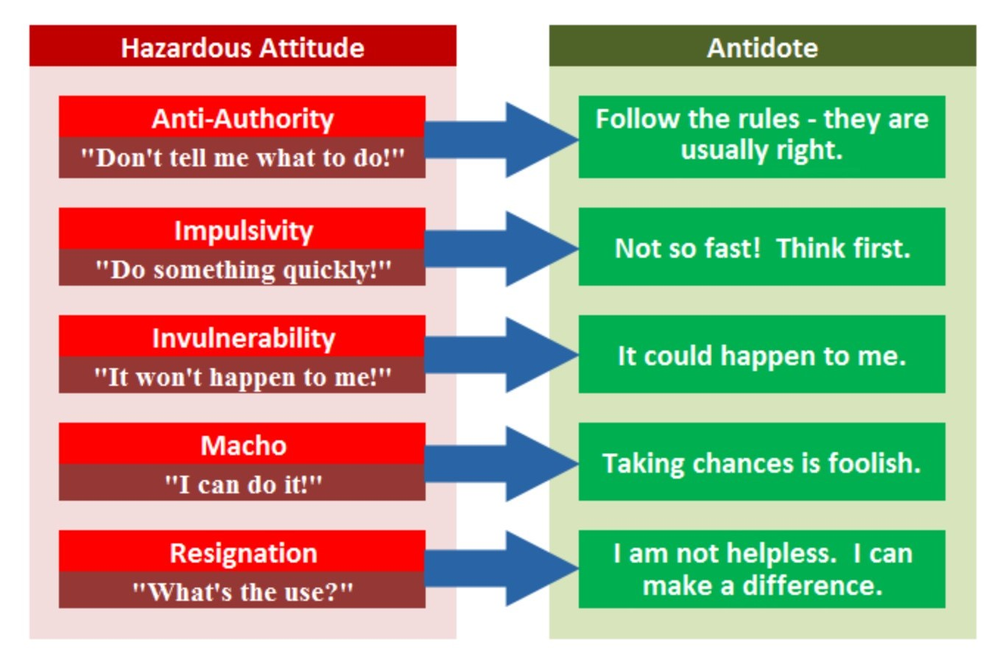
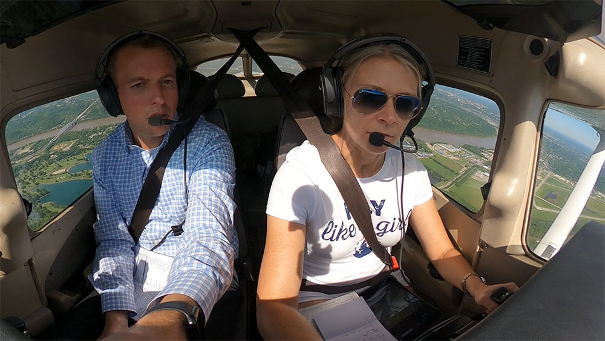
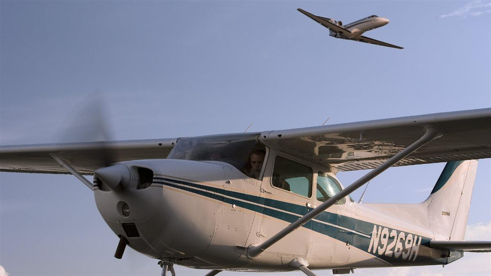

### Fundamentals of Instruction

# Teaching Practical Risk Management

---

## Overview

- Motivation & Objective
- Teaching risk identification, assessment, and mitigation
- Risk management tools (PAVE, FRAT)
- When and how to introduce risk management
- Risk management by phase of instruction
- Managing risk during flight instruction
- Aeronautical Decision-Making (ADM) & CRM/SRM
- Hazards and obstacles in flight instruction
- Human factors and hazardous attitudes
- Scenario-Based Training (SBT) for risk management
- Maintaining awareness and oversight
- Modeling and teaching safety practices
- Summary

---

## Motivation

Effective risk management is one of the most important skills a pilot needs to learn, understand, and practice as a habit.

## Objective

Understand the responsibility of the instructor to mitigate risks associated with teaching, and teach students to evaluate risk systematically.

---

## Teaching Risk Identification, Assessment, and Mitigation

- Teach students to systematically identify, assess, and mitigate risks
- Use structured tools and checklists to guide the process
- Emphasize evaluating both severity (impact) and likelihood (probability) of risks

---

## Risk Management Tools - PAVE Checklist

Emphasize use of the PAVE checklist on every flight.

What are the challenges for operating this flight safely?

- **P**ilot: Experience, health, currency (use IMSAFE)
- **A**ircraft: Airworthiness, equipment, limitations
- En**V**ironment: Weather, terrain, airspace, airports
- **E**xternal Pressures: Schedules, expectations, distractions

---

### Flight Risk Assessment Tools (FRATs)

- Structured forms or digital tools to quantify risk before a flight
- Assigns scores to various risk factors (pilot, aircraft, environment, external pressures)
- Helps decide if risk is acceptable, needs mitigation, or flight should be cancelled
- Most basic form is the table
- More advanced computer-based versions use numerical scoring system

---

### Risk Matrix - Examples

- Landing light failure on a night flight.
- Engine failure over an extended over-water flight.
- A VFR-only pilot attempts to make a 180nm cross-country trip in MVFR conditions.

---

## When and How to Introduce Risk Management

- Begin risk management instruction at the start of training, including ground lessons
- Reinforce during preflight planning and post-flight debriefs
- Integrate risk management into every lesson, not just as a one-time topic
  - The ACS structure emphasize risk management in every operation
- Emphasize during flight review and recurrent checks as well

---

## Risk Management by Phase of Instruction

- **Pre-solo:** Instructor leads risk analysis, discusses before/after each flight, use of FRAT
- **Pre-solo cross-country:** Learner performs risk analysis with coaching
- **Cross-country training:** Focus on complex, real-world risk scenarios
  - Night flight
  - Unfamiliar airports
  - Complex airspace
- **Instrument/transition/recurrent:** Address unique risks
  - Flight in IMC, weather conditions, icing
  - Transition training to high-performance or complex aircraft

---

## Common Risks During Flight Instruction

- **Pilot risks:**
  - Expect learner mistakes
  - Maintain margin for error
  - Instructor must be current and proficient
- **Aircraft risks:**
  - Ensure airworthiness, be aware of maintenance limitations
- **Environment risks:**
  - Crowded airspace, weather, terrain, night operations
- **External pressures:**
  - Distractions, pressure to complete training, scheduling

---

## IMSAFE Checklist - Student and Instructor

Regularly use the IMSAFE checklist to evaluate your own readiness, but also your students:

1. Illness
2. Medication
3. Stress
4. Alcohol
5. Fatigue
6. Emotions

---

## Special Considerations: Takeoffs & Landings

### Takeoffs

- Limited time for instruction
- Brief thoroughly before turning onto runway
- Maintain a sterile cockpit
- Create realistic but safe scenarios for obstacles
- Follow-along on controls

---

### Landings

- Avoid teaching landings mechanically
  - Explain power, stability, airspeed control
  - Build fundamentals first, then apply them to landing
- Keep collision avoidance as a priority
- Use concise prompts during landing
- Follow-along on controls

---

## Aeronautical Decision-Making (ADM), CRM, SRM

- Teach ADM models for systematic decision-making
- Use Crew Resource Management (CRM)
  - Clearly define tasks and roles of each crew member
  - Split and delegate tasks to other crew members as appropriate
- Single-Pilot Resource Management (SRM)
  - Managing all resources available to a single-pilot
- Emphasize communication, workload management, and resource use
  - Task prioritization
  - Checklist usage
  - Autopilot usage

---

## ADM: 5-P Checklist

Review the 5P components at preflight, pre-takeoff, hourly or at the midpoint of the flight, pre-descent, and just prior to entering the traffic pattern.

1. Plan
2. Plane
3. Pilot
4. Passengers
5. Programming

---

## Hazards in Flight Instruction

- Inexperienced students with variety of skills and experiences
- Variety of student emotional reactions
- Instructor's willingness to intervene

---

## Obstacles to Situational Awareness

- Distractions from instruction tasks
- Fatigue, stress, or complacency
- Expectation bias

---

## Human Factors & Hazardous Attitudes

- Recognize hazardous attitudes (anti-authority, impulsivity, invulnerability, macho, resignation)
- Teach strategies to counteract these attitudes early in a student training
- Monitor both instructor and learner for signs of hazardous thinking

---

## Scenario-Based Training (SBT)

- Use realistic scenarios to teach and assess risk management and ADM
- Scenarios should be relevant to the learner’s experience and training phase
- Debrief scenarios to reinforce lessons learned

---

## Maintaining Awareness and Oversight

- Continuous supervision of learner’s actions
- Monitor learner’s cognitive and physiological state (anxiety, stress, fatigue)
- Maintain overall situational awareness of aircraft and environment

---

## Modeling and Teaching Safety Practices

- Collision avoidance while instructing
  - Demonstrate effective scanning
  - Collision-avoidance prioritization
- Avoid unnecessary distractions
- Maintain coordinated flight
- Use positive exchange of flight controls consistently
- Continuous awareness of aircraft’s state and position in the NAS
  - Using all tools available

---

## Summary

- Risk management is a core instructional responsibility.
- Use structured tools (PAVE, FRAT, IMSAFE) and techniques.
- Integrate risk management into all phases of training.
- Model and reinforce safe practices at all times.
- Use scenario-based training to develop real-world risk management skills.
