

### Ground Operations

# Airport Markings

---

## Objective

Identify airport markings, signage, and lighting, and understand their meanings.

## Motivation

Airport markings, signage, and lighting are critical for safe ground operations. Understanding these elements is essential for pilots to navigate the airport environment safely and efficiently.

---

## Overview

- Parts of an Airport
- Airport Signage
- Movement Areas
- Runway Safety Areas
- Crossing a Runway
- Runway Markings
- Runway Lighting
- VASI and PAPI

---

## Parts of an Airport

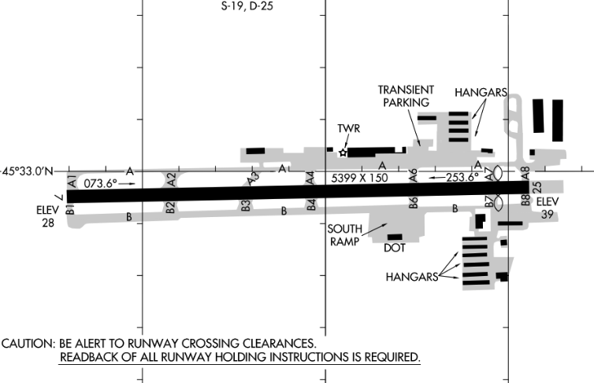

<!--
- Ramp
- Taxiway
- Runway
- "Movement area" - runways, taxiways, and other areas that are used for taxiing, takeoff, and landing of aircraft
-->

---

## Signs We'll Encounter as We Taxi

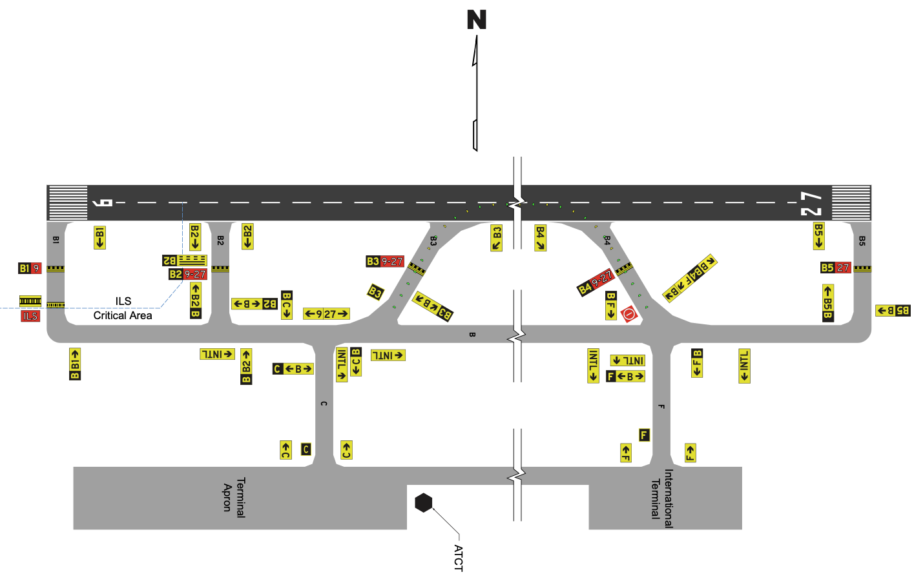

---

## Movement Area Boundary

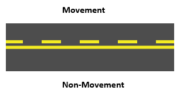

- Lines works similar to a highway passing lane
- Separates ramp from movement area
  - Need a clearance to cross at an airport with a control tower
  - Announce taxi on CTAF at an uncontrolled airport

---

## Taxiway signs

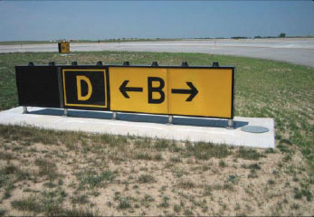

- Black-backed text indicates taxiway you are on (taxiway direction sign)
- Yellow-backed text indicates direction to destination (taxiway location sign)

---

## Taxiway Intersection

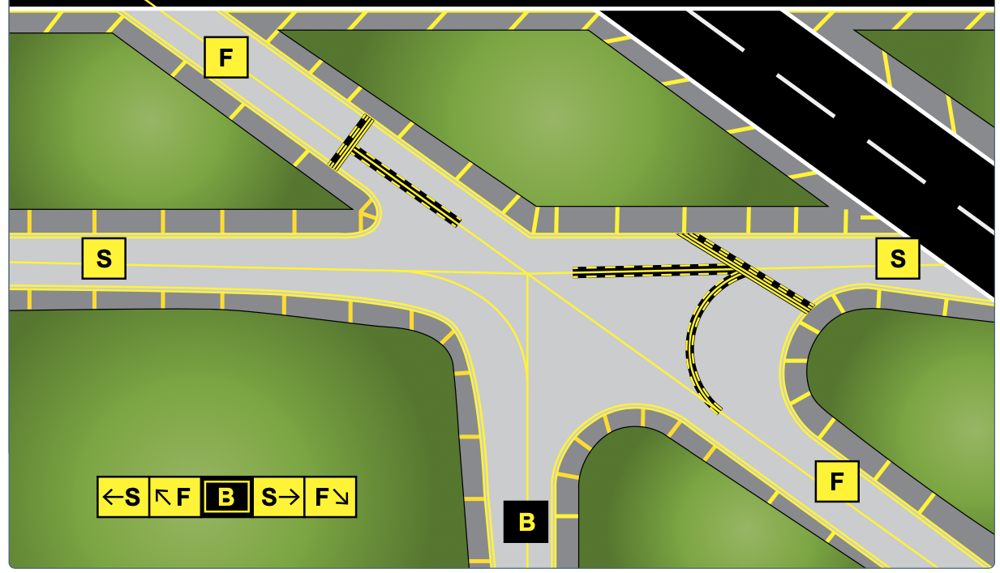

- Signs show direction to each taxiway
- Black-backed text indicates taxiway you are on

---

## Destination Signs

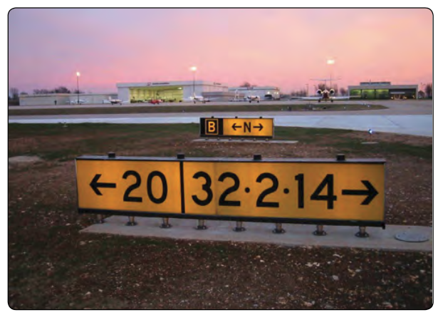

- Runway destination signs
- Dot separates multiple runways

---

## Runway Safety Area

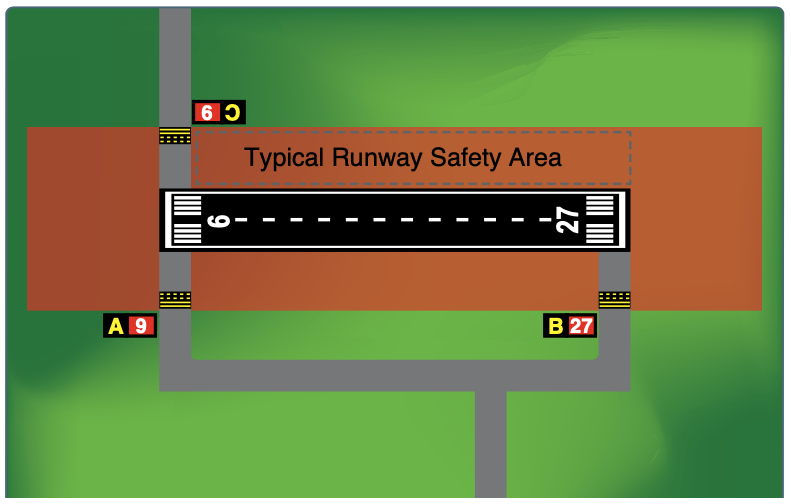

- Buffer zone which reduces the risk of damage to airplanes in the event of an undershoot overshoot, or excursion from the runway

---

## Crossing a Runway

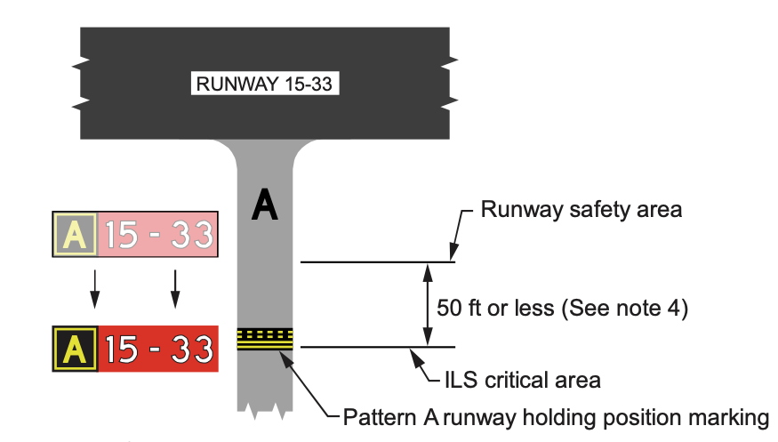

<!--
Sign: Runway holding position sign
 -->

- Stop before the hold short bars
- Need a clearance to cross
- Runways numbers are placed on the corresponding side of the sign

---

## Crossing a Runway

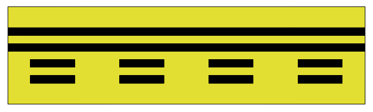

- Dashed to solid, crossing ok
- Solid to dashed, need a clearance
- Completely cross the entire line to be clear of the runway

---

## Crossing a Runway

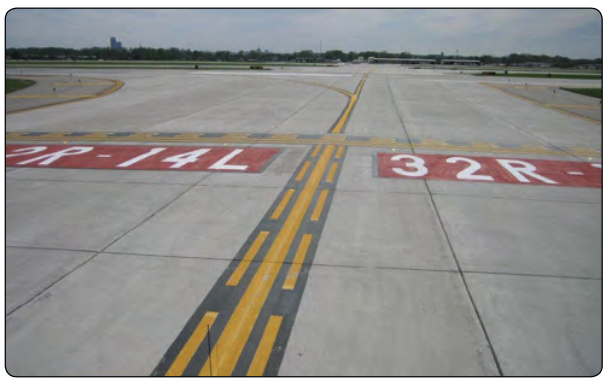

- Runway identifiers also painted on the ground
- See red, think STOP

---

## Holding Short of a Runway

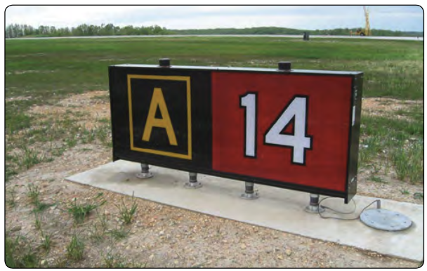

- Runway holding position sign (at runway end)

---

## ILS Hold Position Area

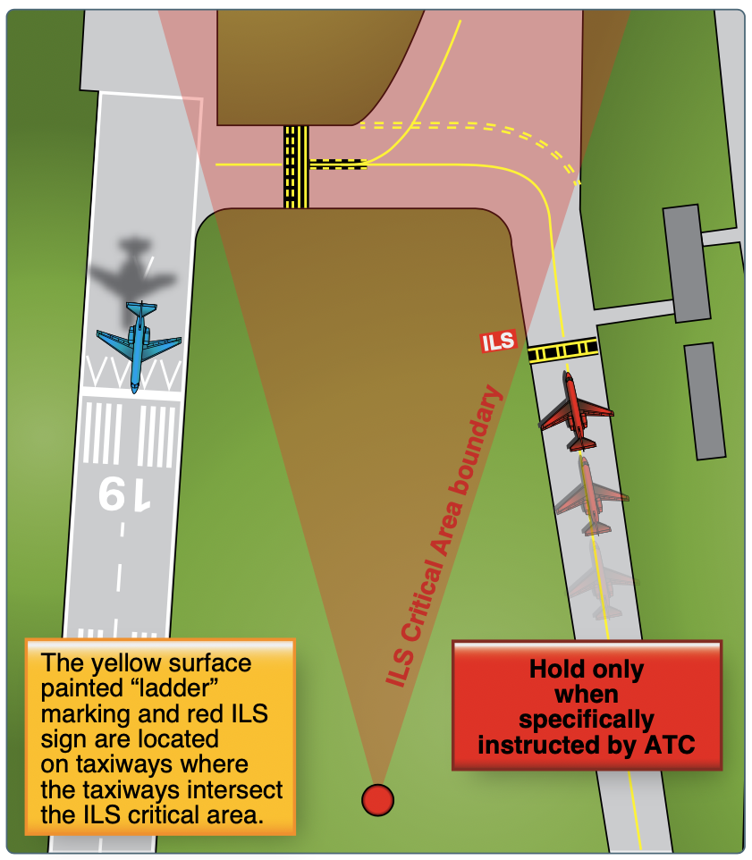

- ILSs have critical areas that must be kept clear of all obstacles
- To use, ATC will say `HOLD SHORT OF RUNWAY 36 ILS CRITICAL AREA.`

---

## Runway Approach Area Holding

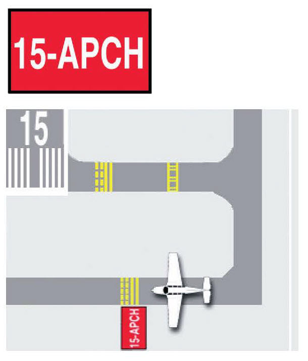

- ATC: `Hold short of Runway XX approach or Runway XX departure area`

---

## Runway Approach Area Holding

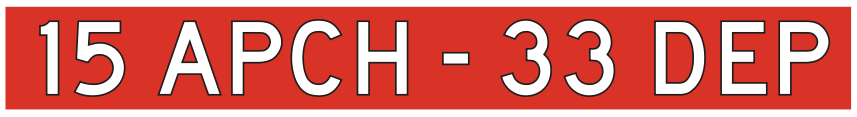

- ATC: `Hold short of Runway XX approach or Runway XX approach area`

---

## No Entry Sign

---

# Runway Signs and Markings

---

## Non-Precision Runway Markings

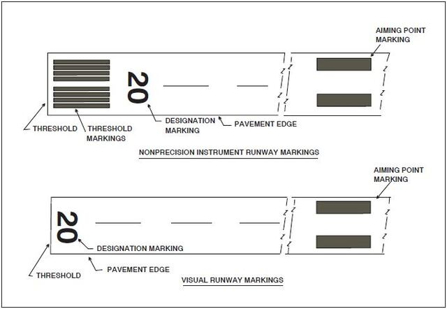

- Threshold blocks: Depending on the width of the runway, there may be 2-16 stripes
- Aiming point: 1000' from threshold
- Lines are 120' long with 80' in between them

---

## Precision Runway Markings - Runways with Instrument Approach

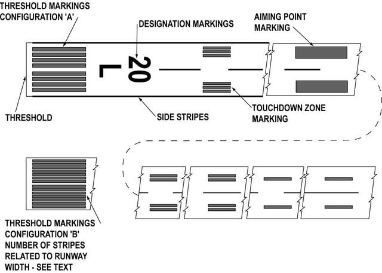

- Double bars, touchdown: 500' from threshold
- Single bar, aiming point: 1000' from threshold
- Dashed bars are 500' from each block

---

## Runway Location Sign

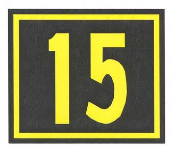

- Identifies which runway you are on

---

## Runway Distance Remaining

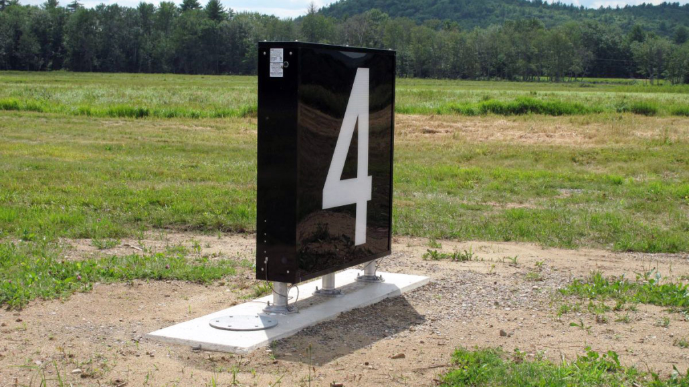

- Identifies how much runway is remaining in 1000's of feet

---

## Displaced Threshold

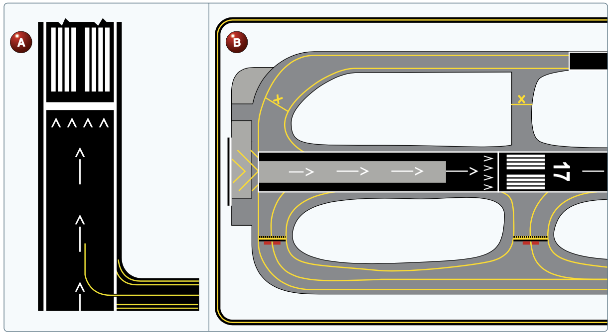

- Can be used for takeoff, but not for landing
- Ok to rollout when landing from opposite direction

---

## Relocated Runway Threshold

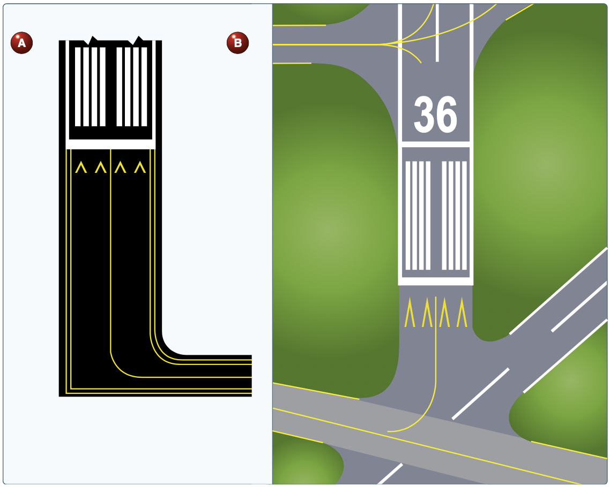

- Cannot be used for takeoff or landing, taxi only

---

## Blastpad or Stopway

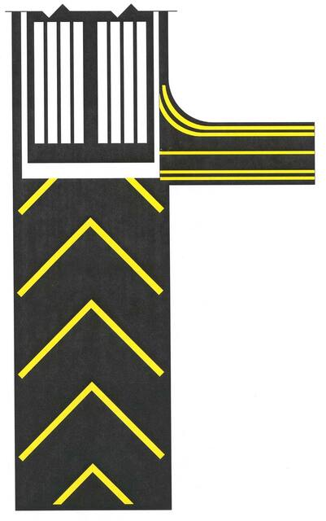

- Cannot be used for taxi, takeoff, or landing

---

## EMAS

- Engineered materials arresting system

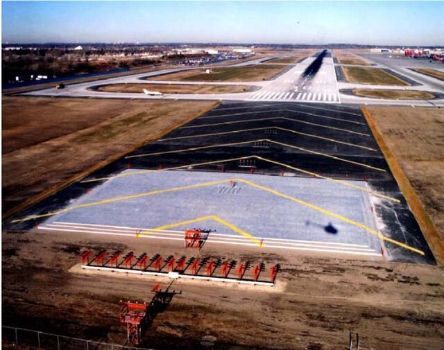

---

## Closed Runway "X"

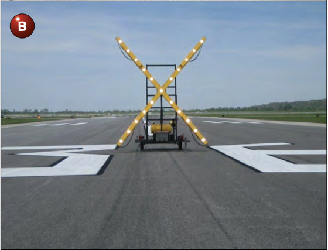

---

# Airport Lighting

---

## Lighting Overview

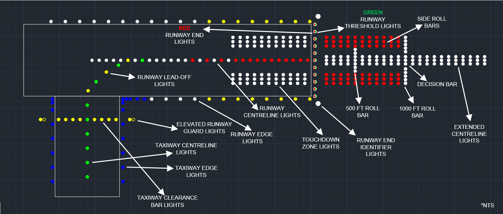

---

### Runway Guard Lights - Hold short bars

Used to indicate hold short bars

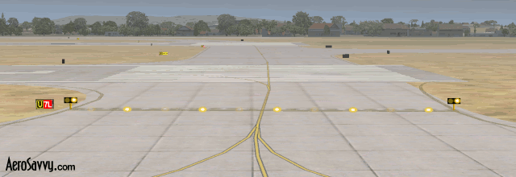

---

## VASI and PAPI

- Visual approach slope indicator (VASI)
- Precision approach path indicator (PAPI)

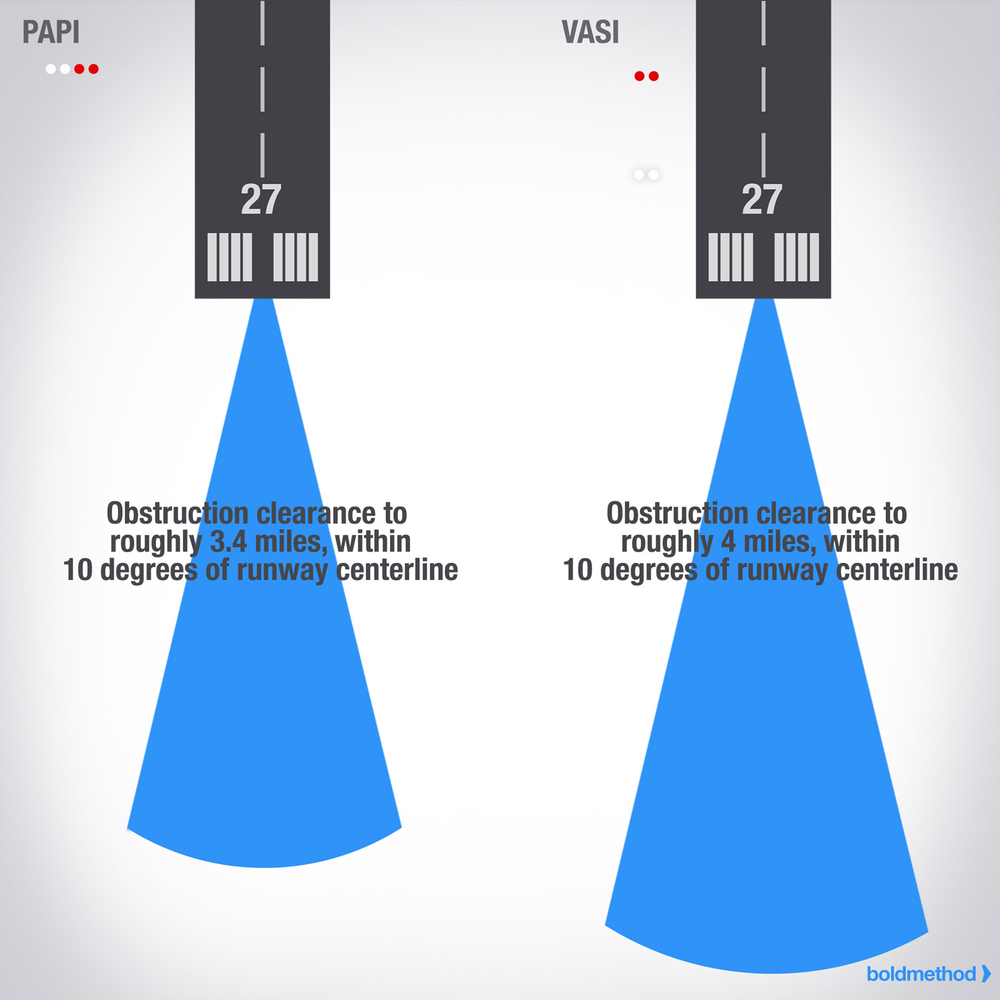

---

## Two-Bar VASI

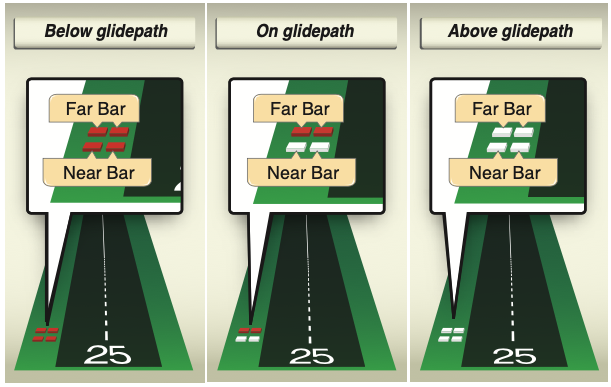

---

## PAPI

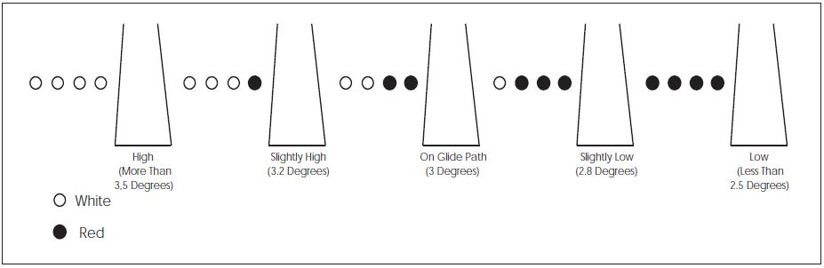

---

## Runway Centerline Lighting

- Precision approach runways
- Spaced at 50' intervals

---

## REIL

- Runway end identifier lights
- Two flashing strobes

---

# Summary

- Parts of an Airport: Apron, taxiway, runway
- Airport Signage: Movement area boundary, taxiway signs, destination signs
- Movement Areas: Runway safety area, crossing a runway
- Runway Safety Areas: Buffer zone to reduce risk of damage
- Crossing a Runway: Requires a clearance at towered airport
- Runway Markings: Non-precision and precision markings
- Runway Lighting: Runway centerline lighting, REIL
- VASI and PAPI: Visual approach slope indicators, use at night
