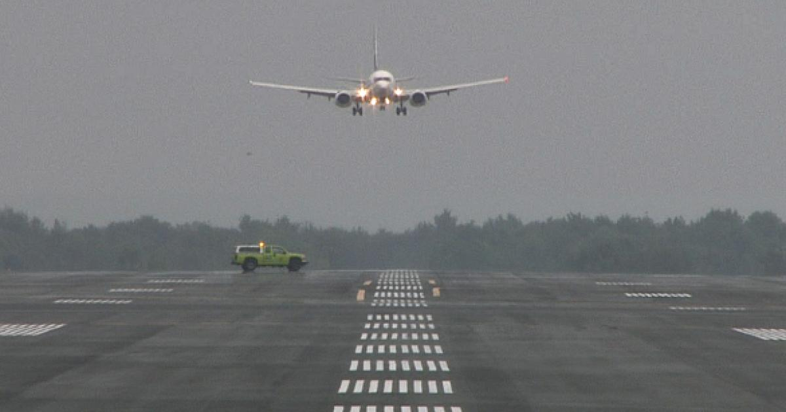
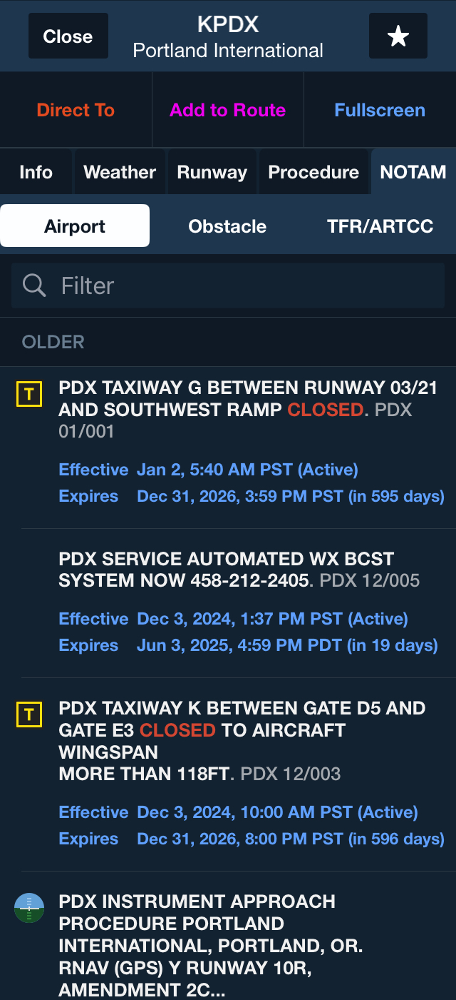
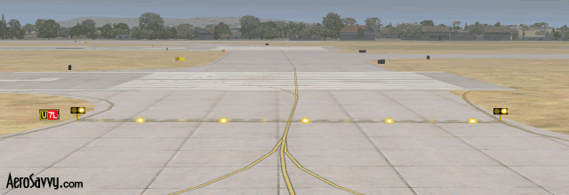
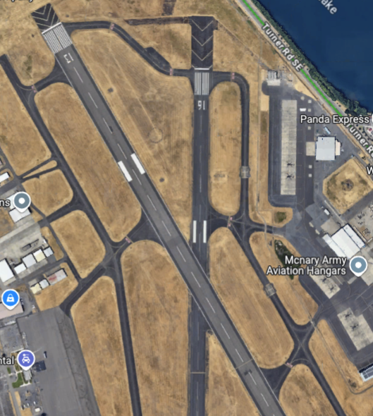
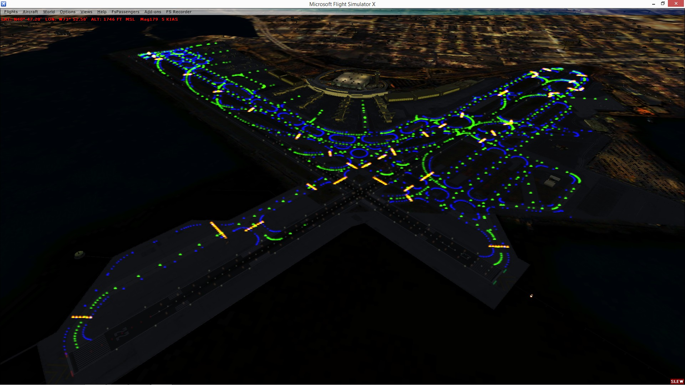

# Runway Incursions

---

## What is a runway incursion?

"Any occurrence at an aerodrome involving the incorrect presence of an aircraft, vehicle, or person on the protected area of a surface designated for the landing and takeoff of aircraft."

---

## Objective

Understand the causes of runway incursions and how to avoid them.

## Motivation

Runway incursions are a significant safety concern in aviation. Understanding the causes and prevention strategies is essential for maintaining safety on the ground.

---

## Overview

### Tools in Our Toolbox

- NOTAMs
- Airport diagrams and EFBs
- Hotspots
- Progressive taxi
- Writing down taxi instructions
- Confirmation of instructions
- Distractions and a sterile cockpit

### Situations Needing Extra Care

- Complex intersections
- Parallel runways
- Intersecting runways
- LAHSO
- ILS critical areas
- Night and low-visibility

---

## Ground Operation Challenges

- Airplanes may have poor visibility on the ground
- Lots of airplanes are in close proximity
- Complex runway and taxiway layouts

---

# Tools for Runway Incursion Avoidance

---

## Notice to Airmen - NOTAMS

- Check before every flight
- Found in an EFB or FAA NOTAM site
- May include:
  - Taxiway closures
  - Runway closures
  - Construction
  - Wildlife activity
  - Other hazards
- Mark closures or hazards on the airport diagram

---

## Airport Diagrams

- Included in Chart Supplements
- GTN also includes SafeTaxi
- ForeFlight also includes airport diagrams
- Make a habit of displaying the diagram before taxi

---

## Airport Hotspots

- Areas that may cause confusion or have a higher potential for runway incursions
- Marked on the airport diagram
- Read the hotspot information in the Chart Supplement

---

## Hotspot Information

- Hotspot information is included in the "back pages" of the Chart Supplement (along with the airport diagrams)

---

## Taxi Clearances

- Expectation vs actual taxi instructions (expectation bias)
- Always record taxi instruction
- Unambiguous understanding of instructions
- Display an airport diagram in the cockpit (especially on a moving map)
- Use progressive taxi if unsure or unfamiliar

---

## Example Clearance

The ATC clearance is:

> N2017E taxi runway 9R via Bravo, Echo Juliet, Hold Short 4L at Echo

The ATC clearance written:

> 9R B E J <u>4L</u> E.

Where the clearance limit of 4L at Echo is circled.

(AC 91-73B)

---

## Stop and Confirm at Hold Short Lines

- Stop prior to any hold short line
- An explicit clearance ("cross runway 12") is always required
- Notice enhanced centerline stripes prior to the hold short line
- When in doubt, stop and ask ATC if you're cleared to cross

---

### Runway Guard Lights - Hold short bars

Also called "wig-wag" lights

---

## Avoiding Distractions and Managing Workload

- Keep additional workload to a minimum
- Avoid distractions while taxiing
  - Communicating with ATC, if not necessary
  - Programming avionics
  - Run-up procedures
  - Conversation with passengers
- Disorientation can lead to confusion

---

## Aircraft Lighting (91.209)

- Anti-collision/beacon: On all the time
- Position lights (red/green): Sunset to sunrise
- Taxi light used for taxi
- Taxi + landing lights should be used for takeoff
- All lights on when crossing runways

---

# Scenarios Requiring Extra Diligence

---

## Intersecting Runways

- Don't confuse intersecting run way with a taxiway
- Aircraft may be operating from the other runway
- Runway/runway crossing will not have the same signage and markings as a taxiway/runway crossing

---

## Complex Intersections

- Multi-taxiway intersections can be very confusing
- Be sure to read the signage carefully and cross-check with the airport diagram
- Use progressive taxi instructions if unsure
- Take extra care at night

---

## Departing the Runway After Landing

- Departing the runway after landing
  - Move past the hold short line, getting out of the runway safety area
  - Run any checklists, then contact ATC
- Be careful rolling out onto a taxiway near another runway

---

## Taxiing Between Parallel Runways

- Taxiing between parallel runways
  - Exercise increased awareness when taxing in between active parallel runways
  - Ensure you're out of both runway's safety area

---

## Uncontrolled Airfields

- Always scan the runway before entering
- Announce your intentions on the common frequency (AIM 4-1-9)
  - Announce before taxiing
  - Announce before taking a runway for takeoff
  - Announce when clear of runway after landing
- Remember not all airplanes have radios

---

## Low Visibility Operations

- Harder to see signs, other aircraft, and tell direction
- Taxi speed should be slower
- ATC may not be able to see you visually from the tower
- Take care to read lights and signs

---

## Night Taxi Operations

- Easy to get confused about position or direction
- Not all airport signs are illuminated
- Taxi speed should be slower
- Taxi lights should be used
  - But avoid shining into another airplane's cockpit
- Don't use strobe lights when taxiing

---

## Local Examples: KUAO

- Aurora wasn't originally designed as a tower-controlled airport initially
- There have been historically been issues with pilots entering the runway from the ramp

---

## Local Examples: KVUO

- SFRA rules apply
- We don't need a clearance to enter the runway, however
  - We _do_ need to contact Pearson Advisory
  - We also need to announce our intentions like any other non-towered airport

---

## Case Study: Chicago Midway Near-Miss

[VASAviation Video](https://www.youtube.com/watch?v=c6Mp9aUJaTY)

---

## Case Study: Chicago Midway Near-Miss

- FlexJet obvious had some confusion from the start
- Crossing runways don't always have hold-short markings
- 31L is narrow, may have looked like a taxiway
- Other things we might not know:
  - Pilot's familiarly with the airport?
  - Distractions?
  - Expectation bias?
  - Time pressure?

---

# Summary

- Ground Operations: Presents unique challenges
- NOTAMS, Hotspots, Complex Intersections
- Taxi Clearances: Expectations vs actual
- Hold Short Lines: Confirm you have a clearance to cross
- Distractions and Workload: Minimize distractions
- Specific Scenarios: Parallel runways, rollout near another runway
- Uncontrolled Airfields: No-radio airplanes are out there

---

## Knowledge Check

Taxiing at a towered airport, you realized after passing a complicated intersection you that you've made a wrong turn. You're now on taxiway Juliet instead, when you were cleared via taxiway Bravo.

What should you do?

---

## Knowledge Check

You've just landed and are taxiing off the runway. Where should you stop and do your after-landing checklist?

---

## Knowledge Check

You are approaching a runway that you will need to cross to get to your destination. You can't remember if ATC cleared you to cross.

What should you do?
