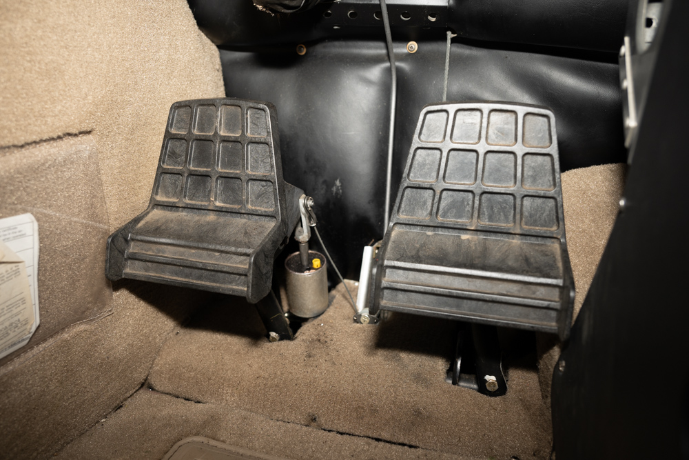

# Taxi Operations

---

## Objective

Identify taxi operations, including taxi speed, wind effects, airport diagrams, NOTAMs, and ATC phraseology.

## Motivation

Taxiing is a critical phase of flight that requires careful attention to detail and adherence to procedures. Understanding taxi operations is essential for safe and efficient ground movement of aircraft.

---

## Overview

- Taxi Procedures
- Taxi Aids
- Ground Communications
- Low visibility operations
- Night taxi operations

---

## Basic Taxi Procedure

1. Engine start checklist
2. Get ATIS/AWOS, see wind
3. Display the airport diagram
4. Start taxi, check brakes
5. Taxi to start of movement area
6. Get taxi clearance or announce taxi intentions
7. Follow your clearance
8. If needed, stop do run-up/pre-takeoff checklist
9. At the end of the runway, contact tower or announce on CTAF

---

## Taxi Speed

- Taxi slow enough that you can stop quickly
- Don't ride the brakes
- Turn with rudder/nosewheel first, then use differental braking

---

## Wind Controls Position

- Keep the wind from lifting the wing
  - "Turn into the wind"
  - "Dive away from the wind"
- If taxiing in wind difficult, flying will be even more difficult

---

## Windsocks

---

## Wind Tee and Tetrahedrons

- Can also be manually positioned
- No indication of velocity

---

## Airport Diagrams

- Included in Chart Supplements
- GTN also includes SafeTaxi
- ForeFlight also includes airport diagrams
- Make a habit of displaying the diagram before taxi

---

## Airport Hotspots

- Areas that may cause confusion or have a higher potential for runway incursions

---

## Hotspot Information

- Hotspot information is included in the "back pages" of the Chart Supplement (along with the airport diagrams)

---

## Notice to Air Missions - NOTAMS

- Check before every flight
- Found in an EFB or FAA NOTAM site
- May include:
  - Taxiway closures
  - Runway closures
  - Construction
  - Wildlife activity
  - Other hazards

---

# Ground Communications

---

## General ATC Phraseology

1. Who are you calling
2. Who you are - your type and callsign (Cessna N12345)
3. What information do you have?
4. What do you want to do?

`Salem Ground, Cessna N13212 with information Papa, ready to taxi for VFR departure.`

---

## Types of Departures

1. "Closed traffic" - remain the traffic pattern
2. North/south/west/east bound departure
3. VFR arrival/departure procedures: Ask if not familiar

---

## Progressive Taxi

- At an unfamiliar airport you can ask ATC for progressive taxi
- They will give you turn-by-turn directions as you taxi to your destination

---

## Copying Taxi Instructions

1. Anticipate the expected clearance
2. Write down taxi instruction and cross reference with airport diagram
3. Call out any taxi hotspots
4. Monitor progress on airport diagram

---

## Example Taxi Clearance

- You: `Salem Ground, Cessna N12345 with information Papa, ready to taxi for VFR departure to the north.`
- Ground: `Cessna N12345, Salem Ground, taxi runway 13 via Alpha.`
- You: `Taxi runway 13 via Alpha, Cessna N12345.`

---

## Taxi Clearance

- Need a clearance to move into a movement area
- If unable, reply "unable" prior to taxiing

---

## Entering and crossing runways

- ATC Clearance required to cross any runway at a towered airport
- Runway crossing instructions must be explicit
  - `N12345 cross runway 36 at A3`
- See red think "stop"

---

## Low Visibility Operations

- Harder to see signs, other aircraft, and tell direction
- Taxi speed should be slower
- ATC may not be able to see you visually from the tower
- Take care to read lights and signs

---

## Night Taxi Operations

- Easy to get confused about position or direction
- Not all airport signs are illuminated
- Taxi speed should be slower
- Taxi lights should be used
  - But avoid shining into another airplane's cockpit
- Don't use strobe lights when taxiing

---

## Aircraft Lighting (91.209)

- Anti-collision/beacon lights must be on all the time
- Position lights (red/green) must be turned on from sunset to sunrise
- Taxi light used for taxi
- Taxi + landing lights should be used for takeoff

---

## Summary

- Taxi Procedures: Checklist, ATIS, airport diagram, clearance
- Taxi Aids: Windsocks, Airport Diagrams, Hotspots
- Ground Communications: Clearance before movement area, explicit clearance to cross runways
- Low visibility operations: Go slower, ATC may not see you
- Night taxi operations: Easy to get disoriented, go slower

---

## Knowledge Check

You're at a large unfamiliar airport and ATC gives you taxi instructions to your destination. You are unsure of the taxiway layout and want to ensure you follow the instructions correctly.

What should you do?

---

## Knowledge Check

ATC gives you instructions to taxi to runway 36 via B, but B will cross runway 31. As you approach runway 31, what should you do?

---

## Knowledge Check

You're taxiing for takeoff when you notice large gusts of headwind.

How should you position your controls?
Anything else on your mind?
