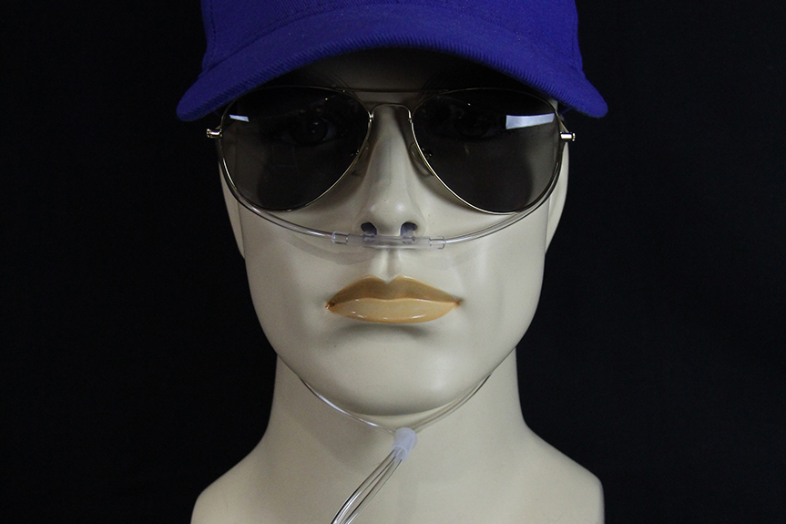

# High Altitude Flight

---

## Overview

- Altitude and Air Density
- Hypoxic Hypoxia
- Time of Useful Consciousness
- Supplemental Oxygen Systems
  - Oxygen System Types
  - Pulse Oximeters
  - FAA Oxygen Regulations (14 CFR 91.211)

- Pressurization
  - Pressurization System Components
  - Turbocharged Pressurized Aircraft
  - Pressurization Control
  - Cabin Instrumentation
  - Decompression

---

## Objective

To understand the physiology, equipment, and regulations regarding high altitude flights, including pressurization and oxygen systems

## Motivation

High altitude flight presents unique risks and challenges that must be mitigated through various equipment requirements. A commercial pilot preparing to fly at high altitudes needs to understand the equipment and human factors involved.

---

## Altitude and Air Density

- Air density decreases with altitude
- At 18,000 feet, air density is about half that at sea level
  - The percentage of oxygen in the air remains above the same (around 21%)
  - Because of the reduced pressure, your lungs aren't exposed to as much oxygen
- To remedy this we can:
  - Increase the pressure of the air
  - Increase the percent of oxygen we're breathing

---

## Hypoxic Hypoxia

Hypoxia is a state of oxygen deficiency in the body sufficient to impair functions of the brain and other organs.

Hypoxic hypoxia is caused by the reduction of barometric pressure at altitude.

---

## Symptoms of Hypoxia

- Cyanosis (blue fingernails and lips)
- Headache
- Decreased response to stimuli and increased reaction time
- Impaired judgment
- Euphoria
- Visual impairment
- Drowsiness
- Lightheaded or dizzy sensation
- Tingling in fingers and toes
- Numbness

---

## Time of Useful Consciousness

- The time you can function effectively without supplemental oxygen
- Decreases rapidly as altitude increases
  - 20-30 minutes at 18,000 feet
  - 15-20s seconds at 40,000 feet
- This motivates the supplemental oxygen rules in 91.211

---

## Supplemental Oxygen Systems

- Continuous-flow and Pulse-Demand Systems
  - With a cannula: Good to ~18,000 ft.
  - With a rebreather bag: Good to ~25,000 ft.
- Diluter-demand systems: Good up to 40,000 ft.
- Pressure-demand system: Can be certified up above 40,000 ft.

---

## Oxygen System Types - Continuous Flow

- Deliveries continuous flow of oxygen to mask or cannula
- Usually has individual adjustment on the tube prior the mouth piece
- Simple operation: On/off, plus flow adjustment
- **Altitude-compensating** systems adjust the flow of oxygen for you as you climb

---

## Continuous Flow System Diagram

---

## Oxygen System Types - Electrical Pulse-Demand

- Electronically-controlled regulator
- Detects user's inhalation and only provides oxygen
- Doesn't waste oxygen during exhalation like a continuous-flow system
- Many pulse-demand system are also altitude-compensating

---

## Cannulas and Masks for Continuous Flow

Rebreather bag, basic cannula, oxymizer cannula

---

## Oxygen System Types - Diluter Demand

- Demand-systems deliver oxygen when the user inhales
- A diluter demand system mixes cabin air and 100% oxygen from a tube
- These require a tight-sealing mask
- Can be used to up 40,000'
- Common on airliners

---

## Oxygen System Types - Pressure Demand

- Similar to diluter-demand, except oxygen is delivered under pressure
- Allows the user lungs to be pressurized with oxygen

---

## Pulse Oximeters

- Measure blood oxygen saturation
- Values above 90% are considered good

---

## FAA Oxygen Regulations (14 CFR 91.211)

- **Unpressurized aircraft**:
  - Above 12,500' MSL up to 14,000' MSL: crew must use oxygen for duration of flight longer than 30 minutes
  - Above 14,000' MSL: Crew must use oxygen at all times
  - Above 15,000' MSL: Oxygen must be provided to all occupants
- **Pressurized aircraft**:
  - Above FL250: 10-minute supply for each occupant in case of decompression
  - Above FL350: One pilot must wear and use an oxygen mask, unless both have quick-donning masks and are below FL410

---

# Pressurization

---

## Principle of Pressurization

- Cabin is kept at a higher pressure than ambient air around the aircraft
- Allows flight at higher altitudes without the need for supplemental oxygen
- Cabins are usually pressurized to a pressure equivalent to 6000-8000 ft.

---

## Pressurization System Components

1. Airtight fuselage
2. Compressed air delivery system
3. Pressure controller
4. Safety dump valve

---

## Turbocharged Pressurized Aircraft

- Turbocharged airplanes often use compressed air from the turbocharger for pressurization
- Hot air from the turbocharger is ducted through a heat exchanger, then into the cabin
- Pressurization controller controls the "leaking" of cabin air pressure to maintain a set cabin altitude
  - Outflow valve regulates air leaving the cabin
- Dump valve for rapid depressurization if needed

---

## Cabin Differential

- **Max differential pressure**: The maximum pressure difference between the inside and outside of the cabin
  - Determined by the strength of the fuselage
  - A typical differential for a piston airplane is 5.5 PSI
- This differential is usually set my a controller in the cockpit

---

## Pressurization Control

- Differential pressure: Settable by the pilot, determine cabin altitude
  - Usually set just above cruise altitude during climb
  - Set to just above airport elevation during descent
- Rate valve: Determine how fast the cabin will change pressures

---

## Cabin Instrumentation

- Cabin altimeter: Measure barometric pressure inside the cabin
- Cabin rate-of-climb indicator: Change of cabin air pressure
- Differential pressure gauge: PSI difference between cabin and atmosphere

---

## Decompression

- **Slow decompression**: Depressurization in > 10 seconds
- **Rapid decompression**: Lungs decompress faster than cabin, can cause discomfort
- **Explosive decompression**: Cabin loses pressure in 0.2–0.5 seconds
  - Risk of lung damage, hypoxia, loss of consciousness, decompression sickness
  - Fog, debris, and noise may occur

---

# Summary

- Altitude and Air Density
- Hypoxic Hypoxia
- Time of Useful Consciousness
- Supplemental Oxygen Systems
  - Oxygen System Types
  - Pulse Oximeters
  - FAA Oxygen Regulations (14 CFR 91.211)

- Pressurization
  - Pressurization System Components
  - Turbocharged Pressurized Aircraft
  - Pressurization Control
  - Cabin Instrumentation
  - Decompression

---

## Knowledge Check

What is hypoxia and why is it dangerous at high altitudes?

---

## Knowledge Check

At what cabin pressure altitudes must the crew use supplemental oxygen, and when must it be provided to all occupants?

---

## Knowledge Check

What are the main components of a pressurization system?

---

## Knowledge Check

What are the differences between slow, rapid, and explosive decompression?
